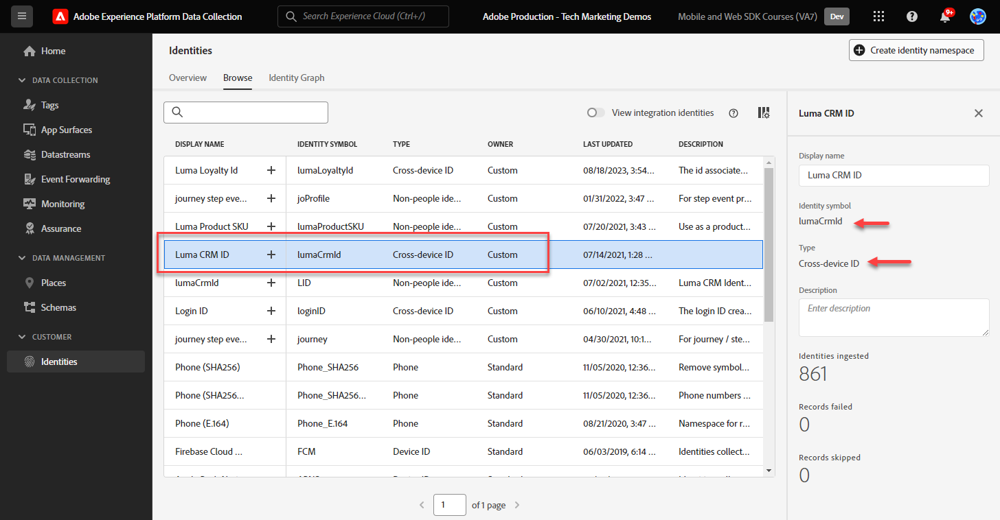

# Konfigurera ett identitetsnamnutrymme

Lär dig hur du konfigurerar identitetsnamnutrymmen som ska användas med Adobe Experience Platform Web SDK.

[Adobe Experience Cloud identitetstjänst](https://experienceleague.adobe.com/sv/docs/id-service/using/home) ställer in ett gemensamt besökar-ID (ECID) för SDK-baserade Adobe-program för att ge Experience Cloud möjligheter, som målgruppsdelning mellan program. Du kan också skicka dina egna kund-ID:n till tjänsten för att möjliggöra målinriktning mellan olika enheter och integrering med andra system, som CRM-systemet (Customer Relationship Management).

[Adobe Experience Platform identitetstjänst](https://experienceleague.adobe.com/sv/docs/experience-platform/identity/home) (ja, det finns två!) använder ECID:n och kund-ID:n för att generera identitetsdiagram, vilket gör att du kan sammanfoga attribut och beteenden i kundprofiler i realtid.

>[!NOTE]
>
>Ett anpassat identitetsnamnutrymme krävs _inte_ för att implementera Adobe Analytics, Adobe Target eller Adobe Audience Manager med Web SDK (autentiserade identiteter kan skickas i `data`-objektet i stället för `xdm`-objektet som du kommer att se senare). Identitetsnamnutrymmen krävs för plattformsspecifika program som Journey Optimizer, Real-Time Customer Data Platform och Customer Journey Analytics. Även om du kanske bestämmer dig för att inte använda ett identitetsnamnutrymme i din egen implementering, förväntas du göra det som en del av den här självstudien.

>[!NOTE]
>
> I demonstrationssyfte kan du i övningarna i den här lektionen fånga identitetsinformationen för en fiktiv kund som är inloggad på [Luma Demo Site](https://luma.enablementadobe.com/content/luma/us/en.html) med hjälp av inloggningsuppgifterna **user: `test@adobe.com` / password: test**.

## Utbildningsmål

När lektionen är klar kan du:

* Identitetsnamnutrymmen
* Skapa ett anpassat identitetsnamnutrymme för att hämta ett internt CRM-ID

## Förhandskrav

Du måste ha slutfört tidigare lektioner:

* [Konfigurera scheman](configure-schemas.md)

>[!IMPORTANT]
>
>[Experience Cloud ID-tillägget](https://exchange.adobe.com/apps/ec/100160/adobe-experience-cloud-id-launch-extension) behövs inte när du implementerar Adobe Experience Platform Web SDK eftersom Web SDK JavaScript-biblioteket innehåller tjänstfunktionaliteten för besökar-ID.
>
> Om webbplatsen redan använder Experience Cloud ID Service på webbplatsen, antingen via Visitor API eller Experience Cloud ID Service Tag-tillägget, och du vill fortsätta använda det under migreringen till Adobe Experience Platform Web SDK, måste du använda den senaste versionen av Visitor API eller Experience Cloud ID Service Tag-tillägget. Mer information finns i [ID-migrering](https://experienceleague.adobe.com/sv/docs/experience-platform/edge/identity/overview).

## Skapa ett identitetsnamnutrymme

I den här övningen skapar du ett identitetsnamnutrymme för Lumas anpassade identitetsfält, `lumaCrmId`. Identitetsnamnutrymmen spelar en viktig roll när det gäller att skapa kundprofiler i realtid, eftersom två matchande värden i samma namnutrymme gör att två datakällor kan bilda ett identitetsdiagram.

Titta på den här korta videon om du vill veta mer om din identitet i Adobe Experience Platform innan du börjar övningarna:

>[!VIDEO](https://video.tv.adobe.com/v/3432348?learn=on&enablevpops&captions=swe)

Skapa nu ett namnutrymme för Luma CRM-ID:

1. Öppna [gränssnittet för datainsamling](https://experience.adobe.com/data-collection/){target="_blank"}
1. Välj den sandlåda som du använder för självstudiekursen

   >[!NOTE]
   >
   >Om du använder ett plattformsbaserat program som Real-Time CDP eller Journey Optimizer rekommenderar vi att du använder en utvecklingssandlåda för den här kursen. Om du inte gör det använder du sandlådan **[!UICONTROL Prod]**.

1. Välj **[!UICONTROL Identities]** i den vänstra navigeringen
1. Välj **[!UICONTROL Browse]**

   En lista med identitetsnamnutrymmen visas i sidans huvudgränssnitt med namn, identitetssymboler, senaste uppdateringsdatum och om de är standardnamnutrymmen eller anpassade namnutrymmen. Den högra listen innehåller information om [!UICONTROL Identity graph strength].

1. Välj **[!UICONTROL Create identity namespace]**

   

1. Ange följande information och välj **[!UICONTROL Create]**.

   | Fält | Värde |
   |---------------|-----------|
   | Visningsnamn | Luma CRM-ID |
   | Identitetssymbol | lumaCrmId |
   | Typ | Enskilt enhets-ID |

   

   Identitetsnamnområdet fylls i på skärmen **[!UICONTROL Identities]**.

   

>[!NOTE]
>
> I lektionen [Skapa identiteter](create-identities.md) får du lära dig hur du använder det här namnutrymmet när du skickar identiteter till Platform Edge Network.

Nu när identiteter finns på plats kan datastream konfigureras.

[Nästa: ](configure-datastream.md)

>[!NOTE]
>
>Tack för att du har lagt ned din tid på att lära dig om Adobe Experience Platform Web SDK. Om du har frågor, vill dela allmän feedback eller har förslag på framtida innehåll kan du dela dem i det här [Experience League diskussionsgruppsinlägget](https://experienceleaguecommunities.adobe.com/t5/adobe-experience-platform-data/tutorial-discussion-implement-adobe-experience-cloud-with-web/td-p/444996)
