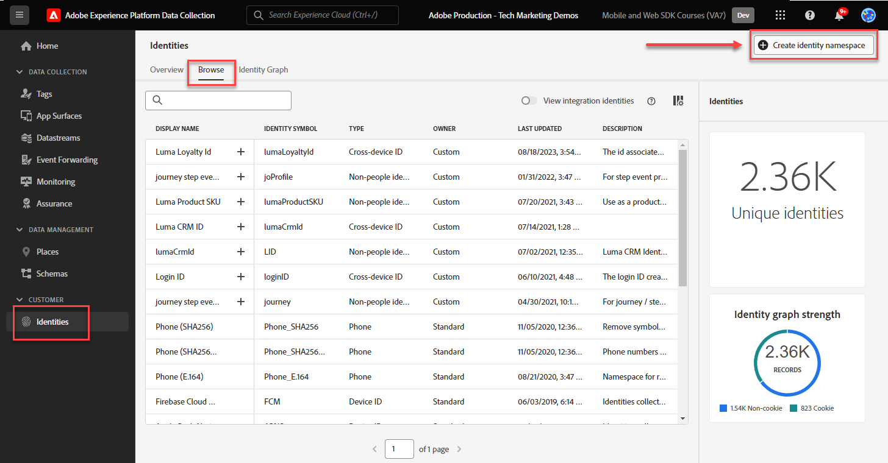

# Konfigurera ett identitetsnamnutrymme

Lär dig hur du konfigurerar identitetsnamnutrymmen som ska användas med Adobe Experience Platform Web SDK.

The [Adobe Experience Cloud Identity Service](https://experienceleague.adobe.com/en/docs/id-service/using/home) ställer in ett gemensamt besökar-ID (ECID) för SDK-baserade Adobe-program för att underlätta Experience Cloud-funktioner, t.ex. målgruppsdelning mellan program. Du kan också skicka dina egna kund-ID:n till tjänsten för att möjliggöra målinriktning mellan olika enheter och integrering med andra system, som CRM-systemet (Customer Relationship Management).

The [Adobe Experience Platform Identity Service](https://experienceleague.adobe.com/en/docs/experience-platform/identity/home) (Ja, det finns två!) använder ECID:n och kund-ID:n för att generera identitetsdiagram, så att du kan sammanfoga attribut och beteenden i kundprofiler i realtid.

>[!NOTE]
>
> I demonstrationssyfte kan du använda övningarna i den här lektionen för att fånga identitetsinformationen för en fiktiv kund som är inloggad på [Luma Demo Site](https://luma.enablementadobe.com/content/luma/us/en.html) med hjälp av inloggningsuppgifterna, **användare: `test@adobe.com` / lösenord: test**.

## Utbildningsmål

När lektionen är klar kan du:

* Identitetsnamnutrymmen
* Skapa ett anpassat identitetsnamnutrymme för att hämta ett internt CRM-ID

## Förutsättningar

Du måste ha slutfört tidigare lektioner:

* [Konfigurera scheman](configure-schemas.md)

>[!IMPORTANT]
>
>The [Experience Cloud ID-tillägg](https://exchange.adobe.com/apps/ec/100160/adobe-experience-cloud-id-launch-extension) behövs inte när du implementerar Adobe Experience Platform Web SDK, eftersom JavaScript-biblioteket för Web SDK innehåller funktioner för tjänsten för besöks-ID.
>
> Om din webbplats redan använder Experience Cloud ID-tjänsten på din webbplats (antingen via Visitor API eller Experience Cloud ID Service Tag-tillägget) och du vill fortsätta använda den när du migrerar till Adobe Experience Platform Web SDK, måste du använda den senaste versionen av Visitor API eller Experience Cloud ID Service Tag-tillägget. Se [ID-migrering](https://experienceleague.adobe.com/en/docs/experience-platform/edge/identity/overview) för mer information.

## Skapa ett identitetsnamnutrymme

I den här övningen skapar du ett ID-namnutrymme för Lumas anpassade identitetsfält, `lumaCrmId`. Identitetsnamnutrymmen spelar en viktig roll när det gäller att skapa kundprofiler i realtid, eftersom två matchande värden i samma namnutrymme gör att två datakällor kan bilda ett identitetsdiagram.

Titta på den här korta videon om du vill veta mer om din identitet i Adobe Experience Platform innan du börjar övningarna:

>[!VIDEO](https://video.tv.adobe.com/v/27841?learn=on)

Skapa nu ett namnutrymme för Luma CRM-ID:

1. Öppna [Gränssnitt för datainsamling](https://launch.adobe.com/){target="_blank"}
1. Välj den sandlåda som du använder för självstudiekursen

   >[!NOTE]
   >
   >Om du använder ett plattformsbaserat program som Real-Time CDP eller Journey Optimizer rekommenderar vi att du använder en utvecklingssandlåda för den här kursen. Om du inte gör det använder du **[!UICONTROL Prod]** sandlåda.

1. Välj **[!UICONTROL Identities]** till vänster navigering
1. Välj **[!UICONTROL Browse]**

   En lista med identitetsnamnutrymmen visas i sidans huvudgränssnitt med namn, identitetssymboler, senaste uppdateringsdatum och om de är standardnamnutrymmen eller anpassade namnutrymmen. Den högra listen innehåller information om [!UICONTROL Identity graph strength].

1. Välj **[!UICONTROL Create identity namespace]**

   

1. Ange följande information och välj **[!UICONTROL Create]**.

   | Fält | Värde |
   |---------------|-----------|
   | Visningsnamn | Luma CRM-ID |
   | Identitetssymbol | lumaCrmId |
   | Typ | Enskilt enhets-ID |

   

   Identitetsnamnutrymmet fylls i i **[!UICONTROL Identities]** skärm.

   

>[!NOTE]
>
> I [Skapa identiteter](create-identities.md) lektionen lär du dig hur du använder det här namnutrymmet när du skickar identiteter till Platform Edge Network.

Nu när identiteter finns på plats kan datastream konfigureras.

[Nästa: ](configure-datastream.md)

>[!NOTE]
>
>Tack för att du lade ned din tid på att lära dig om Adobe Experience Platform Web SDK. Om du har frågor, vill dela allmän feedback eller har förslag på framtida innehåll kan du dela med dig av dem om detta [Experience League diskussionsinlägg](https://experienceleaguecommunities.adobe.com/t5/adobe-experience-platform-data/tutorial-discussion-implement-adobe-experience-cloud-with-web/td-p/444996)
