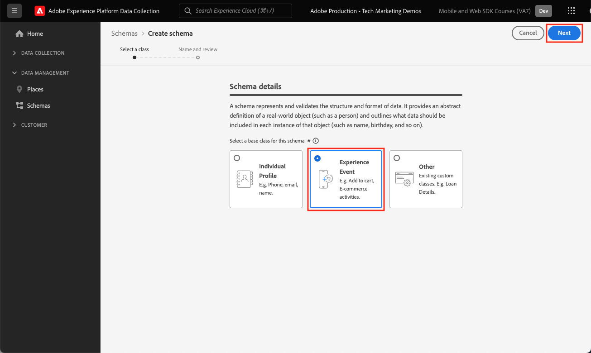
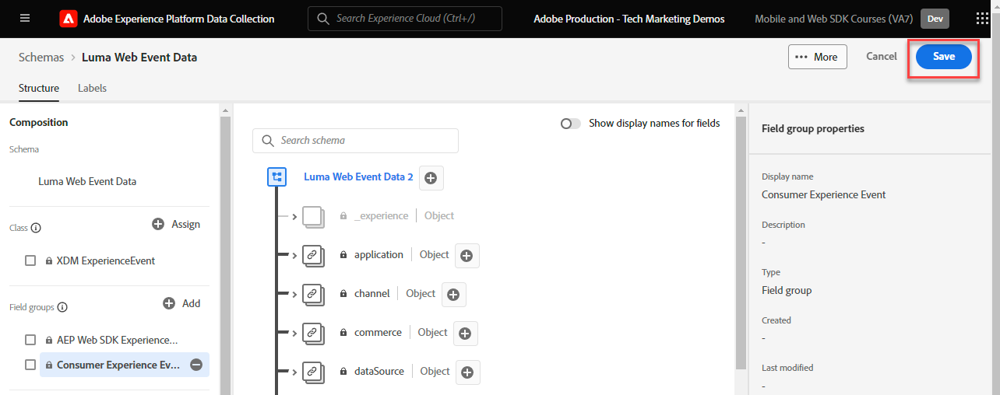

# Skapa ett XDM-schema för webbdata

Lär dig hur du skapar ett XDM-schema för webbdata i Adobe Experience Platform Data Collection-gränssnittet.

XDM-scheman (Experience Data Model) är byggstenar, principer och bästa praxis för datainsamling i Adobe Experience Platform.

Platform Web SDK använder ditt schema för att standardisera dina webbhändelsedata, skicka dem till Platform Edge Network och slutligen vidarebefordra data till alla Experience Cloud-program som är konfigurerade i datastream. Det här steget är viktigt eftersom det definierar en standarddatamodell som krävs för inmatning av kundupplevelsedata i Experience Platform och möjliggör tjänster och applikationer som bygger på dessa standarder.

>[!NOTE]
>
>Ett XDM-schema _krävs inte_ för att implementera Adobe Analytics, Adobe Target eller Adobe Audience Manager med Web SDK (data kan skickas i `data`-objektet i stället för `xdm`-objektet som du kommer att se senare). Ett XDM-schema krävs för de mest prestandaoptimerade implementeringarna av plattformsspecifika program som Journey Optimizer, Real-Time Customer Data Platform, Customer Journey Analytics. Även om du kanske bestämmer dig för att inte använda ett XDM-schema i din egen implementering, så är det en del av den här självstudiekursen.

## Varför modellera data?

Företag har sitt eget språk för att kommunicera om sin domän. Bilhandlare hanterar fabriker, modeller och cylindrar. Flygbolagen hanterar flightnummer, tjänsteklass och platstilldelningar. Vissa av dessa villkor är unika för ett visst företag, andra delas av ett vertikalt företag i branschen och andra delas av nästan alla företag. För termer som delas av en bransch vertikalt eller till och med bredare, kan ni börja göra kraftfulla saker med era data när ni namnger och strukturerar dessa termer på ett gemensamt sätt.

Många företag hanterar till exempel beställningar. Vad händer om dessa företag tillsammans beslutar sig för att göra en beställning på ett liknande sätt? Vad händer till exempel om datamodellen består av ett objekt med en `priceTotal`-egenskap som representerar orderns totalpris? Vad händer om det objektet också har egenskaperna `currencyCode` och `purchaseOrderNumber`? Orderobjektet kanske innehåller egenskapen `payments` som skulle vara en matris med betalningsobjekt. Varje objekt motsvarar en betalning för ordern. En kund kanske till exempel betalar en del av beställningen med ett presentkort och resten med kreditkort. Du kan börja skapa en modell som ser ut ungefär så här:

```json
{
  "order": {
    "priceTotal": 89.50,
    "currencyCode": "EUR",
    "purchaseOrderNumber": "JWN20192388410012",
    "payments": [
      {
        "paymentType": "gift_card",
        "paymentAmount": 50
      },
      {
        "paymentType": "credit_card",
        "paymentAmount": 39.50
      }
    ]
  }
}
```

Om alla företag som hanterar beställningar beslutar sig för att modellera sina beställningsdata på ett konsekvent sätt för termer som är vanliga i branschen kan magiska saker börja hända. Information skulle kunna utbytas smidigare både inom och utanför er organisation i stället för att man hela tiden tolkar och översätter data (utkast och evar, vem som helst?). Datorinlärning kan enklare förstå vad dina data _betyder_ och ge användbara insikter. Användargränssnitt för relevanta data kan bli mer intuitiva. Dina data kan integreras smidigt med partners och leverantörer som följer samma modellering.

Det här är målet för Adobe [Experience Data Model](https://business.adobe.com/se/products/experience-platform/experience-data-model.html). XDM tillhandahåller preskriptiv modellering för data som är vanliga i branschen, samtidigt som du kan utöka modellen efter dina specifika behov. Adobe Experience Platform bygger på XDM och därför måste data som skickas till Experience Platform finnas i XDM. I stället för att fundera på var och hur ni kan omvandla era aktuella datamodeller till XDM innan ni skickar data till Experience Platform bör ni överväga att implementera XDM i hela organisationen så att översättningen sällan behöver ske.


>[!NOTE]
>
> I demonstrationssyfte bygger övningarna i den här lektionen upp ett exempelschema för att fånga innehåll som visas och produkter som köpts av kunder på [Luma Demo-webbplatsen](https://luma.enablementadobe.com/content/luma/us/en.html). Du kan använda de här stegen för att skapa ett annat schema för dina egna syften, men vi rekommenderar att du först följer med när du skapar exempelschemat för att lära dig funktionerna i schemaredigeraren.

Om du vill veta mer om XDM-scheman kan du titta på spellistan [Modellera dina kundupplevelsedata med XDM](https://experienceleague.adobe.com/sv/playlists/experience-platform-model-your-customer-experience-data-with-xdm) eller se [XDM-systemöversikt](https://experienceleague.adobe.com/sv/docs/experience-platform/xdm/home).

## Utbildningsmål

När lektionen är klar kan du:

* Skapa ett XDM-schema inifrån datainsamlingsgränssnittet
* Lägg till fältgrupper i XDM-schemat
* Skapa XDM-scheman för webbhändelsedata enligt vedertagna standarder

## Förhandskrav

Alla nödvändiga etablerings- och användarbehörigheter för datainsamling och Adobe Experience Platform som beskrivs på sidan [översikt](overview.md).

## Skapa ett XDM-schema

XDM-scheman är standardsättet att beskriva data i Experience Platform, vilket gör att alla data som överensstämmer med scheman kan återanvändas i en organisation utan konflikter, eller till och med delas mellan flera organisationer. Mer information finns i [Grunderna för schemakomposition](https://experienceleague.adobe.com/sv/docs/experience-platform/xdm/schema/composition).

I den här övningen skapar du ett XDM-schema med de rekommenderade baslinjefältgrupperna för att hämta webbhändelsedata på [Luma Demo-webbplatsen](https://luma.enablementadobe.com/content/luma/us/en.html){target="_blank"}:

1. Öppna [gränssnittet för datainsamling](https://experience.adobe.com/data-collection/){target="_blank"}
1. Kontrollera att du är i rätt sandlåda. Hitta sandlådan i det övre högra hörnet

   >[!NOTE]
   >
   >Om du använder ett plattformsbaserat program som Real-Time CDP eller Journey Optimizer rekommenderar vi att du använder en utvecklingssandlåda för den här kursen. Om du inte gör det använder du sandlådan **[!UICONTROL Prod]**.

1. Gå till **[!UICONTROL Schemas]** i den vänstra navigeringen
1. Markera knappen **[!UICONTROL Create Schema]** överst till höger

   
1. Välj **[!UICONTROL Experience Event]** på följande skärm
1. Välj **[!UICONTROL Next]**

   

1. Ange schemats namn under fältet **[!UICONTROL Schema display name]**, i det här fallet `Luma Web Event Data`

   >[!TIP]
   >
   >En vanlig namnkonvention för XDM-scheman är att namnge schemat efter datakällan.


1. Välj Slutför

   

## Lägg till fältgrupper

Som tidigare nämnts är XDM det centrala ramverket som standardiserar kundupplevelsedata genom att tillhandahålla gemensamma strukturer och definitioner för användning i Adobe Experience Platform-tjänster längre fram i kedjan. Genom att följa XDM-standarder kan _alla kundupplevelsedata_ införlivas i en gemensam representation. Med den här metoden kan ni få värdefulla insikter från kundåtgärder, definiera kundmålgrupper genom segment och uttrycka kundattribut för personalisering med hjälp av data från flera olika källor. Mer information finns i [Bästa tillvägagångssätt för datamodellering](https://experienceleague.adobe.com/sv/docs/experience-platform/xdm/schema/best-practices).

När det är möjligt bör du använda befintliga fältgrupper och följa en produktmedveten modell och namnkonventioner. För alla data som är specifika för din organisation och som inte passar in i de fördefinierade fältgrupperna ovan kan du skapa en anpassad fältgrupp. Mer information om anpassade scheman finns i [Skapa ett schema med Schemaredigeraren](https://experienceleague.adobe.com/sv/docs/experience-platform/xdm/tutorials/create-schema-ui#create).

>[!TIP]
> 
>I den här övningen lägger du till de rekommenderade fördefinierade fältgrupperna för webbdatainsamling: _&#x200B;**[!UICONTROL AEP Web SDK ExperienceEvent]**&#x200B;_och_&#x200B;**[!UICONTROL Consumer Experience Event]**&#x200B;_.
>


1. I avsnittet **[!UICONTROL Field groups]** väljer du **[!UICONTROL Add]**

   

1. Sök efter [!UICONTROL `AEP Web SDK ExperienceEvent`]
1. Markera rutan
1. Sök efter [!UICONTROL `Consumer Experience Event`]
1. Markera rutan
1. Välj **[!UICONTROL Add field groups]**

   

Observera att du har tillgång till de mest använda nyckelvärdepar som krävs för datainsamling på webben i båda fältgrupperna. [!UICONTROL display name] för varje fält visas för marknadsförarna i segmentbyggargränssnittet i plattformsbaserade program och du kan ändra visningsnamnet för standardfält efter dina behov. Du kan också ta bort fält som du inte vill ha. När du klickar på något av fältgruppsnamnen markeras vilka nyckelvärdepar som tillhör det. I nedanstående exempel ser du vilka fält som tillhör **[!UICONTROL Consumer Experience Event]**.


Den här lektionen är bara en startpunkt. När du skapar ett eget webbeventschema måste du utforska och dokumentera dina affärskrav. Den här processen påminner om att skapa ett [dokument för affärskrav](https://experienceleague.adobe.com/sv/docs/analytics-learn/tutorials/implementation/implementation-basics/creating-a-business-requirements-document) och en [referens för lösningsdesign](https://experienceleague.adobe.com/sv/docs/analytics-learn/tutorials/implementation/implementation-basics/creating-and-maintaining-an-sdr) för en Adobe Analytics-implementering, men den bör innehålla krav för _alla datamottagare i senare led_, t.ex. för plattforms-, mål- och händelsevidarebefordringsmål.


### identityMap-objektet

Det finns ett särskilt fält som används för att identifiera webbanvändare med namnet `[!UICONTROL identityMap]`.


Det är ett måste-ha-objekt för alla webbrelaterade datainsamlingar eftersom det innehåller det Experience Cloud-id som krävs för att identifiera användare på webben. Det är också nyckeln till att ange interna kund-ID:n för autentiserade användare. `[!UICONTROL identityMap]` beskrivs mer i lektionen [Konfigurera identiteter](configure-identities.md). Den inkluderas automatiskt i alla scheman som använder klassen **[!UICONTROL XDM ExperienceEvent]**.


>[!IMPORTANT]
>
> Det går att aktivera **[!UICONTROL Profile]** för ett schema innan du sparar schemat. **Aktivera det inte** just nu. När ett schema har aktiverats för profilen kan det inte inaktiveras eller tas bort utan att hela sandlådan har återställts. Fält kan inte heller tas bort från scheman just nu, även om det går att [Föråldra fält i användargränssnittet](https://experienceleague.adobe.com/sv/docs/experience-platform/xdm/tutorials/field-deprecation-ui#deprecate). Dessa konsekvenser är viktiga att tänka på senare när du arbetar med egna data i produktionsmiljön.
>
>
>Den här inställningen beskrivs mer under lektionen [Konfigurera Experience Platform](setup-experience-platform.md).
>&#x200B;>

Slutför den här lektionen genom att välja **[!UICONTROL Save]** överst till höger.




Nu kan du referera till det här schemat när du lägger till Web SDK-tillägget i taggegenskapen.

>[!NOTE]
>
>Tack för att du har lagt ned din tid på att lära dig om Adobe Experience Platform Web SDK. Om du har frågor, vill dela allmän feedback eller har förslag på framtida innehåll kan du dela dem i det här [Experience League diskussionsgruppsinlägget](https://experienceleaguecommunities.adobe.com/t5/adobe-experience-platform-data/tutorial-discussion-implement-adobe-experience-cloud-with-web/td-p/444996?profile.language=sv)
