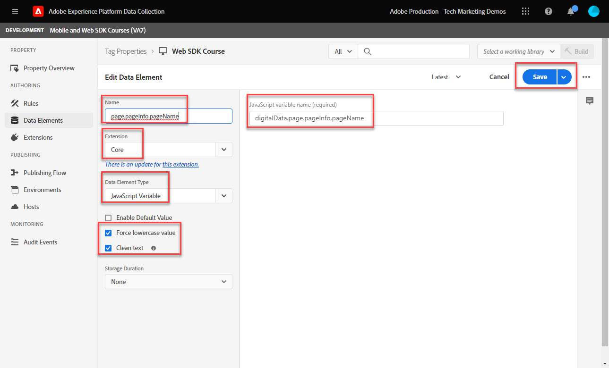

# Skapa dataelement

Lär dig hur du skapar de grundläggande dataelement som behövs för att hämta in data med Experience Platform Web SDK. Samla in både innehåll- och identitetsdata på [Luma demo site](https://luma.enablementadobe.com/content/luma/us/en.html). Lär dig hur du använder XDM-schemat som du skapade tidigare för att samla in data med hjälp av Platform Web SDK via ett nytt dataelement som kallas XDM-objekt.

>[!NOTE]
>
> I demonstrationssyfte bygger övningarna i den här lektionen på det exempel som används under [Konfigurera ett schema](configure-schemas.md) steg, skapa exempel på XDM-objekt som fångar innehåll som visas och identiteter för användare på [Luma demo site](https://luma.enablementadobe.com/content/luma/us/en.html).

>[!IMPORTANT]
>
>Informationen i den här lektionen kommer från `[!UICONTROL digitalData]` datalager på Luma-webbplatsen. Om du vill visa datalagret öppnar du utvecklarkonsolen och skriver in `[!UICONTROL digitalData]` för att se hela datalagret.


Oberoende av Platform Web SDK måste du fortsätta att skapa dataelement inuti taggegenskapen som mappar till datainsamlingsvariabler från webbplatsen, till exempel ett datalager, HTML-attribut eller andra. När du har skapat dessa dataelement måste du mappa dem till XDM-schemat som du skapade under [konfigurera scheman](configure-schemas.md) lektion. För att göra detta gör Platform Web SDK-tillägget att det finns en ny dataelementtyp som kallas XDM-objekt. Därför består det av två åtgärder att skapa dataelement:

1. Mappa webbplatsvariabler till dataelement, och
1. Mappa dessa dataelement till ett XDM-objekt

För steg 1 fortsätter du att mappa datalagret till dataelement på det sätt du gör just nu, med hjälp av någon av bastaggens tilläggstyper för dataelement. I steg 2 skapar Platform Web SDK-tillägget en uppsättning nya dataelementtyper som inte tidigare var tillgängliga:

* ID för händelsesammanfogning
* Identitetskarta
* XDM-objekt

Den här lektionen fokuserar på elementtyperna XDM-objekt och identitetskarta. Du skapar XDM-objekt för att fånga Luma-besökares aktivitet och autentiseringsstatus.

## Utbildningsmål

När lektionen är slut kan du:

* Skapa dataelement för att hämta innehåll och användarens användar-ID-data
* Skapa ett dataelement för identitetskarta
* Mappa dataelement till ett XDM-objektdataelement


## Förutsättningar

Du har en förståelse för vad ett datalager är, och vet hur det [Luma demo site](https://luma.enablementadobe.com/content/luma/us/en.html)datalagret {target=&quot;_blank&quot;} och du kan referera till dataelement i taggar. Du måste ha utfört följande steg i självstudiekursen

* [Konfigurera behörigheter](configure-permissions.md)
* [Konfigurera ett XDM-schema](configure-schemas.md)
* [Konfigurera ett identitetsnamnutrymme](configure-identities.md)
* [Konfigurera ett datastream](configure-datastream.md)
* [Web SDK-tillägget är installerat i taggegenskapen](install-web-sdk.md)

>[!IMPORTANT]
>
>The [Experience Cloud ID-tjänsttillägg](https://exchange.adobe.com/experiencecloud.details.100160.adobe-experience-cloud-id-launch-extension.html) behövs inte vid implementering av Adobe Experience Platform Web SDK eftersom ID-tjänstfunktionen är inbyggd i Platform Web SDK.

## Skapa dataelement för att hämta datalagret

Innan du börjar skapa XDM-objektet skapar du följande uppsättning dataelement som ska mappas till [Luma demo site](https://luma.enablementadobe.com/content/luma/us/en.html){target=&quot;_blank&quot;} datalager:

1. Gå till **[!UICONTROL Dataelement]** och markera **[!UICONTROL Lägg till dataelement]** (eller **[!UICONTROL Skapa nytt dataelement]** om det inte finns några befintliga dataelement i taggegenskapen)

   

1. Namnge dataelementet `page.pageInfo.pageName`
1. Använd **[!UICONTROL JavaScript-variabel]** **[!UICONTROL Dataelementtyp]** för att peka på ett värde i Lumas datalager: `digitalData.page.pageInfo.pageName`

1. Markera rutorna för **[!UICONTROL Använd gemener]** och **[!UICONTROL Rensa text]** standardisera ärendet och ta bort ovidkommande utrymmen

1. Lämna `None` som **[!UICONTROL Lagringstid]** inställning eftersom det här värdet är olika på alla sidor

1. Välj **[!UICONTROL Spara]**

   

Följ de här stegen för att skapa ytterligare fyra dataelement:

* **`page.pageInfo.server`**  mappad till
   `digitalData.page.pageInfo.server`

* **`page.pageInfo.hierarchie1`**  mappad till
   `digitalData.page.pageInfo.hierarchie1`

* **`user.profile.attributes.username`**  mappad till
   `digitalData.user.0.profile.0.attributes.username`

* **`user.profile.attributes.loggedIn`** mappad till
   `digitalData.user.0.profile.0.attributes.loggedIn`

* **`cart.orderId`** mappad till `digitalData.cart.orderId` (du kommer att använda detta under [Konfigurationsanalys](setup-analytics.md) lektion)


>[!CAUTION]
>
>The [!UICONTROL JavaScript-variabel] dataelementtypen behandlar arrayreferenser som punkter i stället för hakparenteser, så att användarnamnets dataelement refereras som `digitalData.user[0].profile[0].attributes.username` **fungerar inte**.

## Skapa dataelement för identitetskarta

Sedan kan du skapa dataelementet för identitetskartan:

1. Gå till **[!UICONTROL Dataelement]** och markera **[!UICONTROL Lägg till dataelement]**

1. **[!UICONTROL Namn]** dataelementet `identityMap.loginID`

1. Som **[!UICONTROL Tillägg]**, markera `Adobe Experience Platform Web SDK`

1. Som **[!UICONTROL Dataelementtyp]**, markera `Identity map`

1. Då visas ett skärmyta till höger i dialogrutan **[!UICONTROL Gränssnitt för datainsamling]** så att du kan konfigurera identiteten:

   

1. Som  **[!UICONTROL Namnutrymme]** väljer du `Luma CRM Id` namnutrymme som du tidigare skapade i [Konfigurera identiteter](configure-identities.md) lektion.

   >[!NOTE]
   >
   >    Om du inte ser dina `Luma CRM Id` namnutrymme kontrollerar du att du även har skapat det i din standardproduktionssandlåda. Endast namnutrymmen som skapats i standardproduktionssandlådan visas för närvarande i listrutan för namnutrymme.

1. Efter **[!UICONTROL Namnutrymme]** är markerat måste ett ID anges. Välj `user.profile.attributes.username` dataelement som skapades tidigare i den här lektionen, som hämtar ett ID när användare loggar in på Luma-webbplatsen.

<!--  >[!TIP]
   >
   >You can verify the **[!UICONTROL Luma CRM ID]** is collected in a data element on the web property by going to the [Luma Demo site](https://luma.enablementadobe.com/content/luma/us/en.html), logging in, [switching the tag environment](validate-with-debugger.md#use-the-experience-platform-debugger-to-map-to-your-tag-property) to your own, and typing `_satellite.getVar("user.profile.attributes.username")` in the web browser developer console.
   >
   >   
-->

1. Som **[!UICONTROL Autentiserat läge]**, markera **[!UICONTROL Autentiserad]**

1. Välj **[!UICONTROL Spara]**

   

>[!WARNING]
>
>Den primära identiteten krävs i alla poster som skickas till Adobe Experience Platform. Som standard används Experience Cloud-ID (ECID) som den primära identiteten för Platform Web SDK. Du vill aldrig använda något liknande `Luma CRM ID` som en primär identitet med Web SDK, eftersom den bara finns efter att användaren autentiserar sig och därför inte är tillgänglig i alla poster.

<!--
1. Once the data element is configured in **[!UICONTROL Data Collection interface]**, it can be tested on the Luma web property like any other Data Element. Enter the following script in the browser developer console
   
   
   ```
   _satellite.getVar('identityMap.loginID')
   ```  

   
   
   >[!NOTE]
   >
   >ECID identifier will NOT populate in the Data Element, as this is configured already with Platform Web SDK.   
-->

## Mappa dataelement till XDM-objekt

Alla dataelement du skapar måste mappas till ett XDM-objekt. Det här objektet bör följa XDM-schemat som du skapade under [Konfigurera ett schema](configure-schemas.md) lektion.

Det finns olika sätt att mappa dataelement till XDM-objektfält. Du kan mappa enskilda dataelement till enskilda XDM-fält eller mappa dataelement till hela XDM-objekt så länge som dataelementet matchar det exakta nyckelvärdepar som finns i XDM-objektet. I den här lektionen hämtar du in innehållsdata genom att mappa till enskilda fält. Du kommer att lära dig hur [mappa ett dataelement till ett helt XDM-objekt](setup-analytics.md#Map-an-entire-array-to-an-XDM-Object) i [Konfigurationsanalys](setup-analytics.md) lektion.

Skapa ett XDM-objekt för att hämta innehållsdata:

1. Välj **[!UICONTROL Dataelement]**
1. Välj **[!UICONTROL Lägg till dataelement]**
1. **[!UICONTROL Namn]** dataelementet **`xdm.content`**
1. Som **[!UICONTROL Tillägg]** välj `Adobe Experience Platform Web SDK`
1. Som **[!UICONTROL Dataelementtyp]** välj `XDM object`
1. Välj plattform **[!UICONTROL Sandbox]** som du skapade XDM-schemat i under [Konfigurera ett XDM-schema](configure-schemas.md) lektion, i det här exemplet `DEVELOPMENT Mobile and Web SDK Courses`
1. Som **[!UICONTROL Schema]** väljer du `Luma Web Event Data` schema:

   

   >[!NOTE]
   >
   >Sandlådan motsvarar den Experience Platform-sandlåda där du skapade schemat. Det kan finnas flera tillgängliga sandlådor i din Experience Platform-instans, så se till att välja rätt. Arbeta alltid först med utveckling och sedan produktion.

1. Bläddra nedåt tills du når **`web`** object
1. Markera för att öppna den

   


1. Mappa följande webb-XDM-variabler till dataelement

   * **`web.webPageDetials.name`** till `%page.pageInfo.pageName%`
   * **`web.webPageDetials.server`** till `%page.pageInfo.server%`
   * **`web.webPageDetials.siteSection`** till `%page.pageInfo.hierarchie1%`

   

1. Leta reda på `identityMap` objekt i schemat och markera det

1. Mappa till `identityMap.loginID` dataelement

1. Välj **[!UICONTROL Spara]**

   


I slutet av dessa steg bör du skapa följande dataelement:

| CORE-tilläggsdataelement | Webbsidedataelement för plattformar |
-----------------------------|-------------------------------
| `cart.orderId` | `identityMap.loginID` |
| `page.pageInfo.hierarchie1` | `xdm.content` |
| `page.pageInfo.pageName` |  |
| `page.pageInfo.server` |  |
| `user.profile.attributes.loggedIn` |  |
| `user.profile.attributes.username` |  |

Med dessa dataelement på plats är du redo att börja skicka data till Platform Edge Network via XDM-objektet genom att skapa en regel i taggar.

[Nästa: ](create-tag-rule.md)

>[!NOTE]
>
>Tack för att du lade ned din tid på att lära dig om Adobe Experience Platform Web SDK. Om du har frågor, vill dela allmän feedback eller har förslag på framtida innehåll kan du dela med dig av dem om detta [Experience League diskussionsinlägg](https://experienceleaguecommunities.adobe.com/t5/adobe-experience-platform-launch/tutorial-discussion-implement-adobe-experience-cloud-with-web/td-p/444996)
