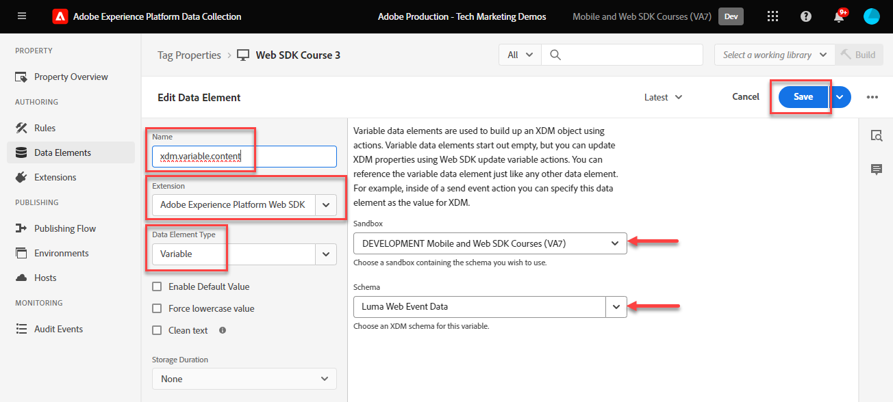

# Skapa dataelement

Lär dig hur du skapar dataelement i taggar för innehåll, handel och identitetsdata på [demowebbplatsen för Luma](https://luma.enablementadobe.com/content/luma/us/en.html). Fyll sedan i fälten i XDM-schemat med dataelementtypen för Adobe Experience Platform Web SDK-tillägget Variable.

## Utbildningsmål

När lektionen är slut kan du:

* Förstå olika metoder för att mappa ett datalager till XDM
* Skapa dataelement för datainhämtning
* Mappa dataelement till ett XDM-objekt


## Förhandskrav

Du har en förståelse för vad ett datalager är och har slutfört föregående lektioner i självstudien:

* [Konfigurera ett XDM-schema](configure-schemas.md)
* [Konfigurera ett identitetsnamnutrymme](configure-identities.md)
* [Konfigurera ett datastream](configure-datastream.md)
* [Web SDK-tillägget är installerat i taggegenskapen](install-web-sdk.md)


>[!IMPORTANT]
>
>Data för den här lektionen kommer från datalagret `[!UICONTROL digitalData]` på Luma-webbplatsen. Om du vill visa datalagret öppnar du utvecklarkonsolen och skriver in `[!UICONTROL digitalData]` för att se hela datalagret som är tillgängligt.


## Metoder för datalager

Det finns flera sätt att mappa data från datalagret till XDM med taggfunktionerna i Adobe Experience Platform. Nedan visas några fördelar och ikoner med tre olika strategier. Det är möjligt att kombinera metoder, om så önskas:

1. Implementera XDM i datalagret
1. Mappa till XDM i taggar
1. Mappa till XDM i datastream

>[!NOTE]
>
>Exemplen i den här självstudiekursen följer kartan till XDM när det gäller taggar.


### Implementera XDM i datalagret

Detta innebär att det fullständigt definierade XDM-objektet används som struktur för datalagret. Därefter mappar du hela datalagret till ett XDM-objektdataelement i -taggar. Om implementeringen inte använder en tagghanterare kan det här tillvägagångssättet vara idealiskt eftersom du kan skicka data till XDM direkt från programmet med kommandot [XDM sendEvent](https://experienceleague.adobe.com/en/docs/experience-platform/edge/fundamentals/tracking-events#sending-xdm-data). Om du använder taggar kan du skapa ett anpassat kodelement som hämtar hela datalagret som ett genomströmningsJSON-objekt till XDM-filen. Därefter mappar du genomströmnings-JSON till XDM-objektfältet i åtgärden Skicka händelse.

Nedan visas ett exempel på hur datalagret skulle se ut när formatet Adobe Client Data Layer används:

+++XDM i datalagrets exempel

```JSON
window.adobeDataLayer.push({
"eventType": "web.webPageDetails.pageViews",
"web":{
         "webInteraction":{
            "linkClicks":{
               "id":"",
               "value":""
            },
            "URL":"",
            "name":"",
            "region":"",
            "type":""
         },
         "webPageDetails":{
            "pageViews":{
               "id":"",
               "value":"1"
            },
            "URL":"https://luma.enablementadobe.com/",
            "isErrorPage":"",
            "isHomePage":"",
            "name":"luma:home",
            "server":"enablementadobe.com",
            "siteSection":"home",
            "viewName":""
         },
         "webReferrer":{
            "URL":"",
            "type":""
         }
      }
});
```

+++

Proffs

* Eliminerar ytterligare steg som går vidare till datalagervariabler till XDM
* Det kan gå snabbare att driftsätta om webbutvecklingsteamet också äger taggning av digitalt beteende

Kon

* Fullständigt beroende av utvecklingsteamet och utvecklingscykeln för uppdatering av vilka data som skickas till XDM
* Begränsad flexibilitet eftersom XDM får exakt nyttolast från datalagret
* Det går inte att använda inbyggda taggfunktioner, till exempel skrapning, beständighet och funktioner för snabb distribution
* Det är svårare att använda datalagret för pixlar från tredje part (men du kanske vill flytta dessa pixlar till [händelsevidarebefordran](setup-event-forwarding.md)!)
* Ingen möjlighet att omvandla data mellan datalagret och XDM

### Mappa datalager i taggar

Detta innebär att mappa enskilda datalagervariabler ELLER datalagerobjekt till dataelement i taggar och slutligen till XDM. Detta är det traditionella sättet att implementera med hjälp av ett tagghanteringssystem.

#### Proffs

* Den mest flexibla metoden eftersom du kan styra enskilda variabler och omvandla data innan det når XDM
* Kan använda Adobe-taggar som utlöser och scraping-funktioner för att skicka data till XDM
* Kan mappa dataelement till pixlar från tredje part på klientsidan

#### Kon

* Det tar tid att rekonstruera datalagret som dataelement


>[!TIP]
>
> Google datalager
> 
> Om din organisation redan använder Google Analytics och har det traditionella Google dataLayer-objektet på din webbplats kan du använda [Google datalagertillägg](https://experienceleague.adobe.com/en/docs/experience-platform/tags/extensions/client/google-data-layer/overview) i taggar. På så sätt kan ni driftsätta Adobe-teknik snabbare utan att behöva be IT-avdelningen om support. Om datalagret för Google mappas till XDM följer du samma steg som ovan.

### Mappa till XDM i datastream

Den här metoden använder inbyggda funktioner i datastream-konfigurationen [Data Prep för datainsamling](https://experienceleague.adobe.com/en/docs/experience-platform/datastreams/data-prep) och hoppar över mappning av datalagervariabler till XDM i taggar.

#### Proffs

* Flexibelt eftersom du kan mappa enskilda variabler till XDM
* Möjlighet att [beräkna nya värden](https://experienceleague.adobe.com/en/docs/experience-platform/data-prep/functions) eller [omvandla datatyper](https://experienceleague.adobe.com/en/docs/experience-platform/data-prep/data-handling) från ett datalager innan det går till XDM
* Använd ett [mappningsgränssnitt](https://experienceleague.adobe.com/en/docs/experience-platform/datastreams/data-prep#create-mapping) för att mappa fält i källdata till XDM med ett peka-och-klicka-gränssnitt

#### Kon

* Det går inte att använda datalagervariabler som dataelement för pixlar från tredje part på klientsidan, men de kan användas med händelsevidarebefordran
* Det går inte att använda funktionen för att klippa i taggfunktionen i Adobe Experience Platform
* Underhållskomplexiteten ökar om datalagret mappas både i taggar och i datastream


>[!IMPORTANT]
>
>Som tidigare nämnts följer exemplen i den här självstudiekursen mappningen till XDM när det gäller taggar.

## Skapa dataelement för att hämta datalagret

Skapa följande dataelement för datalagret [Luma demo site](https://luma.enablementadobe.com/content/luma/us/en.html){target="_blank"} innan du skapar XDM-objektet:

1. Gå till **[!UICONTROL Data Elements]** och markera **[!UICONTROL Add Data Element]** (eller **[!UICONTROL Create New Data Element]** om det inte finns några befintliga dataelement i taggegenskapen)

   

1. Namnge dataelementet `page.pageInfo.pageName`
1. Använd **[!UICONTROL JavaScript Variable]** **[!UICONTROL Data Element type]** för att peka på ett värde i Lumas datalager: `digitalData.page.pageInfo.pageName`

1. Markera kryssrutorna för **[!UICONTROL Force lowercase value]** och **[!UICONTROL Clean text]** för att standardisera skiftläget och ta bort överflödiga mellanslag

1. Använd `None` som **[!UICONTROL Storage Duration]**-inställning eftersom det här värdet är olika på alla sidor

1. Välj **[!UICONTROL Save]**

   

Skapa dessa ytterligare dataelement genom att följa samma steg:

* **`page.pageInfo.server`** har mappats till
  `digitalData.page.pageInfo.server`

* **`page.pageInfo.hierarchie1`** har mappats till
  `digitalData.page.pageInfo.hierarchie1`

* **`user.profile.attributes.username`** har mappats till
  `digitalData.user.0.profile.0.attributes.username`

* **`user.profile.attributes.loggedIn`** har mappats till
  `digitalData.user.0.profile.0.attributes.loggedIn`

* **`product.productInfo.sku`** har mappats till `digitalData.product.0.productInfo.sku`
<!--digitalData.product.0.productInfo.sku
    ```javascript
    var cart = digitalData.product;
    var cartItem;
    cart.forEach(function(item){
    cartItem = item.productInfo.sku;
    });
    return cartItem;
    ```
    -->
* **`product.productInfo.title`** har mappats till `digitalData.product.0.productInfo.title`
* **`cart.orderId`** har mappats till `digitalData.cart.orderId`
<!--
    ```javascript
    var cart = digitalData.product;
    var cartItem;
    cart.forEach(function(item){
    cartItem = item.productInfo.title;
    });
    return cartItem;
    ```
    -->
* **`product.category`** använder **[!UICONTROL Custom Code]** **[!UICONTROL Data Element type]** och följande anpassade kod för att tolka webbplats-URL:en för kategorin på den översta nivån:

  ```javascript
  var cat = location.pathname.split(/[/.]+/);
  if (cat[5] == 'products') {
     return (cat[6]);
  } else if (cat[5] != 'html') { 
     return (cat[5]);
  }
  ```

* **`cart.productInfo`** med följande anpassade kod:

  ```javascript
  var cart = digitalData.cart.cartEntries; 
  var cartItem = [];
  cart.forEach(function(item, index, array){
  cartItem.push({
  "SKU": item.sku
  });
  });
  return cartItem; 
  ```

* **`cart.productInfo.purchase`** med följande anpassade kod:

  ```javascript
  var cart = digitalData.cart.cartEntries; 
  var cartItem = [];
  cart.forEach(function(item, index, array){
  var qty = parseInt(item.qty);
  var price = parseInt(item.price);
  cartItem.push({
  "SKU": item.sku,
  "quantity": qty,
  "priceTotal": price
  });
  });
  return cartItem; 
  ```


>[!CAUTION]
>
>Dataelementtypen [!UICONTROL JavaScript variable] behandlar matrisreferenser som punkter i stället för hakparenteser, så att det inte fungerar att referera användarnamnselementet som `digitalData.user[0].profile[0].attributes.username` **&#x200B;**.

## Skapa variabla dataelement för XDM- och dataobjekt

De dataelement du just skapade används för att skapa ett XDM-objekt (för plattformsprogram) och ett dataobjekt (för Analytics, Target och Audience Manager). Dessa objekt har egna specialdataelement som kallas **[!UICONTROL Variable]** dataelement som är mycket enkla att skapa.

Om du vill skapa ett variabelt dataelement för XDM kopplar du det till schemat som du skapade i [Konfigurera ett schema](configure-schemas.md) -lektionen:

1. Välj **[!UICONTROL Add Data element]**
1. Namnge dataelementet `xdm.variable.content`. Vi rekommenderar att du prefix med &quot;xdm&quot; för dataelementen som är specifika för XDM för att bättre organisera taggegenskaperna
1. Välj **[!UICONTROL Adobe Experience Platform Web SDK]** som **[!UICONTROL Extension]**
1. Välj **[!UICONTROL Variable]** som **[!UICONTROL Data Element Type]**
1. Välj **[!UICONTROL XDM]** som **[!UICONTROL property]**
1. Välj den **[!UICONTROL Sandbox]** som du skapade schemat i
1. Välj lämplig **[!UICONTROL Schema]**, i det här fallet `Luma Web Event Data`
1. Välj **[!UICONTROL Save]**

   

Skapa sedan dataelementet Variable för dataobjektet:

1. Välj **[!UICONTROL Add Data element]**
1. Namnge dataelementet `data.variable`. Vi rekommenderar att du prefix med&quot;data&quot; för dataelementen som är specifika för dataobjektet för att bättre organisera taggegenskapen
1. Välj **[!UICONTROL Adobe Experience Platform Web SDK]** som **[!UICONTROL Extension]**
1. Välj **[!UICONTROL Variable]** som **[!UICONTROL Data Element Type]**
1. Välj **[!UICONTROL data]** som **[!UICONTROL property]**
1. Välj de Experience Cloud-lösningar du vill implementera som en del av kursen
1. Välj **[!UICONTROL Save]**

   


I slutet av dessa steg bör du skapa följande dataelement:

| Dataelement för kärntillägg | SDK Extension Data Elements för webben |
-----------------------------|-------------------------------
| `cart.orderId` | `data.variable` |
| `cart.productInfo` | `xdm.variable.content` |
| `cart.productInfo.purchase` | |
| `page.pageInfo.hierarchie1` | |
| `page.pageInfo.pageName` | |
| `page.pageInfo.server` | |
| `product.category` | |
| `product.productInfo.sku` | |
| `product.productInfo.title` | |
| `user.profile.attributes.loggedIn` | |
| `user.profile.attributes.username` | |

>[!TIP]
>
>I en framtida [Skapa taggregler](create-tag-rule.md)-lektion får du lära dig hur dataelementen i **[!UICONTROL Variable]** gör att du kan stapla flera regler i taggar med hjälp av **[!UICONTROL Update Variable Action type]**.

Med dessa dataelement på plats är du redo att börja skicka data till Platform Edge Network med en taggregel. Men först och främst: lär dig att samla in identiteter med Web SDK.

>[!NOTE]
>
>Tack för att du har lagt ned din tid på att lära dig om Adobe Experience Platform Web SDK. Om du har frågor, vill dela allmän feedback eller har förslag på framtida innehåll kan du dela dem i det här [Experience League diskussionsgruppsinlägget](https://experienceleaguecommunities.adobe.com/t5/adobe-experience-platform-data/tutorial-discussion-implement-adobe-experience-cloud-with-web/td-p/444996)
