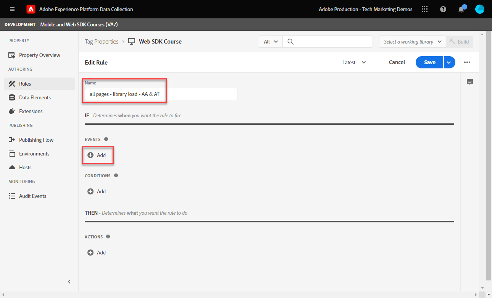
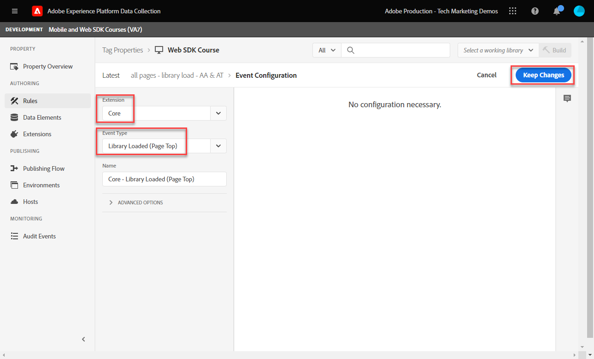
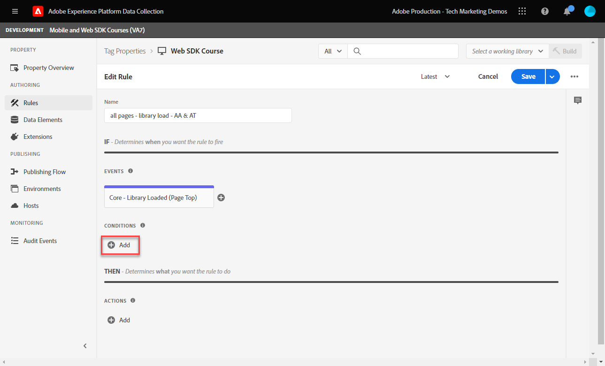

# Skapa en taggregel

>[!CAUTION]
>
>Vi räknar med att publicera viktiga ändringar av den här självstudiekursen fredagen den 15 mars 2024. Därefter kommer många övningar att ändras och du kan behöva starta om självstudiekursen från början för att kunna slutföra alla lektioner.

Lär dig hur du skickar en händelse till Platform Edge Network med ditt XDM-objekt med hjälp av en taggregel. En taggregel är en kombination av händelser, villkor och åtgärder som instruerar taggegenskapen att göra något.

>[!NOTE]
>
> I demonstrationssyfte bygger övningarna i den här lektionen på det exempel som användes under [Skapa dataelement](create-data-elements.md) steg; skicka en XDM-händelseåtgärd för att hämta innehåll och identiteter från användare på [Luma demo site](https://luma.enablementadobe.com/content/luma/us/en.html).

## Utbildningsmål

När lektionen är klar kan du:

* Använd en namnkonvention för att hantera regler i taggar
* Skapa en taggregel för att skicka en XDM-händelse
* Publicera en taggregel i ett utvecklingsbibliotek

## Förutsättningar

Du känner till datainsamlingstaggar och [Luma demo site](https://luma.enablementadobe.com/content/luma/us/en.html)och du måste ha slutfört följande lektioner i självstudiekursen:

* [Konfigurera behörigheter](configure-permissions.md)
* [Konfigurera ett XDM-schema](configure-schemas.md)
* [Konfigurera ett identitetsnamnutrymme](configure-identities.md)
* [Konfigurera ett datastream](configure-datastream.md)
* [Web SDK-tillägget är installerat i taggegenskapen](install-web-sdk.md)
* [Skapa dataelement](create-data-elements.md)

## Namnkonventioner

Om du vill hantera regler i taggar bättre bör du följa en standardnamnkonvention. I den här självstudiekursen används en namnkonvention med tre delar:

* [plats] - [event] - [verktyg]

där

1. plats är den eller de sidor på webbplatsen där regeln utlöses
1. -händelsen är den utlösare som utlöser beacon
1. är det eller de program som används i åtgärdssteget för den regeln

## Skapa taggregel

I taggar används regler för att utföra åtgärder (brandanrop) under olika förhållanden. Du använder den första regeln för att skicka XDM-objektet till Edge Network med Web SDK:n [!UICONTROL Send Event] åtgärd. Senare i den här självstudien skickar du olika versioner av XDM-objektet baserat på vilken typ av sida besökaren är på. Därför kommer du att använda regelvillkor för att exkludera de andra sidtyperna.

Så här skapar du en taggregel:

1. Öppna taggegenskapen som du använder för den här självstudien
1. Gå till **[!UICONTROL Rules]** till vänster navigering
1. Välj **[!UICONTROL Create New Rule]** knapp
   
1. Namnge regeln `all pages - library load - AA & AT`

   >[!NOTE]
   >
   > Den här regeln används på ett specifikt sätt av Adobe Analytics och Target i en framtida lektion, och det är därför `AA & AT` används i slutet av namnet.

1. I **[!UICONTROL Events]** avsnitt, markera **[!UICONTROL Add]**
   
1. Använd **[!UICONTROL Core Extension]** och markera `Library Loaded (Page Top)` som **[!UICONTROL Event Type]**.

   Den här inställningen innebär att regeln aktiveras när taggbiblioteket läses in på en sida.
1. Välj **[!UICONTROL Keep Changes]** för att återgå till huvudlinjeraster
   
1. I **[!UICONTROL Conditions]** väljer du **[!UICONTROL Add]** knapp
   
1. Välj **[!UICONTROL Logic Type]** `Exception`, **[!UICONTROL Extension]** `Core`och **[!UICONTROL Condition Type]** `Path Without Query String`
1. Ange URL-sökvägen `/content/luma/us/en/user/cart.html` i **[!UICONTROL path equals]** fält och **[!UICONTROL name]** it `Core - cart page`
1. Välj **[!UICONTROL Keep Changes]**
   
1. Lägg till ytterligare tre undantag för följande URL-sökvägar

   * **`Core - checkout page`** for `/content/luma/us/en/user/checkout.html`
   * **`Core - thank you page`** for `/content/luma/us/en/user/checkout/order/thank-you.html`
   * **`Core - product page`** for `/products/` med Regex-omkopplaren PÅ

   

1. I **[!UICONTROL Actions]** avsnitt, markera **[!UICONTROL Add]**
1. Välj **[!UICONTROL Adobe Experience Platform Web SDK]** som **[!UICONTROL Extension]**
1. Välj **[!UICONTROL Send Event]** som **[!UICONTROL Action Type]**
1. Välj **[!UICONTROL web.webpagedetails.pageViews]** som **[!UICONTROL Type]**.

   >[!WARNING]
   >
   > Den här listrutan fyller i **`xdm.eventType`** i XDM-objektet. Du kan även skriva frihandsetiketter i det här fältet, men vi rekommenderar att du **inte** eftersom det får negativa effekter med Platform.

1. Som **[!UICONTROL XDM data]** väljer du `xdm.content` dataelement som skapades i föregående lektion
1. Välj **[!UICONTROL Keep Changes]** för att återgå till huvudlinjeraster

   
1. Välj **[!UICONTROL Save]** för att spara regeln

   

## Publicera regeln i ett bibliotek

Publicera sedan regeln i utvecklingsmiljön så att vi kan bekräfta att den fungerar.

Så här skapar du ett bibliotek:

1. Gå till **[!UICONTROL Publishing Flow]** till vänster navigering
1. Välj **[!UICONTROL Add Library]**

   
1. För **[!UICONTROL Name]**, ange `Luma Web SDK Tutorial`
1. För **[!UICONTROL Environment]**, markera `Development`
1. Välj  **[!UICONTROL Add All Changed Resources]**

   >[!NOTE]
   >
   >    Förutom Adobe Experience Platform Web SDK och `all pages - library load - AA & AT` -regeln visas de taggkomponenter som skapades i tidigare lektioner. Tillägget Core innehåller det grundläggande JavaScript som krävs för alla egenskaper för webbtaggar.

1. Välj **[!UICONTROL Save & Build for Development]**

   

Det kan ta några minuter att skapa biblioteket och när det är klart visas en grön punkt till vänster om biblioteksnamnet:

Som du kan se på [!UICONTROL Publishing Flow] på skärmen finns det mycket mer i publiceringsprocessen som ligger utanför kursen. I den här självstudiekursen används bara ett bibliotek i din utvecklingsmiljö.

Nu kan du validera data i begäran med Adobe Experience Platform Debugger.

[Nästa ](validate-with-debugger.md)

>[!NOTE]
>
>Tack för att du lade ned din tid på att lära dig om Adobe Experience Platform Web SDK. Om du har frågor, vill dela allmän feedback eller har förslag på framtida innehåll kan du dela dem om detta [Experience League diskussionsinlägg](https://experienceleaguecommunities.adobe.com/t5/adobe-experience-platform-launch/tutorial-discussion-implement-adobe-experience-cloud-with-web/td-p/444996)
