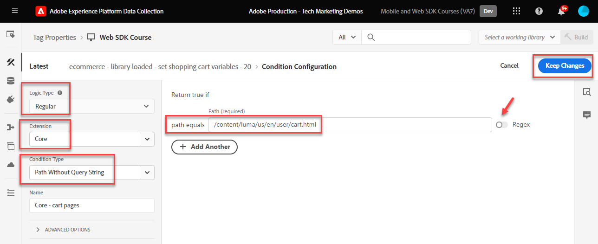
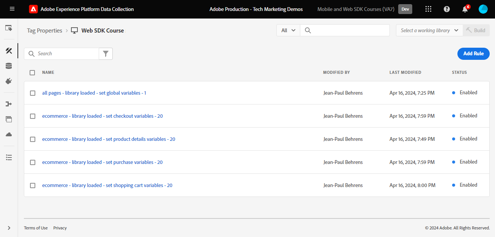

# Skapa taggregler

Lär dig hur du skickar händelser till Adobe Experience Platform Edge Network med ditt XDM-objekt med hjälp av taggregler. En taggregel är en kombination av händelser, villkor och åtgärder som instruerar taggegenskapen att göra något. Med Platform Web SDK används regler för att skicka händelser till Platform Edge Network med rätt data.

## Utbildningsmål

När lektionen är slut kan du:

* Använd en namnkonvention för att hantera regler i taggar
* Skicka en händelse med XDM-fält med åtgärderna Uppdatera variabel och Skicka händelse
* Stapla flera uppsättningar XDM-fält över flera regler
* Mappa enskilda eller hela arraydataelement till XDM-objektet
* Publicera en taggregel i ett utvecklingsbibliotek

## Förhandskrav

Du är bekant med datainsamlingstaggar och [Luma demo-webbplatsen](https://luma.enablementadobe.com/content/luma/us/en.html) och har slutfört föregående lektioner i självstudiekursen:

* [Konfigurera ett XDM-schema](configure-schemas.md)
* [Konfigurera ett identitetsnamnutrymme](configure-identities.md)
* [Konfigurera ett datastream](configure-datastream.md)
* [Installera SDK-tillägg för webben](install-web-sdk.md)
* [Skapa dataelement](create-data-elements.md)
* [Skapa identiteter](create-identities.md)

## Namnkonventioner

Om du vill hantera regler i taggar bör du följa en standardnamnkonvention. I den här självstudiekursen används en namnkonvention med fem delar:

* [**location**] - [**event**] - [**purpose**] - [**order**]

där

1. **plats** är sidan eller sidorna på webbplatsen där regeln utlöses
1. **event** är utlösaren för regeln
1. **purpose** är den huvudåtgärd som utförs av regeln
1. **order** är den ordning i vilken regeln ska utlösas i relation till andra regler
<!-- minor update -->

## Skapa taggregler

I taggar används regler för att utföra åtgärder (brandanrop) under olika förhållanden. Platsens SDK-taggtillägg innehåller två åtgärder som används i den här lektionen:

* **[!UICONTROL Update variable]** mappar dataelement till egenskaper i ett XDM-objekt
* **[!UICONTROL Send Event]** skickar XDM-objektet till Experience Platform Edge Network

I resten av lektionen:

1. Skapa en regel med åtgärden **[!UICONTROL Update variable]** för att definiera en&quot;global konfiguration&quot; av XDM-fält.

1. Skapa ytterligare regler med åtgärden **[!UICONTROL Update variable]** som åsidosätter vår&quot;globala konfiguration&quot; och som bidrar till ytterligare XDM-fält under vissa villkor (till exempel lägger till produktinformation på produktsidor).

1. Skapa en annan regel med åtgärden **[!UICONTROL Send Event]** som skickar hela XDM-objektet till Adobe Experience Platform Edge Network.

Alla dessa regler kommer att ordnas korrekt med alternativet [!UICONTROL order].

Den här videon ger en översikt över processen:

>[!VIDEO](https://video.tv.adobe.com/v/3454031/?learn=on&enablevpops&captions=swe)

### Globala konfigurationsfält

Så här skapar du en taggregel för de globala XDM-fälten:

1. Öppna taggegenskapen som du använder för den här självstudien

1. Gå till **[!UICONTROL Rules]** i den vänstra navigeringen

1. Markera knappen **[!UICONTROL Create New Rule]**

   

1. Namnge regeln `all pages - library loaded - set global variables - 1`

1. I avsnittet **[!UICONTROL Events]** väljer du **[!UICONTROL Add]**

   

1. Använd **[!UICONTROL Core Extension]** och välj **[!UICONTROL Library Loaded (Page Top)]** som **[!UICONTROL Event Type]**

1. Välj listrutan **[!UICONTROL Advanced]** och ange `1` som **[!UICONTROL Order]**

   >[!NOTE]
   >
   > Ju lägre ordernummer, desto tidigare körs det. Därför ger vi vår&quot;globala konfiguration&quot; ett lågt ordernummer.

1. Välj **[!UICONTROL Keep Changes]** för att återgå till huvudregelskärmen
   

1. I avsnittet **[!UICONTROL Actions]** väljer du **[!UICONTROL Add]**

1. Som **[!UICONTROL Extension]** väljer du **[!UICONTROL Adobe Experience Platform Web SDK]**

1. Som **[!UICONTROL Action Type]** väljer du **[!UICONTROL Update variable]**

1. Som **[!UICONTROL Data element]** väljer du `xdm.variable.content` som du skapade i lektionen [Skapa dataelement](create-data-elements.md)

   

Mappa [!UICONTROL data elements] till [!UICONTROL schema] som används av XDM-objektet. Du kan mappa till enskilda egenskaper eller hela objekt. I det här exemplet mappar du till enskilda egenskaper:

1. Sök efter fältet eventType och markera det

1. Ange värdet `web.webpagedetails.pageViews`

   >[!TIP]
   >
   > För att förstå vilka värden som ska fyllas i i fältet `eventType` måste du gå till schemasidan och välja fältet `eventType` för att visa de föreslagna värdena på den högra listen. Du kan också ange ett nytt värde om det behövs.
   > 

1. Leta sedan reda på objektet `identityMap` i schemat och markera det

1. Mappa till dataelementet `identityMap.loginID`

   

   >[!TIP]
   >
   > XDM-fält inkluderas inte i nätverksbegäran om dataelementet är null. Därför skickas inte `identityMap.loginID`-objektet när användaren inte är autentiserad och dataelementet `identityMap` är null. Därför kan vi definiera den i vår&quot;globala konfiguration&quot;.

1. Bläddra nedåt tills du når objektet **`web`**

1. Markera för att öppna den

1. Mappa följande dataelement till motsvarande `web` XDM-variabler

   * **`web.webPageDetials.name`** till `%page.pageInfo.pageName%`
   * **`web.webPageDetials.server`** till `%page.pageInfo.server%`
   * **`web.webPageDetials.siteSection`** till `%page.pageInfo.hierarchie1%`

1. Ange `web.webPageDetials.pageViews.value` till `1`

   

   >[!TIP]
   >
   > Även om varken `eventType` är inställt på `web.webpagedetails.pageViews` eller `web.webPageDetails.pageViews.value` krävs för att Adobe Analytics ska kunna bearbeta en fyr som en sidvy, är det användbart att ha ett standardsätt att indikera en sidvy för andra program längre fram i kedjan.

1. Välj **[!UICONTROL Keep Changes]** och sedan **[!UICONTROL Save]** regeln på nästa skärm för att slutföra skapandet av regeln

### Produktsidesfält

Börja nu använda **[!UICONTROL Update variable]** i ytterligare sekvensregler för att berika XDM-objektet innan du skickar det till [!UICONTROL Platform Edge Network].

>[!TIP]
>
>Regelordningen bestämmer vilken regel som körs först när en händelse utlöses. Om två regler har samma händelsetyp körs den med det lägsta talet först.
> 

Börja med att spåra produktvyer på Lumas produktinformationssida:

1. Välj **[!UICONTROL Add Rule]**
1. Ge den namnet [!UICONTROL `ecommerce - library loaded - set product details variables - 20`]
1. Välj symbolen  under Händelse för att lägga till en ny utlösare
1. Under **[!UICONTROL Extension]** väljer du **[!UICONTROL Core]**
1. Under **[!UICONTROL Event Type]** väljer du **[!UICONTROL Library Loaded (Page Top)]**
1. Välj att öppna **[!UICONTROL Advanced Options]**, skriv in `20`. Det här ordningsvärdet garanterar att regeln körs _efter_ `all pages - library loaded - set global variables - 1` som anger den globala konfigurationen.
1. Välj **[!UICONTROL Keep changes]**

   

1. Under **[!UICONTROL Conditions]** väljer du att **[!UICONTROL Add]**
1. Lämna **[!UICONTROL Logic Type]** som **[!UICONTROL Regular]**
1. Lämna **[!UICONTROL Extension]** som **[!UICONTROL Core]**
1. Välj **[!UICONTROL Condition Type]** som **[!UICONTROL Path Without Query String]**
1. Aktivera alternativet **[!UICONTROL Regex]** till höger
1. Under **[!UICONTROL path equals]**, ange `/products/`. För demonstrationswebbplatsen Luma säkerställer den att regeln endast aktiveras på produktsidor
1. Välj **[!UICONTROL Keep Changes]**

   

1. Under **[!UICONTROL Actions]** väljer du **[!UICONTROL Add]**
1. Välj tillägget **[!UICONTROL Adobe Experience Platform Web SDK]**
1. Välj **[!UICONTROL Action Type]** som **[!UICONTROL Update variable]**
1. Välj `xdm.variable.content` som **[!UICONTROL Data element]**
1. Bläddra nedåt till objektet `commerce`
1. Öppna objektet **[!UICONTROL productViews]** och ange **[!UICONTROL value]** till `1`

   

   >[!TIP]
   >
   >Om du anger commerce.productViews.value=1 i XDM mappas automatiskt till händelsen `prodView` i Analytics

1. Bläddra ned till `eventType` och ställ in den på `commerce.productViews`

   >[!NOTE]
   >
   >Eftersom den här regeln har en högre ordning skriver den över uppsättningen `eventType` i regeln för global konfiguration. `eventType` kan bara innehålla ett värde och vi rekommenderar att du ställer in det med den mest värdefulla händelsen.

1. Bläddra nedåt till och välj `productListItems`-matris
1. Välj **[!UICONTROL Provide individual items]**
1. Välj **[!UICONTROL Add Item]**

   

   >[!CAUTION]
   >
   >**`productListItems`** är en `array`-datatyp, så data förväntas komma in som en samling element. På grund av Luma-demonstrationswebbplatsens datalagerstruktur och eftersom det bara är möjligt att visa en produkt i taget på Luma-webbplatsen, lägger du till objekt individuellt. När du implementerar på din egen webbplats, beroende på din datalagerstruktur, kanske du kan tillhandahålla en hel array.

1. Markera för att öppna **[!UICONTROL Item 1]**
1. Mappa **`productListItems.item1.SKU`** till `%product.productInfo.sku%`

   

1. Välj **[!UICONTROL Keep Changes]**

1. Välj **[!UICONTROL Save]** om du vill spara regeln

### Kundvagnsfält

Du kan mappa hela arrayen till ett XDM-objekt, förutsatt att arrayen matchar formatet för XDM-schemat. Det anpassade kodelementet `cart.productInfo` som du skapade tidigare slingor genom datalagret `digitalData.cart.cartEntries` på Luma och översätter det till det format som krävs för objektet `productListItems` i XDM-schemat.

Se jämförelsen nedan av Luma-webbplatsens datalager (vänster) till det översatta dataelementet (höger) för att illustrera:

Jämför dataelementet med `productListItems`-strukturen (tips, det ska matcha).

>[!IMPORTANT]
>
>Observera hur numeriska variabler översätts, med strängvärden i datalagret som `price` och `qty` omformaterade till tal i dataelementet. Dessa formatkrav är viktiga för dataintegriteten i Platform och bestäms under steget [Konfigurera scheman](configure-schemas.md). I exemplet använder **[!UICONTROL quantity]** datatypen **[!UICONTROL Integer]**.
>&#x200B;> 

Låt oss mappa vår array till XDM-objektet:

1. Skapa en ny regel med namnet `ecommerce - library loaded - set shopping cart variables - 20`
1. Välj symbolen  under Händelse för att lägga till en ny utlösare
1. Under **[!UICONTROL Extension]** väljer du **[!UICONTROL Core]**
1. Under **[!UICONTROL Event Type]** väljer du **[!UICONTROL Library Loaded (Page Top)]**
1. Välj att öppna **[!UICONTROL Advanced Options]**, skriv in `20`
1. Välj **[!UICONTROL Keep Changes]**

   

1. Under **[!UICONTROL Conditions]** väljer du att **[!UICONTROL Add]**
1. Lämna **[!UICONTROL Logic Type]** som **[!UICONTROL Regular]**
1. Lämna **[!UICONTROL Extensions]** som **[!UICONTROL Core]**
1. Välj **[!UICONTROL Condition Type]** som **[!UICONTROL Path Without Query String]**
1. **aktivera inte**-växeln **[!UICONTROL Regex]** till höger
1. Under **[!UICONTROL path equals]**, ange `/content/luma/us/en/user/cart.html`. För Luma demo-webbplatsen säkerställer det att regeln endast aktiveras på kundvagnssidan
1. Välj **[!UICONTROL Keep Changes]**

   

1. Under **[!UICONTROL Actions]** väljer du **[!UICONTROL Add]**
1. Välj tillägget **[!UICONTROL Adobe Experience Platform Web SDK]**
1. Välj **[!UICONTROL Action Type]** som **[!UICONTROL Update variable]**
1. Välj `xdm.variable.content` som **[!UICONTROL Data element]**
1. Bläddra ned till objektet `commerce` och välj att öppna det.
1. Öppna objektet **[!UICONTROL productListViews]** och ange **[!UICONTROL value]** till `1`

   

   >[!TIP]
   >
   >Om du ställer in commerce.productListViews.value=1 i XDM mappas automatiskt till händelsen `scView` i Analytics

1. Välj `eventType` och ange till `commerce.productListViews`

1. Bläddra nedåt till och välj **[!UICONTROL productListItems]**-matris

1. Välj **[!UICONTROL Provide entire array]**

1. Mappa till **`cart.productInfo`**-dataelement

1. Välj **[!UICONTROL Keep Changes]**

1. Välj **[!UICONTROL Save]** om du vill spara regeln

Skapa ytterligare två regler för utcheckning och köp enligt samma mönster med skillnaderna nedan:

**Regelnamn**: `ecommerce  - library loaded - set checkout variables - 20`

1. **[!UICONTROL Condition]**: /content/luma/us/en/user/checkout.html
1. Ange `eventType` till `commerce.checkouts`
1. Ange `commerce.checkout.value` till `1`

   >[!TIP]
   >
   >Detta motsvarar att ställa in `scCheckout`-händelsen i Analytics

**Regelnamn**: `ecommerce - library loaded - set purchase variables -  20`

1. **[!UICONTROL Condition]**: /content/luma/us/en/user/checkout/order/thank-you.html
1. Ange `eventType` till `commerce.purchases`
1. Ange `commerce.purchases.value` till `1`

   >[!TIP]
   >
   >Detta motsvarar att ställa in `purchase`-händelsen i Analytics

1. Ange `commerce.order.purchaseID` till dataelementet `cart.orderId`
1. Ange `commerce.order.currencyCode` till det hårdkodade värdet `USD`

   

   >[!TIP]
   >
   >Detta motsvarar att ställa in `s.purchaseID` och `s.currencyCode` variabler i Analytics

1. Bläddra nedåt till och välj **[!UICONTROL productListItems]**-matris
1. Välj **[!UICONTROL Provide entire array]**
1. Mappa till **`cart.productInfo.purchase`**-dataelement
1. Välj **[!UICONTROL Keep Changes]**
1. Välj **[!UICONTROL Save]**

När du är klar bör du se följande regler som skapats.

### Skicka händelseregel

Nu när du har angett variablerna kan du skapa regeln för att skicka hela XDM-objektet till Platform Edge Network med åtgärden **[!UICONTROL Send event]**.

1. Till höger väljer du **[!UICONTROL Add Rule]** för att skapa en annan regel

1. Namnge regeln `all pages - library loaded - send event - 50`

1. I avsnittet **[!UICONTROL Events]** väljer du **[!UICONTROL Add]**

1. Använd **[!UICONTROL Core Extension]** och välj `Library Loaded (Page Top)` som **[!UICONTROL Event Type]**

1. Välj **[!UICONTROL Advanced]** och ange `50` i **[!UICONTROL Order]**. Detta garanterar att den här regeln aktiveras efter alla andra regler som du har konfigurerat (som hade `1` eller `20` som [!UICONTROL Order]).

1. Välj **[!UICONTROL Keep Changes]** för att återgå till huvudregelskärmen
   

1. I avsnittet **[!UICONTROL Actions]** väljer du **[!UICONTROL Add]**

1. Som **[!UICONTROL Extension]** väljer du **[!UICONTROL Adobe Experience Platform Web SDK]**

1. Som **[!UICONTROL Action Type]** väljer du **[!UICONTROL Send event]**

1. Som **[!UICONTROL XDM]** väljer du dataelementet `xdm.variable.content` som skapades i föregående lektion

1. Välj **[!UICONTROL Keep Changes]** för att återgå till huvudregelskärmen

   
1. Välj **[!UICONTROL Save]** om du vill spara regeln

   

## Publicera reglerna i ett bibliotek

Publicera sedan regeln i utvecklingsmiljön så att du kan verifiera att den fungerar.

Så här skapar du ett bibliotek:

1. Gå till **[!UICONTROL Publishing Flow]** i den vänstra navigeringen

1. Välj **[!UICONTROL Add Library]**

   
1. Ange **[!UICONTROL Name]** för `Luma Web SDK Tutorial`
1. För **[!UICONTROL Environment]** väljer du `Development`
1. Välj **[!UICONTROL Add All Changed Resources]**

   >[!NOTE]
   >
   >    Du bör se alla taggkomponenter som har skapats i tidigare lektioner. Tillägget Core innehåller den bas-JavaScript som krävs för alla webbtaggegenskaper.

1. Välj **[!UICONTROL Save & Build for Development]**

   

Det kan ta några minuter att skapa biblioteket och när det är klart visas en grön punkt till vänster om biblioteksnamnet:

Som du ser på skärmen [!UICONTROL Publishing Flow] finns det mycket mer i publiceringsprocessen, som ligger utanför den här självstudiekursen. I den här självstudiekursen används bara ett bibliotek i din utvecklingsmiljö.

Nu kan du validera data i begäran med Adobe Experience Platform Debugger.

>[!NOTE]
>
>Tack för att du har lagt ned din tid på att lära dig om Adobe Experience Platform Web SDK. Om du har frågor, vill dela allmän feedback eller har förslag på framtida innehåll kan du dela dem i det här [Experience League diskussionsgruppsinlägget](https://experienceleaguecommunities.adobe.com/t5/adobe-experience-platform-data/tutorial-discussion-implement-adobe-experience-cloud-with-web/td-p/444996?profile.language=sv)
