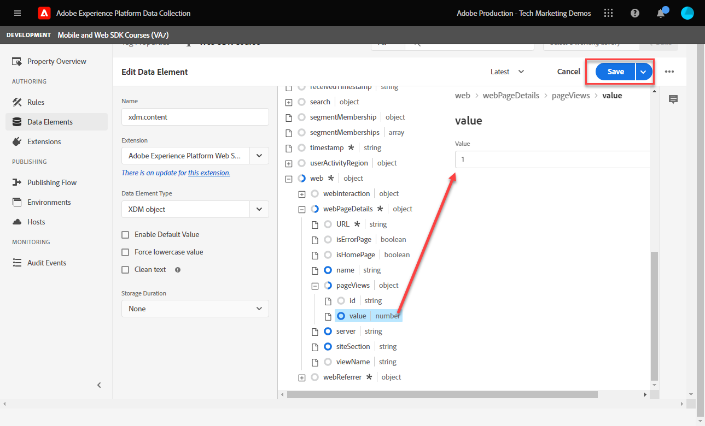
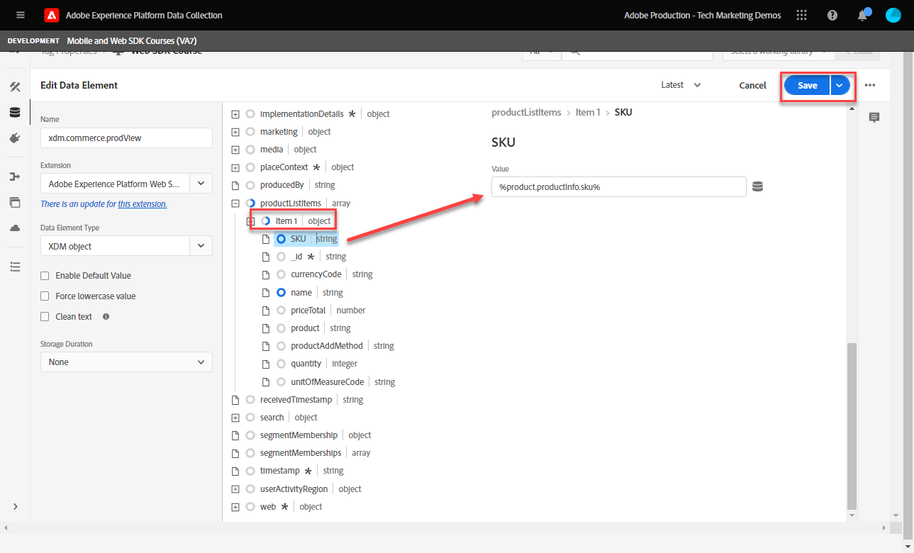
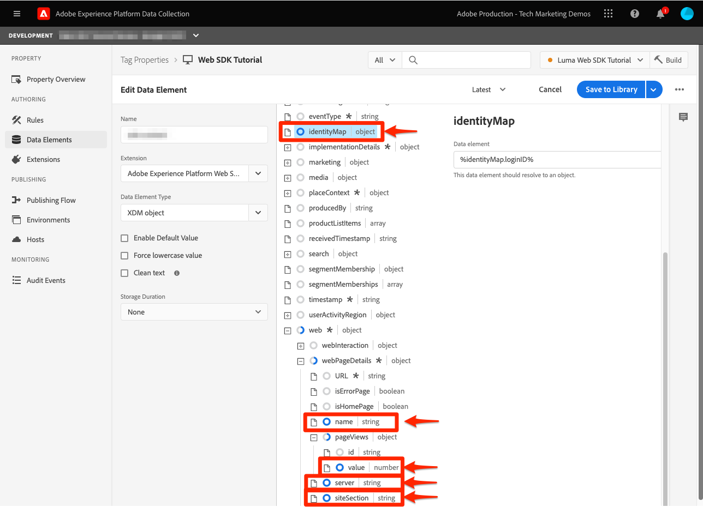
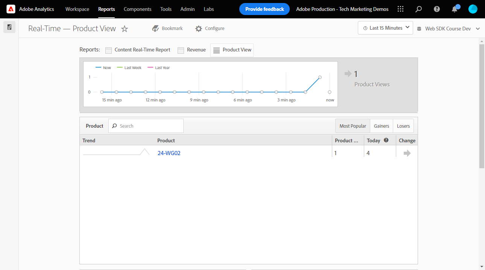

# Konfigurera Adobe Analytics med Platform Web SDK

Lär dig konfigurera Adobe Analytics med [Experience Platform Web SDK](https://experienceleague.adobe.com/docs/platform-learn/data-collection/web-sdk/overview.html), skapa taggregler för att skicka data till Adobe Analytics och validera att Analytics hämtar in data som förväntat.

[Adobe Analytics](https://experienceleague.adobe.com/docs/analytics.html) är en branschledande applikation som ger er möjlighet att förstå era kunder som människor och styra verksamheten med kundanalys.

## Utbildningsmål

När lektionen är klar kan du:

* Konfigurera ett XDM-schema för Adobe Analytics och förstå skillnaden mellan automatiskt mappade och manuellt mappade XDM-variabler för Analytics
* Konfigurera ett datastream för att aktivera Adobe Analytics
* Mappa enskilda eller hela arraydataelement till XDM-objektet
* Hämta sidvyer i Adobe Analytics med XDM-objektet
* Samla in e-handelsdata med XDM-objektet för Adobe Analytics produktsträng
* Validera Adobe Analytics-variabler anges med XDM-objektet med Experience Platform Debugger
* Använd Adobe Analytics bearbetningsregler för att ange anpassade variabler
* Validera data hämtas av Adobe Analytics med Real-Time Reports

## Förutsättningar

Du känner till taggar, Adobe Analytics och [Luma demo site](https://luma.enablementadobe.com/content/luma/us/en.html){target="_blank"} inloggnings- och shoppingfunktioner.

Du behöver minst ett test-/dev-rapportpaket-ID. Om du inte har någon test-/dev-rapportsserie som du kan använda för den här självstudiekursen [skapa en](https://experienceleague.adobe.com/docs/analytics/admin/manage-report-suites/new-report-suite/t-create-a-report-suite.html).

Du måste ha slutfört alla steg från de föregående avsnitten i självstudien:

* Inledande konfiguration
   * [Konfigurera behörigheter](configure-permissions.md)
   * [Konfigurera ett XDM-schema](configure-schemas.md)
   * [Konfigurera ett identitetsnamnutrymme](configure-identities.md)
   * [Konfigurera ett datastream](configure-datastream.md)
* Märkordskonfiguration
   * [Installera SDK-tillägg för webben](install-web-sdk.md)
   * [Skapa dataelement](create-data-elements.md)
   * [Skapa en taggregel](create-tag-rule.md)
   * [Validera med Adobe Experience Platform debugger](validate-with-debugger.md)

## XDM-scheman och analysvariabler

Grattis! Du har redan konfigurerat ett schema som är kompatibelt med Adobe Analytics i [Konfigurera ett schema](configure-schemas.md) lektion!

Implementeringsplattformens Web SDK ska vara så produktagnostiska som möjligt. För Adobe Analytics sker inte mappning av eVars, props och händelser när du skapar ett schema, och inte heller under taggrelicenskonfigurationen som den har gjorts traditionellt. I stället blir varje nyckelvärdepar i XDM en kontextdatavariabel som mappas till en Analytics-variabel på ett av två sätt:

1. Automatiskt mappade variabler med reserverade XDM-fält
1. Manuellt mappade variabler med analysbearbetningsregler

Mer information om vilka XDM-variabler som automatiskt mappas till Adobe Analytics finns i [Variabler mappas automatiskt i Analytics](https://experienceleague.adobe.com/docs/experience-platform/edge/data-collection/adobe-analytics/automatically-mapped-vars.html?lang=en). Alla variabler som inte är automatiskt mappade måste mappas manuellt.

Schemat som skapats i [Konfigurera ett schema](configure-schemas.md) lektionen innehåller några automatiskt mappade till analysvariabler, som beskrivs i följande tabell:

| XDM till Analytics - automappade variabler | Adobe Analytics-variabel |
|-------|---------|
| `identitymap.ecid.[0].id` | mitten |
| `web.webPageDetails.pageViews.value` | a page view s.t() call |
| `web.webPageDetails.name` | s.pageName |
| `web.webPageDetails.server` | s.server |
| `web.webPageDetails.siteSection` | s.channel |
| `commerce.productViews.value` | prodView |
| `commerce.productListViews.value` | scView |
| `commerce.checkouts.value` | scCheckout |
| `commerce.purchases.value` | köp |
| `commerce.order.currencyCode` | s.currencyCode |
| `commerce.order.purchaseID` | s.purchaseID |
| `productListItems[].SKU` | s.products=;product name;;;; (primär - se anmärkning nedan) |
| `productListItems[].name` | s.products=;product name;;;; (fallback - se anm. nedan) |
| `productListItems[].quantity` | s.products=;;produktkvantitet; |
| `productListItems[].priceTotal` | s.product=;;;produktpris; |

>[!NOTE]
>
>De enskilda avsnitten i Analytics-produktsträngen anges via olika XDM-variabler under `productListItems` -objekt.
>18 augusti 2022 `productListItems[].SKU` prioriterar mappning till produktnamnet i variabeln s.products.
>Värdet som anges till `productListItems[].name` mappas endast till produktnamnet om `productListItems[].SKU` finns inte. Annars är den omappad och tillgänglig i kontextdata.
>Ange inte en tom sträng eller null till  `productListItems[].SKU`. Detta har den oönskade effekten av att mappa till produktnamnet i variabeln s.products.


## Konfigurera datastream

Platform Web SDK skickar data från din webbplats till Platform Edge Network. Din datastream talar sedan om för Platform Edge Network var dessa data ska vidarebefordras, i det här fallet, vilken av dina Adobe Analytics rapporteringsprogram.

1. Gå till [Datainsamling](https://experience.adobe.com/#/data-collection){target="blank"} gränssnitt
1. Välj **[!UICONTROL Datastreams]**
1. Markera tidigare skapade `Luma Web SDK` datastream

   

1. Välj **[!UICONTROL Lägg till tjänst]**
   
1. Välj **[!UICONTROL Adobe Analytics]** som **[!UICONTROL Tjänst]**
1. Ange  **[!UICONTROL Report Suite-ID]** av din utvecklingsrapportsserie
1. Välj **[!UICONTROL Spara]**

   

   >[!TIP]
   >
   >Lägg till fler rapportsviter genom att välja **[!UICONTROL Lägg till rapportsvit]** motsvarar taggning i flera programsviter.

>[!WARNING]
>
>I den här självstudiekursen konfigurerar du bara utvecklingssviten för Adobe Analytics. När du skapar datastreams för din egen webbplats skapar du ytterligare datastreams och rapportsviter för dina staging- och produktionsmiljöer.


## Skapa ytterligare dataelement

Hämta sedan in ytterligare data från Luma-datalagret och skicka dem till Platform Edge Network. Även om lektionen fokuserar på vanliga Adobe Analytics-krav kan alla insamlade data enkelt skickas till andra destinationer baserat på din datastream-konfiguration. Om du t.ex. har avslutat Adobe Experience Platform-lektionen skickas även de ytterligare data du får i lektionen till Platform.

### Skapa dataelement för e-handel

Under lektionen Skapa dataelement kan du [skapade JavaScript-dataelement](create-data-elements.md#create-data-elements-to-capture-the-data-layer) som fångade innehåll och identitetsinformation. Nu ska du skapa ytterligare dataelement för att hämta in e-handelsdata. På grund av [Luma demo site](https://luma.enablementadobe.com/content/luma/us/en.html){target="_blank"} använder olika datalagerstrukturer för produktinformationssidor och produkter i kundvagnen, måste du skapa dataelement för varje scenario. Du måste skapa vissa anpassade kodelement för att kunna hämta det du behöver från Luma-datalagret, som kanske inte behövs när du implementerar på din egen webbplats. I så fall måste du slingra dig igenom en mängd olika varukorgsartiklar för att få information om varje produkt. Använd följande kodfragment:

1. Öppna taggegenskapen som du använder för självstudiekursen
1. Gå till **[!UICONTROL Dataelement]**
1. Välj **[!UICONTROL Lägg till dataelement]**
1. Ge den ett namn **`product.productInfo.sku`**
1. Använd **[!UICONTROL Egen kod]** **[!UICONTROL Dataelementtyp]**
1. Lämna kryssrutor för **[!UICONTROL Använd gemener]** och **[!UICONTROL Rensa text]** avmarkerad
1. Lämna `None` som **[!UICONTROL Lagringstid]** inställning eftersom det här värdet är olika på alla sidor
1. Välj **[!UICONTROL Öppna redigeraren]**

   

1. Kopiera och klistra in följande kod

   ```javascript
   var cart = digitalData.product;
   var cartItem;
   cart.forEach(function(item){
   cartItem = item.productInfo.sku;
   });
   return cartItem;
   ```

1. Välj **[!UICONTROL Spara]** för att spara den anpassade koden

   

1. Välj **[!UICONTROL Spara]** spara dataelementet

Följ de här stegen för att skapa ytterligare dataelement:

* **`product.productInfo.title`**

  ```javascript
  var cart = digitalData.product;
  var cartItem;
  cart.forEach(function(item){
  cartItem = item.productInfo.title;
  });
  return cartItem;
  ```

* **`cart.productInfo`**

  ```javascript
  var cart = digitalData.cart.cartEntries;
  var cartItem = [];
  cart.forEach(function(item, index, array){
  var qty = parseInt(item.qty);
  var price = parseInt(item.price);
  cartItem.push({
  "SKU": item.sku,
  "name":item.title,
  "quantity":qty,
  "priceTotal":price
  });
  });
  return cartItem;
  ```

När du har lagt till dessa dataelement och skapat de tidigare elementen i [Skapa dataelement](create-data-elements.md) lektion bör du ha följande dataelement:

| Dataelement |
-----------------------------|
| `cart.orderId` |
| `cart.productInfo` |
| `identityMap.loginID` |
| `page.pageInfo.hierarchie1` |
| `page.pageInfo.pageName` |
| `page.pageInfo.server` |
| `product.productInfo.sku` |
| `product.productInfo.title` |
| `user.profile.attributes.loggedIn` |
| `user.profile.attributes.username` |
| `xdm.content` |

>[!IMPORTANT]
>
>I den här självstudiekursen skapar du olika XDM-objekt för varje händelse. Det innebär att du måste mappa om variabler som betraktas som&quot;globalt&quot; tillgängliga för varje träff, till exempel sidnamn och identityMap. Du kan dock [Sammanfoga objekt](https://experienceleague.adobe.com/docs/experience-platform/tags/extensions/adobe/core/overview.html#merged-objects) eller använda [Mappa tabeller](https://exchange.adobe.com/experiencecloud.details.103136.mapping-table.html) att hantera XDM-objekten effektivare i verkligheten. I den här lektionen betraktas de globala variablerna som:
>
>* **[!UICONTROL identityMap]** för att hämta det autentiserade ID:t enligt [Skapa dataelement för identitetskarta](create-data-elements.md#create-identity-map-data-element) träna i [Skapa dataelement](create-data-elements.md) lektion.
>* **[!UICONTROL webb]** objekt för att hämta innehåll enligt [content XDM-objekt](create-data-elements.md#map-content-data-elements-to-XDM-Schema-individually) träna i [Skapa dataelement](create-data-elements.md) lektion på alla dataelement ovan.

### Öka sidvyer

I lektionen Skapa dataelement [har skapat `xdm.content` dataelement](create-data-elements.md#map-content-data-elements-to-xdm-schema-individually) för att hämta in innehållsdimensioner. Eftersom du nu skickar data till Adobe Analytics måste du även mappa ett extra XDM-fält för att ange att en fyr ska bearbetas som en Analytics-sidvy.

1. Öppna `xdm.content` dataelement
1. Bläddra nedåt och välj att öppna tills `web.webPageDetails`
1. Välj för att öppna **[!UICONTROL pageViews]** object
1. Ange **[!UICONTROL value]** till `1`
1. Välj [!UICONTROL **Spara**]

   

>[!TIP]
>
>Det här fältet motsvarar att skicka en **`s.t()`** sidvisningsfyr för Analytics med `AppMeasurement.js`. För en länk klickar du på beacon och anger `webInteraction.linkClicks.value` till `1`


### Ange produktsträngen

Innan du mappar till produktsträngen är det viktigt att förstå att det finns två huvudobjekt i XDM-schemat som används för att hämta e-handelsdata som har särskilda relationer med Adobe Analytics:

1. The `commerce` objekt ställer in Analytics-händelser som `prodView`, `scView`och `purchase`
1. The `productListItems` objekt ställer in Analytics-dimensioner som `productID`.

Se [Samla in data om handel och produkter](https://experienceleague.adobe.com/docs/experience-platform/edge/data-collection/collect-commerce-data.html?lang=en) för mer information.

Det är också viktigt att du förstår att du kan **[!UICONTROL ange enskilda attribut]** till enskilda XDM-fält eller **[!UICONTROL tillhandahåller en hel array]** till ett XDM-objekt.


### Mappa enskilda attribut till ett XDM-objekt

Du kan mappa till enskilda variabler för att samla in data på sidan med produktinformation på Luma Demo-webbplatsen:

1. Skapa en **[!UICONTROL XDM-objekt]** **[!UICONTROL Dataelementtyp]** namngiven **`xdm.commerce.prodView`**
1. Välj samma plattformssandlåda och XDM-schema som användes i tidigare lektioner
1. Öppna **[!UICONTROL handel]** object
1. Öppna **[!UICONTROL productViews]** objekt och ange **[!UICONTROL value]** till `1`

   

   >[!TIP]
   >
   >Det här steget motsvarar inställningen `prodView` händelse i Analytics


1. Bläddra nedåt till och markera `productListItems` array
1. Välj **[!UICONTROL Ange enskilda objekt]**
1. Välj **[!UICONTROL Lägg till objekt]**

   

   >[!CAUTION]
   >
   >The **`productListItems`** är en `array` datatyp så att data förväntas komma in som en samling element. På grund av Luma-demonstrationswebbplatsens datalagerstruktur och eftersom det bara är möjligt att visa en produkt i taget på Luma-webbplatsen, kommer du att lägga till objekt individuellt. När du implementerar på din egen webbplats, beroende på din datalagerstruktur, kanske du kan tillhandahålla en hel array.

1. Markera för att öppna **[!UICONTROL Objekt 1]**
1. Mappa följande XDM-variabler till dataelement

   * **`productListItems.item1.SKU`** till `%product.productInfo.sku%`
   * **`productListItems.item1.name`** till `%product.productInfo.title%`

   

   >[!IMPORTANT]
   >
   >Innan du sparar det här XDM-objektet måste du även ange globala variabler och sidvisningsökare:
   >

1. Välj **[!UICONTROL Spara]**

### Mappa en hel array till ett XDM-objekt

Som tidigare nämnts använder Luma Demo-webbplatsen en annan datalagerstruktur för produkter i kundvagnen. Elementet med anpassade koddata `cart.productInfo` dataelement som du skapade tidigare slingor genom `digitalData.cart.cartEntries` datalagerobjekt och översätter det till det obligatoriska XDM-objektschemat som krävs. Det nya formatet **måste matcha exakt** schemat som definieras av `productListItems` XDM-schemats objekt.

Se jämförelsen nedan av Luma-webbplatsens datalager (vänster) till det översatta dataelementet (höger) för att illustrera:


Jämför dataelementet med `productListItems` struktur (tips, det ska matcha).

>[!IMPORTANT]
>
>Observera hur numeriska variabler översätts, med strängvärden i datalagret som `price` och `qty` formateras om till tal i dataelementet. Dessa formatkrav är viktiga för dataintegriteten i plattformar och fastställs under [konfigurera scheman](configure-schemas.md) steg. I exemplet **[!UICONTROL kvantitet]** använder **[!UICONTROL Heltal]** datatyp.
> 

Nu tillbaka till mappningen av XDM-objektet till en hel array. Skapa ett XDM-objektdataelement för att hämta produkter på kundvagnssidan:

1. Skapa en **[!UICONTROL XDM-objekt]** **[!UICONTROL Dataelementtyp]** namngiven **`xdm.commerce.cartView`**
1. Välj samma plattformssandlåda och XDM-schema som du använder för den här självstudien
1. Öppna **[!UICONTROL handel]** object
1. Öppna **[!UICONTROL productListViews]** objekt och ange `value` till `1`

   >[!TIP]
   >
   >Det här steget motsvarar inställningen `scView` händelse i Analytics

1. Bläddra nedåt till och markera **[!UICONTROL productListItems]** array
1. Välj **[!UICONTROL Ange hela matrisen]**
1. Mappa till **`cart.productInfo`** dataelement

   

   >[!IMPORTANT]
   >
   >Innan du sparar det här XDM-objektet måste du även ange globala variabler och sidvisningsökare:
   >

1. Välj **[!UICONTROL Spara]**

Skapa en till **[!UICONTROL XDM-objekt]**  **[!UICONTROL Dataelementtyp]** för utcheckning har anropats `xdm.commerce.checkout`. Den här gången anger du **[!UICONTROL commerce.checkouts.value]** till `1`, karta **[!UICONTROL productListItems]** till **`cart.productInfo`** som du just gjorde, och lägg till de&quot;globala&quot; variablerna och sidvisningsräknaren.

>[!TIP]
>
>Det här steget motsvarar inställningen `scCheckout` händelse i Analytics


Det finns ytterligare steg för att hämta `purchase` händelse:

1. Skapa en till  **[!UICONTROL XDM-objekt]**  **[!UICONTROL Dataelementtyp]** för inköp anropade `xdm.commerce.purchase`
1. Öppna **[!UICONTROL handel]** object
1. Öppna **[!UICONTROL beställa]** object
1. Karta **[!UICONTROL purchaseID]** till `cart.orderId` dataelement
1. Ange **[!UICONTROL currencyCode]** till hårdkodat värde `USD`

   

   >[!TIP]
   >
   >Det här motsvarar inställningen `s.purcahseID` och `s.currencyCode` variabler i Analytics

1. Välj för att öppna `purchases` objekt och ange `value` till `1`
   >[!TIP]
   >
   >Det här motsvarar inställningen `purchase` händelse i Analytics

   >[!IMPORTANT]
   >
   >Innan du sparar det här XDM-objektet måste du även ange globala variabler och sidvisningsökare:
   >

1. Välj **[!UICONTROL Spara]**

I slutet av dessa steg bör du skapa följande fem XDM-objektdataelement:

| XDM-objektdataelement |
-----------------------------|
| `xdm.commerce.cartView` |
| `xdm.commerce.checkout` |
| `xdm.commerce.prodView` |
| `xdm.commerce.purchase` |
| `xdm.content` |


## Skapa ytterligare regler för Platform Web SDK

När du har skapat flera XDM-objektdataelement kan du ange beacons med hjälp av regler. I den här övningen skapar du individuella regler per e-handelshändelse och användningsvillkor så att reglerna aktiveras på rätt sidor. Låt oss börja med en produktvyhändelse.

1. Välj **[!UICONTROL Regler]** och sedan **[!UICONTROL Lägg till regel]**
1. Ge den ett namn  [!UICONTROL `product view - library load - AA`]
1. Under **[!UICONTROL Händelser]**, markera **[!UICONTROL Bibliotek inläst (sidan ovanpå)]**
1. Under **[!UICONTROL Villkor]**, välj **[!UICONTROL Lägg till]**

   

1. Lämna **[!UICONTROL Typ av logik]** as **[!UICONTROL Normal]**
1. Lämna **[!UICONTROL Tillägg]** as **[!UICONTROL Core]**
1. Välj **[!UICONTROL Villkorstyp]** as **[!UICONTROL Sökväg utan frågesträng]**
1. Till höger aktiverar du **[!UICONTROL Regex]** växla
1. Under **[!UICONTROL bana är lika med]** set `/products/`. För demonstrationswebbplatsen Luma säkerställer den att regeln endast aktiveras på produktsidor
1. Välj **[!UICONTROL Behåll ändringar]**

   

1. Under **[!UICONTROL Åtgärder]** välj **[!UICONTROL Lägg till]**
1. Välj **[!UICONTROL Adobe Experience Platform Web SDK]** extension
1. Välj **[!UICONTROL Åtgärdstyp]** as **[!UICONTROL Skicka händelse]**
1. The **[!UICONTROL Typ]** fältet har en nedrullningsbar lista med värden att välja mellan. Välj `[!UICONTROL commerce.productViews]`

   >[!TIP]
   >
   >Det värde som markeras här påverkar inte hur data mappas till Analytics, men vi rekommenderar att variabeln tillämpas noggrant eftersom den används i Adobe Experience Platform segmentbygggränssnitt. Det valda värdet är tillgängligt att använda i `[!UICONTROL c.a.x.eventtype]` sammanhangsdatavariabel nedströms.

1. Under **[!UICONTROL XDM-data]** väljer du `[!UICONTROL xdm.commerce.prodView]` XDM-objektdataelement
1. Välj **[!UICONTROL Behåll ändringar]**

   

1. Regeln ska se ut ungefär som nedan. Välj **[!UICONTROL Spara]**

   


Upprepa samma sak för alla andra e-handelshändelser med följande parametrar:

**Regelnamn**: kundvagnsvy - biblioteksinläsning - AA

* **[!UICONTROL Händelsetyp]**: Bibliotek inläst (sidan ovanpå)
* **[!UICONTROL Villkor]**: /content/luma/us/en/user/cart.html
* **Ange ett värde under Web SDK - skicka åtgärd**: commerce.productListViews
* **XDM-data för Web SDK - skicka åtgärd:** `%xdm.commerce.cartView%`

**Regelnamn**: utcheckning - biblioteksinläsning - AA

* **[!UICONTROL Händelsetyp]**: Bibliotek inläst (sidan ovanpå)
* **[!UICONTROL Villkor]** /content/luma/us/en/user/checkout.html
* **Typ för Web SDK - skicka åtgärd**: commerce.checkouts
* **XDM-data för Web SDK - skicka åtgärd:** `%xdm.commerce.checkout%`

**Regelnamn**: purchase - library load - AA

* **[!UICONTROL Händelsetyp]**: Bibliotek inläst (sidan ovanpå)
* **[!UICONTROL Villkor]** /content/luma/us/en/user/checkout/order/thank-you.html
* **Typ för Web SDK - skicka åtgärd**: commerce.purchase
* **XDM-data för Web SDK - skicka åtgärd:** `%xdm.commerce.purchase%`

När du är klar bör du se följande regler som skapats.


## Bygg en utvecklingsmiljö

Lägg till nya dataelement och regler i `Luma Web SDK Tutorial` och bygga om utvecklingsmiljön.


## Validera Adobe Analytics for Platform Web SDK

I [Felsökning](validate-with-debugger.md) lektionen lärde du dig att inspektera XDM-objektbeacon på klientsidan med plattformsfelsökaren och webbläsarutvecklarkonsolen, som liknar hur du felsöker en `AppMeasurement.js` Implementering av analyser. För att validera att Analytics hämtar in data på rätt sätt via Platform Web SDK måste du gå två steg längre:

1. Validera hur data bearbetas av XDM-objektet på Platform Edge Network med hjälp av funktionen Edge Trace i Experience Platform-felsökaren
1. Validera hur data behandlas av Analytics med bearbetningsregler och realtidsrapporter.

### Använd kantkalkering

Lär dig hur du validerar att Adobe Analytics spelar in ECID, sidvisningar, produktsträngen och e-handelshändelser med Edge Trace-funktionen i felsökaren för Experience Platform.

### Experience Cloud ID-validering

1. Gå till [Luma demo site](https://luma.enablementadobe.com/content/luma/us/en.html){target="_blank"} och använd Experience Platform Debugger för att [växla taggegenskapen på webbplatsen till din egen utvecklingsegenskap](validate-with-debugger.md#use-the-experience-platform-debugger-to-map-to-your-tags-property)

   >[!WARNING]
   >
   >Kontrollera att du är inloggad på Luma-webbplatsen innan du fortsätter.  Om du inte är inloggad tillåter Luma-webbplatsen inte utcheckning.
   >
   > 1. På Luma väljer du inloggningsknappen längst upp till höger och använder inloggningsuppgifter **u: test@adobe.com p: test** autentisera
   >
   > 1. Du omdirigeras automatiskt till [Didi Sport Watch produktsida](https://luma.enablementadobe.com/content/luma/us/en/products/gear/watches/didi-sport-watch.html#24-WG02) vid inläsning av nästa sida

1. Om du vill aktivera Edge Trace går du till Felsökning för Experience Platform, i den vänstra navigeringen väljer du **[!UICONTROL Loggar]** väljer du **[!UICONTROL Kant]** och markera **[!UICONTROL Anslut]**

   

1. Den kommer att vara tom tills vidare

   

1. Uppdatera [Didi Sport Watch produktsida](https://luma.enablementadobe.com/content/luma/us/en/products/gear/watches/didi-sport-watch.html#24-WG02) och kontrollera Experience Platform Debugger igen bör du se data som kommit fram. Raden börjar med **[!UICONTROL Automatisk mappning av RSID för analyser]** är Adobe Analytics fyr
1. Markera för att öppna båda `[!UICONTROL mappedQueryParams]` listruta och den andra listrutan för att visa Analytics-variabler

   

   >[!TIP]
   >
   >Den andra listrutan motsvarar det ID för analysrapportsserie som du skickar data till. Det ska matcha din egen rapportsserie, inte den i skärmbilden.

1. Bläddra nedåt för att hitta `[!UICONTROL c.a.x.identitymap.ecid.[0].id]`. Det är en kontextdatavariabel som hämtar ECID
1. Fortsätt rulla nedåt tills du ser Analytics `[!UICONTROL mid]` variabel. Båda ID:n överensstämmer med enhetens Experience Cloud ID.

   

   >[!NOTE]
   >
   >Eftersom du är inloggad bör du ägna en stund åt att validera det autentiserade ID:t `112ca06ed53d3db37e4cea49cc45b71e` för användaren **test@adobe.com** tas också med i `[!UICONTROL c.a.x.identitymap.lumacrmid.[0].id]`


### Vyer av innehållssidor

Du använder samma fyr för att validera att innehållssidvisningar hämtas av Analytics.

1. Leta efter `[!UICONTROL c.a.x.web.webpagedetails.pageviews.value]=1`. Det säger att `s.t()` sidvisningsfyren skickas till Analytics
1. Bläddra nedåt för att se `[!UICONTROL gn]` variabel. Det är den dynamiska syntaxen i Analytics för `[!UICONTROL s.pageName]` variabel. Det hämtar sidnamnet från datalagret.

   

### Produktsträng och e-handelshändelser

Eftersom du redan är på en produktsida fortsätter den här övningen att använda samma Edge Trace för att validera att produktdata hämtas av Analytics. Både produktsträngen och e-handelshändelserna mappas automatiskt XDM-variabler till Analytics. Så länge du har mappat till rätt `productListItem` XDM-variabeln while [konfigurera ett XDM-schema för Adobe Analytics](setup-analytics.md#configure-an-xdm-schema-for-adobe-analytics)tar Platform Edge Network hand om att mappa data till rätt analysvariabler.

1. Verifiera först att `Product String` är inställt
1. Leta efter `[!UICONTROL c.a.x.productlistitems.][0].[!UICONTROL sku]`. Variabeln hämtar det dataelementvärde som du har mappat till `productListItems.item1.sku` tidigare i den här lektionen
1. Bläddra nedåt för att se `[!UICONTROL pl]` variabel. Det är den dynamiska syntaxen för produktsträngvariabeln Analytics
1. Båda värdena matchar produktnamnet som finns i datalagret

   

Edge Trace behandlar `commerce` händelser något annorlunda än `productList` dimensioner. Du ser inte att en kontextdatavariabel är mappad på samma sätt som du ser produktnamnet mappat till `[!UICONTROL c.a.x.productlistitem.[0].name]` ovan. I stället visar Edge Trace den slutliga automatiska händelsemappningen i Analytics `event` variabel. Platform Edge Network mappar det så länge du mappar till rätt XDM `commerce` variabel while [konfigurera schema för Adobe Analytics](setup-analytics.md#configure-an-xdm-schema-for-adobe-analytics); i detta fall `commerce.productViews.value=1`.

1. Gå tillbaka till Experience Platform Debugger-fönstret och rulla nedåt till `[!UICONTROL event]` variabel, är inställd på `[!UICONTROL prodView]`

   

Validera resten av e-handelshändelserna och produktsträngarna är inställda för Analytics.

1. Lägg till [Didi Sport Watch](https://luma.enablementadobe.com/content/luma/us/en/products/gear/watches/didi-sport-watch.html#24-WG02) till kundvagn
1. Gå till [Kundsida](https://luma.enablementadobe.com/content/luma/us/en/user/cart.html), kontrollera Edge Trace för `[!UICONTROL events: "scView"]` och produktsträngen

   

1. Fortsätt till kassan, kontrollera Edge Trace för `[!UICONTROL events: "scCheckout"]` och produktsträngen

   

1. Fyll ut bara **Förnamn** och **Efternamn** fält i leveransformuläret och välj **Fortsätt**. På nästa sida väljer du **Montera beställning**
1. På bekräftelsesidan kan du kontrollera Edge Trace för

   * Inköpshändelse som ställs in `[!UICONTROL events: "purchase"]`
   * Valutakodvariabeln anges `[!UICONTROL cc: "USD"]`
   * Inköps-ID anges `[!UICONTROL pi]`
   * Produktsträng `[!UICONTROL pl]` ange produktnamn, kvantitet och pris

   

## Bearbetningsregler och realtidsrapporter

Nu när du har validerat Analytics-fyrar med Edge Trace kan du även validera data som bearbetas av Analytics med hjälp av Real-Time-rapporterna. Innan du kontrollerar realtidsrapporterna måste du konfigurera bearbetningsregler för Analytics `props` efter behov.

### Bearbetningsregler för anpassade analysmappningar

I den här övningen mappar du en XDM-variabel till ett utkast så att du kan visa den i realtidsrapporter. Följ de här stegen för alla anpassade mappningar du måste göra för alla `eVar`, `prop`, `event`, eller variabel som är tillgänglig via bearbetningsregler.

1. Gå till Analytics-gränssnittet [!UICONTROL Administratör] > [!UICONTROL Administratörsverktyg] > [!UICONTROL Rapportsviter]
1. Välj den rapport för utveckling/test som du använder för självstudiekursen > [!UICONTROL Redigera inställningar] > [!UICONTROL Allmänt] > [!UICONTROL Bearbetar regler]

   

1. Skapa en regel till **[!UICONTROL Skriv över värde för]** `[!UICONTROL Product Name (prop1)]` till `a.x.productlistitems.0.name`. Kom ihåg att lägga till anteckningen till varför du skapar regeln och ge den ett namn. Välj **[!UICONTROL Spara]**

   

   >[!IMPORTANT]
   >
   >Första gången du mappar till en bearbetningsregel visas inte kontextdatavariablerna från XDM-objektet. Om du vill åtgärda det väljer du ett värde, Spara och återgå till att redigera. Alla XDM-variabler ska nu visas.

1. Gå till [!UICONTROL Redigera inställningar] >  [!UICONTROL Realtid]. Konfigurera alla tre med följande parametrar som visas nedan så att du kan validera visningar av innehållssidor, produktvyer och köp

   

1. Upprepa valideringsstegen och du bör se att realtidsrapporter fyller i data i enlighet med detta.

   **Sidvisningar**
   

   **Produktvisningar**
   

   **Inköp**
   

1. I arbetsytans användargränssnitt skapar du en tabell som visar hela e-handelsflödet för den produkt du har köpt

   

Mer information om hur du mappar XDM-fält till analysvariabler finns i videon [Mappa Web SDK-variabler till Adobe Analytics](https://experienceleague.adobe.com/docs/analytics-learn/tutorials/analysis-use-cases/internal-site-search/map-web-sdk-variables-into-adobe-analytics.html).

Grattis! Det här är slutet av lektionen och nu är du redo att implementera Adobe Analytics med Platform Web SDK för din egen webbplats.

[Nästa: ](setup-audience-manager.md)

>[!NOTE]
>
>Tack för att du lade ned din tid på att lära dig om Adobe Experience Platform Web SDK. Om du har frågor, vill dela allmän feedback eller har förslag på framtida innehåll kan du dela dem om detta [Experience League diskussionsinlägg](https://experienceleaguecommunities.adobe.com/t5/adobe-experience-platform-launch/tutorial-discussion-implement-adobe-experience-cloud-with-web/td-p/444996)
