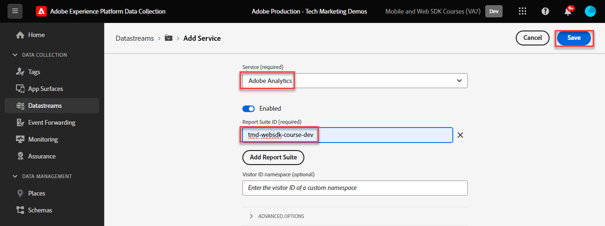

# Konfigurera Adobe Analytics med Adobe Experience Platform Web SDK

Lär dig hur du konfigurerar Adobe Analytics med [Adobe Experience Platform Web SDK](https://experienceleague.adobe.com/sv/docs/platform-learn/data-collection/web-sdk/overview), skapar taggregler för att skicka data till Adobe Analytics och validerar att Analytics hämtar data som förväntat.

[Adobe Analytics](https://experienceleague.adobe.com/sv/docs/analytics) är ett branschledande program som gör att du kan förstå dina kunder som människor och styra din verksamhet med kundanalys.

## Utbildningsmål

När lektionen är klar kan du:

* Konfigurera ett datastream för att aktivera Adobe Analytics
* Ta reda på vilka XDM-standardfält som automatiskt mappas till analysvariabler
* Ange analysvariabler i dataobjektet
* Skicka data till en annan rapportserie genom att åsidosätta datastream
* Validera Adobe Analytics-variabler med Debugger och Assurance

## Förhandskrav

För att slutföra lektionen måste du först:

* Bekanta dig med och få tillgång till Adobe Analytics.

* Ha minst ett test-/dev-rapportpaket-ID. Om du inte har någon test-/dev-rapportsserie som du kan använda för den här självstudiekursen [skapar du en](https://experienceleague.adobe.com/sv/docs/analytics/admin/admin-tools/manage-report-suites/c-new-report-suite/t-create-a-report-suite).

* Slutför de tidigare lektionerna i avsnitten Inledande konfiguration och Tagginställningar i den här självstudien.

## Konfigurera datastream

Platform Web SDK skickar data från er webbplats till Platform Edge Network. Din datastream talar sedan om för Platform Edge Network till vilken Adobe Analytics-rapport säger att dina data ska skickas.

1. Gå till gränssnittet [Datainsamling](https://experience.adobe.com/#/data-collection){target="blank"}
1. Välj **[!UICONTROL Datastreams]** i den vänstra navigeringen
1. Markera den tidigare skapade `Luma Web SDK: Development Environment`-datastream

   

1. Välj **[!UICONTROL Add Service]**
   
1. Välj **[!UICONTROL Adobe Analytics]** som **[!UICONTROL Service]**
1. Ange **[!UICONTROL Report Suite ID]** för utvecklingsrapportsviten
1. Välj **[!UICONTROL Save]**

   

   >[!TIP]
   >
   >Om du lägger till fler rapportsviter genom att välja **[!UICONTROL Add Report Suite]** motsvarar det taggning av flera sviter.

>[!WARNING]
>
>I den här självstudiekursen konfigurerar du bara Adobe Analytics rapportsvit för din utvecklingsmiljö. När du skapar datastreams för din egen webbplats bör du skapa ytterligare datastreams och rapportsviter för dina staging- och produktionsmiljöer.

## Ange analysvariabler

Det finns flera sätt att ställa in Analytics-variabler i en Web SDK-implementering:

1. Automatisk mappning av XDM-fält till analysvariabler (automatiskt).
1. Ange fält i objektet `data` (rekommenderas).
1. Mappa XDM-fält till Analytics-variabler i Analytics-bearbetningsregler (rekommenderas inte längre).
1. Mappa till Analytics-variabler direkt i XDM-schemat (rekommenderas inte längre).

Från maj 2024 behöver du inte längre skapa ett XDM-schema för att implementera Adobe Analytics med Platform Web SDK. Objektet `data` (och dataelementet `data.variable` som du skapade i lektionen [Skapa dataelement](create-data-elements.md)) kan användas för att ställa in alla anpassade Analytics-variabler. Att ställa in dessa variabler i dataobjektet kommer att kännas bekant för befintliga analyskunder, är mer effektivt än att använda gränssnittet för bearbetningsregler och förhindrar att onödiga data tar upp utrymme i kundprofiler i realtid (viktigt om du har Real-Time Customer Data Platform eller Journey Optimizer).

### Automatiskt mappade fält

Många XDM-fält mappas automatiskt till analysvariabler. Den senaste listan över mappningar finns i [Variabelmappning i Analytics i Adobe Experience Edge](https://experienceleague.adobe.com/sv/docs/experience-platform/edge/data-collection/adobe-analytics/automatically-mapped-vars).

Detta inträffar om _även om du inte har definierat ett anpassat schema_. Experience Platform Web SDK samlar automatiskt in vissa data och skickar dem till Platform Edge Network som XDM-fält. Web SDK läser till exempel den aktuella sidans URL och skickar den som XDM-fält `web.webPageDetails.URL`. Det här fältet vidarebefordras till Adobe Analytics och fyller automatiskt i sidans URL-rapporter i Adobe Analytics.

Om du implementerar Web SDK för Adobe Analytics med ett XDM-schema, som du har gjort i den här självstudiekursen, har du några av XDM-fälten som du har anpassat automatiskt mappa till Analytics-variabler, vilket beskrivs i följande tabell:

| XDM till Analytics - automappade variabler | Adobe Analytics-variabel |
|-------|---------|
| `identitymap.ecid.[0].id` | mitten |
| `web.webPageDetails.name` | s.pageName |
| `web.webPageDetails.server` | s.server |
| `web.webPageDetails.siteSection` | s.channel |
| `commerce.productViews.value` | prodView |
| `commerce.productListViews.value` | scView |
| `commerce.checkouts.value` | scCheckout |
| `commerce.purchases.value` | köp |
| `commerce.order.currencyCode` | s.currencyCode |
| `commerce.order.purchaseID` | s.purchaseID |
| `productListItems[].SKU` | s.products=;product name;;;; (primär - se anmärkning nedan) |
| `productListItems[].name` | s.products=;product name;;;; (fallback - se anm. nedan) |
| `productListItems[].quantity` | s.products=;;produktkvantitet; |
| `productListItems[].priceTotal` | s.product=;;;produktpris; |

De enskilda avsnitten i Analytics-produktsträngen ställs in via olika XDM-variabler under objektet `productListItems`.

>[!NOTE]
>
>Från och med den 18 augusti 2022 prioriterar `productListItems[].SKU` mappning till produktnamnet i variabeln s.products.
>&#x200B;>Värdet `productListItems[].name` mappas bara till produktnamnet om `productListItems[].SKU` inte finns. Annars är den omappad och tillgänglig i kontextdata.
>&#x200B;>Ange inte en tom sträng eller null till `productListItems[].SKU`. Detta har den oönskade effekten av att mappa till produktnamnet i variabeln s.products.

### Ange variabler i dataobjektet

Men evar, props och händelser då? Vi rekommenderar att du anger variabler i objektet `data` för att ställa in dessa Analytics-variabler med Web SDK. Om du ställer in variabler i dataobjektet kan även alla automatiskt mappade variabler skrivas över.

För det första, vad är objektet `data`? I alla Web SDK-händelser kan du skicka två objekt med anpassade data, `xdm`-objektet och `data`-objektet. Båda skickas till Platform Edge Network, men endast objektet `xdm` skickas till Experience Platform datamängd. Egenskaper i `data`-objektet kan mappas på Edge till `xdm`-fält med hjälp av dataprep för datainsamling, men skickas annars inte till Experience Platform. Detta gör det till ett idealiskt sätt att skicka data till program som Analytics, som inte är inbyggt i Experience Platform.

Här är de två objekten i ett generiskt Web SDK-anrop:

Adobe Analytics har konfigurerats för att söka efter egenskaper i objektet `data.__adobe.analytics` och använda dem för Analytics-variabler.

Nu ska vi se hur det här fungerar. Låt oss ange `eVar1` och `prop1` med vårt sidnamn och se hur XDM-mappat värde kan skrivas över

1. Öppna taggregeln `all pages - library loaded - set global variables - 1`
1. Lägg till en ny **[!UICONTROL Action]**
1. Välj tillägget **[!UICONTROL Adobe Experience Platform Web SDK]**
1. Välj **[!UICONTROL Action Type]** som **[!UICONTROL Update variable]**
1. Välj `data.variable` som **[!UICONTROL Data element]**
1. Markera objektet **[!UICONTROL analytics]**
1. Ange `eVar1` som `page.pageInfo.pageName`-dataelement
1. Ange `prop1` för kopiering av värdet för `eVar1`
1. Om du vill testa att XDM-mappade värden skrivs över anger du sidnamnet som ett statiskt värde `test` i avsnittet **[!UICONTROL Additional property]**.
1. Spara regeln

Nu måste vi inkludera dataobjektet i vår sändningshändelseregel.

1. Öppna taggregeln `all pages - library loaded - send event - 50`
1. Öppna åtgärden **[!UICONTROL Send Event]**
1. Välj `data.variable` som **[!UICONTROL Data]**
1. Välj **[!UICONTROL Keep Changes]**
1. Välj **[!UICONTROL Save]**

<!--

### Map to Analytics variables with processing rules

All fields in the XDM schema become available to Adobe Analytics as Context Data Variables with the following prefix `a.x.`. For example, `a.x.web.webinteraction.region`

In this exercise, you map one XDM variable to a prop. Follow these same steps for any custom mapping that you must do for any `eVar`, `prop`, `event`, or variable accessible via Processing Rules.

1. Go to the Analytics interface
1. Go to [!UICONTROL Admin] > [!UICONTROL Admin Tools] > [!UICONTROL Report Suites ]
1. Select the dev/test report suite that you are using for the tutorial > [!UICONTROL Edit Settings] > [!UICONTROL General] > [!UICONTROL Processing Rules]

       

1. Create a rule to **[!UICONTROL Overwrite value of]** `[!UICONTROL Product SKU (prop1)]` to `a.x.productlistitems.0.sku`. Remember to add a note about why you are creating the rule and name your rule title. Select **[!UICONTROL Save]**

       

    >[!IMPORTANT]
    >
    >The first time you map to a processing rule, the UI does not show you the context data variables from the XDM object. To fix that select any value, Save, and come back to edit. All XDM variables should now appear.

### Map to Analytics variables using the Adobe Analytics field group

An alternative to processing rules is to map to Analytics variables in the XDM schema using the `Adobe Analytics ExperienceEvent Template` field group. This approach has gained popularity because many users find it simpler than configuring processing rules, however, by increasing the size of the XDM payload it could in turn increase the profile size in other applications like Real-Time CDP.

To add the `Adobe Analytics ExperienceEvent Template` field group to your schema:

1. Open the [Data Collection](https://experience.adobe.com/#/data-collection){target="blank"} interface
1. Select **[!UICONTROL Schemas]** from the left navigation
1. Make sure you are in the sandbox you are using from the tutorial
1. Open your `Luma Web Event Data` schema
1. In the **[!UICONTROL Field Groups]** section, select **[!UICONTROL Add]**
1. Find the `Adobe Analytics ExperienceEvent Template` field group and add it to your schema

Now, set a merchandising eVar in the product string. With the `Adobe Analytics ExperienceEvent Template` field group, you are able to map variables to merchandising eVars or events within the product string. This is also known as setting **Product Syntax Merchandising**. 

1. Go back to your tag property

1. Open the rule `ecommerce - library loaded - set product details variables - 20`

1. Open the **[!UICONTROL Set Variable]** action

1. Select to open `_experience > analytics > customDimensions > eVars > eVar1`

1. Set the **[!UICONTROL Value]** to `%product.productInfo.title%`

1. Select **[!UICONTROL Keep Changes]**

    

1. Select **[!UICONTROL Save]** to save the rule

As you just saw, basically all of the Analytics variables can be set in the `Adobe Analytics ExperienceEvent Template` field group.

>[!NOTE]
>
> Notice the `_experience` object under `productListItems` > `Item 1`. Setting any variable under this [!UICONTROL object] sets Product Syntax eVars or Events.

-->

## Skicka data till en annan rapportserie

Du kanske vill ändra vilka data i Adobe Analytics rapportserie som skickas till när besökarna finns på vissa sidor. Detta kräver en konfiguration i både datastream och en regel.

### Konfigurera datastream för åsidosättning av en rapportserie

Så här konfigurerar du åsidosättningsinställningen för Adobe Analytics-rapportsviten i datastream:

1. Öppna ditt datastream
1. Redigera konfigurationen för **[!UICONTROL Adobe Analytics]** genom att öppna menyn  och sedan välja **[!UICONTROL Edit]**

   

1. Välj **[!UICONTROL Advanced Options]** för att öppna **[!UICONTROL Report Suite Overrides]**

1. Markera de rapportsviter som du vill åsidosätta. I det här fallet `Web SDK Course Dev` och `Web SDK Course Stg`

1. Välj **[!UICONTROL Save]**

   

### Konfigurera en regel för åsidosättning av en rapportserie

Låt oss skapa en regel för att skicka ytterligare ett sidvisningsanrop till en annan rapportserie. Använd åsidosättningsfunktionen för datastream för att ändra rapportsviten för en sida med åtgärden **[!UICONTROL Send Event]**.

1. Skapa en ny regel, ge den namnet `homepage - library loaded - AA report suite override - 51`

1. Välj plustecknet under **[!UICONTROL Event]** för att lägga till en ny utlösare

1. Under **[!UICONTROL Extension]** väljer du **[!UICONTROL Core]**

1. Under **[!UICONTROL Event Type]** väljer du **[!UICONTROL Library Loaded (Page Top)]**

1. Välj att öppna **[!UICONTROL Advanced Options]**, skriv in `51`. Detta garanterar att regeln körs efter `all pages - library loaded - send event - 50` som anger baslinje-XDM med åtgärdstypen **[!UICONTROL Update variable]**.
1. Välj **[!UICONTROL Keep Changes]**

   

1. Under **[!UICONTROL Conditions]** väljer du att **[!UICONTROL Add]**

1. Lämna **[!UICONTROL Logic Type]** som **[!UICONTROL Regular]**

1. Lämna **[!UICONTROL Extensions]** som **[!UICONTROL Core]**

1. Välj **[!UICONTROL Condition Type]** som **[!UICONTROL Path Without Query String]**

1. Till höger lämnar du växlingsknappen **[!UICONTROL Regex]** inaktiverad

1. Under **[!UICONTROL path equals]**, ange `/content/luma/us/en.html`. För demonstrationswebbplatsen Luma säkerställer den att regeln endast aktiveras på startsidan

1. Välj **[!UICONTROL Keep Changes]**

   

1. Under **[!UICONTROL Actions]** väljer du **[!UICONTROL Add]**

1. Som **[!UICONTROL Extension]** väljer du **[!UICONTROL Adobe Experience Platform Web SDK]**

1. Som **[!UICONTROL Action Type]** väljer du **[!UICONTROL Send Event]**

1. Som **[!UICONTROL XDM data]** väljer du dataelementet `xdm.variable.content` som du skapade i lektionen [Skapa dataelement](create-data-elements.md)

1. Som **[!UICONTROL Data]** väljer du dataelementet `data.variable` som du skapade i lektionen [Skapa dataelement](create-data-elements.md)

   

1. Bläddra ned till avsnittet **[!UICONTROL Datastream Configurations Overrides]**

1. Låt fliken **[!UICONTROL Development]** vara markerad.

   >[!TIP]
   >
   >    Den här fliken avgör i vilken taggmiljö åsidosättningen sker. I det här exemplet anger du bara utvecklingsmiljön, men när du distribuerar den till produktionen måste du också göra det i **[!UICONTROL Production]**-miljön.

1. Välj **[!UICONTROL Sandbox]** som du använder som självstudiekurs
1. Välj **[!UICONTROL Datastream]**, i det här fallet `Luma Web SDK: Development Environment`

1. Under **[!UICONTROL Report suites]** väljer du den rapportwebbplats som du vill åsidosätta. I det här fallet `tmd-websdk-course-stg`.

1. Välj **[!UICONTROL Keep Changes]**

1. Och **[!UICONTROL Save]** din regel

   

## Bygg en utvecklingsmiljö

Lägg till dina uppdaterade regler i `Luma Web SDK Tutorial`-taggbiblioteket och återskapa utvecklingsmiljön.

Grattis! Nästa steg är att validera Adobe Analytics-implementeringen via Experience Platform Web SDK.

## Validera Adobe Analytics med felsökning

Lär dig hur du validerar att Adobe Analytics spelar in ECID, sidvisningar, produktsträngar och e-handelshändelser med Edge Trace-funktionen i Experience Platform Debugger.

I lektionen [Felsökning](validate-with-debugger.md) lärde du dig att inspektera XDM-begäran på klientsidan med plattformsfelsökaren och webbläsarutvecklarkonsolen, som liknar hur du felsöker en `AppMeasurement.js` -analysimplementering. Du har också lärt dig att validera de Edge Network-begäranden på serversidan som skickas till Adobe-program och hur du visar en fullt bearbetad nyttolast med Assurance.

För att validera att Analytics hämtar in data på rätt sätt via Experience Platform Web SDK måste ni gå ytterligare två steg:

1. Validera hur data bearbetas av XDM-objektet på Platform Edge Network med hjälp av Experience Platform Debugger Edge Trace-funktionen
1. Validera hur data bearbetas fullt ut av Analytics med Adobe Experience Platform Assurance

### Experience Cloud ID-validering

1. Gå till webbplatsen [Luma demo](https://luma.enablementadobe.com/content/luma/us/en.html){target="_blank"}
1. Välj inloggningsknappen högst upp till höger och använd inloggningsuppgifterna u: test@test.com p: test to authenticate
1. Öppna Experience Platform Debugger och [växla taggegenskapen på webbplatsen till din egen utvecklingsegenskap](validate-with-debugger.md#use-the-experience-platform-debugger-to-map-to-your-tags-property)

1. Om du vill aktivera Edge Trace går du till Experience Platform Debugger, i den vänstra navigeringen väljer du **[!UICONTROL Logs]**, sedan fliken **[!UICONTROL Edge]** och väljer **[!UICONTROL Connect]**

   

1. Den kommer att vara tom tills vidare

   

1. Uppdatera Luma-sidan och kontrollera Experience Platform Debugger igen. Du bör se data som skickats. Raden som börjar med **[!UICONTROL Analytics Automatic Mapping]** är Adobe Analytics-fyren
1. Välj att öppna både listrutan `[!UICONTROL mappedQueryParams]` och den andra listrutan för att visa Analytics-variabler

   

   >[!TIP]
   >
   >Den andra listrutan motsvarar det ID för analysrapportsserie som du skickar data till. Det ska matcha din egen rapportsserie, inte den i skärmbilden.

1. Bläddra ned för att hitta `[!UICONTROL c.a.x.identitymap.ecid.[0].id]`. Det är en kontextdatavariabel som hämtar ECID
1. Fortsätt rulla nedåt tills du ser variabeln `[!UICONTROL mid]` i Analytics. Båda ID:n överensstämmer med din enhets Experience Cloud ID.
1. På Luma-webbplatsen:

   

   >[!NOTE]
   >
   >Eftersom du är inloggad kan du ägna en stund åt att validera att det autentiserade ID:t `b642b4217b34b1e8d3bd915fc65c4452` för användaren **`test@test.com`** också har hämtats i `[!UICONTROL c.a.x.identitymap.lumacrmid.[0].id]`

### Åsidosättningsvalidering av rapportsviten

Ovanför du konfigurerade en datastream-åsidosättning för [Luma-startsidan](https://luma.enablementadobe.com/content/luma/us/en.html).  Validera konfigurationen

1. Leta efter en rad med **[!UICONTROL Datastream config after override was applied]**. Här hittar du den primära rapportsviten och de extra rapportsviterna som har konfigurerats för åsidosättningar av rapportsviten.

   

1. Bläddra nedåt till raden som börjar med **[!UICONTROL Analytics Automatic Mapping]** och verifiera att `[!UICONTROL reportSuiteIds]` visar rapportsviten som du angav i dina åsidosättningskonfigurationer

   

### Validering av vyer av innehållssidor

Gå till en produktsida som produktsidan [Didi Sport Watch](https://luma.enablementadobe.com/content/luma/us/en/products/gear/watches/didi-sport-watch.html#24-WG02).  Verifiera att innehållssidvisningar hämtas av Analytics.

1. Leta efter `[!UICONTROL c.a.x.web.webpagedetails.pageviews.value]=1`.
1. Bläddra nedåt för att se variabeln `[!UICONTROL gn]`. Det är den dynamiska syntaxen för Analytics för variabeln `[!UICONTROL s.pageName]`. Det hämtar sidnamnet från datalagret.

   >[!NOTE]
   >
   > Värdet `gn` kan vara `test` om du skrev över objektet `xdm` med objektet `data` i den tidigare övningen.

   

### Produktsträng och validering av e-handelshändelser

Eftersom du redan är på en produktsida fortsätter den här övningen att använda samma Edge Trace för att validera att produktdata hämtas av Analytics. Både produktsträngen och e-handelshändelserna mappas automatiskt XDM-variabler till Analytics. Så länge du har mappat till rätt `productListItem` XDM-variabel när du [konfigurerar ett XDM-schema för Adobe Analytics](setup-analytics.md#configure-an-xdm-schema-for-adobe-analytics), hanterar Platform Edge Network mappningen av data till rätt analysvariabler.

**Verifiera först att `Product String` är inställt**

1. Leta efter `[!UICONTROL c.a.x.productlistitems.][0].[!UICONTROL sku]`. Variabeln hämtar det dataelementvärde som du mappade till `productListItems.item1.sku` tidigare i den här lektionen
1. Sök även efter `[!UICONTROL c.a.x.productlistitems.][0].[!UICONTROL _experience.analytics.customdimensions.evars.evar1]`. Variabeln hämtar det dataelementvärde som du har mappat till `productListItems.item1._experience.analytics.customdimensions.evars.evar1`
1. Bläddra nedåt för att se variabeln `[!UICONTROL pl]`. Det är den dynamiska syntaxen för produktsträngvariabeln Analytics
1. Observera att produktnamnet från datalagret mappas både till parametern `[!UICONTROL c.a.x.productlistitems.][0].[!UICONTROL sku]` och `[!UICONTROL product]` för produktsträngen.  Dessutom mappas produkttiteln från datalagret till merchandising evar1 i produktsträngen.

   

   Edge Trace hanterar `commerce` händelser något annorlunda än `productList` dimensioner. Du ser ingen kontextdatavariabel som har mappats på samma sätt som du ser produktnamnet som har mappats till `[!UICONTROL c.a.x.productlistitem.[0].name]` ovan. I stället visar Edge Trace den slutliga automatiska händelsemappningen i variabeln `event` för analysen. Platform Edge Network mappar den därefter så länge du mappar till rätt XDM `commerce`-variabel medan [schemat för Adobe Analytics](setup-analytics.md#configure-an-xdm-schema-for-adobe-analytics) konfigureras, i det här fallet `commerce.productViews.value=1`.

1. Gå tillbaka till Experience Platform Debugger-fönstret, bläddra nedåt till variabeln `[!UICONTROL events]`, den är inställd på `[!UICONTROL prodView]`

1. Observera också att `[!UICONTROL c.a.x.eventType]` är inställt på `commerce.productViews` eftersom du är på en produktsida.

   >[!TIP]
   >
   > Regeln `ecommerce - library loaded - set product details variables - 20` skriver över värdet för `eventType` som anges av regeln `all pages - library loaded - set global variables - 1` eftersom den ställs in att utlösas senare i sekvensen

   

**Verifiera resten av e-handelshändelser och produktsträngar har angetts för Analytics**

1. Lägg till [Didi Sport Watch](https://luma.enablementadobe.com/content/luma/us/en/products/gear/watches/didi-sport-watch.html#24-WG02) i kundvagnen
1. Gå till [kundvagnssidan](https://luma.enablementadobe.com/content/luma/us/en/user/cart.html) och kontrollera Edge Trace efter

   * `eventType` inställd på `commerce.productListViews`
   * `[!UICONTROL events: "scView"]` och
   * produktsträngen är inställd

   

1. Gå till kassan, kontrollera Edge Trace för

   * `eventType` inställd på `commerce.checkouts`
   * `[!UICONTROL events: "scCheckout"]` och
   * produktsträngen är inställd

   

1. Fyll bara i fälten **Förnamn** och **Efternamn** i leveransformuläret och välj **Fortsätt**. På nästa sida väljer du **Placera ordning**
1. På bekräftelsesidan finns Edge Trace

   * `eventType` inställd på `commerce.purchases`
   * Inköpshändelse ställs in `[!UICONTROL events: "purchase"]`
   * Valutakodvariabeln ställs in `[!UICONTROL cc: "USD"]`
   * Inköps-ID anges i `[!UICONTROL pi]`
   * Produktsträng `[!UICONTROL pl]` som anger produktnamn, kvantitet och pris

   

## Validera Adobe Analytics med Assurance

Adobe Experience Platform Assurance hjälper er att inspektera, bevisa, simulera och validera hur ni samlar in data eller levererar upplevelser med er webbplats och mobilapplikation.

I den föregående övningen validerade du att Adobe Analytics spelar in ECID, sidvisningar, produktsträngen och e-handelshändelser med Edge Trace-funktionen i Experience Platform Debugger.  Sedan validerar du dessa händelser med Adobe Experience Platform Assurance, ett alternativt gränssnitt för att få tillgång till samma data i Edge Trace.

Som du har lärt dig i lektionen [Assurance](validate-with-assurance.md) finns det flera sätt att initiera en Assurance-session. Eftersom du redan har Adobe Experience Platform Debugger öppet med en Edge Trace-session som initierats från den senaste övningen rekommenderar vi att du kommer åt Assurance via Felsökning:

I **[!UICONTROL "Web SDK Tutorial 3"]** Assurance Session anger du **[!UICONTROL "hitdebugger"]** i sökfältet för händelser för att filtrera resultaten till data som bearbetats efter Adobe Analytics.

### Experience Cloud ID-validering

Om du vill validera att Adobe Analytics hämtar ECID-numret markerar du en fyr och öppnar nyttolasten.  Leverantören för denna fyr bör vara **[!UICONTROL com.adobe.analytics.hitdebugger]**

Bläddra sedan nedåt till **[!UICONTROL mcvisId]** för att verifiera att ECID:t har hämtats korrekt

### Validering av vyer av innehållssidor

Använd samma fyr för att kontrollera att vyerna för innehållssidor är mappade till rätt Adobe Analytics-variabel.
Bläddra ned till **[!UICONTROL pageName]** för att verifiera att `Page Name` har hämtats korrekt:

    >[!NOTE]
    >
    > Värdet &quot;pageName&quot; kan vara &quot;test&quot; om du skrev över &quot;xdm&quot;-objektet med &quot;data&quot;-objektet i den tidigare övningen.
    
    

### Produktsträng och validering av e-handelshändelser

Efter samma valideringsanvändningsfall som användes vid valideringen med Experience Platform Debugger ovan kan du fortsätta använda samma fyr för att validera `Ecommerce Events` och `Product String`.

1. Leta efter nyttolast där **[!UICONTROL events]** innehåller `prodView`
   
1. Bläddra ned till **[!UICONTROL product-string]** för att validera `Product String`.
   * Observera `Product SKU` och `Merchandizing eVar1`.
1. Bläddra nedåt och validera att `prop1`, som du konfigurerade med bearbetningsreglerna i föregående avsnitt, innehåller `Product SKU`\
   

Fortsätt att validera implementeringen genom att granska kundvagnen, kassan och köphändelserna.

1. Sök efter nyttolast där **[!UICONTROL events]** innehåller `scView` och validera produktsträngen.
   
1. Sök efter nyttolast där **[!UICONTROL events]** innehåller `scCheckout` och validera produktsträngen.
   
1. Leta efter nyttolast där **[!UICONTROL events]** innehåller `purchase`
   
1. När du validerar `purchase`-händelsen bör du tänka på att `Product String` ska innehålla `Product SKU`, `Product Quantity` och `Product Total Price`.
1. Dessutom, för `purchase`-valideringen, måste `purchase-id` och/eller `purchaseId` anges

Grattis! Du lyckades! Det här är slutet av lektionen och nu är du redo att implementera Adobe Analytics med Platform Web SDK för din egen webbplats.

[Nästa: ](setup-audience-manager.md)

>[!NOTE]
>
>Tack för att du har lagt ned din tid på att lära dig om Adobe Experience Platform Web SDK. Om du har frågor, vill dela allmän feedback eller har förslag på framtida innehåll kan du dela dem i det här [Experience League diskussionsgruppsinlägget](https://experienceleaguecommunities.adobe.com/t5/adobe-experience-platform-data/tutorial-discussion-implement-adobe-experience-cloud-with-web/td-p/444996)
