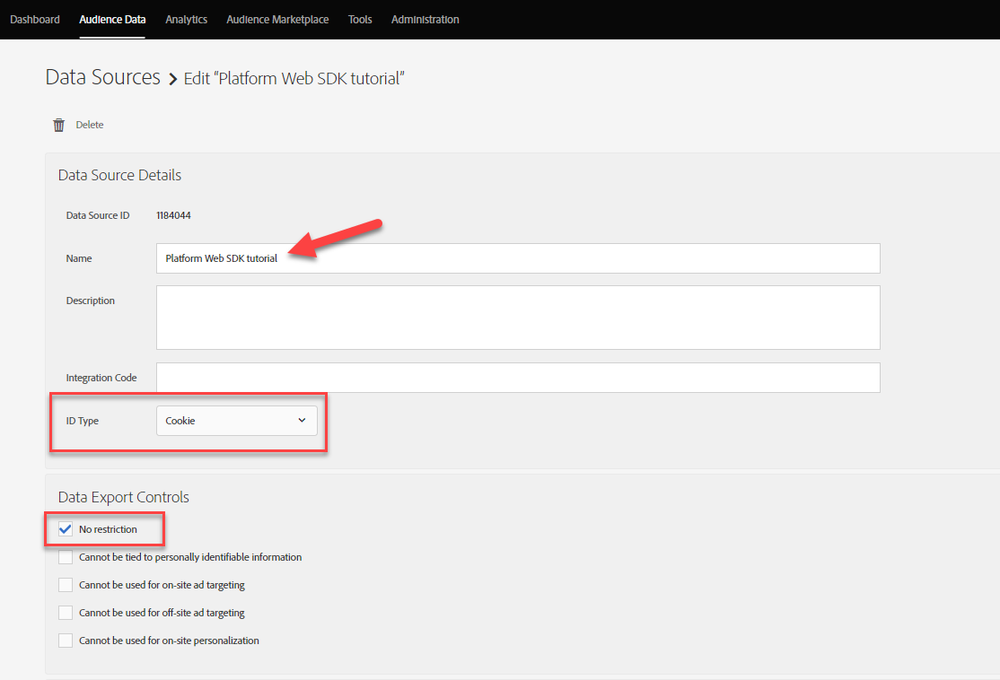
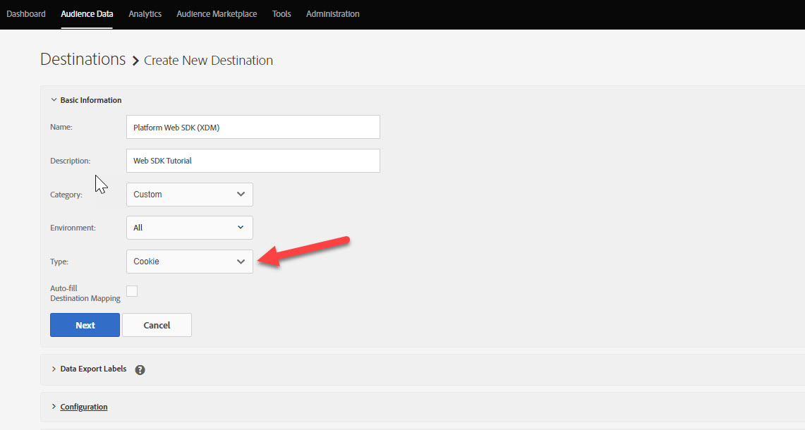

# Konfigurera Audience Manager med Platform Web SDK

Lär dig hur du konfigurerar Adobe Audience Manager med Adobe Experience Platform Web SDK och validerar implementeringen med hjälp av en cookie-destination.

[Adobe Audience Manager](https://experienceleague.adobe.com/sv/docs/audience-manager) är en Adobe Experience Cloud-lösning som innehåller allt som krävs för att samla in kommersiellt relevant information om webbplatsbesökare, skapa marknadsföringsbara segment och leverera riktad reklam och innehåll till rätt målgrupp.

## Utbildningsmål

När lektionen är klar kan du:

* Konfigurera ett datastream för att aktivera Audience Manager
* Aktivera en cookie-destination i Audience Manager
* Validera Audience Manager-implementeringen genom att bekräfta målgruppskvalifikation med Adobe Experience Platform Debugger

## Förhandskrav

För att slutföra lektionen måste du först:

* Slutför de tidigare lektionerna i avsnitten Inledande konfiguration och Tagginställningar i den här självstudien.
* ha tillgång till Adobe Audience Manager och de behörigheter som krävs för att skapa, läsa och skriva egenskaper, segment och mål. Mer information finns i [Audience Manager rollbaserad åtkomstkontroll](https://experienceleague.adobe.com/sv/docs/audience-manager-learn/tutorials/setup-and-admin/user-management/setting-permissions-with-role-based-access-control).

## Konfigurera datastream

Implementeringen av Audience Manager som använder Platform Web SDK skiljer sig från implementeringen med [vidarebefordring på serversidan (SSF)](https://experienceleague.adobe.com/sv/docs/analytics/admin/admin-tools/manage-report-suites/edit-report-suite/report-suite-general/server-side-forwarding/ssf). Vidarebefordran på serversidan skickar Adobe Analytics data för begäran till Audience Manager. En SDK-implementering för en plattform skickar XDM-data som skickas till Platform Edge Network till Audience Manager. Audience Manager är aktiverat i datastream:

1. Gå till gränssnittet [Datainsamling](https://experience.adobe.com/#/data-collection){target="blank"}
1. Välj **[!UICONTROL Datastreams]** i den vänstra navigeringen
1. Markera den tidigare skapade `Luma Web SDK: Development Environment`-datastream

   

1. Välj **[!UICONTROL Add Service]**
   
1. Välj **[!UICONTROL Adobe Audience Manager]** som **[!UICONTROL Service]**
1. Bekräfta att **[!UICONTROL Cookie Destinations Enabled]** och **[!UICONTROL URL Destinations Enabled]** är markerade
1. Välj **[!UICONTROL Save]**
   

## Skapa en datakälla

Skapa sedan en [Data Source](https://experienceleague.adobe.com/sv/docs/audience-manager/user-guide/features/data-sources/datasources-list-and-settings) - ett grundläggande verktyg för att ordna data i Audience Manager:

1. Gå till gränssnittet [Audience Manager](https://experience.adobe.com/#/audience-manager/)
1. Välj **[!UICONTROL Audience Data]** i den övre navigeringen
1. Välj **[!UICONTROL Data Sources]** i listrutan
1. Välj knappen **[!UICONTROL Add New]** högst upp på sidan Datakällor

   

1. Ge Data Source ett eget namn och en beskrivning. Du kan namnge `Platform Web SDK tutorial` för den första konfigurationen.
1. Ange **[!UICONTROL ID Type]** till **[!UICONTROL Cookie]**
1. I avsnittet **[!UICONTROL Data Export Controls]** väljer du **[!UICONTROL No Restriction]**

   

1. **[!UICONTROL Save]** Data Source

## Skapa ett varumärke

När Data Source har sparats konfigurerar du en [egenskap](https://experienceleague.adobe.com/sv/docs/audience-manager/user-guide/features/traits/traits-overview). Traits är en kombination av en eller flera signaler i Audience Manager. Skapa ett varumärke för besökare på hemsidan.

>[!NOTE]
>
>Alla XDM-data skickas till Audience Manager om de är aktiverade i datastream, men data kan ta 24 timmar tills de blir tillgängliga i rapporten Oanvända signaler. Skapa explicita egenskaper för XDM-data som du vill använda direkt i Audience Manager, enligt beskrivningen i den här övningen.

1. Välj **[!UICONTROL Audience Data]** > **[!UICONTROL Traits]**
1. Välj **[!UICONTROL Add New]** > **[!UICONTROL Rule-Based]** trait

   

1. Ge ditt eget namn och en beskrivning, `Luma homepage view`
1. Markera **[!UICONTROL Data Source]** som du skapade i föregående avsnitt.
1. **[!UICONTROL Select a Folder]** där du vill spara din egenskap i rutan till höger. Du kan skapa en mapp genom att **välja +-ikonen** bredvid en befintlig överordnad mapp. Du kan namnge den nya mappen `Platform Web SDK tutorial`.
1. Expandera cirkumflexet **[!UICONTROL Trait Expression]** och välj **[!UICONTROL Expression Builder]** Du måste ange ett nyckelvärdepar som representerar ett hemsidesbesök.
1. Öppna [Luma-startsidan](https://luma.enablementadobe.com/content/luma/us/en.html) (mappad till taggegenskapen) och **Adobe Experience Platform Debugger** och uppdatera sidan.
1. Titta på nätverksförfrågningar och händelseinformationen för Platform Web SDK för att hitta nyckel- och namnvärdet för hemsidan.
   
1. Gå tillbaka till uttrycksverktyget i användargränssnittet för Audience Manager och ange nyckeln som **`web.webPageDetails.name`** och värdet för **`content:luma:us:en`**. Det här steget gör att du får ett spår när du läser in hemsidan.
1. **[!UICONTROL Save]** trait.

## Skapa ett segment

Nästa steg är att skapa ett **segment** och tilldela det här segmentet din nydefinierade egenskap.

1. Markera **[!UICONTROL Audience Data]** i den övre navigeringen och välj **[!UICONTROL Segments]**
1. Välj **[!UICONTROL Add New]** i det övre vänstra hörnet på sidan för att öppna segmentverktyget
1. Ge ditt segment ett eget namn och en beskrivning, till exempel `Platform Web SDK - Homepage visitors`
1. **[!UICONTROL Select a Folder]** där ditt segment sparas i rutan till höger. Du kan skapa en mapp genom att **välja +-ikonen** bredvid en befintlig överordnad mapp. Du kan namnge den nya mappen `Platform Web SDK tutorial`.
1. Lägg till en integrationskod, som i det här fallet är en slumpmässig uppsättning med siffror.
1. I avsnittet **[!UICONTROL Data Source]** väljer du **[!UICONTROL Audience Manager]** och den datakälla du skapade tidigare
1. Expandera avsnittet **[!UICONTROL Traits]** och sök efter den egenskap du har skapat
1. Välj **[!UICONTROL Add Trait]**.
1. Markera **[!UICONTROL Save]** längst ned på sidan

   

   

## Skapa ett mål

Skapa sedan ett **cookie-baserat mål** med **Målverktyget**. Med Destination Builder kan du skapa och hantera mål för cookies, URL och server-till-server.

1. Öppna målverktyget genom att välja **[!UICONTROL Destinations]** på menyn **Måldata** i den övre navigeringen
1. Välj **[!UICONTROL Create Destination]**
1. Ange namn och beskrivning, `Platform Web SDK tutorial`
1. Som **[!UICONTROL Category]** väljer du **[!UICONTROL Custom]**
1. Som **[!UICONTROL Type]** väljer du **[!UICONTROL Cookie]**

   

1. Öppna avsnittet **[!UICONTROL Configuration]** för att ange information om din cookie-destination
1. Ge din cookie ett eget namn, `platform_web_sdk_tutorial`
1. Som **[!UICONTROL Cookie Domain]** lägger du till domänen för webbplatsen där du planerar för integreringen, för självstudiekursen i Luma-domänen, `luma.enablementadobe.com`
1. Som **[!UICONTROL Publish data to]**-alternativ väljer du **[!UICONTROL Only the Selected domains]**
1. Välj din domän om den inte redan har lagts till
1. Som **[!UICONTROL Data Format]** väljer du **[!UICONTROL Single Key]** och ger din cookie en nyckel. Använd `segment` som nyckelvärde för den här självstudien.
1. Välj slutligen **[!UICONTROL Save]** för att spara information om målkonfigurationen.

   

<!--
   

   
-->

1. I avsnittet **[!UICONTROL Segment Mappings]** använder du funktionen **[!UICONTROL Search and Add Segments]** för att söka efter din tidigare skapade `Platform Web SDK - Homepage visitors` och väljer **[!UICONTROL Add]**.

1. När du har lagt till ditt segment öppnas ett popup-fönster där du måste ange ett förväntat värde för din cookie. Ange värdet &quot;hpvisitor&quot; för den här övningen.

1. Välj **[!UICONTROL Save]**

1. Välj **[!UICONTROL Done]**
   

Segmentmappningsperioden tar några timmar att aktivera. När du är klar kan du uppdatera Audience Manager-gränssnittet och se att listan **Mappade segment** har uppdaterats.

## Validera segmentet

Några timmar efter det att segmentet ursprungligen skapades kan du verifiera att det fungerar som det ska.

Bekräfta först att du kan kvalificera dig för segmentet

1. Öppna [Luma-demonstrationswebbplatsens hemsida](https://luma.enablementadobe.com/content/luma/us/en.html) med den mappad till taggegenskapen för att kvalificera dig för ditt nyligen skapade segment.
1. Öppna webbläsarens **utvecklarverktyg** > fliken **Nätverk**
1. Filtrera till plattformens SDK-begäran med `interact` som textfilter
1. Markera ett samtal och öppna fliken **Förhandsgranska** för att visa svarsinformationen
1. Expandera **nyttolasten** om du vill visa den förväntade cookie-informationen, som tidigare konfigurerats i Audience Manager. I det här exemplet visas det förväntade cookie-namnet `platform_web_sdk_tutorial`.

   

1. Öppna fliken **Program** och öppna **Cookies** på menyn **Lagring**.
1. Markera domänen **`https://luma.enablementadobe.com`** och bekräfta att din cookie är korrekt skriven i listan

   

Slutligen bör du öppna segmentet i Audience Manager-gränssnittet och se till att **segmentpopulationerna** har ökat:

Nu när du är klar med den här lektionen bör du kunna se hur Platform Web SDK skickar data till Audience Manager och kan ange en segmentspecifik cookie med en cookie-destination.

[Nästa: ](setup-target.md)

>[!NOTE]
>
>Tack för att du lade ned din tid på att lära dig om Adobe Experience Platform Web SDK. Om du har frågor, vill dela allmän feedback eller har förslag på framtida innehåll kan du dela dem i det här [Experience League-diskussionsinlägget](https://experienceleaguecommunities.adobe.com/t5/adobe-experience-platform-data/tutorial-discussion-implement-adobe-experience-cloud-with-web/td-p/444996)
