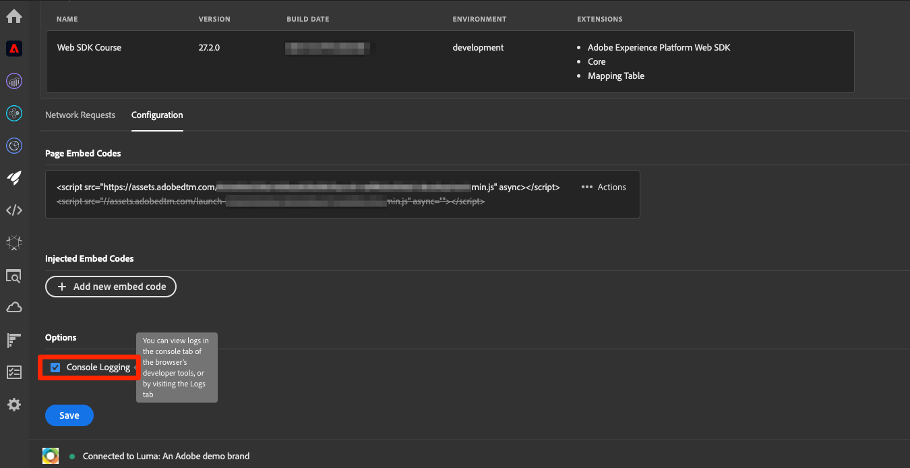
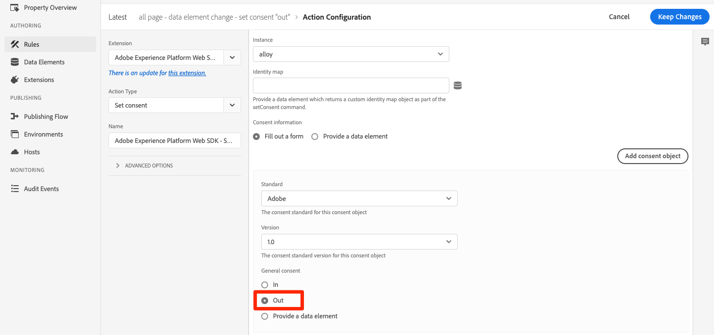
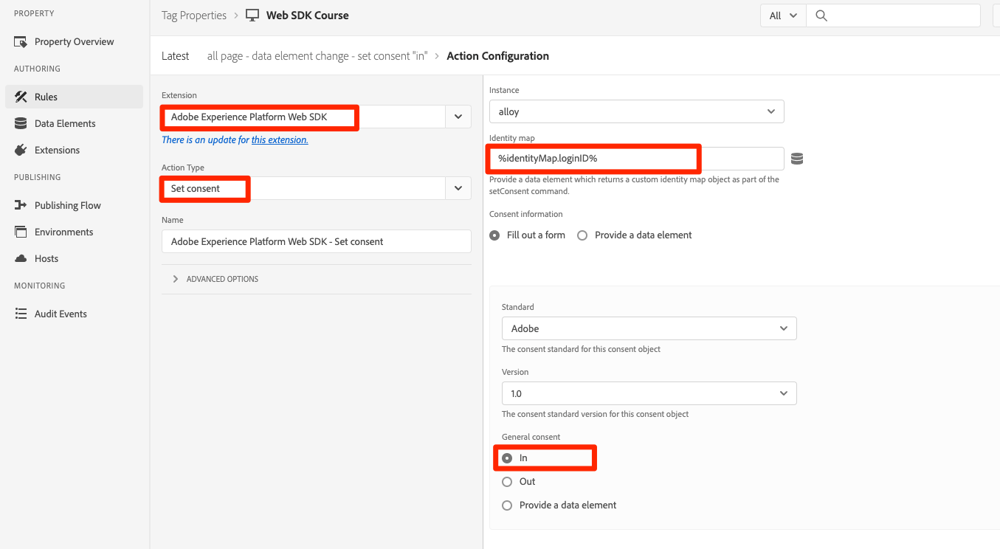

# Konfigurera samtycke med Platform Web SDK

Lär dig konfigurera sekretessinställningarna för taggtillägget Adobe Experience Platform Web SDK. Ange samtycke baserat på besökarens interaktion med en banderoll från en CMP (Consent Management Platform).

>[!NOTE]
> 
>I den här självstudiekursen används [Klaro](https://klaro.org/) som CMP för demonstrationssyften. Du kan följa med i arbetet med Klaro eller den CMP du använder på din webbplats.


## Utbildningsmål

När lektionen är slut kan du:

* Läsa in en CMP med taggar
* Konfigurera sekretessinställningar i taggtillägget Experience Platform Web SDK
* Ange samtycke för Experience Platform Web SDK baserat på besökarens åtgärd

## Förhandskrav

Du bör känna till taggarna och stegen för att skapa regler, dataelement, bygga bibliotek för miljöer och växla taggbibliotek med Experience Platform Debugger.

Innan du börjar konfigurera sekretessinställningarna och skapar regler för samtycke, måste du se till att du har injicerat ditt skript för plattformar för samtyckeshantering på webbplatsen och fungerar som det ska. En CMP kan läsas in direkt i källkoden med hjälp av webbplatsutvecklare eller läsas in med hjälp av själva taggar. Den här lektionen visar det senare tillvägagångssättet.

>[!NOTE]
> 
>1. En plattform för hantering av samtycke (CMP) används av organisationer för att lagligen dokumentera och hantera besökares val av samtycke innan besökarens data samlas in, delas eller säljs från onlinekällor som webbplatser och appar.
>
>2. Det rekommenderade sättet att injicera en CMP är direkt genom källkoden före tagghanteringsskriptet.

### Konfigurera Klaro

Läs mer om den plattform för hantering av samtycke som används i den här självstudiekursen Klaro innan du börjar använda taggkonfigurationer.

1. Besök [Klaro](https://klaro.org/) och konfigurera ett konto.
1. Gå till **Sekretesshanteraren** och skapa en instans enligt instruktionerna.
1. Använd **integreringskoden** för att injicera Klaro i taggegenskapen (instruktionerna finns i nästa övning).
1. Hoppa över avsnittet **Skanning** eftersom den identifierar taggegenskapen som är hårdkodad på Luma-demowebbplatsen och inte den som du har skapat för den här självstudiekursen.
1. Lägg till en tjänst med namnet `aep web sdk` och aktivera **tjänstens standardläge**. När det är aktiverat är standardvärdet för samtycke `true`, annars är det `false`. Den här konfigurationen är användbar när du vill bestämma vilket standardtillstånd (innan besökaren ger sitt samtycke) som ska användas för ditt webbprogram. Exempel:
   * För CCPA är standardmedgivandet vanligtvis inställt på `true`. Du kommer att referera till det här scenariot som **implicit anmälan** i den här självstudien
   * För GDPR är standardmedgivandet vanligtvis inställt på `false`. Du kommer att referera till det här scenariot som **implicit avanmälan** i den här självstudiekursen.

<!--
    This consent value can be verified by returning the JavaScript object ```klaro.getManager().consents``` in the browser's developer console.
-->
    >[!NOTE]
    >
    >Oftast utförs och hanteras de ovanstående stegen av det team eller den person som ansvarar för att hantera CMP, till exempel OneTrust eller TrustArc.

## Mata in en CMP

>[!WARNING]
>
>Det bästa sättet att implementera en plattform för hantering av samtycke är vanligtvis att läsa in CMP _innan_ din tagghanterare har lästs in. För att underlätta den här självstudiekursen läser du in CMP _med_ i tagghanteraren. Den här lektionen visar hur du använder medgivandefunktionerna i Platform Web SDK och ska inte användas som vägledning för att konfigurera Klaro eller någon annan CMP på rätt sätt.


När du är klar med Klaros konfigurationer kan du nu skapa taggregler med följande konfigurationer:

* [!UICONTROL Name]: `all pages - library load - Klaro`
* [!UICONTROL Event]: [!UICONTROL Library Loaded (Page Top)] med [!UICONTROL Advanced Options] > [!UICONTROL Order] inställt på 1
* [!UICONTROL Action]: [!UICONTROL Custom Code], [!UICONTROL Language]: HTML för att läsa in CMP-skriptet.


Det anpassade kodblocket ska se ut ungefär som nedan:


Spara och bygg nu den här regeln i ditt utvecklingsbibliotek, validera att den medgivande banderollen visas genom att växla från Luma-webbplatsen till din egen. En CMP-banderoll ska visas på webbplatsen enligt nedan. Och för att kontrollera den aktuella besökarens samtycke kan du använda följande kodutdrag på webbläsarens konsol.

```javascript
    klaro.getManager().consents 
```


Använd följande kryssruta i Adobe Experience Platform Debugger för att komma till felsökningsläget.



Du kan också behöva rensa dina cookies och lokala lager flera gånger medan du går igenom den här självstudiekursen eftersom besökarens medgivandevärde lagras där. Du kan göra det så här:


## Samtyckesscenarier

Integritetsåtgärder som GDPR, CCPA och andra spelar en viktig roll när det gäller att utforma genomförandet av samtycke. I den här lektionen får du utforska hur en besökare kan interagera med medgivandebanderollen under två mest framträdande sekretessåtgärder.


### Scenario 1: Implicit deltagande

Underförstådd anmälan innebär att företaget inte behöver få besökarens samtycke (eller&quot;anmälan&quot;) innan de samlar in sina data, och därmed behandlas alla besökare på webbplatsen som insticksprogram som standard. Men besökaren kan avanmäla sig genom att avvisa cookies via medgivandebanderollen. Det här användningsfallet liknar CCPA.

Nu ska du konfigurera och implementera samtycke för det här scenariot:

1. Kontrollera att **[!UICONTROL Privacy]** är inställt på **[!UICONTROL Default consent]** i avsnittet **[!UICONTROL In]** i taggtillägget Experience Platform Web SDK:


   

   >[!NOTE]
   > 
   >För en dynamisk lösning väljer du alternativet Ange ett dataelement och skickar ett dataelement som returnerar värdet ```klaro.getManager().consents```
   >
   >Det här alternativet används om CMP matas in i källkoden *före* taggens inbäddningskod så att standardmedgivandet är tillgängligt innan Experience Platform Web SDK-tillägget börjar läsas in. I vårt exempel kan vi inte använda det här alternativet eftersom CMP har lästs in med taggar och inte före taggar.


2. Spara och skapa den här ändringen i ditt taggbibliotek
3. Läs in ditt taggbibliotek på webbplatsen Luma Demo
4. Aktivera taggfelsökning på Luma-webbplatsen och läs in sidan igen. I webbläsarens utvecklarkonsol ser du att defaultConsent är lika med **[!UICONTROL In]**
5. Med den här konfigurationen fortsätter tillägget Experience Platform Web SDK att göra nätverksbegäranden, såvida inte en besökare bestämmer sig för att avvisa cookies och avanmäla sig:

   


Om en besökare bestämmer sig för att avanmäla sig (avvisa spårningscookies) måste du ändra medgivandet till **[!UICONTROL Out]**. Ändra inställningen för samtycke genom att följa dessa steg:

<!--
1. Create a data element to store the consent value of the visitor. Let's call it `klaro consent value`. Use the code snippet to create a custom code type data element:
    
    ```javascript
    return klaro.getManager().consents["aep web sdk"]
    ```

    


1. Create another custom code data element, `consent confirmed`, with the following snippet which returns ```true``` only after a visitor confirms consent:

    
    ```javascript
    return klaro.getManager().confirmed
    ```

    
-->

1. Skapa en regel som utlöses när besökaren klickar på **Jag avböjer**.  Ge den här regeln namnet: `all pages - click consent banner - set consent "out"`

1. Använd **[!UICONTROL Event]** **[!UICONTROL Click]** **[!UICONTROL Elements matching the CSS selector]** som `#klaro .cn-decline`

   

1. Använd nu Experience Platform Web SDK, [!UICONTROL Set consent] [!UICONTROL action type] för att ange medgivandet som out:

   

1. Välj **[!UICONTROL Save to Library and Build]**:

   

När en besökare avanmäler sig utlöses regeln som konfigurerats på ovanstående sätt och webb-SDK-medgivandet anges som **[!UICONTROL Out]**.

Validera genom att gå till webbplatsen Luma Demo, avvisa cookies och bekräfta att ingen Web SDK-begäran aktiveras efter att du avanmält dig.

### Scenario 2: Underförstådd avanmälan


Underförstådd avanmälan innebär att besökarna ska behandlas som avanmäld som standard och cookies bör inte anges. Begäranden från SDK på webben får inte utlösas om inte besökarna bestämmer sig för att manuellt gå med på att acceptera cookies via medgivandebanderollen. Ni kanske måste hantera ett sådant användningsfall i den EU-region där GDPR gäller.

Så här kan du konfigurera konfigurationen för ett implicit avanmälningsscenario:

1. I Klaro stänger du av **tjänstens standardläge** i `aep web sdk`-tjänsten och sparar den uppdaterade konfigurationen.

1. I **[!UICONTROL Privacy]**-delen av Experience Platform Web SDK-tillägget anger du **[!UICONTROL Out]** eller **[!UICONTROL Pending]** som standardsamtycke.

   

1. **Spara** den uppdaterade konfigurationen i ditt taggbibliotek och återskapa den.

   Med den här konfigurationen ser Experience Platform Web SDK till att ingen begäran aktiveras om inte medgivandebehörigheten ändras till **[!UICONTROL In]**. Det kan inträffa om en besökare manuellt accepterar cookies genom att anmäla sig.

1. I Felsökning kontrollerar du att Luma-webbplatsen är kopplad till din taggegenskap och att taggkonsolloggningen är aktiverad.
1. Använd webbläsarens utvecklarkonsol för att **rensa webbplatsdata** i **Program** > **Lagring**

1. Läs in Luma-webbplatsen igen och du bör se att `defaultConsent` är inställt på **[!UICONTROL Out]** och att inga Web SDK-begäranden har gjorts

   

Om en besökare bestämmer sig för att anmäla sig (acceptera spårningscookies) måste du ändra medgivandet och ange det till **[!UICONTROL In]**. Så här kan du göra med en regel:

1. Skapa en regel som utlöses när besökaren klickar på **Det är OK**.  Ge den här regeln namnet: `all pages - click consent banner - set consent "in"`

1. Använd **[!UICONTROL Event]** **[!UICONTROL Click]** **[!UICONTROL Elements matching the CSS selector]** som `#klaro .cm-btn-success`

   

1. Lägg till en åtgärd med Experience Platform Web SDK [!UICONTROL Extension], **[!UICONTROL Action Type]** av **[!UICONTROL Set consent]**, **[!UICONTROL General consent]** som **[!UICONTROL In]**.

   

   En sak att notera här är att den här [!UICONTROL Set consent]-åtgärden kommer att vara den första begäran som går ut och upprättar identitet. Därför kan det vara viktigt att synkronisera identiteter på själva den första begäran. Identitetsmappningen kan läggas till i åtgärden [!UICONTROL Set consent] genom att skicka ett datatypselement.

1. Välj **[!UICONTROL Save to Library and Build]**:

   

1. **[!UICONTROL Save]** regeln till ditt bibliotek och återskapa den.

När du har den här regeln på plats, bör händelsesamlingen börja när en besökare väljer att delta.


Mer information om samtycke i Web SDK finns i [Supporting customer medgivande preferences](https://experienceleague.adobe.com/sv/docs/experience-platform/edge/consent/supporting-consent).


Mer information om åtgärden [!UICONTROL Set consent] finns i [Ange medgivande](https://experienceleague.adobe.com/sv/docs/experience-platform/tags/extensions/client/web-sdk/action-types#set-consent).

>[!NOTE]
>
>Tack för att du har lagt ned din tid på att lära dig om Adobe Experience Platform Web SDK. Om du har frågor, vill dela allmän feedback eller har förslag på framtida innehåll kan du dela dem i det här [Experience League diskussionsgruppsinlägget](https://experienceleaguecommunities.adobe.com/t5/adobe-experience-platform-data/tutorial-discussion-implement-adobe-experience-cloud-with-web/td-p/444996?profile.language=sv)
