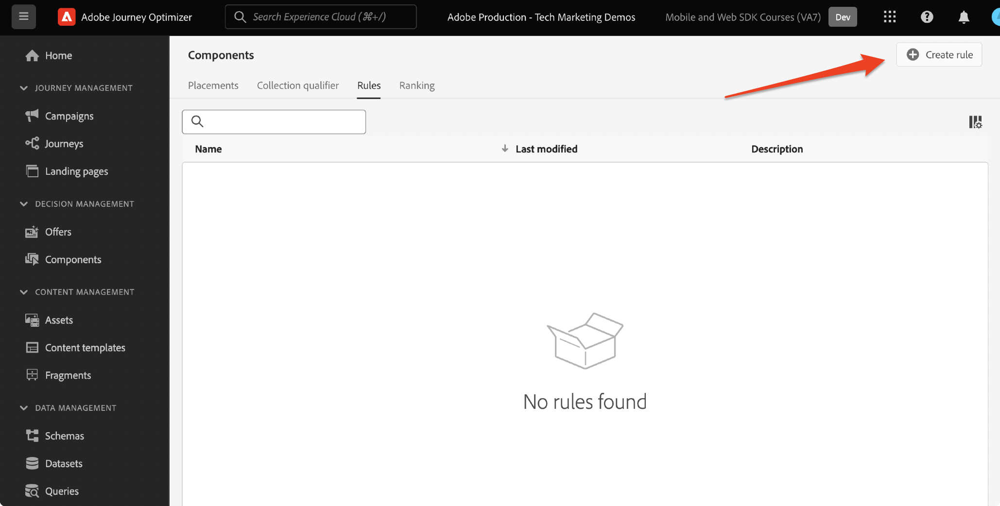

# Konfigurera beslutshantering med Platform Web SDK

Lär dig implementera beslutshantering med hjälp av Platform Web SDK. Den här guiden innehåller grundläggande krav för beslutshantering, detaljerade konfigurationssteg och en djupdykning i ett användningsexempel som fokuserar på lojalitetsstatus.

Genom att följa den här självstudiekursen kan Journey Optimizer-användare effektivt tillämpa offera decisioningar, vilket förbättrar personaliseringen och relevansen i deras kundinteraktioner.


## Utbildningsmål

När lektionen är slut kan du:

* Ta en titt på de centrala begreppen för beslutshantering inom Adobe Journey Optimizer och dess integrering med Adobe Experience Platform Web SDK.

* Lär dig steg för steg hur du konfigurerar Web SDK för Offer decisioning och säkerställer smidig integrering med Journey Optimizer.

* Utforska ett detaljerat användningsexempel som fokuserar på lojalitetserbjudanden och få insikter i hur ni effektivt kan skapa och hantera erbjudanden, beslut och placeringar.

* Förstå viktiga termer och deras konsekvenser inom ramen för beslutsfattandet.

* Förstå betydelsen av beslutsregler, kravspecifikationer och reserverbjudanden när det gäller att leverera rätt erbjudande till rätt användare.

* Ta till vara avancerade ämnen som simuleringar och anpassad datainsamling för event, så att ni kan testa, validera och förbättra era mekanismer för leverans av erbjudanden.

## Förutsättningar

För att slutföra lektionerna i det här avsnittet måste du först:

* Se till att din organisation har tillgång till Adobe Journey Optimizer Ultimate (Journey Optimizer och Offer decisioning) eller Adobe Experience Platform och Offera decisioningens programtjänsttillägg.

* Slutför alla lektioner för den inledande konfigurationen av Platform Web SDK.

* Aktivera din organisation för Edge Decisioning.

* Lär dig hur du konfigurerar en placering och instansierar placerings- och aktivitets-ID:n i din beslutsomfångs-JSON.

## Begränsningar

Observera följande begränsning:

* Händelsebaserade erbjudanden stöds för närvarande inte i Adobe Journey Optimizer. Om du skapar en beslutsregel baserat på en händelse kan du inte tillämpa den i ett erbjudande.

## Bevilja åtkomst till beslutsledning

Om du vill ge åtkomst till funktionen Beslutshantering måste du skapa en **Produktprofil** och tilldela användarna motsvarande behörigheter. [Läs mer om hur du hanterar Journey Optimizer-användare och behörigheter i det här avsnittet](https://experienceleague.adobe.com/docs/journey-optimizer/using/access-control/privacy/high-low-permissions.html?lang=en#decisions-permissions).

## Konfigurera datastream

Offera decisioningen måste vara aktiverad i **datastream** konfiguration innan någon beslutshanteringsaktivitet kan levereras av Platform Web SDK.

Så här konfigurerar du Offer decisioning i datastream:

1. Gå till [Datainsamling](https://experience.adobe.com/#/data-collection) gränssnitt.

1. Välj **Datastreams**.

1. Markera tidigare skapade Luma Web SDK-dataström.

   

1. Välj **Redigera** inom **Adobe Experience Platform Service**.

   

1. Kontrollera **Offer decisioning** box.

   

1. Välj **Spara**.

Detta säkerställer att inkommande händelser för Journey Optimizer hanteras korrekt av **Adobe Experience Platform Edge**.

## Konfigurera SDK för beslutshantering

Beslutshantering kräver ytterligare SDK-steg beroende på vilken implementeringstyp du har för Web SDK. Det finns två tillgängliga alternativ för att konfigurera SDK för beslutshantering.

* fristående SDK-installation
   1. Konfigurera `sendEvent` åtgärd med `decisionScopes`.

      ```javascript
      alloy("sendEvent", {
         ...
         "decisionScopes": [
            "[DECISION SCOPE 1]",
            "[DECISION SCOPE 2]"
         ]
      })
      ```

* Installation av SDK-taggar
   1. Gå till gränssnittet Datainsamling.

   1. Välj **Taggar**.

      

   1. Välj **Taggegenskap**.

   1. Skapa **Regler**.
      * Lägg till en SDK för webben **Åtgärden Skicka händelse** och lägga till relevanta `decisionScopes` till åtgärdens konfiguration.

   1. Skapa och publicera **Bibliotek** som innehåller alla relevanta **Regler**, **Dataelement** och **Tillägg** du har konfigurerat.

## Terminologi

För det första bör du förstå den terminologi som används i gränssnittet för beslutshantering.

* **Takning**: En begränsning som bestämmer hur ofta ett erbjudande visas. Två typer:
   * Total Caps: Maximalt antal gånger ett erbjudande kan visas för alla målgrupper.
   * Profilbegränsning: Ett erbjudande kan visas för en viss användare.
* **Samlingar**: Delmängder av erbjudanden grupperade efter specifika villkor som angetts av en marknadsförare, till exempel, erbjudandekategori.
* **Beslut**: Logik som bestämmer valet av erbjudande.
* **Beslutsregel**: Begränsningar för erbjudanden för att ta reda på om en användare är berättigad.
* **Berättigat erbjudande**: Ett erbjudande som matchar de förinställda begränsningarna och kan visas för en användare.
* **Beslutshantering**: Systemet för att skapa och distribuera personaliserade erbjudanden med hjälp av logiska funktioner och beslutsregler.
* **Reserverbjudanden**: Det standarderbjudande som visas när en användare inte är berättigad till erbjudanden i en samling.
* **Erbjudande**: Ett marknadsföringsmeddelande med potentiella regler för behörighet som avgör vilka som tittar.
* **Erbjudandebibliotek**: En central databas som hanterar erbjudanden, beslut och tillhörande regler.
* **Personaliserade erbjudanden**: Anpassade marknadsföringsmeddelanden som är skräddarsydda baserat på behörighetskrav.
* **Placeringar**: Den inställning eller det scenario där ett erbjudande visas för en användare.
* **Prioritet**: Rankningsmått för erbjudanden med olika begränsningar som berättigande och begränsning.
* **Representationer**: Kanalspecifik information, till exempel plats eller språk, som guidar visningen av ett erbjudande.

## Use Case Overview - Loyalty Rewards

I den här lektionen implementerar du ett exempel på Loyalty Rewards-användning för att förstå hur beslut hanteras med Web SDK.

Med detta exempel får ni en bättre förståelse för hur Journey Optimizer kan hjälpa er att leverera det bästa erbjudandet till era kunder genom att utnyttja det centraliserade erbjudandebiblioteket och beslutsmotorn för erbjudandet.

>[!NOTE]
>
> Eftersom den här självstudiekursen riktar sig till implementerare är det värt att notera att den här lektionen handlar om omfattande gränssnittsarbete i Journey Optimizer. Sådana gränssnittsuppgifter hanteras vanligtvis av marknadsförare, men det kan vara bra för implementerare att få insikt i processen, även om de inte i längden ansvarar för att skapa en beslutshanteringskampanj.

## Komponenter

Innan du börjar skapa erbjudandena måste du definiera flera nödvändiga komponenter.

### Skapa en placering för lojalitetserbjudanden

**Placeringar** är behållare som används för att visa upp erbjudandena. I det här exemplet skapar du en placering högst upp på Luma-webbplatsen.

Listan över placeringar finns i **Komponenter** -menyn. Det finns filter som hjälper dig att hämta placeringar utifrån en viss kanal eller ett visst innehåll.


Så här skapar du placeringen:

1. Klicka **Skapa placering**.

   

1. Definiera placeringens egenskaper:
   * **Namn**: Placeringens namn. Låt oss kalla exempelplaceringen *&#39;Homepage Banner&#39;*.
   * **Kanaltyp**: Den kanal som placeringen används för. Låt oss använda *&#39;Webb&#39;* eftersom erbjudandena visas på Lumas webbplats.
   * **Innehållstyp**: Den typ av innehåll som placeringen kan visa: Text, HTML, Bildlänk eller JSON. Du kan använda *HTML* för erbjudandet.
   * **Beskrivning**: En beskrivning av placeringen (valfritt).

   

1. Klicka **Spara**.
1. När placeringen har skapats visas den i placeringslistan.
1. Markera raden som innehåller din nya placering och notera placerings-ID, eftersom detta kan behövas för konfigurationen inom ditt beslutsomfång.

   

### Beslutsregler för lojalitetsstatus

**Beslutsregler** ange villkoren för hur anbuden presenteras. I det här exemplet skapar du beslutsregler för olika erbjudanden beroende på en användares lojalitetsstatus.

Listan över beslutsregler finns i **Komponenter** -menyn.

Så här skapar du beslutsregler:

1. Navigera till **Regler** och klicka på **Skapa regel**.

   

1. Vi namnger den första regeln *Gold - regel för lojalitetsstatus*&#39;. Du kan använda XDM-fält för att definiera regeln. Adobe Experience Platform **Segment Builder** är ett intuitivt gränssnitt som du kan använda för att skapa regelvillkoren.

   

1. Klicka **Spara** för att bekräfta regelvillkoret.
1. Det nyligen sparade &#39;*Gold - regel för lojalitetsstatus* visas i **Regellista**. Markera den för att visa dess egenskaper.

   

1. Skapa nu de återstående villkoren för förmånserbjudanderegeln för användningsfallet.


### Samlingskvalificerare

**Samlingskvalificerare** låter dig enkelt ordna och söka efter erbjudanden i erbjudandebiblioteket. I det här exemplet lägger du till samlingskvalificerare i Loyalty Rewards-erbjudandena för att förbättra organisationen för erbjudandet.

Listan över samlingskvalificerare finns i **Komponenter** -menyn.

Så här skapar du en kvalificerare för Loyalty Rewards-samlingen:

1. Navigera till **Samlingskvalificerare** och klicka på **Skapa samlingskvalificerare**.

   

1. Vi namnger mängdkvalificeraren &#39;*Lojalitetsbelöningar*&#39;

   

1. Den nya samlingskvalificeraren ska nu visas i **Samlingskvalificerare** tab

## Erbjudanden

Nu är det dags att skapa Loyalty Rewards-erbjudandena.

Listan över erbjudanden finns på **Erbjudanden** -menyn.


### Skapa erbjudanden för olika lojalitetsnivåer

Börja med att skapa personaliserade erbjudanden för de olika lojalitetsnivåerna i Luma.

Skapa den första **erbjudande** gör du så här:

1. Klicka **Skapa erbjudande** väljer **Personligt erbjudande**.

1. Låt oss namnge det första erbjudandet *Luma Loyalty Tier - Gold*&#39;. Du måste ange ett start-/slutdatum och en sluttid för erbjudandet. Du bör även associera **samlingskvalificerare** &#39;*Lojalitetsbelöningar* till erbjudandet, så att ni bättre kan ordna i **Erbjudandebibliotek**. Efteråt klickar du på **Nästa**.

   

1. Nu måste du lägga till **representationer** för att definiera var erbjudandet ska visas. Låt oss välja **webbkanal**. Vi väljer också&#x200B;*Banderoll för hemsida*&#39; **placering** du redan har konfigurerat. Den markerade **placering** är av HTML-typ, så du kan lägga till HTML, JSON eller TEXT direkt i redigeraren för att skapa erbjudandet med **Egen** alternativknapp.

   

1. Redigera erbjudandeinnehållet direkt med **Uttrycksredigeraren**. Kom ihåg att du kan lägga till HTML, JSON eller TEXT i den här placeringen. Se till att du väljer rätt **läge** längst ned i redigeraren, beroende på innehållstypen. Du kan också träffas **validera** för att säkerställa att inga fel uppstår.

   

1. Du kan också använda uttrycksredigeraren för att hämta attribut som lagras i Adobe Experience Platform. Låt oss lägga till en profils förnamn i erbjudandeinnehållet för att göra det mer personligt för lojalitetsmedlemmarna på 1:1-nivå.

   

1. Lägg till begränsningar om du bara vill visa erbjudandet för profiler som är kvalificerade för *Gold - regel för lojalitetsstatus*&#39;.

   

1. När du är klar med granskningen av erbjudandet klickar du **Slutför**. Välj **Spara och godkänn**.

Skapa nu resten av erbjudandena för de olika Luma Loyalty-nivåerna

### Reserverbjudanden

Du vill fortfarande erbjuda besökare som inte är Luma Loyalty till Lumas webbplats ett erbjudande. Om du vill göra det kan du konfigurera en **grunderbjudande** för kampanjen.

Så här skapar du ett reserverbjudande:

1. Klicka **Skapa erbjudande** väljer **Reserverbjudande**.
   <!--
      
   -->
1. Låt oss namnge reserverbjudandet *Lojalitet utanför Luma*&#39;. Du kan även associera tidigare skapade **samlingskvalificerare**, &#39;*Lojalitetsbelöningar* till reserverbjudandet för enkel organisation av erbjudanden.
   <!--
      
   -->
1. Lägg till innehåll för reserverbjudandet i **Uttrycksredigeraren**. Kom ihåg att du kan lägga till HTML, JSON eller TEXT i den här placeringen. Se till att du väljer rätt **läge** längst ned i redigeraren, beroende på innehållstypen. Du kan också träffas **validera** för att säkerställa att inga fel uppstår.
   <!--
      
   -->
1. Om allt är korrekt konfigurerat trycker du på **Slutför** och sedan **Spara och godkänn**.
<!--
   
-->

## Beslut

**Beslut** är behållare för erbjudanden som väljer det bästa erbjudandet som finns tillgängligt för en kund, beroende på målet.

Listan över beslut finns i **Beslut** -fliken i **Erbjudanden** -menyn.
<!--
   
-->

### Skapa ett beslut för lojalitetserbjudanden

Låt oss ta ett beslut om Luma Loyalty Rewards-fallet.

Så här skapar du ett beslut:

1. Klicka **Skapa beslut**.
   <!--
      
   -->
1. Låt oss ringa beslutet, &#39;*Lojalitetserbjudanden för december*&#39;. Erbjudandena gäller i en månad, så vi ska specificera det här.
   <!--
      
   -->
1. Nu måste du definiera **beslutsomfattningar**. Välj först en placering. Du kan använda den tidigare skapade &#39;*Banderoll för hemsida*&#39;.
   <!--
      
   -->
1. Nästa steg du måste lägga till **utvärderingskriterier** för beslutets omfattning. Klicka **Lägg till** och välj den tidigare skapade *Lojalitetsbelöningar*&#39; **samling** som innehåller alla lojalitetserbjudanden att tänka på.
   <!--
      
   -->
1. Inom *Lojalitetsbelöningar*&#39; samling, du kan använda fältet för behörighet för att begränsa leveransen av erbjudandet till en delmängd av Luma-besökare. I det här fallet vill du dock att alla besökare ska få ett av erbjudandena. Kom ihåg att du konfigurerade en **grunderbjudande** för alla icke-lojalitetsbesökare. Ställ in behörigheten till Ingen.
   <!--
      
   -->
1. Du kan även använda **rangordningsmetod** för att välja det bästa erbjudandet för varje Luma-besökare, om flera erbjudanden är berättigade till kombinationen av användare/placering. I det här fallet kan du använda **Prioritet** som använder de värden som definieras i erbjudandena för att ge det bästa erbjudandet.
   <!--
      
   -->
1. Lägg till **grunderbjudande** på beslutet. Påminnelse om att reserverbjudandet är standarderbjudandet som visas för Luma-besökare om de inte faller inom någon av Lumas lojalitetsmålgrupper. Välj &#39;*Lojalitet utanför Luma*&#39; i listan över tillgängliga reserverbjudanden för &#39;*Banderoll för hemsida* placeringen.
   <!--
      
   -->
1. Innan vi aktiverar beslutet ska vi granska beslutsomfånget, reserverbjudandet, förhandsgranska tillgängliga erbjudanden och uppskatta de kvalificerade profilerna. När allt ser bra ut kan du klicka **Slutför** och **Spara och aktivera**.
<!--
   
-->

## Simuleringar

Som en god praxis bör ni validera Luma Loyalty-beslutslogiken för att säkerställa att rätt erbjudanden levereras till rätt lojalitetsmålgrupper. Du kan göra detta med **testprofiler**. Det är också en bra idé att testa ändringar av erbjudanden via testprofiler innan nya erbjudandeversioner skickas till produktionen.

Välj **Simuleringar** -fliken från **Erbjudanden** -menyn.

### Testa lojalitetserbjudanden

1. Välj en testprofil som ska användas för simuleringen. Klicka **Hantera profil**. [Följ den här guiden för att skapa eller ange en ny testprofil för erbjudandetestning](https://experienceleague.adobe.com/docs/journeys/using/building-journeys/about-journey-building/creating-test-profiles.html?lang=en#create-test-profiles-csv).
   <!--
      
   -->
1. Lägg till en eller flera testprofiler i simuleringen och spara urvalet. För falltestning bör du se till att du har testprofiler konfigurerade för varje målgrupp som belönas med Luma-lojalitet.
   <!--
      
   -->
1. Välj det beslutsområde som ska testas. Välj **Lägg till beslutsomfattning**.
   <!--
      
   -->
1. Markera den tidigare skapade &#39;*Banderoll för hemsida* placeringen.
   <!--
      
   -->
1. De tillgängliga besluten visas, välj den tidigare skapade *Lojalitetserbjudanden för december*&#39; och klicka **Lägg till**.
   <!--
      
   -->
1. När du har valt en testprofil klickar du **Visa resultat**. Det bästa tillgängliga erbjudandet visas för den valda testprofilen för *Lojalitetserbjudanden för december* beslut.
   <!--
      
   -->
1. Välj en annan testprofil och klicka på **Visa resultat**. Helst ska du se ett annat simulerat erbjudande, som motsvarar testprofilens lojalitetsnivå.

## Beslutsstyrningsvalidering med Adobe Experience Platform Debugger

The **Adobe Experience Platform Debugger** för både Chrome och Firefox analyserar dina webbsidor för att identifiera problem med implementeringen av Adobe Experience Cloud lösningar.

Du kan använda felsökaren på Luma-webbplatsen för att validera beslutslogiken i produktionen. Det här är en bra rutin när Loyalty Rewards-användningsexemplet är öppet och körs för att säkerställa att allt är korrekt konfigurerat.

[Lär dig hur du konfigurerar felsökaren i webbläsaren med hjälp av guiden här](https://experienceleague.adobe.com/docs/platform-learn/data-collection/debugger/overview.html?lang=en).

Så här börjar du valideringen med felsökaren:

1. Navigera till Lumas webbsida med erbjudandeplaceringen.
   <!--
      
   -->
1. Öppna **Adobe Experience Platform debugger**.
   <!--
      
   -->
1. Navigera till **Sammanfattning**. Verifiera att **Dataström-ID** matchar **datastream** in **Adobe datainsamling** som du har aktiverat Offer decisioning för.
   <!--
      
   -->
1. Under **Lösningar** navigera till **Experience Platform Web SDK**.
   <!--
      
   -->
1. I **Konfiguration** flik, växla på **Aktivera felsökning**. Detta aktiverar loggning för sessionen i en **Adobe Experience Platform Assurance** session.
   <!--
      
   -->
1. Du kan sedan logga in på webbplatsen med olika Luma-förmånskonton och använda felsökaren för att validera förfrågningar som skickas till **Adobe Experience Platform Edge-nätverk**. Alla dessa förfrågningar ska registreras i **Säkerhet** för loggspårning.
<!--
   
-->

[Nästa: ](setup-consent.md)

>[!NOTE]
>
>Tack för att du lade ned din tid på att lära dig om Adobe Experience Platform Web SDK. Om du har frågor, vill dela allmän feedback eller har förslag på framtida innehåll kan du dela med dig av dem om detta [Experience League diskussionsinlägg](https://experienceleaguecommunities.adobe.com/t5/adobe-experience-platform-launch/tutorial-discussion-implement-adobe-experience-cloud-with-web/td-p/444996)
