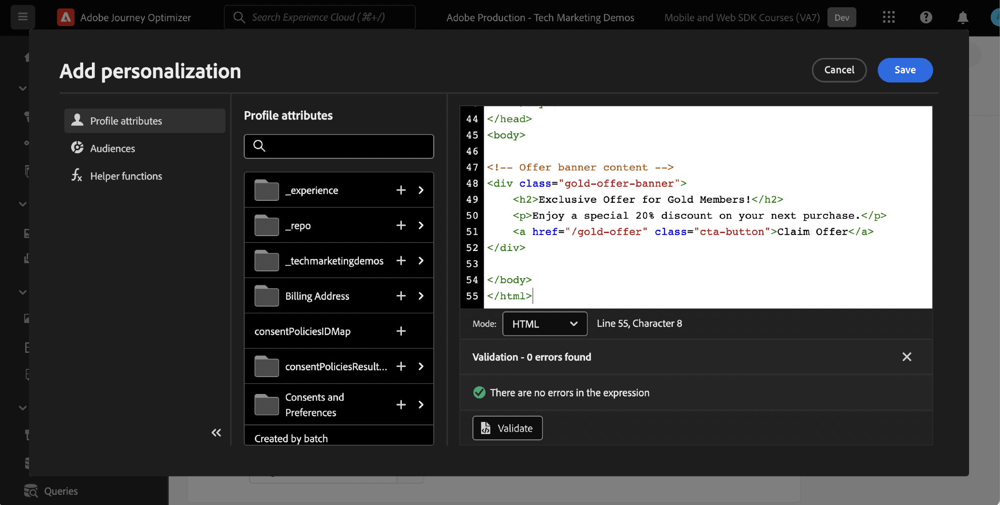

# Konfigurera beslutshantering med Platform Web SDK

Lär dig hur du implementerar Adobe Journey Optimizer beslutsstyrningsfunktion med Platform Web SDK. Den här guiden innehåller grundläggande krav för beslutshantering, detaljerade konfigurationssteg och en djupdykning i ett användningsexempel som fokuserar på lojalitetsstatus.

Genom att följa den här självstudiekursen är Journey Optimizer-användare utrustade att använda funktioner för beslutshantering, vilket förbättrar personaliseringen och relevansen av deras kundinteraktioner.


## Utbildningsmål

När lektionen är slut kan du:

* Ta en titt på de centrala begreppen för beslutshantering inom Adobe Journey Optimizer och dess integrering med Adobe Experience Platform Web SDK.

* Lär dig steg för steg hur du konfigurerar Web SDK för Offer decisioning och säkerställer smidig integrering med Journey Optimizer.

* Utforska ett detaljerat användningsexempel som fokuserar på lojalitetserbjudanden och få insikter i hur ni effektivt kan skapa och hantera erbjudanden, beslut och placeringar.

* Förstå viktiga termer och deras konsekvenser inom ramen för beslutsfattandet.

* Förstå betydelsen av beslutsregler, kravspecifikationer och reserverbjudanden när det gäller att leverera rätt erbjudande till rätt användare.

* Ta till vara avancerade ämnen som simuleringar och anpassad datainsamling för event, så att ni kan testa, validera och förbättra era mekanismer för leverans av erbjudanden.

## Förhandskrav

För att slutföra lektionerna i det här avsnittet måste du först:

* Se till att din organisation har tillgång till Adobe Journey Optimizer Ultimate (Journey Optimizer och Offer decisioning) eller Adobe Experience Platform och Offer decisioning-tillägget.

* Slutför alla lektioner för den inledande konfigurationen av Platform Web SDK.

* Aktivera er organisation för Edge-beslut.

* Lär dig hur du konfigurerar en placering och instansierar placerings- och aktivitets-ID:n i din beslutsomfångs-JSON.

## Begränsningar

Händelsebaserade erbjudanden stöds för närvarande inte i Adobe Journey Optimizer. Om du skapar en beslutsregel baserat på en händelse kan du inte tillämpa den i ett erbjudande.

## Bevilja åtkomst till beslutsledning

Om du vill ge åtkomst till beslutshanteringsfunktionen måste du skapa en **produktprofil** och tilldela användarna motsvarande behörigheter. [Läs mer om hur du hanterar Journey Optimizer-användare och behörigheter i det här avsnittet](https://experienceleague.adobe.com/en/docs/journey-optimizer/using/access-control/privacy/high-low-permissions#decisions-permissions).

## Konfigurera datastream

Offera decisioningen måste aktiveras i **datastream**-konfigurationen innan någon beslutshanteringsaktivitet kan levereras av Platform Web SDK.

Så här konfigurerar du Offer decisioning i datastream:

1. Gå till gränssnittet [Datainsamling](https://experience.adobe.com/#/data-collection).

1. Välj **Datastreams** i den vänstra navigeringen.

1. Markera tidigare skapade Luma Web SDK-dataström.

   

1. Välj **Redigera** i **Adobe Experience Platform-tjänsten**.

   

1. Markera rutan **Offer decisioning**.

   

1. Välj **Spara**.

Detta garanterar att inkommande händelser för Journey Optimizer hanteras korrekt av **Adobe Experience Platform Edge**.

## Konfigurera SDK för beslutshantering

Beslutshantering kräver ytterligare SDK-steg beroende på vilken implementeringstyp du har för Web SDK. Det finns två tillgängliga alternativ för att konfigurera SDK för beslutshantering.

* fristående SDK-installation
   1. Konfigurera åtgärden `sendEvent` med din `decisionScopes`.

      ```javascript
      alloy("sendEvent", {
         ...
         "decisionScopes": [
            "[DECISION SCOPE 1]",
            "[DECISION SCOPE 2]"
         ]
      })
      ```

* Installation av SDK-taggar
   1. Gå till gränssnittet Datainsamling.

   1. Välj **Taggar** i den vänstra navigeringen.

      

   1. Markera **taggegenskapen**.

   1. Skapa dina **regler**.
      * Lägg till en Platform Web SDK **Skicka händelse** och lägg till relevant `decisionScopes` i åtgärdens konfiguration.

   1. Skapa och publicera ett **bibliotek** som innehåller alla relevanta **regler**, **dataelement** och **tillägg** som du har konfigurerat.

## Terminologi

För det första bör du förstå den terminologi som används i gränssnittet för beslutshantering.

* **Begränsning**: En begränsning som bestämmer hur ofta ett erbjudande visas. Två typer:
   * Total Caps: Maximalt antal gånger ett erbjudande kan visas för alla målgrupper.
   * Profilbegränsning: Ett erbjudande kan visas för en viss användare.
* **Samlingar**: Delmängder av erbjudanden grupperade efter specifika villkor som angetts av en marknadsförare, till exempel en erbjudandekategori.
* **Beslut**: En logik som bestämmer valet av erbjudande.
* **Beslutsregel**: Begränsningar för erbjudanden för att ta reda på om en användare är berättigad.
* **Berättigat erbjudande**: Ett erbjudande som matchar de förinställda begränsningarna och kan visas för en användare.
* **Beslutshantering**: Systemet för att skapa och distribuera personaliserade erbjudanden med hjälp av affärslogik och beslutsregler.
* **Reserverbjudanden**: Standarderbjudandet som visas när en användare inte är berättigad till erbjudanden i en samling.
* **Erbjudande**: Ett marknadsföringsmeddelande med potentiella berättiganderegler som avgör vilka som tittar.
* **Erbjudandebibliotek**: En central databas som hanterar erbjudanden, beslut och associerade regler.
* **Personaliserade erbjudanden**: Anpassade marknadsföringsmeddelanden som är anpassade efter behörighetskraven.
* **Placeringar**: Inställningen eller scenariot där ett erbjudande visas för en användare.
* **Prioritet**: Rankningsmått för erbjudanden som överväger olika begränsningar som berättigande och begränsning.
* **Representationer**: Kanalspecifik information, till exempel plats eller språk, som guidar visningen av ett erbjudande.

## Use Case Overview - Loyalty Rewards

I den här lektionen implementerar du ett exempel på Loyalty Rewards-användning för att förstå hur beslut hanteras med Web SDK.

Med detta exempel får ni en bättre förståelse för hur Journey Optimizer kan hjälpa er att leverera det bästa erbjudandet till era kunder genom att utnyttja det centraliserade erbjudandebiblioteket och beslutsmotorn.

>[!NOTE]
>
> Eftersom den här självstudiekursen riktar sig till implementerare är det värt att notera att den här lektionen handlar om omfattande gränssnittsarbete i Journey Optimizer. Sådana gränssnittsuppgifter hanteras vanligtvis av marknadsförare, men det kan vara bra för implementerare att få insikt i processen, även om de inte i längden ansvarar för att skapa en beslutshanteringskampanj.

## Komponenter

Innan du börjar skapa erbjudandena måste du definiera flera nödvändiga komponenter.

### Skapa en placering för lojalitetserbjudanden

**Placeringar** är behållare som används för att visa erbjudandena. I det här exemplet skapar du en placering högst upp på Luma-webbplatsen.

Listan med placeringar finns på menyn **Komponenter**. Det finns filter som hjälper dig att hämta placeringar utifrån en viss kanal eller ett visst innehåll.


Så här skapar du placeringen:

1. Klicka på **Skapa placering**.

   

1. Definiera placeringens egenskaper:
   * **Namn**: Placeringens namn. Vi kallar exempelplaceringen *&#39;Homepage Banner&#39;*.
   * **Kanaltyp**: Kanalen som placeringen används för. Låt oss använda *&#39;Webben&#39;*&#39; eftersom erbjudandena visas på Luma-webbplatsen.
   * **Innehållstyp**: Den typ av innehåll som placeringen kan visa: Text, HTML, Bildlänk eller JSON. Du kan använda *&#39;HTML&#39;* för erbjudandet.
   * **Beskrivning**: En beskrivning av placeringen (valfritt).

   

1. Klicka på **Spara**.
1. När placeringen har skapats visas den i placeringslistan.
1. Markera raden som innehåller din nya placering och notera placerings-ID, eftersom detta kan behövas för konfigurationen inom ditt beslutsomfång.

   

### Beslutsregler för lojalitetsstatus

**Beslutsregler** anger villkoren för hur erbjudandena presenteras. I det här exemplet skapar du beslutsregler för olika erbjudanden beroende på en användares lojalitetsstatus.

Listan med beslutsregler finns på menyn **Komponenter** .

Så här skapar du beslutsregler:

1. Navigera till fliken **Regler** och klicka på **Skapa regel**.

   

1. Vi namnger den första regeln *Gold Loyalty Status Rule*. Du kan använda XDM-fält för att definiera regeln. Adobe Experience Platform **Segment Builder** är ett intuitivt gränssnitt som du kan använda för att skapa regelvillkoren.

   

1. Klicka på **Spara** för att bekräfta regelvillkoret.
1. Den nyligen sparade *Gold Loyalty-statusregeln* visas i **Regellistan**. Markera den för att visa dess egenskaper.

   

1. Skapa nu de återstående villkoren för förmånserbjudanderegeln för användningsfallet.


### Samlingskvalificerare

Med **samlingskvalificerare** kan du enkelt ordna och söka efter erbjudanden i erbjudandebiblioteket. I det här exemplet lägger du till samlingskvalificerare i Loyalty Rewards-erbjudandena för att förbättra organisationen för erbjudandet.

Listan med samlingskvalificerare finns på menyn **Komponenter**.

Så här skapar du en kvalificerare för Loyalty Rewards-samlingen:

1. Navigera till fliken **Samlingskvalificerare** och klicka på **Skapa samlingskvalificerare**.

   

1. Vi namnger samlingskvalificeraren *Loyalty Rewards*

   

1. Den nya samlingskvalificeraren ska nu visas på fliken **Samlingskvalificerare**

## Erbjudanden

Nu är det dags att skapa Loyalty Rewards-erbjudandena.

Listan med erbjudanden finns på menyn **Erbjudanden** .


### Skapa erbjudanden för olika lojalitetsnivåer

Börja med att skapa personaliserade erbjudanden för de olika lojalitetsnivåerna i Luma.

Så här skapar du det första **erbjudandet**:

1. Klicka på **Skapa erbjudande** och välj sedan **Personaliserat erbjudande**.

1. Låt oss namnge det första erbjudandet *Luma Loyalty Tier - Gold*. Du måste ange ett start-/slutdatum och en sluttid för erbjudandet. Du bör även associera **samlingskvalificeraren** *Loyalty Rewards* med erbjudandet, så att du kan ordna materialet bättre i **Erbjudandebiblioteket**. Efteråt klickar du på **Nästa**.

   

1. Nu måste du lägga till **representationer** för att definiera var erbjudandet ska visas. Vi väljer **webbkanalen**. Vi väljer också *startsidesbanderollen* **placeringen** som du konfigurerade tidigare. Den markerade **placeringen** är av HTML-typ, så du kan lägga till HTML, JSON eller TEXT-innehåll direkt i redigeraren för att skapa erbjudandet med alternativknappen **Egen** .

   

1. Redigera erbjudandeinnehållet direkt med **uttrycksredigeraren**. Kom ihåg att du kan lägga till HTML, JSON eller TEXT i den här placeringen. Kontrollera att du har valt rätt **läge** längst ned i redigeraren, beroende på din innehållstyp. Du kan även trycka på **validate** för att kontrollera att det inte finns några fel.

   

1. Du kan också använda uttrycksredigeraren för att hämta attribut som lagras i Adobe Experience Platform. Låt oss lägga till en profils förnamn i erbjudandeinnehållet för att göra det mer personligt för lojalitetsmedlemmarna på 1:1-nivå.

   

1. Lägg till begränsningar om du bara vill visa erbjudandet för profiler som är kvalificerade för *Gold Loyalty-statusregeln*.

   

1. När du har granskat ditt erbjudande klickar du på **Slutför**. Välj **Spara och godkänn**.

Skapa nu resten av erbjudandena för de olika Luma Loyalty-nivåerna

### Reserverbjudanden

Du vill fortfarande erbjuda besökare som inte är Luma Loyalty till Lumas webbplats ett erbjudande. För att göra detta kan du konfigurera ett **reserverbjudande** för kampanjen.

Så här skapar du ett reserverbjudande:

1. Klicka på **Skapa erbjudande** och välj sedan **Reserverbjudande**.
   <!--
      
   -->
1. Låt oss namnge reserverbjudandet *Non-Luma Loyalty*. Du kan även associera den tidigare skapade **samlingskvalificeraren**, *Loyalty Rewards* till reserverbjudandet för att underlätta organisationen av erbjudandet.
   <!--
      
   -->
1. Lägg till reserverbjudandeinnehåll i **uttrycksredigeraren**. Kom ihåg att du kan lägga till HTML, JSON eller TEXT i den här placeringen. Kontrollera att du har valt rätt **läge** längst ned i redigeraren, beroende på din innehållstyp. Du kan även trycka på **validate** för att kontrollera att det inte finns några fel.
   <!--
      
   -->
1. Om allt är korrekt konfigurerat trycker du på **Slutför** och sedan på **Spara och godkänn**.
<!--
   
-->

## Beslut

**Beslut** är behållare för erbjudanden som väljer det bästa erbjudandet som är tillgängligt för en kund, beroende på målet.

Listan över beslut finns på fliken **Beslut** på menyn **Erbjudanden** .
<!--
   
-->

### Skapa ett beslut för lojalitetserbjudanden

Låt oss ta ett beslut om Luma Loyalty Rewards-fallet.

Så här skapar du ett beslut:

1. Klicka på **Skapa beslut**.
   <!--
      
   -->
1. Låt oss ringa beslutet, *December Luma Loyalty Offers*. Erbjudandena gäller i en månad, så vi ska specificera det här.
   <!--
      
   -->
1. Nu måste du definiera **beslutsomfattningarna**. Välj först en placering. Du kan använda den tidigare skapade *hemsidesbanderollen*.
   <!--
      
   -->
1. Därefter måste du lägga till **utvärderingskriterier** för beslutsomfånget. Klicka på **Lägg till** och välj den tidigare skapade samlingen *Loyalty Rewards* **som innehåller alla lojalitetserbjudanden som du vill ta hänsyn till.
   <!--
      
   -->
1. I samlingen *Loyalty Rewards* kan du använda berättigandefältet för att begränsa erbjudandeleveransen till en delmängd av Luma-besökare. I det här fallet vill du dock att alla besökare ska få ett av erbjudandena. Kom ihåg att du konfigurerade ett **reserverbjudande** för alla icke-lojalitetsbesökare. Ställ in behörigheten till Ingen.
   <!--
      
   -->
1. Du kan också använda fältet **rankningsmetod** för att välja det bästa erbjudandet för varje Luma-besökare, om flera erbjudanden är berättigade för kombinationen användare/placering. I det här fallet kan du använda metoden **Erbjudandeprioritet** som använder de värden som definieras i erbjudandena för att leverera det bästa erbjudandet.
   <!--
      
   -->
1. Lägg nu till **grunderbjudandet** i beslutet. Påminnelse om att reserverbjudandet är standarderbjudandet som visas för Luma-besökare om de inte faller inom någon av Lumas lojalitetsmålgrupper. Välj *Non-Luma Loyalty* i listan över tillgängliga reserverbjudanden för placeringen *Homepage Banner*.
   <!--
      
   -->
1. Innan vi aktiverar beslutet ska vi granska beslutsomfånget, reserverbjudandet, förhandsgranska tillgängliga erbjudanden och uppskatta de kvalificerade profilerna. När allt ser bra ut kan du klicka på **Slutför** och **Spara och aktivera**.
<!--
   
-->

## Simuleringar

Som en god praxis bör ni validera Luma Loyalty-beslutslogiken för att säkerställa att rätt erbjudanden levereras till rätt lojalitetsmålgrupper. Du kan göra den här valideringen med **testprofiler**. Det är också en bra idé att testa ändringar av erbjudanden via testprofiler innan nya erbjudandeversioner skickas till produktionen.

Starta testningen genom att välja fliken **Simuleringar** på menyn **Erbjudanden** .

### Testa lojalitetserbjudanden

1. Välj en testprofil som ska användas för simuleringen. Klicka på **Hantera profil**. [Följ den här guiden](https://experienceleague.adobe.com/en/docs/journeys/using/building-journeys/about-journey-building/creating-test-profiles#create-test-profiles-csv) om du vill skapa eller ange en ny testprofil för erbjudandetestning.
   <!--
      
   -->
1. Lägg till en eller flera testprofiler i simuleringen och spara urvalet. För falltestning bör du se till att du har testprofiler konfigurerade för varje målgrupp som belönas med Luma-lojalitet.
   <!--
      
   -->
1. Välj det beslutsområde som ska testas. Välj **Lägg till beslutsområde**.
   <!--
      
   -->
1. Välj den tidigare skapade placeringen *Hemsidesbanderoll*.
   <!--
      
   -->
1. De tillgängliga besluten visas. Välj det tidigare skapade beslutet *Luma Loyalty Offers* i december och klicka sedan på **Lägg till**.
   <!--
      
   -->
1. När du har valt en testprofil klickar du på **Visa resultat**. Det bästa tillgängliga erbjudandet visas för den valda testprofilen för beslutet *Luma Loyalty Offers* i december.
   <!--
      
   -->
1. Välj en annan testprofil och klicka på **Visa resultat**. Helst ska du se ett annat simulerat erbjudande, som motsvarar testprofilens lojalitetsnivå.

## Beslutsstyrningsvalidering med Adobe Experience Platform Debugger

Tillägget **Adobe Experience Platform Debugger**, som är tillgängligt för både Chrome och Firefox, analyserar dina webbsidor för att identifiera problem i implementeringen av Adobe Experience Cloud lösningar.

Du kan använda felsökaren på Luma-webbplatsen för att validera beslutslogiken i produktionen. Valideringen är bra att använda när Loyalty Rewards-användningsexemplet är öppet och körs för att säkerställa att allt är korrekt konfigurerat.

[Lär dig hur du konfigurerar felsökaren i webbläsaren med hjälp av guiden här](https://experienceleague.adobe.com/en/docs/platform-learn/data-collection/debugger/overview).

Så här börjar du valideringen med felsökaren:

1. Navigera till Lumas webbsida med erbjudandeplaceringen.
   <!--
      
   -->
1. Öppna **Adobe Experience Platform-felsökaren** när du är på webbsidan.
   <!--
      
   -->
1. Navigera till **Sammanfattning**. Kontrollera att **DataStream ID** matchar **datastream** i **Adobe datainsamling** som du har aktiverat Offer decisioning för.
   <!--
      
   -->
1. Under **Lösningar** navigerar du till **Experience Platform Web SDK**.
   <!--
      
   -->
1. På fliken **Konfiguration** växlar du till **Aktivera felsökning**. Detta aktiverar loggning för sessionen i en **Adobe Experience Platform Assurance**-session.
   <!--
      
   -->
1. Du kan sedan logga in på webbplatsen med olika Luma-förmånskonton och använda felsökaren för att validera begäranden som skickas till **Adobe Experience Platform Edge-nätverket**. Alla dessa förfrågningar ska hämtas i **Assurance** för loggspårning.
<!--
   
-->

[Nästa: ](setup-consent.md)

>[!NOTE]
>
>Tack för att du lade ned din tid på att lära dig om Adobe Experience Platform Web SDK. Om du har frågor, vill dela allmän feedback eller har förslag på framtida innehåll kan du dela dem i det här [Experience League-diskussionsinlägget](https://experienceleaguecommunities.adobe.com/t5/adobe-experience-platform-data/tutorial-discussion-implement-adobe-experience-cloud-with-web/td-p/444996)
