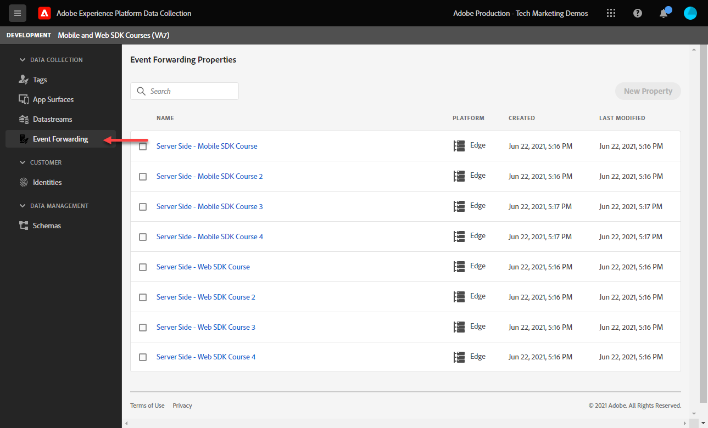
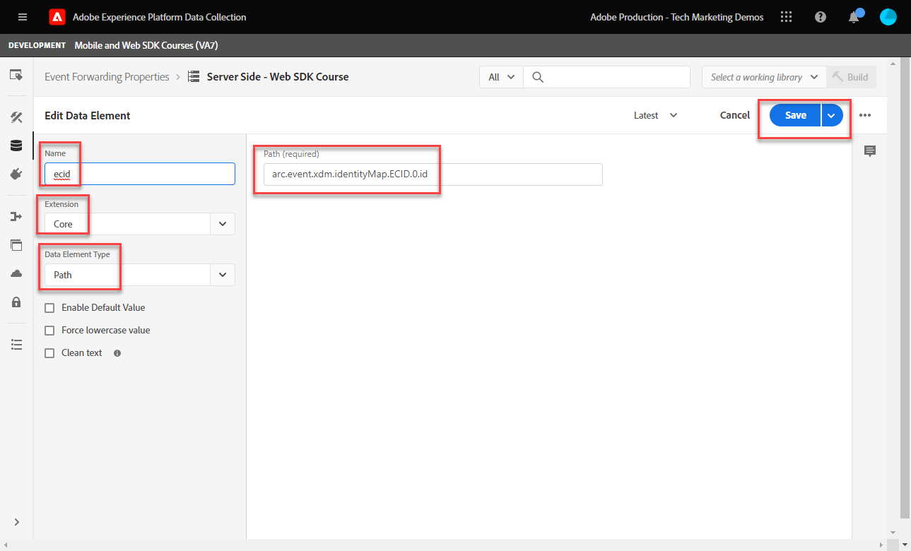
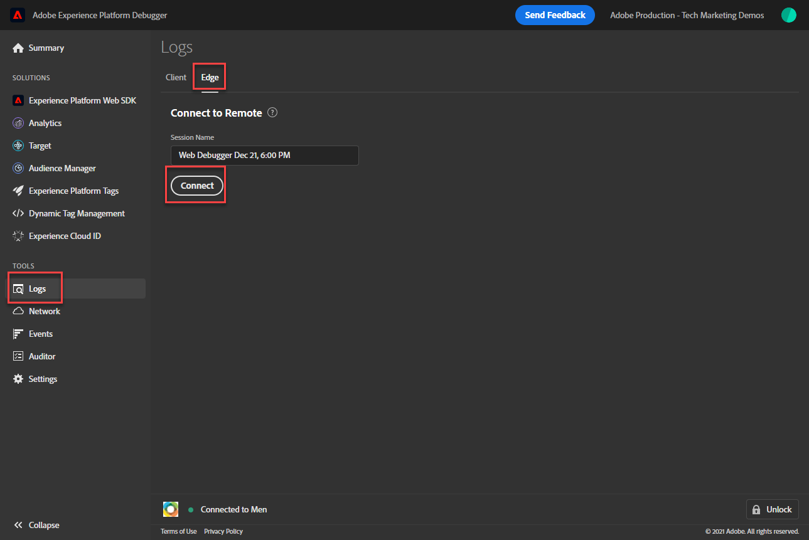

# Konfigurera händelsevidarebefordran med plattformsdata för Web SDK

Lär dig hur du använder händelsevidarebefordran med Adobe Experience Platform Web SDK-data.

Vidarebefordran av händelser är en ny typ av egenskap som är tillgänglig i datainsamling. Med händelsevidarebefordran kan du skicka data till andra leverantörer än Adobe direkt från Adobe Experience Platform Edge Network istället för till den traditionella webbläsaren på klientsidan. Läs mer om fördelarna med vidarebefordran av händelser i [Översikt över vidarebefordran av händelser](https://experienceleague.adobe.com/en/docs/experience-platform/tags/event-forwarding/overview).

Om du vill använda händelsevidarebefordran i Adobe Experience Platform måste data skickas till Adobe Experience Platform Edge Network först med ett eller flera av följande tre alternativ:

* [Webb-SDK för Adobe Experience Platform](overview.md)
* [Adobe Experience Platform Mobile SDK](https://developer.adobe.com/client-sdks/home/)
  <!--* [Server-to-Server API](https://experienceleague.adobe.com/en/docs/audience-manager/user-guide/api-and-sdk-code/dcs/dcs-apis/dcs-s2s)-->

>[!NOTE]
>Platform Web SDK och Platform Mobile SDK kräver inte distribution via taggar, men du bör använda taggar för att distribuera dessa SDK:er.

När du är klar med de tidigare lektionerna i den här självstudiekursen bör du skicka data till Platform Edge Network med hjälp av Web SDK. När data finns i Platform Edge Network kan du aktivera vidarebefordran av händelser och använda en händelsevidarebefordringsegenskap för att skicka data till lösningar utanför Adobe.

## Utbildningsmål

I slutet av lektionen kan du:

* Skapa en egenskap för vidarebefordring av händelser
* Länka en händelsevidarebefordringsegenskap till ett Platform Web SDK-datalager
* Förstå skillnaderna mellan taggegenskapens dataelement och regler och händelsevidarebefordringens egenskapselement och regler
* Skapa ett dataelement för vidarebefordran av händelser
* Konfigurera en regel för vidarebefordran av händelser
* Verifiera att en händelsevidarebefordringsegenskap har skickat data

## Förhandskrav

* En programlicens som innehåller vidarebefordran av händelser. Vidarebefordran av händelser är en betalfunktion i datainsamling. Kontakta kontoteamet på Adobe för mer information.
* Vidarebefordran av händelser är aktiverat i din Experience Cloud-organisation.
* Användarbehörighet för vidarebefordran av händelser. (I [Admin Console](https://adminconsole.adobe.com/), under Adobe Experience Platform Launch-produkten, behörighetsobjekt för [!UICONTROL Platforms] > [!UICONTROL Edge] och alla [!UICONTROL Property Rights]). När du har fått det ska du se [!UICONTROL Event Forwarding] i den vänstra navigeringen i gränssnittet för datainsamling:
  

* Adobe Experience Platform Web eller Mobile SDK har konfigurerats för att skicka data till Edge Network. Du måste ha gjort följande i den här självstudiekursen:

   * Inledande konfiguration

      * [Konfigurera ett XDM-schema](configure-schemas.md)
      * [Konfigurera ett identitetsnamnutrymme](configure-identities.md)
      * [Konfigurera ett datastream](configure-datastream.md)

   * Märkordskonfiguration

      * [Installera SDK-tillägg för webben](install-web-sdk.md)
      * [Skapa dataelement](create-data-elements.md)
      * [Skapa identiteter](create-identities.md)
      * [Skapa taggregler](create-tag-rule.md)
      * [Validera med Adobe Experience Platform debugger](validate-with-debugger.md)

## Skapa en egenskap för vidarebefordring av händelser

Börja med att skapa en händelsevidarebefordringsegenskap:

1. Öppna [gränssnittet för datainsamling](https://experience.adobe.com/#/data-collection)
1. Välj **[!UICONTROL Event Forwarding]** i den vänstra navigeringen
1. Välj **[!UICONTROL New Property]**.
   

1. Namnge egenskapen. I det här fallet `Server-Side - Web SDK Course`

1. Välj **[!UICONTROL Save]**.
   

## Konfigurera datastream

För att händelsevidarebefordran ska kunna använda data som du skickar till Platform Edge Network måste du länka den nyligen skapade händelsevidarebefordringsegenskapen till samma dataström som används för att skicka data till Adobe-lösningar.

Så här konfigurerar du Target i datastream:

1. Gå till gränssnittet [Datainsamling](https://experience.adobe.com/#/data-collection){target="blank"}
1. Välj **[!UICONTROL Datastreams]** i den vänstra navigeringen
1. Markera den tidigare skapade `Luma Web SDK: Development Environment`-datastream

   

1. Välj **[!UICONTROL Add Service]**
   
1. Välj **[!UICONTROL Event Forwarding]** som **[!UICONTROL Service]**

1. I listrutan **[!UICONTROL Property ID]** väljer du namnet som du gav till egenskapen för vidarebefordran av händelser, i det här fallet `Server-Side - Web SDK Course`

1. I listrutan **[!UICONTROL Environment ID]** väljer du den taggmiljö som du länkar händelsens vidarebefordringsmiljö till, i det här fallet `Development`

   >[!TIP]
   >
   >    Om du vill skicka data till en händelsevidarebefordringsmiljö utanför Adobe-organisationen markerar du **[!UICONTROL Manually enter IDs]** och klistrar in ett ID. ID:t anges när du skapar en händelsevidarebefordringsegenskap.

1. Välj **[!UICONTROL Save]**.

   

Upprepa dessa steg för staging- och produktionsdatastreams när du är redo att marknadsföra dina ändringar via publiceringsflödet.

## Vidarebefordra data från Platform Edge Network till en icke-Adobe-lösning

I den här övningen får du lära dig hur du konfigurerar ett dataelement för vidarebefordran av händelser, konfigurerar en regel för vidarebefordran av händelser och validerar med hjälp av ett tredjedelsverktyg som kallas [Webkrok.site](https://webhook.site/).

>[!NOTE]
>
>En webkrok är ett sätt att integrera olika system i halvrealtid. [Webkrok.site](https://webhook.site/) är ett tredjepartsverktyg som gör att du enkelt kan inspektera, testa och automatisera (med den visuella anpassade åtgärdshanteraren eller WebkrockScript) inkommande HTTP-begäran eller e-post.

>[!IMPORTANT]
>
>Du måste redan ha skapat och mappat dataelement till ett XDM-objekt, samt konfigurerade taggregler och byggt dessa ändringar i ett bibliotek till en taggmiljö för att kunna fortsätta. Om du inte har det läser du stegen **Tagskonfiguration** i avsnittet [Krav](setup-event-forwarding.md#prerequisites) . Dessa steg säkerställer att data skickas till Platform Edge Network, och därifrån kan du konfigurera en händelsevidarebefordringsegenskap för att vidarebefordra data till en icke-Adobe-lösning.

### Skapa ett dataelement för vidarebefordran av händelser

XDM-objektet som du tidigare konfigurerade med plattformens SDK-taggtillägg blir datakällan för dataelement i en händelsevidarebefordringsegenskap. Du använder samma data som du redan har konfigurerat i taggegenskapen som en datakälla för händelsevidarebefordran.

>[!IMPORTANT]
>
>Det finns en viktig syntaxskillnad när XDM-fält refereras i händelsevidarebefordran jämfört med andra kontexter. Om du vill referera till data i en händelsevidarebefordringsegenskap måste dataelementets sökväg innehålla prefixet `arc.event`:
>
> * `arc` står för Adobe Response Context.
> * Till exempel: `arc.event.xdm.web.webPageDetails.URL`
>
>Om den här sökvägen anges felaktigt samlas inga data in.

I den här övningen vidarebefordrar du höjden på webbläsarens visningsruta och Experience Cloud-ID från XDM-objektet till en webkrok. Sökvägen till XDM-fältet bestäms av XDM-schemat som skapades under lektionen [Konfigurera ett XDM-schema](configure-schemas.md).

>[!TIP]
>
>Du kan också hitta XDM-objektsökvägen med hjälp av webbläsarens nätverksverktyg, filtrering efter `/ee`-begäranden, öppning av [!UICONTROL **nyttolasten**] och fördjupning av variabeln du söker efter. Högerklicka sedan med musen och välj Kopiera egenskapssökväg. Här är ett exempel på webbläsarvisningsportens höjd:
> 

1. Gå till egenskapen **[!UICONTROL Event Forwarding]** som du nyss skapade

1. Välj **[!UICONTROL Data Elements]** i den vänstra navigeringen

1. Välj till **[!UICONTROL Create New Data Element]**

   

1. **[!UICONTROL Name]** dataelementet `environment.browserDetails.viewportHeight`

1. Lämna `CORE` under **[!UICONTROL Extension]**

1. Under **[!UICONTROL Data Element Type]** väljer du `Path`

1. Ange XDM-objektsökvägen som innehåller höjden för webbläsarvisningsrutan `arc.event.xdm.environment.browserDetails.viewportHeight`

1. Välj **[!UICONTROL Save]**

   

1. Skapa ett annat dataelement

1. **[!UICONTROL Name]** den `ecid`

1. Lämna `CORE` under **[!UICONTROL Extension]**

1. Under **[!UICONTROL Data Element Type]** väljer du `Path`

1. Ange sökvägen till XDM-objektet som innehåller Experience Cloud-ID `arc.event.xdm.identityMap.ECID.0.id`

1. Välj **[!UICONTROL Save]**

   

   >[!CAUTION]
   >
   > Se till att du tar med prefixet `arc.event.` i sökvägen. Se även till att följa det exakta skiftläget som fältnamnet för XDM-objektet. ECID-namnutrymmet måste vara i versaler.

   >[!TIP]
   >
   >När du arbetar med din egen webbplats kan du hitta XDM-objektsökvägen med webbläsarens nätverksverktyg, filtrera efter `/ee` begäranden, öppna [!UICONTROL **nyttolasten**] och gå ned till den variabel du söker. Högerklicka sedan med musen och välj Kopiera egenskapssökväg. Här är ett exempel på webbläsarvisningsportens höjd:
   > 

### Installera tillägget Adobe Cloud Connector

Om du vill skicka data till tredjepartsplatser måste du först installera tillägget [!UICONTROL Adobe Cloud Connector].

1. Välj **[!UICONTROL Extensions]** i den vänstra navigeringen

1. Välj fliken **[!UICONTROL Catalog]**

1. Sök efter **[!UICONTROL Adobe Cloud Connector]**, välj **[!UICONTROL Install]**

   

Ingen tilläggskonfiguration behövs. Med det här tillägget kan du nu vidarebefordra data till en icke-Adobe-lösning!

### Skapa en regel för vidarebefordran av händelser

Det finns några huvudsakliga skillnader mellan att konfigurera regler i en taggegenskap och en regel i en händelsevidarebefordringsegenskap:

* **[!UICONTROL Events]&amp;[!UICONTROL Conditions]**:

   * **Taggar**: Alla regler aktiveras av en händelse som måste anges i regeln, till exempel `Library Loaded - Page Top`. Villkoren är valfria.
   * **Vidarebefordran av händelser**: Det antas att alla händelser som skickas till Platform Edge Network utlöser vidarebefordran av data. Det finns därför inga [!UICONTROL Events] som måste väljas i reglerna för vidarebefordran av händelser. Om du vill hantera vilka händelser som utlöser en regel för vidarebefordran av händelser måste du konfigurera villkoren.

* **Tokenisering av dataelement**:

   * **Taggar**: Dataelementnamn tokeniseras med `%` i början och slutet av dataelementnamnet när de används i en regel. Exempel: `%viewportHeight%`.

   * **Vidarebefordran av händelser**: Dataelementnamn tokeniseras med `{{` i början och `}}` i slutet av dataelementnamnet när de används i en regel. Exempel: `{{viewportHeight}}`.

* **Regelåtgärdssekvens**:

   * Avsnittet Åtgärder i en regel för vidarebefordran av händelser körs alltid sekventiellt. Kontrollera att åtgärdsordningen är korrekt när du sparar en regel. Den här körningssekvensen kan inte köras asynkront på samma sätt som den kan med taggar.

<!--
  * **Tags**: Rule actions can easily be reordered using drag-and-drop functionality.
  * **Event forwarding**: Rule actions are always executed sequentially. Make sure the order of actions is correct when you save a rule.
-->

Om du vill konfigurera en regel för att vidarebefordra data till din webkrok måste du först skaffa din personliga webkrok:

1. Gå till [Webkrok.site](https://webhook.site)

1. Sök efter **din unika URL**, du använder den som URL-begäran i din regel för vidarebefordran av händelser

1. Välj **[!UICONTROL Copy to clipboard]**

1. Lämna det här fönstret öppet så att du kan validera händelsevidarebefordringsdata i realtid som hämtas av Webkroks

   

1. Gå tillbaka **[!UICONTROL Data Collection]** > **[!UICONTROL Event Forwarding]** > **[!UICONTROL Rules]** från vänster navigering

1. Välj **[!UICONTROL Create New Rule]**

   

1. Ge den namnet `all events - ad cloud connector - webhook`

1. Lägg till en åtgärd

1. Under **[!UICONTROL Extension]** väljer du **[!UICONTROL Adobe Cloud Connector]**

1. Under **[!UICONTROL Action Type]** väljer du **[!UICONTROL Make Fetch Call]**

1. Klistra in webkroks-URL i fältet **[!UICONTROL URL]**

   

1. Under **[Frågeparametrar]** lägger du till båda dataelementen som du skapade tidigare.

1. På kolumntypen **[!UICONTROL Key]** i `viewPortHeight`. I kolumnen **[!UICONTROL Value]** anger du dataelementet `{{environment.browserDetails.viewportHeight}}` genom att antingen skriva in det eller välja det från dataelementets väljarikon

1. Välj [!UICONTROL **+ Lägg till ytterligare en**] om du vill lägga till ytterligare en frågeparameter

1. På kolumntypen **[!UICONTROL Key]** i `ecid`. Ange dataelementet `{{ecid}}` i kolumnen Värde

1. Välj **[!UICONTROL Keep Changes]**

   

1. Regeln ska se ut så här nedan

1. Välj **[!UICONTROL Save]**

   

### Skapa och bygg biblioteket

Skapa ett bibliotek och bygg alla ändringar i utvecklingsmiljön för vidarebefordring av händelser på samma sätt som i en taggegenskap.

>[!NOTE]
>
>Om du inte har länkat egenskaperna för vidarebefordran av mellanlagrings- och produktionshändelser till ditt datastam, kommer du att se Utvecklingsmiljö som det enda alternativet att skapa ett bibliotek till.

## Validera regel för vidarebefordran av händelse

Nu kan du validera din egenskap för vidarebefordran av händelser med hjälp av Platform Debugger och Webhook.site:

1. Följ stegen för att [växla taggbiblioteket](validate-with-debugger.md#use-the-experience-platform-debugger-to-map-to-your-tag-property) på [Luma Demo-webbplatsen](https://luma.enablementadobe.com/content/luma/us/en/men.html) till taggegenskapen Web SDK som du mappade din händelsevidarebefordringsegenskap till i datastream.

1. Innan du läser in sidan igen öppnar du **[!UICONTROL Logs]** från den vänstra navigeringen i felsökaren i Experience Platform

1. Markera fliken **[!UICONTROL Edge]** och välj sedan **[!UICONTROL Connect]** för att visa begäran från Platform Edge Network

   

1. Läs in sidan igen

1. Du kommer att se ytterligare begäranden som ger dig synlighet i de serverförfrågningar som skickas av Platform Edge Network till WebHook

1. Begäran om fokusvalidering är den som visar den fullständiga URL som skickas av Edge-nätverket

   

1. Anteckna parametrarna för frågesträngarna viewPortHeight och ecid

   

1. De matchar de data som visas i XDM-objektet

   

1. Validera datasammanfogningarna i [Webkrok.site](https://webhook.site) genom att visa det öppna Webkrocksfönstret

   

Grattis! Du har konfigurerat vidarebefordran av händelser!

[Nästa: ](conclusion.md)

>[!NOTE]
>
>Tack för att du lade ned din tid på att lära dig om Adobe Experience Platform Web SDK. Om du har frågor, vill dela allmän feedback eller har förslag på framtida innehåll kan du dela dem i det här [Experience League-diskussionsinlägget](https://experienceleaguecommunities.adobe.com/t5/adobe-experience-platform-data/tutorial-discussion-implement-adobe-experience-cloud-with-web/td-p/444996)
