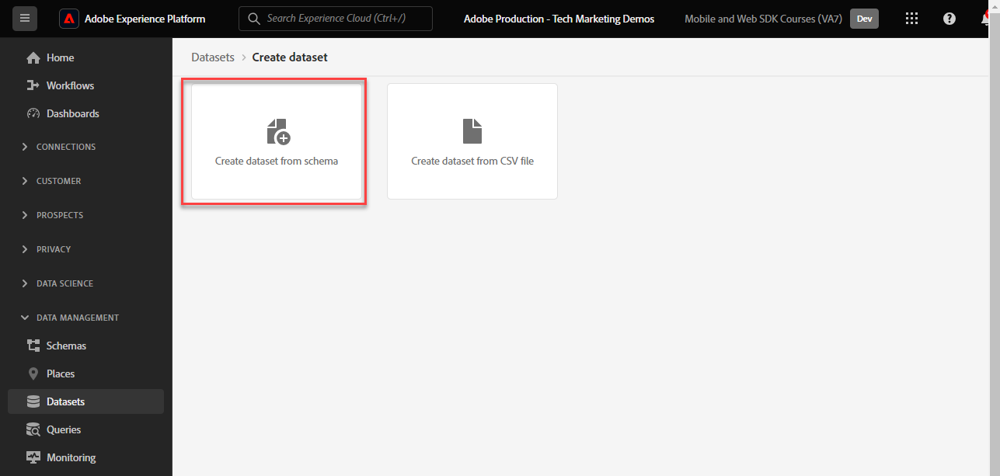

# Strömma data till Experience Platform med Web SDK

Lär dig hur du strömmar webbdata till Adobe Experience Platform med Platform Web SDK.

Experience Platform är ryggraden i alla nya Experience Cloud-program, som Adobe Real-time Customer Data Platform, Adobe Customer Journey Analytics och Adobe Journey Optimizer. Dessa program är utformade för att använda Platform Web SDK som den optimala metoden för webbdatainsamling.

Experience Platform använder samma XDM-schema som du skapade tidigare för att hämta händelsedata från Luma-webbplatsen. När dessa data skickas till Platform Edge Network kan datastream-konfigurationen vidarebefordra dem till Experience Platform.

## Utbildningsmål

När lektionen är klar kan du:

* Skapa en datauppsättning i Adobe Experience Platform
* Konfigurera dataströmmen för att skicka Web SDK-data till Adobe Experience Platform
* Aktivera direktuppspelande webbdata för kundprofil i realtid
* Validera att data har landats både i plattformsdatauppsättningen och i kundprofilen i realtid
* Infoga exempeldata om lojalitetsprogram i plattformen
* Bygg en publik på en enkel plattform

## Förhandskrav

För att slutföra lektionen måste du först:

* Har tillgång till ett Adobe Experience Platform-program som Real-time Customer Data Platform, Journey Optimizer eller Customer Journey Analytics
* Slutför de tidigare lektionerna i avsnitten Inledande konfiguration och Tagginställningar i den här självstudien.

>[!NOTE]
>
>Om du inte har något plattformsprogram kan du hoppa över den här lektionen eller läsa vidare.

## Skapa en datauppsättning

Alla data som har inhämtats till Adobe Experience Platform lagras i datasjön som datauppsättningar. En [datamängd](https://experienceleague.adobe.com/sv/docs/experience-platform/catalog/datasets/overview) är en lagrings- och hanteringskonstruktion för en datamängd, vanligtvis en tabell som innehåller ett schema (kolumner) och fält (rader). Datauppsättningar innehåller också metadata som beskriver olika aspekter av de data som lagras.

Låt oss skapa en datauppsättning för dina webbhändelsedata för Luma:

1. Gå till gränssnittet [Experience Platform](https://experience.adobe.com/platform/) eller [Journey Optimizer](https://experience.adobe.com/journey-optimizer/)
1. Bekräfta att du befinner dig i den utvecklingssandlåda som du använder för den här självstudien
1. Öppna **[!UICONTROL Data Management > Datasets]** från den vänstra navigeringen
1. Välj **[!UICONTROL Create dataset]**

   

1. Välj alternativet **[!UICONTROL Create dataset from schema]**

   

1. Välj det `Luma Web Event Data`-schema som skapades i [tidigare lektionen](configure-schemas.md) och välj sedan **[!UICONTROL Next]**

   

1. Ange ett **[!UICONTROL Name]** och valfritt **[!UICONTROL Description]** för datauppsättningen. Använd `Luma Web Event Data` för den här övningen och välj sedan **[!UICONTROL Finish]**

   

En datauppsättning har nu konfigurerats för att börja samla in data från implementeringen av Platform Web SDK.

## Konfigurera datastream

Nu kan du konfigurera [!UICONTROL datastream] för att skicka data till [!UICONTROL Adobe Experience Platform]. Datastream är länken mellan taggegenskapen, Platform Edge Network och datamängden Experience Platform.

1. Öppna gränssnittet [Datainsamling](https://experience.adobe.com/#/data-collection){target="blank"}
1. Välj **[!UICONTROL Datastreams]** i den vänstra navigeringen
1. Öppna datastream som du skapade i [Konfigurera en datastream](configure-datastream.md)-lektion, `Luma Web SDK`

   

1. Välj **[!UICONTROL Add Service]**
   
1. Välj **[!UICONTROL Adobe Experience Platform]** som **[!UICONTROL Service]**
1. Välj `Luma Web Event Data` som **[!UICONTROL Event Dataset]**

1. Välj **[!UICONTROL Save]**.

   

När du genererar trafik på [Luma Demo Site](https://luma.enablementadobe.com/content/luma/us/en.html) som är mappad till din taggegenskap fylls datauppsättningen i Experience Platform!

## Validera datauppsättningen

Det här steget är viktigt för att se till att data har landats i datauppsättningen. Det finns två aspekter av att validera data som skickas till datauppsättningen.

* Validera med [!UICONTROL Experience Platform Debugger]
* Validera med [!UICONTROL Preview Dataset]
* Validera med [!UICONTROL Query Service]

### Experience Platform Debugger

De här stegen är mer eller mindre desamma som du gjorde i [felsökningslektionen](validate-with-debugger.md). Eftersom data bara skickas till plattformen när du har aktiverat den i datastream måste du generera fler exempeldata:

1. Öppna [demowebbplatsen för luma](https://luma.enablementadobe.com/content/luma/us/en.html) och välj tilläggsikonen [!UICONTROL Experience Platform Debugger]

1. Konfigurera felsökaren för att mappa taggegenskapen till *din* utvecklingsmiljö, enligt beskrivningen i lektionen [Validera med felsökning](validate-with-debugger.md)

   

1. Logga in på Luma-webbplatsen med inloggningsuppgifterna `test@adobe.com`/`test`

1. Återgå till [Lumas hemsida](https://luma.enablementadobe.com/content/luma/us/en.html)

1. Markera på raden &quot;events&quot; i plattforms-Web SDK-nätverksbeacons som visas av felsökaren för att visa information i ett popup-fönster

   

1. Sök efter &quot;identityMap&quot; i popup-fönstret. Här visas lumaCrmId med tre nycklar för authenticatedState, id och primär
   

Data ska nu fyllas i i datamängden `Luma Web Event Data` och vara klara för validering av datauppsättningen Preview.

### Förhandsgranska datauppsättningen

För att bekräfta att data har landat i plattformens datalinje är ett snabbt alternativ att använda funktionen **[!UICONTROL Preview dataset]**. SDK-data för webben mikrobatcheras till datasjön och uppdateras regelbundet i plattformsgränssnittet. Det kan ta 10-15 minuter att se data som du har skapat.

1. I gränssnittet [Experience Platform](https://experience.adobe.com/platform/) väljer du **[!UICONTROL Data Management > Datasets]** i den vänstra navigeringen för att öppna kontrollpanelen **[!UICONTROL Datasets]**.

   Kontrollpanelen visar alla tillgängliga datauppsättningar för din organisation. Information visas för varje datamängd som anges, inklusive namn, schema som datauppsättningen följer och status för den senaste importen.

1. Markera `Luma Web Event Data`-datauppsättningen för att öppna dess **[!UICONTROL Dataset activity]**-skärm.

   

   Aktivitetsskärmen innehåller ett diagram som visar hur många meddelanden som har förbrukats samt en lista över lyckade och misslyckade batchar.

1. På skärmen **[!UICONTROL Dataset activity]** väljer du **[!UICONTROL Preview dataset]** i skärmens övre högra hörn om du vill förhandsgranska upp till 100 rader med data. Om datauppsättningen är tom inaktiveras förhandsgranskningslänken.

   

   I förhandsgranskningsfönstret visas den hierarkiska vyn av datasetens schema till höger.

   

### Fråga data

1. I gränssnittet [Experience Platform](https://experience.adobe.com/platform/) väljer du **[!UICONTROL Data Management > Queroes]** i den vänstra navigeringen för att öppna skärmen **[!UICONTROL Queries]**.
1. Välj **[!UICONTROL Create query]**
1. Kör först en fråga för att se alla tabellnamn i datasjön. Ange `SHOW TABLES` i frågeredigeraren och klicka på uppspelningsikonen för att köra frågan.
1. Lägg märke till att namnet på tabellen liknar `luma_web_event_data` i resultatet
1. Fråga nu tabellen med en enkel fråga som refererar till tabellen (observera att frågan som standard är begränsad till 100 resultat): `SELECT * FROM "luma_web_event_data"`
1. Efter en stund bör du se exempelposter av dina webbdata.

>[!ERROR]
>
>Om du får ett felmeddelande om att tabellen inte har etablerats dubbelkontrollerar du namnet på tabellen. Det kan också vara så att mikrobatchen med data ännu inte landat i sjön med data. Försök igen om 10-15 minuter.

>[!INFO]
>
>  Mer information om Adobe Experience Platform frågetjänst finns i [Utforska data](https://experienceleague.adobe.com/sv/docs/platform-learn/tutorials/queries/explore-data) i självstudiekurserna för plattformen.

## Aktivera datauppsättningen och schemat för kundprofil i realtid

För kunder som har Real-time Customer Data Platform och Journey Optimizer är nästa steg att aktivera datauppsättningen och schemat för kundprofilen i realtid. Dataströmning från Web SDK kommer att vara en av många datakällor som flödar på Platform och du vill koppla webbdata till andra datakällor för att skapa 360-graders kundprofiler. Titta på den här korta videon om du vill veta mer om kundprofilen i realtid:

>[!VIDEO](https://video.tv.adobe.com/v/27251?learn=on&captions=eng)

>[!CAUTION]
>
>När vi arbetar med din egen webbplats och data rekommenderar vi en mer robust validering av data innan vi aktiverar den för kundprofil i realtid.

**Så här aktiverar du datauppsättningen:**

1. Öppna datauppsättningen som du skapade, `Luma Web Event Data`

1. Markera **[!UICONTROL Profile Toggle]** för att aktivera den

   

1. Bekräfta att du vill **[!UICONTROL Enable]** datauppsättningen

   

**Så här aktiverar du schemat:**

1. Öppna schemat som du skapade, `Luma Web Event Data`

1. Markera **[!UICONTROL Profile Toggle]** för att aktivera den

   

1. Välj **[!UICONTROL Data for this schema will contain a primary identity in the identityMap field.]**

   >[!IMPORTANT]
   >
   >    Primära identiteter krävs i alla poster som skickas till kundprofilen i realtid. Vanligtvis är identitetsfält märkta i schemat. När du använder identitetskartor visas emellertid inte identitetsfälten i schemat. I den här dialogrutan bekräftar du att du har en primär identitet i åtanke och att du anger den i en identitetskarta när du skickar data. Som du vet använder Web SDK en identitetskarta med Experience Cloud-ID (ECID) som primär standardidentitet och ett autentiserat ID som primär identitet när det är tillgängligt.

1. Välj **[!UICONTROL Enable]**

   

1. Välj **[!UICONTROL Save]** om du vill spara det uppdaterade schemat

Nu är schemat även aktiverat för profilen.

>[!IMPORTANT]
>
>    När ett schema har aktiverats för profilen kan det inte inaktiveras eller tas bort utan att du behöver återställa eller ta bort hela sandlådan. Det går inte heller att ta bort fält från schemat efter den här punkten.
>
>   
> När du arbetar med egna data rekommenderar vi att du gör saker i följande ordning:
> 
> * För det första kan du importera vissa data i dina datauppsättningar.
> * Åtgärda eventuella problem som uppstår under dataöverföringsprocessen (till exempel datavalidering eller mappningsproblem).
> * Aktivera datauppsättningar och scheman för profil
> * Importera data igen, om det behövs

### Validera en profil

Du kan slå upp en kundprofil i plattformsgränssnittet (eller Journey Optimizer-gränssnittet) för att bekräfta att data har landats i kundprofilen i realtid. Som namnet antyder fyller profilerna i realtid, så det är ingen fördröjning som när data i datauppsättningen validerades.

Först måste du generera fler exempeldata. Upprepa stegen tidigare i den här lektionen för att logga in på Luma-webbplatsen när den mappas till taggegenskapen. Inspect-begäran om Platform Web SDK för att se till att den skickar data med `lumaCRMId`.

1. I gränssnittet [Experience Platform](https://experience.adobe.com/platform/) väljer du **[!UICONTROL Customer]** > **[!UICONTROL Profiles]** i den vänstra navigeringen

1. Som **[!UICONTROL Identity namespace]** använder du `lumaCRMId`
1. Kopiera och klistra in värdet för `lumaCRMId` som skickades i anropet som du inspekterade i felsökaren i Experience Platform, i det här fallet `112ca06ed53d3db37e4cea49cc45b71e`.

   

1. Om det finns ett giltigt värde i profilen för `lumaCRMId` fylls ett profil-ID i konsolen:

   

1. Om du vill visa hela **[!UICONTROL Customer Profile]** för varje ID väljer du **[!UICONTROL Profile ID]** i huvudfönstret.

   >[!NOTE]
   >
   >Observera att du kan välja hyperlänken för profil-ID:t, eller om du markerar raden öppnas en högermeny där du kan välja hyperlänken för profil-ID
   > 

   Här kan du se alla identiteter som är länkade till `lumaCRMId`, till exempel `ECID`.

   

Du har nu aktiverat Platform Web SDK för Experience Platform (och Real-Time CDP! Och Journey Optimizer! Och Customer Journey Analytics!).

### Skapa ett bonusschema och importera exempeldata

Kunder som använder Real-time Customer Data Platform och Journey Optimizer förväntas bli klara.

När Web SDK-data hämtas till Adobe Experience Platform kan de berikas av andra datakällor som du har kapslat in i Platform. När en användare till exempel loggar in på Luma-webbplatsen skapas ett identitetsdiagram i Experience Platform och alla andra profilaktiverade datauppsättningar kan sammanfogas för att skapa kundprofiler i realtid. Om du vill se hur detta fungerar skapar du snabbt en ny datauppsättning i Adobe Experience Platform med några exempel på lojalitetsdata så att du kan använda kundprofiler i realtid med Real-time Customer Data Platform och Journey Optimizer. Eftersom du redan har gjort liknande övningar kommer instruktionerna att vara korta.

Skapa bonusschemat:

1. Skapa ett nytt schema
1. Välj **[!UICONTROL Individual Profile]** som [!UICONTROL base class]
1. Namnge schemat `Luma Loyalty Schema`
1. Lägg till fältgruppen [!UICONTROL Loyalty Details]
1. Lägg till fältgruppen [!UICONTROL Demographic Details]
1. Markera fältet `Person ID` och markera det som en [!UICONTROL Identity] och [!UICONTROL Primary identity] med `Luma CRM Id` [!UICONTROL Identity namespace].
1. Aktivera schemat för [!UICONTROL Profile]. Om du inte kan hitta växlingsknappen Profil kan du prova att klicka på schemanamnet högst upp till vänster.
1. Spara schemat

   

Så här skapar du datauppsättningen och importerar exempeldata:

1. Skapa en ny datauppsättning från `Luma Loyalty Schema`
1. Namnge datauppsättningen `Luma Loyalty Dataset`
1. Aktivera datauppsättningen för [!UICONTROL Profile]
1. Hämta exempelfilen [luma-loyalty-forWeb.json](assets/luma-loyalty-forWeb.json)
1. Dra och släpp filen i datauppsättningen
1. Bekräfta att data har importerats

   

### Skapa en målgrupp

Målgruppsprofiler samlas kring gemensamma egenskaper. Skapa en snabb målgrupp som ni kan använda i er webbkampanj:

1. I gränssnittet Experience Platform eller Journey Optimizer går du till **[!UICONTROL Customer]** > **[!UICONTROL Audiences]** i den vänstra navigeringen
1. Välj **[!UICONTROL Create audience]**
1. Välj **[!UICONTROL Build rule]**
1. Välj **[!UICONTROL Create]**

   

1. Välj **[!UICONTROL Attributes]**
1. Hitta fältet **[!UICONTROL Loyalty]** > **[!UICONTROL Tier]** och dra det till avsnittet **[!UICONTROL Attributes]**
1. Definiera målgruppen som användare vars `tier` är `gold`
1. Namnge målgruppen `Luma Loyalty Rewards – Gold Status`
1. Välj **[!UICONTROL Edge]** som **[!UICONTROL Evaluation method]**
1. Välj **[!UICONTROL Save]**

   

Eftersom detta är en mycket enkel publik kan vi använda Edge utvärderingsmetod. Edge målgrupper utvärderas i det närmaste, så i samma begäran som Web SDK till Platform Edge Network kan vi utvärdera målgruppsdefinitionen och omedelbart bekräfta om användaren är berättigad.

[Nästa: ](setup-analytics.md)

>[!NOTE]
>
>Tack för att du lade ned din tid på att lära dig om Adobe Experience Platform Web SDK. Om du har frågor, vill dela allmän feedback eller har förslag på framtida innehåll kan du dela dem i det här [Experience League-diskussionsinlägget](https://experienceleaguecommunities.adobe.com/t5/adobe-experience-platform-data/tutorial-discussion-implement-adobe-experience-cloud-with-web/td-p/444996)
