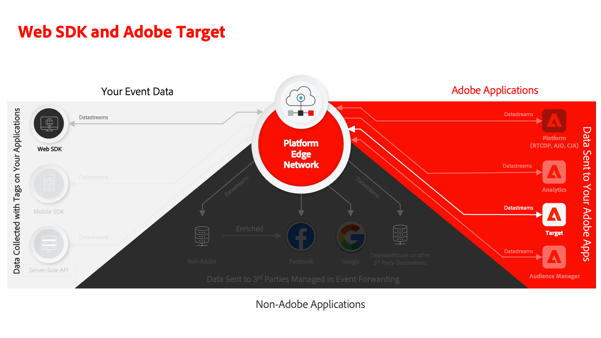

# Konfigurera Adobe Target med Platform Web SDK

Lär dig implementera Adobe Target med Adobe Experience Platform Web SDK. Lär dig hur du levererar upplevelser och hur du skickar ytterligare parametrar till Target.

[Adobe Target](https://experienceleague.adobe.com/sv/docs/target/using/target-home) är ett Adobe Experience Cloud-program som innehåller allt du behöver för att skräddarsy och personalisera kundupplevelsen, så att du kan maximera intäkterna på dina webbplatser, mobilsajter, appar och andra digitala kanaler.



## Utbildningsmål

I slutet av lektionen kan du göra följande med en Web SDK-implementering av Target:

* Lägg till det fragment som döljs för att förhindra flimmer
* Konfigurera ett datastream för att aktivera Target-funktioner
* Visa dispositionsaktiviteter för visuell upplevelse
* Återge formulärdispositionsaktiviteter
* Skicka XDM-data till Target och förstå mappningen till Target-parametrar
* Skicka anpassade data till Target, t.ex. profil- och enhetsparametrar
* Validera en målinriktad implementering
* Separera personaliseringsbegäranden från analysförfrågningar

>[!TIP]
>
>Se vår självstudiekurs [Migrate Target från at.js 2.x till Platform Web SDK](/help/tutorial-migrate-target-websdk/introduction.md) för en steg-för-steg-guide för att migrera din befintliga at.js-implementering.


## Förhandskrav

För att slutföra lektionerna i det här avsnittet måste du först:

* Slutför alla lektioner för den första konfigurationen av Platform Web SDK, inklusive inställning av dataelement och regler.
* Kontrollera att du har en [redigerings- eller godkännarroll](https://experienceleague.adobe.com/sv/docs/target/using/administer/manage-users/enterprise/properties-overview#section_8C425E43E5DD4111BBFC734A2B7ABC80) i Adobe Target.
* Installera [hjälptillägget för Visual Experience Composer](https://experienceleague.adobe.com/sv/docs/target/using/experiences/vec/troubleshoot-composer/vec-helper-browser-extension) om du använder webbläsaren Google Chrome.
* Lär dig hur du ställer in aktiviteter i Target. Om du behöver en uppdaterare kan du använda följande självstudiekurser och guider för den här lektionen:
   * [Använd hjälptillägget för Visual Experience Composer (VEC)](https://experienceleague.adobe.com/sv/docs/target/using/experiences/vec/troubleshoot-composer/vec-helper-browser-extension)
   * [Använd Visual Experience Composer](https://experienceleague.adobe.com/sv/docs/target-learn/tutorials/experiences/use-the-visual-experience-composer)
   * [Använd den formulärbaserade Experience Composer](https://experienceleague.adobe.com/sv/docs/target-learn/tutorials/experiences/use-the-form-based-experience-composer)
   * [Skapa aktiviteter för målinriktning av upplevelser](https://experienceleague.adobe.com/sv/docs/target-learn/tutorials/activities/create-experience-targeting-activities)

## Lägg till flimmerhantering

Innan du startar avgör du om en extra flimmerhanteringslösning krävs beroende på hur taggbiblioteket läses in.

>[!NOTE]
>
>I den här självstudien används [Luma-webbplatsen](https://luma.enablementadobe.com/content/luma/us/en.html){target=_blank} som har en asynkron implementering av taggar och flimmerreducering. I det här avsnittet finns information om hur flimmerfunktionen fungerar med Platform Web SDK.


### Asynkron implementering

När ett taggbibliotek läses in asynkront kan det hända att sidan sluts återgivningen innan Target har ersatt standardinnehållet med anpassat innehåll. Det här beteendet kan leda till det som kallas&quot;flimmer&quot;, där standardinnehållet visas kort innan det ersätts av det anpassade innehållet. Om du vill undvika denna flimmer rekommenderar Adobe att du lägger till ett särskilt fragment som döljs före den asynkrona taggen för inbäddning.

Det här fragmentet finns redan på Luma-webbplatsen, men vi ska titta närmare på vad koden gör:

```html
<script>
  !function(e,a,n,t){var i=e.head;if(i){
  if (a) return;
  var o=e.createElement("style");
  o.id="alloy-prehiding",o.innerText=n,i.appendChild(o),setTimeout(function(){o.parentNode&&o.parentNode.removeChild(o)},t)}}
  (document, document.location.href.indexOf("adobe_authoring_enabled") !== -1, ".personalization-container { opacity: 0 !important }", 3000);
</script>
```

Det fragment som döljs före skapar en formattagg i sidhuvudet med den CSS-definition som du väljer. Den här stiltaggen tas bort när ett svar från Target tas emot eller när tidsgränsen nås.

Beteendet före döljning styrs av två konfigurationer i slutet av fragmentet.

* `body { opacity: 0 !important }` anger den CSS-definition som ska användas för fördöljning tills Target läses in. Som standard är hela sidan dold. Du kan uppdatera den här definitionen till de väljare som du vill dölja i förväg tillsammans med hur du vill dölja dem. Du kan inkludera flera definitioner eftersom det här värdet är det som infogas i den formattaggen som döljs. Om du har ett enkelt identifierbart behållarelement som omsluter innehållet under navigeringen, kan du använda den här inställningen för att begränsa det fördolda till behållarelementet.
* `3000` anger timeout i millisekunder för fördöljning. Om inget svar från Target tas emot före timeout, tas den formattagg som döljs bort. Det bör vara sällsynt att denna tidsgräns uppnås.

>[!NOTE]
>
>Det förhandsdolda fragmentet för Platform Web SDK skiljer sig något från det som används med Target at.js-biblioteket. Se till att du använder rätt fragment för Platform Web SDK eftersom det använder ett annat format-ID, `alloy-prehiding`. Om det inledande dolda fragmentet för at.js används kanske det inte fungerar som det ska.

Det fragment som döljs är också tillgängligt i taggar:

1. Gå till avsnittet **[!UICONTROL Extensions]** med taggar
1. Välj **[!UICONTROL Configure]** för Adobe Experience Platform Web SDK-tillägget
1. Markera knappen **[!UICONTROL Copy pre-hiding snippet to clipboard]**

    som mål

   >[!NOTE]
   >
   >Standardfragmentet för att dölja i förväg som kopieras från plattformens SDK-tillägg kan innehålla en CSS-definition som inte finns på din plats, till exempel `.personalization-container { opacity: 0 !important }`. Kontrollera och ändra det fördolda fragmentet på rätt sätt för platsen.

### Synkron implementering

Adobe rekommenderar att du implementerar taggar asynkront enligt anvisningarna på Luma-webbplatsen. Men om taggbiblioteket läses in synkront behöver inte det föregående dolda fragmentet användas. I stället anges det fördolda formatet i inställningarna för plattformswebbtillägget för SDK.

Stilen för att dölja i förväg för synkrona implementeringar kan konfigureras på följande sätt:

1. Gå till avsnittet **[!UICONTROL Extensions]** med taggar
1. Markera knappen **[!UICONTROL Configure]** för plattformswebbtillägget SDK
1. Markera knappen **[!UICONTROL Edit pre-hiding style]**

    som mål

1. Ändra CSS så att de väljare och dolda metoder som du vill använda inkluderas, till exempel: `body { opacity: 0 !important }` om du vill dölja hela sidans innehåll i förväg.
1. Spara ändringarna och bygg i ett bibliotek

>[!NOTE]
>
>Stilinställningen som döljs i förväg är bara avsedd att användas för synkrona implementeringar. Det här formatet ska vara tomt eller kommenteras ut om du använder en asynkron implementering av taggar.

Om du vill veta mer om hur Platform Web SDK kan hantera flimmer kan du läsa hjälpavsnittet: [hantera flimmer för personaliserade upplevelser](https://experienceleague.adobe.com/sv/docs/experience-platform/edge/personalization/manage-flicker).


## Konfigurera datastream

Målet måste vara aktiverat i datastream-konfigurationen innan Target-aktiviteter kan levereras av Platform Web SDK.

Så här konfigurerar du Target i datastream:

1. Gå till gränssnittet [Datainsamling](https://experience.adobe.com/#/data-collection){target="blank"}
1. Välj **[!UICONTROL Datastreams]** i den vänstra navigeringen
1. Markera den tidigare skapade `Luma Web SDK: Development Environment`-datastream

   

1. Välj **[!UICONTROL Add Service]**
   
1. Välj **[!UICONTROL Adobe Target]** som **[!UICONTROL Service]**
1. Om du vill kan du ange valfri information om målimplementeringen enligt anvisningarna nedan.
1. Välj **[!UICONTROL Save]**

   

### Egenskapstoken

Target Premium-kunder kan hantera användarbehörigheter med egenskaper. Med målegenskaper kan du skapa gränser runt var användare kan köra Target-aktiviteter. Mer information finns i avsnittet [Företagsbehörigheter](https://experienceleague.adobe.com/sv/docs/target/using/administer/manage-users/enterprise/properties-overview) i måldokumentationen.

Navigera till **Adobe Target** > **[!UICONTROL Administration]** > **[!UICONTROL Properties]** om du vill konfigurera eller söka efter egenskapstoken. Ikonen `</>` visar implementeringskoden. Värdet `at_property` är den egenskapstoken som du skulle använda i din datastream.


<a id="advanced-pto"></a>

Endast en egenskapstoken kan anges per datastream, men med åsidosättningar av egenskapstoken kan du ange alternativa egenskapstoken som ersätter den primära egenskapstoken som definierats i datastream. En uppdatering av `sendEvent`-åtgärden krävs också för att åsidosätta datastream.


### Målmiljö-ID

[Med miljöer](https://experienceleague.adobe.com/sv/docs/target/using/administer/environments) i Target kan du hantera implementeringen i alla utvecklingsfaser. Den här valfria inställningen anger vilken målmiljö du ska använda för varje datastream.

Adobe rekommenderar att du ställer in målmiljö-ID på olika sätt för alla dina dataströmmar för utveckling, staging och produktion för att göra det enkelt. Du kan också ordna dina miljöer i målgränssnittet med funktionen [hosts](https://experienceleague.adobe.com/sv/docs/target/using/administer/hosts) .

Navigera till **Adobe Target** > **[!UICONTROL Administration]** > **[!UICONTROL Environments]** för att konfigurera eller hitta miljö-ID:n.


>[!NOTE]
>
>Om inget målmiljö-ID har angetts antas produktionsmålmiljön.

### Målnamnområde för tredjeparts-ID

Med den här valfria inställningen kan du ange vilken identitetssymbol som ska användas för mål-ID:t för tredje part. Target stöder bara profilsynkronisering för en enskild identitetssymbol eller ett namnutrymme. Mer information finns i avsnittet [Synkronisering av realtidsprofiler för mbox3rdPartyId](https://experienceleague.adobe.com/sv/docs/target/using/audiences/visitor-profiles/3rd-party-id) i målguiden.

Identitetssymbolerna finns i identitetslistan under **Datainsamling** > **[!UICONTROL Customer]** > **[!UICONTROL Identities]**.


I den här självstudiekursen med Luma-webbplatsen använder du den identitetssymbol `lumaCrmId` som ställdes in under lektionen om [Identiteter](configure-identities.md).


## Ge visuella personaliseringsbeslut

De visuella personaliseringsbesluten avser de upplevelser som har skapats i Adobe Target Visual Experience Composer. För det första bör du förstå terminologin som används i Target- och tagggränssnitten:

* **Aktivitet**: En uppsättning upplevelser riktade till en eller flera målgrupper. Ett enkelt A/B-test kan till exempel vara en aktivitet med två upplevelser.
* **Upplevelse**: En uppsättning åtgärder som är riktade till en eller flera platser, eller beslutsomfattningar.
* **Beslutsomfattning**: En plats där en målupplevelse levereras. Beslutsomfattningar motsvarar&quot;mbox&quot; om du är van vid att använda äldre versioner av Target.
* **Personalization-beslut**: En åtgärd som servern fastställer bör tillämpas. Dessa beslut kan baseras på målgruppskriterier och prioritering av målaktiviteter.
* **Föreslå**: Resultatet av serverbeslut som har fattats och som levereras i svaret på Platform Web SDK. Om du till exempel byter en banderollbild blir det ett förslag.

### Uppdatera åtgärden [!UICONTROL Send event]

Visuella personaliseringsbeslut från Target levereras av Platform Web SDK, om Target är aktiverat i datastream. _De återges dock inte automatiskt_. Du måste uppdatera åtgärden [!UICONTROL Send event] för att aktivera automatisk återgivning.

1. Öppna taggegenskapen som du använder för den här självstudiekursen i gränssnittet [Datainsamling](https://experience.adobe.com/#/data-collection){target="blank"}
1. Öppna regeln `all pages - library loaded - send event - 50`
1. Välj åtgärden `Adobe Experience Platform Web SDK - Send event`
1. Aktivera **[!UICONTROL Render visual personalization decisions]** med kryssrutan

   

<!--
1. In the **[!UICONTROL Datastream configuration overrides**] the **[!UICONTROL Target Property Token]** can be overridden either as a static value or with a data element. Only property tokens defined in the [**Advanced Property Token Overrides**](#advanced-pto) section in **Datastream Configuration** will return results.
   
   
   -->

1. Spara ändringarna och bygg i biblioteket

Inställningen för beslut om visuell återgivning gör att Platform Web SDK automatiskt tillämpar de ändringar som har angetts med Target Visual Experience Composer eller&quot;global mbox&quot;.

>[!NOTE]
>
>Vanligtvis bör inställningen [!UICONTROL Render visual personalization decisions] endast aktiveras för en enda Skicka-händelse-åtgärd per helsidesinläsning. Om flera Send Event-åtgärder har den här inställningen aktiverad, ignoreras efterföljande återgivningsbegäranden.

Om du föredrar att själv återge eller vidta åtgärder för de här besluten med egen kod kan du låta inställningen [!UICONTROL Render visual personalization decisions] vara inaktiverad. Platform Web SDK är flexibelt och ger dig full kontroll. Mer information om att [återge anpassat innehåll manuellt](https://experienceleague.adobe.com/sv/docs/experience-platform/edge/personalization/rendering-personalization-content) finns i handboken.


### Konfigurera en Target-aktivitet med Visual Experience Composer

Nu när den grundläggande implementeringsdelen är klar skapar du en XT-aktivitet (Experience Targeting) i Target för att kontrollera att allt fungerar som det ska. Om du behöver hjälp kan du hänvisa till målsjälvstudiekursen för [att skapa aktiviteter för Experience Targeting](https://experienceleague.adobe.com/sv/docs/target-learn/tutorials/activities/create-experience-targeting-activities).

>[!NOTE]
>
>Om du använder Google Chrome som webbläsare krävs hjälptillägget [VEC (Visual Experience Composer)](https://experienceleague.adobe.com/sv/docs/target/using/experiences/vec/troubleshoot-composer/vec-helper-browser-extension) för att webbplatsen ska kunna läsas in korrekt för redigering i VEC.

1. Navigera till Adobe Target
1. Skapa en XT-aktivitet (Experience Targeting) med hjälp av Luma-startsidan för aktivitets-URL:en

   

1. Ändra till exempel texten på startsidans hjältebanner.  När du är klar väljer du **[!UICONTROL Save]** och sedan **[!UICONTROL Next]**.

   

1. Uppdatera händelsenamnet och välj sedan **[!UICONTROL Next]**.

   

1. Välj Adobe Analytics som rapportkälla med rätt rapportsserie och måttet på beställningar som mål.

   

   >[!NOTE]
   >
   >Om du inte använder Adobe Analytics väljer du Mål som rapportkälla och väljer i stället ett annat mått, som **Engagement > Page Views**. Det krävs ett målmått för att spara och förhandsgranska aktiviteten.

1. Spara aktiviteten
1. Om du känner dig trygg med dina ändringar kan du aktivera din aktivitet. Om du vill förhandsgranska upplevelsen utan att aktivera kan du annars kopiera [QA-förhandsgransknings-URL:en](https://experienceleague.adobe.com/sv/docs/target/using/activities/activity-qa/activity-qa).
1. Läs in Lumas hemsida så bör du se hur ändringarna tillämpas
1. Efter några timmar bör du kunna se aktivitetsdata och konverteringar för Target i Adobe Analytics. Mer information om [Analytics for Target-rapportering (A4T) ](https://experienceleague.adobe.com/sv/docs/target/using/integrate/a4t/reporting) finns i målguiden.


### Validera med felsökaren

Om du ställer in en aktivitet bör du se innehållet renderas på sidan. Men även om inga aktiviteter är aktiva kan du kontrollera att Target är korrekt konfigurerat genom att titta på nätverksanropet för Skicka händelse.

>[!CAUTION]
>
>Om du använder Google Chrome och har hjälptillägget [VEC (Visual Experience Composer)](https://experienceleague.adobe.com/sv/docs/target/using/experiences/vec/troubleshoot-composer/vec-helper-browser-extension) installerat kontrollerar du att inställningen **Inmatningsmålbibliotek** är inaktiverad. Om du aktiverar den här inställningen kommer det att resultera i extra Target-begäranden.

1. Öppna Adobe Experience Platform Debugger webbläsartillägg
1. Gå till [demowebbplatsen för luma](https://luma.enablementadobe.com/content/luma/us/en.html) och använd felsökaren för att [växla taggegenskapen på webbplatsen till din egen utvecklingsegenskap](validate-with-debugger.md#use-the-experience-platform-debugger-to-map-to-your-tags-property)
1. Läs in sidan igen
1. Välj verktyget **[!UICONTROL Network]** i felsökaren
1. Filtrera efter **[!UICONTROL Experience Platform Web SDK]**
1. Välj värdet i händelseraden för det första anropet

   

1. Observera att det finns tangenter under `query` > `personalization` och `decisionScopes` har värdet `__view__`. Detta omfång motsvarar `target-global-mbox`. Det här SDK-anropet för plattformen kräver beslut från Target.

   

1. Stäng övertäckningen och välj händelseinformation för det andra nätverksanropet. Det här anropet är bara tillgängligt om Target returnerade en aktivitet.
1. Observera att det finns information om aktiviteten och upplevelsen som returnerats från Target. Det här SDK-anropet för plattformen skickar ett meddelande om att en Target-aktivitet återgavs till användaren och ökar intrycket.

   

## Konfigurera och återge ett anpassat beslutsutrymme

Anpassade beslutsomfattningar (tidigare kallade&quot;mboxes&quot;) kan användas för att leverera HTML- eller JSON-innehåll på ett strukturerat sätt med den Target-formulärbaserade Experience Composer. Innehåll som levereras till något av dessa anpassade omfång återges inte automatiskt av Platform Web SDK. Den kan återges med en åtgärd i Taggar.

### Lägg till ett omfång i [!UICONTROL Send event action]

Ändra sidans inläsningsregel för att lägga till ett anpassat beslutsomfång:

1. Öppna regeln `all pages - library loaded - send event - 50`
1. Välj åtgärden `Adobe Experience Platform Web SDK - Send Event`
1. Lägg till ett eller flera omfång som du vill använda. Använd `homepage-hero` i det här exemplet.

   

1. Spara ändringarna och bygg i biblioteket

>[!TIP]
>
>I den här självstudiekursen använder du ett enda manuellt definierat omfång för demonstrationssyften. Om du bestämmer dig för att använda flera beslutsomfattningar som är avsedda för specifika sidor, bör du överväga att använda ett dataelement som returnerar en array med omfång beroende på sidans sökväg. Med den här metoden är det enkelt och skalbart att implementera.

### Bearbeta svaret från Target

Nu när du har konfigurerat Platform Web SDK att begära innehåll för scopet `homepage-hero` måste du göra något med svaret. Platsens SDK-taggtillägg innehåller en [!UICONTROL Send Event Complete]-händelse som kan användas för att omedelbart aktivera en ny regel när ett svar från en [!UICONTROL Send Event]-åtgärd tas emot.

1. Skapa en regel med namnet `homepage - send event complete - render homepage-hero`.
1. Lägg till en händelse i regeln. Använd tillägget **Adobe Experience Platform Web SDK** och händelsetypen **[!UICONTROL Send event complete]**.
1. Lägg till ett villkor för att begränsa regeln till Luma-startsidan (sökvägen utan frågesträng är lika med `/content/luma/us/en.html`).
1. Lägg till en åtgärd i regeln. Använd **Adobe Experience Platform Web SDK** och åtgärdstypen **Använd förslag** .

   

   >[!TIP]
   >
   >Ge regelhändelser, villkor och funktionsmakron beskrivande namn i stället för att använda standardnamn. Robusta namn på regelkomponenter gör sökresultatet mycket mer användbart.

1. Ange `%event.propositions%` i fältet Föreslag när vi använder händelsen &quot;Skicka händelse klar&quot; som utlösare för den här regeln.
1. I avsnittet &quot;Föreslå metadata&quot; väljer du **[!UICONTROL Use a form]**
1. För fältindata **[!UICONTROL Scope]** `homepage-hero`
1. För fältindata **[!UICONTROL Selector]** `div.heroimage`
1. För **[!UICONTROL Action Type]** väljer du **[!UICONTROL Set HTML]**
1. Välj **[!UICONTROL Keep Changes]**

   

   Förutom att återge aktiviteten måste du anropa Target ytterligare för att ange att den formulärbaserade aktiviteten har återgetts:

1. Lägg till en annan åtgärd till regeln. Använd tillägget **Core** och åtgärdstypen **[!UICONTROL Custom code]**:
1. Klistra in följande JavaScript-kod:

   ```javascript
   var propositions = event.propositions;
   var heroProposition;
   if (propositions) {
      // Find the hero proposition, if it exists.
      for (var i = 0; i < propositions.length; i++) {
         var proposition = propositions[i];
         if (proposition.scope === "homepage-hero") {
            heroProposition = proposition;
            break;
         }
      }
   }
   // Send a "display" event
   if (heroProposition !== undefined){
      alloy("sendEvent", {
         xdm: {
            eventType: "display",
            _experience: {
               decisioning: {
                  propositions: [{
                     id: heroProposition.id,
                     scope: heroProposition.scope,
                     scopeDetails: heroProposition.scopeDetails
                  }]
               }
            }
         }
      });
   }
   ```

   

1. Välj **[!UICONTROL Keep Changes]**

1. Spara ändringarna och bygg i biblioteket
1. Läs in Lumas hemsida några gånger, vilket bör räcka för att göra det nya `homepage-hero`-beslutsomfattningsregistret i målgränssnittet.


### Konfigurera en Target-aktivitet med den formulärbaserade Experience Composer

Nu när du har en regel för att manuellt återge ett anpassat beslutsområde kan du skapa en annan XT-aktivitet (Experience Targeting) i Target. Den här gången använder du den formulärbaserade Experience Composer.

1. Öppna [Adobe Target](https://experience.adobe.com/target)
1. Inaktivera aktiviteten som användes för föregående lektion
1. Skapa en XT-aktivitet (Experience Targeting) med alternativet Formulärbaserad Experience Composer

   

1. Välj platsen **`homepage-hero`** i listrutan Plats och **[!UICONTROL Create HTML Offer]** i listrutan Innehåll. Om platsen inte är tillgänglig kan du skriva in den. Målet fyller regelbundet i nya platsnamn efter att ha tagit emot begäranden för den platsen eller det omfånget.

   

1. Klistra in följande kod i innehållsrutan. Den här koden är en grundläggande hjältebanner med en annan bakgrundsbild:

   ```html
   <div class="we-HeroImage jumbotron" style="background-image: url('/content/luma/us/en/women/_jcr_content/root/hero_image.coreimg.jpeg');">
      <div class="container cq-dd-image">
         <div class="we-HeroImage-wrapper">
            <p class="h3">New Luma Yoga Collection</p>
            <strong class="we-HeroImage-title h1">Be active with style&nbsp;</strong>
            <p>
               <a class="btn btn-primary btn-action" href="/content/luma/us/en/products.html" role="button">Shop Now</a>
            </p>
         </div>
      </div>
   </div>
   ```

1. I steget [!UICONTROL Goals & Settings] väljer du Adobe Target som rapportkälla och [!UICONTROL Engagement] > [!UICONTROL Page Views] som mål
1. Spara aktiviteten
1. Om du känner dig trygg med dina ändringar kan du aktivera din aktivitet. Om du vill förhandsgranska upplevelsen utan att aktivera kan du annars kopiera [QA-förhandsgransknings-URL:en](https://experienceleague.adobe.com/sv/docs/target/using/activities/activity-qa/activity-qa).
1. Läs in Lumas hemsida så bör du se hur ändringarna tillämpas

>[!NOTE]
>
>Konverteringsmålet &quot;Click on mbox&quot; fungerar inte automatiskt. Eftersom Platform Web SDK inte automatiskt återger anpassade omfång spåras inte klickningar till platser som du väljer att använda innehållet. Du kan skapa en egen klickspårning för varje omfång med hjälp av&quot;klicka&quot; `eventType` med tillämplig `_experience`-information med hjälp av åtgärden `sendEvent`.

### Validera med felsökaren

Om du har aktiverat din aktivitet bör du se innehållet återges på sidan. Men även om inga aktiviteter är aktiva kan du titta på [!UICONTROL Send Event]-nätverksanropet för att bekräfta att Target begär innehåll för dina anpassade omfattningar.

1. Öppna webbläsartillägget Adobe Experience Platform debugger
1. Gå till [demowebbplatsen för luma](https://luma.enablementadobe.com/content/luma/us/en.html) och använd felsökaren för att [växla taggegenskapen på webbplatsen till din egen utvecklingsegenskap](validate-with-debugger.md#use-the-experience-platform-debugger-to-map-to-your-tags-property)
1. Läs in sidan igen
1. Välj verktyget **[!UICONTROL Network]** i Felsökning
1. Filtrera efter **[!UICONTROL Adobe Experience Platform Web SDK]**
1. Välj värdet i händelseraden för det första anropet

   

1. Observera att det finns nycklar under `query` > `personalization` och `decisionScopes` med värdet `__view__` som tidigare, men nu ingår även ett `homepage-hero`-omfång. Detta SDK-anrop för plattformen begärde beslut från Target för ändringar som gjorts med VEC och den specifika `homepage-hero`-platsen.

   

1. Stäng övertäckningen och välj händelseinformation för det andra nätverksanropet. Det här anropet är bara tillgängligt om Target returnerade en aktivitet.
1. Observera att det finns information om aktiviteten och upplevelsen som returnerats från Target. Det här SDK-anropet för plattformen skickar ett meddelande om att en Target-aktivitet återgavs till användaren och ökar intrycket. Den initierades av den anpassade kodåtgärden som du lade till tidigare.

   

## Skicka parametrar till mål

I det här avsnittet skickar du Target-specifika data och tar en närmare titt på hur XDM-data mappas till Target-parametrar.

### Sidparametrar (mbox) och XDM

Alla XDM-fält skickas automatiskt till Target som [sidparametrar](https://experienceleague.adobe.com/sv/docs/target-dev/developer/implementation/methods/page-parameters) eller mbox-parametrar.

Vissa av dessa XDM-fält mappas till specialobjekt i Target serverdel. `web.webPageDetails.URL` kommer till exempel automatiskt att vara tillgänglig för att skapa URL-baserade målinriktningsvillkor eller som objektet `page.url` när profilskript skapas.

Du kan också lägga till sidparametrar med dataobjektet.

### Särskilda parametrar och dataobjektet

Det finns vissa datapunkter som kan vara användbara för Target som inte har mappats från XDM-objektet. Dessa speciella Target-parametrar inkluderar:

* [Profilattribut](https://experienceleague.adobe.com/sv/docs/target-dev/developer/implementation/methods/in-page-profile-attributes)
* [Rekommendationer för entitetsattribut](https://experienceleague.adobe.com/sv/docs/target/using/recommendations/entities/entity-attributes)
* [Rekommendationer reserverade parametrar](https://experienceleague.adobe.com/sv/docs/target/using/recommendations/plan-implement#pass-behavioral)
* Kategorivärden för [kategoritillhörighet](https://experienceleague.adobe.com/sv/docs/target/using/audiences/visitor-profiles/category-affinity)

Parametrarna måste skickas i objektet `data` i stället för i objektet `xdm`. Dessutom kan sidparametrar (eller mbox-parametrar) också inkluderas i objektet `data`.

Om du vill fylla i dataobjektet skapar du följande dataelement och återanvänder dataelement som skapats i lektionen [Skapa dataelement](create-data-elements.md):

* **`data.content`** med följande anpassade kod:

  ```javascript
  var data = {
     __adobe: {
        target: {
           "entity.id": _satellite.getVar("product.productInfo.sku"),
           "entity.name": _satellite.getVar("product.productInfo.title"),
           "profile.loggedIn": _satellite.getVar("user.profile.attributes.loggedIn"),
           "user.categoryId": _satellite.getVar("product.category")
        }
     }
  }
  return data;
  ```


### Uppdatera sidans inläsningsregel

Om ytterligare data för Target skickas utanför XDM-objektet måste tillämpliga regler uppdateras. I det här exemplet är den enda ändringen du måste göra att inkludera det nya dataelementet **data.content** i den allmänna sidinläsningsregeln och produktsidans visningsregel.

1. Öppna regeln `all pages - library loaded - send event - 50`
1. Välj åtgärden `Adobe Experience Platform Web SDK - Send event`
1. Lägg till dataelementet `data.content` i datafältet

   

1. Spara ändringarna och bygg i biblioteket

>[!NOTE]
>
>I exemplet ovan används ett `data`-objekt som inte är fullständigt ifyllt på alla sidtyper. Taggar hanterar den här situationen korrekt och utesluter tangenter som har ett odefinierat värde. `entity.id` och `entity.name` skickas till exempel inte på några sidor som inte finns med i produktinformationen.


## Dela upp förfrågningar från Personalization och Analytics

Datalagret på Luma-webbplatsen definieras fullständigt innan taggarna bäddar in kod. Detta gör att vi kan använda ett enda anrop för att både hämta personaliserat innehåll (t.ex. från Adobe Target) och skicka analysdata (t.ex. till Adobe Analytics).

På många webbplatser kan datalagret dock inte läsas in tillräckligt tidigt eller tillräckligt snabbt för att använda ett enda anrop för båda programmen. I sådana fall kan du använda två [!UICONTROL Send event]-åtgärder på en enda sidinläsning och använda den första för personalisering och den andra för analys. Genom att dela upp händelserna på det här sättet kan personaliseringshändelsen utlösas så tidigt som möjligt, samtidigt som datalagret läses in helt innan Analytics-händelsen skickas. Detta liknar många tidigare SDK-implementeringar, där Adobe Target utlöser `target-global-mbox` överst på sidan och Adobe Analytics utlöser `s.t()`-anropet längst ned på sidan

Så här skapar du en begäran om anpassning överst:

1. Öppna regeln `all pages - library loaded - send event - 50`
1. Öppna åtgärden **Skicka händelse**
1. Markera **[!UICONTROL Use guided events]** och välj sedan **[!UICONTROL Request personalization]**
1. Detta låser **Type** som **[!UICONTROL Decisioning Proposition Fetch]**

   

Så här skapar du en begäran som baseras på analys:

1. Skapa en ny regel med namnet `all pages - page bottom - send event - 50`
1. Lägg till en händelse i regeln. Använd tillägget **Core** och händelsetypen **[!UICONTROL Page Bottom]**
1. Lägg till en åtgärd i regeln. Använd åtgärdstypen **Adobe Experience Platform Web SDK** och **Skicka händelse**
1. Markera **[!UICONTROL Use guided events]** och välj sedan **[!UICONTROL Collect analytics]**
1. Detta låser kryssrutan **[!UICONTROL Include pending display notifications]** markerad så att det köade visningsmeddelandet från beslutsbegäran skickas.


>[!TIP]
>
>Om händelsen som du hämtar en beslutsutkast för inte har någon Adobe Analytics-händelse efter den använder du **händelsemodellen** **[!UICONTROL Unguided - show all fields]** . Du måste välja alla alternativ manuellt, men alternativet **[!UICONTROL automatically send a display notification]** låses upp tillsammans med din hämtningsbegäran.


### Validera med felsökaren

Nu när reglerna har uppdaterats kan du validera om data skickas korrekt med Adobe Debugger.

1. Navigera till [demowebbplatsen för luma](https://luma.enablementadobe.com/content/luma/us/en.html) och logga in med e-postadressen `test@test.com` och lösenordet `test`
1. Navigera till en produktinformationssida
1. Öppna webbläsartillägget för Adobe Experience Platform-felsökning och [växla taggegenskapen till din egen utvecklingsegenskap](validate-with-debugger.md#use-the-experience-platform-debugger-to-map-to-your-tags-property)
1. Läs in sidan igen
1. Välj verktyget **Nätverk** i Felsökning och filtrera efter **Adobe Experience Platform Web SDK**
1. Välj värdet i händelseraden för det första anropet
1. Observera att det finns nycklar under `data` > `__adobe` > `target` och de fylls i med information om produkt-, kategori- och inloggningsstatus.

   

### Validera i målgränssnittet

Titta sedan i Target-gränssnittet för att bekräfta att data har tagits emot och är tillgängliga för användning i målgrupper och aktiviteter. XDM-data mappas automatiskt till anpassade Target-parametrar. Du kan validera att XDM-data har tagits emot av Target och är tillgängliga genom att skapa en målgrupp.

1. Öppna [Adobe Target](https://experience.adobe.com/target)
1. Navigera till avsnittet **[!UICONTROL Audiences]**
1. Skapa en målgrupp och välj attributtypen **[!UICONTROL Custom]**
1. Sök i fältet **[!UICONTROL Parameter]** efter `web`. Listrutan ska innehålla alla XDM-fält som hör till webbsidans information.

   

Verifiera sedan att attributet för inloggningstillståndsprofilen har skickats.

1. Välj attributtypen **[!UICONTROL Visitor Profile]**
2. Sök efter `loggedIn`. Om attributet är tillgängligt i listrutan skickades attributet korrekt till Target. Det kan ta flera minuter innan nya attribut blir tillgängliga i målgränssnittet.

   

Om du har Target Premium kan du även validera att enhetsdata skickades korrekt och att produktdata skrevs till produktkatalogen Recommendations.

1. Navigera till avsnittet **[!UICONTROL Recommendations]**
1. Välj **[!UICONTROL Catalog Search]** i den vänstra navigeringen
1. Sök efter den produkt-SKU eller det produktnamn du besökt tidigare på Luma-webbplatsen. Produkten ska visas i produktkatalogen. Nya produkter kan ta flera minuter att bli sökbara i produktkatalogen Recommendations.

   

### Validera med Assurance

Dessutom kan du använda Assurance där det är lämpligt för att bekräfta att målbeslutsbegäranden hämtar rätt data och att serveromvandlingar sker på rätt sätt. Du kan också bekräfta att kampanj- och upplevelseinformation finns i Adobe Analytics-anropen även när Target-beslutet och Adobe Analytics-anrop skickas separat.

1. Öppna [Assurance](https://experience.adobe.com/assurance)
1. Starta en ny kontrollsession, ange **[!UICONTROL session name]** och ange **[!UICONTROL base url]** för webbplatsen eller någon annan sida som du testar
1. Klicka på **[!UICONTROL Next]**

   

1. Välj anslutningsmetod, i det här fallet använder vi **[!UICONTROL copy link]**
1. Kopiera länken och klistra in den på en ny flik i webbläsaren
1. Klicka på **[!UICONTROL Done]**

   

1. När en Assurance-session startar ser du händelser som finns på fliken Händelser
1. Filtrera efter &quot;ton&quot;
1. Markera det senaste samtalet och expandera meddelandena för att se till att de fylls i korrekt och notera värdena för&quot;data&quot;

   

1. Behåll sedan datafiltret och välj händelsen analytics.mapping som inträffar efter den målhändelse som vi just visade.
1. Undersök&quot;context.mappedQueryParams.Värdet \&lt;yourSchemaName\>&quot; för att bekräfta att det innehåller attributet &quot;tta&quot; med en sammanfogad sträng som matchar de &quot;tta&quot;-värden som hittades i föregående målhändelse.

   

Detta bekräftar att A4T-informationen som ställdes i kö för senare överföring när vi gjorde målbeslutsanropet skickades korrekt när analysspårningsanropet utlöstes senare på sidan.

Nu när du är klar med lektionen bör du ha en fungerande implementering av Adobe Target med Platform Web SDK.

[Nästa: ](setup-web-channel.md)

>[!NOTE]
>
>Tack för att du har lagt ned din tid på att lära dig om Adobe Experience Platform Web SDK. Om du har frågor, vill dela allmän feedback eller har förslag på framtida innehåll kan du dela dem i det här [Experience League diskussionsgruppsinlägget](https://experienceleaguecommunities.adobe.com/t5/adobe-experience-platform-data/tutorial-discussion-implement-adobe-experience-cloud-with-web/td-p/444996)
