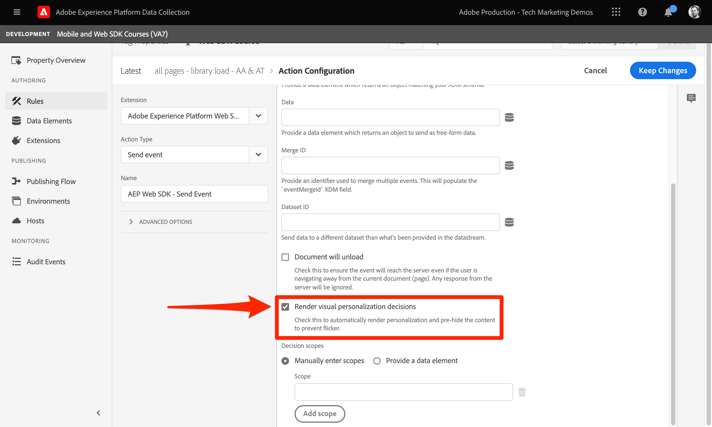

# Konfigurera Adobe Target med Platform Web SDK

Lär dig implementera Adobe Target med Adobe Experience Platform Web SDK. Lär dig hur du levererar upplevelser och hur du skickar ytterligare parametrar till Target.

[Adobe Target](https://experienceleague.adobe.com/en/docs/target/using/target-home) är den Adobe Experience Cloud-applikation som innehåller allt ni behöver för att skräddarsy och personalisera kundupplevelsen, så att ni kan maximera intäkterna på era webbplatser, mobilsajter, appar och andra digitala kanaler.


## Utbildningsmål

I slutet av lektionen kan du göra följande med en Web SDK-implementering av Target:

* Lägg till det fragment som döljs för att förhindra flimmer
* Konfigurera ett datastream för att aktivera Target-funktioner
* Visa dispositionsaktiviteter för visuell upplevelse
* Återge formulärdispositionsaktiviteter
* Skicka XDM-data till Target och förstå mappningen till Target-parametrar
* Skicka anpassade data till Target, t.ex. profil- och enhetsparametrar
* Validera en målinriktad implementering
* Separera personaliseringsbegäranden från analysförfrågningar

>[!TIP]
>
>Se vår [Migrera mål från at.js 2.x till Platform Web SDK](/help/tutorial-migrate-target-websdk/introduction.md) självstudiekurs om hur du steg för steg migrerar din befintliga at.js-implementering.


## Förutsättningar

För att slutföra lektionerna i det här avsnittet måste du först:

* Slutför alla lektioner för den inledande konfigurationen av Platform Web SDK, inklusive inställning av dataelement och regler.
* Kontrollera att du har en [Redigeraren eller godkännarrollen](https://experienceleague.adobe.com/en/docs/target/using/administer/manage-users/enterprise/properties-overview#section_8C425E43E5DD4111BBFC734A2B7ABC80) i Adobe Target.
* Installera [Hjälptillägg för Visual Experience Composer](https://experienceleague.adobe.com/en/docs/target/using/experiences/vec/troubleshoot-composer/vec-helper-browser-extension) om du använder webbläsaren Google Chrome.
* Lär dig hur du ställer in aktiviteter i Target. Om du behöver en uppdaterare kan du använda följande självstudiekurser och guider för den här lektionen:
   * [Använda hjälptillägget för Visual Experience Composer (VEC)](https://experienceleague.adobe.com/en/docs/target/using/experiences/vec/troubleshoot-composer/vec-helper-browser-extension)
   * [Använda Visual Experience Composer](https://experienceleague.adobe.com/en/docs/target-learn/tutorials/experiences/use-the-visual-experience-composer)
   * [Använda den formulärbaserade Experience Composer](https://experienceleague.adobe.com/en/docs/target-learn/tutorials/experiences/use-the-form-based-experience-composer)
   * [Skapa aktiviteter för målinriktning på upplevelser](https://experienceleague.adobe.com/en/docs/target-learn/tutorials/activities/create-experience-targeting-activities)

## Lägg till flimmerhantering

Innan du startar avgör du om en extra flimmerhanteringslösning krävs beroende på hur taggbiblioteket läses in.

>[!NOTE]
>
>I den här självstudiekursen används [Lumas webbplats](https://luma.enablementadobe.com/content/luma/us/en.html){target=_blank}, som har en asynkron implementering av taggar och flimmerreducering. I det här avsnittet finns information om hur flimmerfunktionen fungerar med SDK för plattforms-webben.


### Asynkron implementering

När ett taggbibliotek läses in asynkront kan det hända att sidan sluts återgivningen innan Target har ersatt standardinnehållet med anpassat innehåll. Det här beteendet kan leda till det som kallas&quot;flimmer&quot;, där standardinnehållet visas kort innan det ersätts av det anpassade innehållet. Om du vill undvika denna flimmer rekommenderar Adobe att du lägger till ett särskilt fragment som döljs innan den asynkrona taggen bäddar in.

Det här fragmentet finns redan på Luma-webbplatsen, men vi ska titta närmare på vad koden gör:

```html
<script>
  !function(e,a,n,t){var i=e.head;if(i){
  if (a) return;
  var o=e.createElement("style");
  o.id="alloy-prehiding",o.innerText=n,i.appendChild(o),setTimeout(function(){o.parentNode&&o.parentNode.removeChild(o)},t)}}
  (document, document.location.href.indexOf("adobe_authoring_enabled") !== -1, ".personalization-container { opacity: 0 !important }", 3000);
</script>
```

Det fragment som döljs före skapar en formattagg i sidhuvudet med den CSS-definition som du väljer. Den här stiltaggen tas bort när ett svar från Target tas emot eller när tidsgränsen nås.

Beteendet före döljning styrs av två konfigurationer i slutet av fragmentet.

* `body { opacity: 0 !important }` Anger den CSS-definition som ska användas för fördöljning tills Target läses in. Som standard är hela sidan dold. Du kan uppdatera den här definitionen till de väljare som du vill dölja i förväg tillsammans med hur du vill dölja dem. Du kan inkludera flera definitioner eftersom det här värdet är det som infogas i den formattaggen som döljs. Om du har ett enkelt identifierbart behållarelement som omsluter innehållet under navigeringen, kan du använda den här inställningen för att begränsa det fördolda till behållarelementet.
* `3000` anger tidsgränsen i millisekunder för fördöljning. Om inget svar från Target tas emot före timeout, tas den formattagg som döljs bort. Det bör vara sällsynt att denna tidsgräns uppnås.

>[!NOTE]
>
>Det förhandsdolda fragmentet för Platform Web SDK skiljer sig något från det som används med Target at.js-biblioteket. Var noga med att använda rätt fragment för Platform Web SDK eftersom den använder ett annat format-ID för `alloy-prehiding`. Om det inledande dolda fragmentet för at.js används kanske det inte fungerar som det ska.

Det fragment som döljs är också tillgängligt i taggar:

1. Gå till **[!UICONTROL Extensions]** taggavsnitt
1. Välj **[!UICONTROL Configure]** för Adobe Experience Platform Web SDK-tillägget
1. Välj **[!UICONTROL Copy pre-hiding snippet to clipboard]** knapp

   

   >[!NOTE]
   >
   >Det fördolda standardfragmentet som kopieras från plattformens SDK-tillägg kan innehålla en CSS-definition som inte finns på platsen, till exempel `.personalization-container { opacity: 0 !important }`. Kontrollera och ändra det fördolda fragmentet på rätt sätt för platsen.

### Synkron implementering

Adobe rekommenderar att du implementerar taggar asynkront enligt anvisningarna på Luma-webbplatsen. Men om taggbiblioteket läses in synkront behöver inte det föregående dolda fragmentet användas. I stället anges det fördolda formatet i SDK-tilläggsinställningarna för plattformen.

Stilen för att dölja i förväg för synkrona implementeringar kan konfigureras på följande sätt:

1. Gå till **[!UICONTROL Extensions]** taggavsnitt
1. Välj **[!UICONTROL Configure]** knapp för Platform Web SDK-tillägget
1. Välj **[!UICONTROL Edit pre-hiding style]** knapp

   

1. Ändra CSS så att de väljare och metoder som du vill använda inkluderas, till exempel: `body { opacity: 0 !important }` om du vill dölja hela sidans innehåll i förväg.
1. Spara ändringarna och bygg i ett bibliotek

>[!NOTE]
>
>Stilinställningen som döljs i förväg är bara avsedd att användas för synkrona implementeringar. Det här formatet ska vara tomt eller kommenteras ut om du använder en asynkron implementering av taggar.

Om du vill veta mer om hur Platform Web SDK kan hantera flimmer kan du läsa hjälpavsnittet: [hantera flimmer för personaliserade upplevelser](https://experienceleague.adobe.com/en/docs/experience-platform/edge/personalization/manage-flicker).


## Konfigurera datastream

Målet måste vara aktiverat i datastream-konfigurationen innan målaktiviteter kan levereras av Platform Web SDK.

Så här konfigurerar du Target i datastream:

1. Gå till [Datainsamling](https://experience.adobe.com/#/data-collection){target="blank"} gränssnitt
1. Välj **[!UICONTROL Datastreams]**
1. Markera tidigare skapade `Luma Web SDK: Development Environment` datastream

   

1. Välj **[!UICONTROL Add Service]**
   
1. Välj **[!UICONTROL Adobe Target]** som **[!UICONTROL Service]**
1. Om du vill kan du ange valfri information om målimplementeringen enligt anvisningarna nedan.
1. Välj **[!UICONTROL Save]**

   

### Egenskapstoken

Målgrupper för Premium-kunder kan hantera användarbehörigheter med egenskaper. Med målegenskaper kan du skapa gränser runt var användare kan köra Target-aktiviteter. Se [Enterprise permissions](https://experienceleague.adobe.com/en/docs/target/using/administer/manage-users/enterprise/properties-overview) i Target-dokumentationen för mer information.

Om du vill konfigurera eller söka efter egenskapstoken går du till **Adobe Target** > **[!UICONTROL Administration]** > **[!UICONTROL Properties]**. The `</>` -ikonen visar implementeringskoden. The `at_property` värde är den egenskapstoken som du skulle använda i din datastream.


<a id="advanced-pto"></a>

Endast en egenskapstoken kan anges per datastream, men med åsidosättningar av egenskapstoken kan du ange alternativa egenskapstoken som ersätter den primära egenskapstoken som definierats i datastream. En uppdatering av `sendEvent` åtgärd krävs också för att åsidosätta datastream.


### Målmiljö-ID

[Miljö](https://experienceleague.adobe.com/en/docs/target/using/administer/environments) i Target hjälper er att hantera implementeringen i alla utvecklingsfaser. Den här valfria inställningen anger vilken målmiljö du ska använda för varje datastream.

Adobe rekommenderar att du ställer in målmiljö-ID på olika sätt för alla dina dataströmmar för utveckling, staging och produktion för att göra det enkelt. Du kan också ordna dina miljöer i Target-gränssnittet med hjälp av [värdar](https://experienceleague.adobe.com/en/docs/target/using/administer/hosts) -funktion.

Navigera till för att konfigurera eller hitta miljö-ID:n **Adobe Target** > **[!UICONTROL Administration]** > **[!UICONTROL Environments]**.


>[!NOTE]
>
>Om inget målmiljö-ID har angetts antas produktionsmålmiljön.

### Målnamnområde för tredjeparts-ID

Med den här valfria inställningen kan du ange vilken identitetssymbol som ska användas för mål-ID:t för tredje part. Target stöder bara profilsynkronisering för en enskild identitetssymbol eller ett namnutrymme. Mer information finns i [Synkronisering av realtidsprofiler för mbox3rdPartyId](https://experienceleague.adobe.com/en/docs/target/using/audiences/visitor-profiles/3rd-party-id) i målguiden.

Identitetssymbolerna finns i identitetslistan under **Datainsamling** > **[!UICONTROL Customer]** > **[!UICONTROL Identities]**.


I den här självstudiekursen om du vill använda Luma-webbplatsen använder du identitetssymbolen `lumaCrmId` under lektionen om [Identiteter](configure-identities.md).


## Ge visuella personaliseringsbeslut

De visuella personaliseringsbesluten avser de upplevelser som har skapats i Adobe Target Visual Experience Composer. För det första bör du förstå terminologin som används i Target- och tagggränssnitten:

* **Aktivitet**: En uppsättning upplevelser som riktar sig till en eller flera målgrupper. Ett enkelt A/B-test kan till exempel vara en aktivitet med två upplevelser.
* **Upplevelse**: En uppsättning åtgärder riktade till en eller flera platser, eller beslutsomfattningar.
* **Beslutets omfattning**: En plats där en Target-upplevelse levereras. Beslutsomfattningar motsvarar&quot;mbox&quot; om du är van vid att använda äldre versioner av Target.
* **Beslut om personalisering**: En åtgärd som servern fastställer ska tillämpas. Dessa beslut kan baseras på målgruppskriterier och prioritering av målaktiviteter.
* **Föreslå**: Resultatet av serverns beslut, som levereras i svaret på Platform Web SDK. Om du till exempel byter en banderollbild blir det ett förslag.

### Uppdatera [!UICONTROL Send event] åtgärd

Visuella personaliseringsbeslut från Target levereras av Platform Web SDK, om Target är aktiverat i datastream. Men _de återges inte automatiskt_. Du måste uppdatera [!UICONTROL Send event] åtgärd för att aktivera automatisk återgivning.

1. I [Datainsamling](https://experience.adobe.com/#/data-collection){target="blank"} öppnar du taggegenskapen som du använder för den här självstudiekursen
1. Öppna `all pages - library loaded - send event - 50` regel
1. Välj `Adobe Experience Platform Web SDK - Send event` åtgärd
1. Aktivera **[!UICONTROL Render visual personalization decisions]** med kryssrutan

   

<!--
1. In the **[!UICONTROL Datastream configuration overrides**] the **[!UICONTROL Target Property Token]** can be overridden either as a static value or with a data element. Only property tokens defined in the [**Advanced Property Token Overrides**](#advanced-pto) section in **Datastream Configuration** will return results.
   
   
   -->

1. Spara ändringarna och bygg i biblioteket

Inställningen för beslut om visuell återgivning gör att Platform Web SDK automatiskt tillämpar de ändringar som har angetts med Target Visual Experience Composer eller&quot;global mbox&quot;.

>[!NOTE]
>
>Vanligtvis är [!UICONTROL Render visual personalization decisions] inställningen ska bara aktiveras för en enskild Skicka-händelse per helsidesinläsning. Om flera Send Event-åtgärder har den här inställningen aktiverad, ignoreras efterföljande återgivningsbegäranden.

Om du själv föredrar att återge eller vidta åtgärder för dessa beslut med egen kod kan du lämna [!UICONTROL Render visual personalization decisions] inställningen inaktiverad. Platform Web SDK är flexibelt och ger dig fullständig kontroll. Mer information om [manuellt återge anpassat innehåll](https://experienceleague.adobe.com/en/docs/experience-platform/edge/personalization/rendering-personalization-content).


### Konfigurera en Target-aktivitet med Visual Experience Composer

Nu när den grundläggande implementeringsdelen är klar skapar du en XT-aktivitet (Experience Targeting) i Target för att kontrollera att allt fungerar som det ska. Du kan använda självstudiekursen Mål för [skapa aktiviteter för Experience Targeting](https://experienceleague.adobe.com/en/docs/target-learn/tutorials/activities/create-experience-targeting-activities) om du behöver hjälp.

>[!NOTE]
>
>Om du använder Google Chrome som webbläsare är [Hjälptillägg för Visual Experience Composer (VEC)](https://experienceleague.adobe.com/en/docs/target/using/experiences/vec/troubleshoot-composer/vec-helper-browser-extension) krävs för att läsa in webbplatsen korrekt för redigering i VEC.

1. Navigera till Adobe Target
1. Skapa en XT-aktivitet (Experience Targeting) med hjälp av Luma-startsidan för aktivitets-URL:en

   

1. Ändra till exempel texten på startsidans hjältebanner.  När du är klar väljer du **[!UICONTROL Save]** sedan **[!UICONTROL Next]**.

   

1. Uppdatera händelsenamnet och välj **[!UICONTROL Next]**.

   

1. Välj Adobe Analytics som rapportkälla med rätt rapportsserie och måttet på beställningar som mål.

   

   >[!NOTE]
   >
   >Om du inte använder Adobe Analytics väljer du Target som rapportkälla och väljer ett annat mått, som **Engagemang > Sidvyer** i stället. Det krävs ett målmått för att spara och förhandsgranska aktiviteten.

1. Spara aktiviteten
1. Om du känner dig trygg med dina ändringar kan du aktivera din aktivitet. Om du inte vill förhandsgranska utan att aktivera kan du kopiera [URL för QA-förhandsgranskning](https://experienceleague.adobe.com/en/docs/target/using/activities/activity-qa/activity-qa).
1. Läs in Lumas hemsida så bör du se hur ändringarna tillämpas
1. Efter några timmar bör du kunna se aktivitetsdata och konverteringar för Target i Adobe Analytics. Mer information om målguiden finns i [Analyser för målrapportering (A4T)](https://experienceleague.adobe.com/en/docs/target/using/integrate/a4t/reporting).


### Validera med felsökaren

Om du ställer in en aktivitet bör du se innehållet renderas på sidan. Men även om inga aktiviteter är aktiva kan du kontrollera att Target är korrekt konfigurerat genom att titta på nätverksanropet för Skicka händelse.

>[!CAUTION]
>
>Om du använder Google Chrome och har [Hjälptillägg för Visual Experience Composer (VEC)](https://experienceleague.adobe.com/en/docs/target/using/experiences/vec/troubleshoot-composer/vec-helper-browser-extension) installerade kontrollerar du att **Inmata målbibliotek** inställningen är inaktiverad. Om du aktiverar den här inställningen kommer det att resultera i extra Target-begäranden.

1. Öppna webbläsartillägget Adobe Experience Platform Debugger
1. Gå till [Luma demo site](https://luma.enablementadobe.com/content/luma/us/en.html) och använder felsökaren för att [växla taggegenskapen på webbplatsen till din egen utvecklingsegenskap](validate-with-debugger.md#use-the-experience-platform-debugger-to-map-to-your-tags-property)
1. Läs in sidan igen
1. Välj **[!UICONTROL Network]** i felsökningsverktyget
1. Filtrera efter **[!UICONTROL Adobe Experience Platform Web SDK]**
1. Välj värdet i händelseraden för det första anropet

   

1. Observera att det finns nycklar under `query` > `personalization` och  `decisionScopes` har värdet `__view__`. Detta omfång motsvarar `target-global-mbox`. Detta Platform Web SDK-anrop begärde beslut från Target.

   

1. Stäng övertäckningen och välj händelseinformation för det andra nätverksanropet. Det här anropet är bara tillgängligt om Target returnerade en aktivitet.
1. Observera att det finns information om aktiviteten och upplevelsen som returnerats från Target. Detta Platform Web SDK-anrop skickar ett meddelande om att en Target-aktivitet återgavs till användaren och ökar intrycket.

   

## Konfigurera och återge ett anpassat beslutsutrymme

Anpassade beslutsomfattningar (tidigare kallade&quot;mboxes&quot;) kan användas för att leverera HTML- eller JSON-innehåll på ett strukturerat sätt med den Target-formulärbaserade Experience Composer. Innehåll som levereras till något av dessa anpassade omfång återges inte automatiskt av Platform Web SDK. Den kan återges med en åtgärd i Taggar.

### Lägg till ett omfång i [!UICONTROL Send event action]

Ändra sidans inläsningsregel för att lägga till ett anpassat beslutsomfång:

1. Öppna `all pages - library loaded - send event - 50` regel
1. Välj `Adobe Experience Platform Web SDK - Send Event` åtgärd
1. Lägg till ett eller flera omfång som du vill använda. Använd följande exempel: `homepage-hero`.

   

1. Spara ändringarna och bygg i biblioteket

>[!TIP]
>
>I den här självstudiekursen använder du ett enda manuellt definierat omfång för demonstrationssyften. Om du bestämmer dig för att använda flera beslutsomfattningar som är avsedda för specifika sidor, bör du överväga att använda ett dataelement som returnerar en array med omfång beroende på sidans sökväg. Med den här metoden är det enkelt och skalbart att implementera.

### Bearbeta svaret från Target

Nu när du har konfigurerat Platform Web SDK för att begära innehåll för `homepage-hero` måste du göra något med svaret. Taggtillägget Platform Web SDK ger en [!UICONTROL Send Event Complete] -händelse, som kan användas för att omedelbart aktivera en ny regel när ett svar från en [!UICONTROL Send Event] åtgärden har tagits emot.

1. Skapa en anropad regel `homepage - send event complete - render homepage-hero`.
1. Lägg till en händelse i regeln. Använd **Adobe Experience Platform Web SDK** tillägg och **[!UICONTROL Send event complete]** händelsetyp.
1. Lägg till ett villkor för att begränsa regeln till Luma-startsidan (sökvägen utan frågesträng är lika med) `/content/luma/us/en.html`).
1. Lägg till en åtgärd i regeln. Använd **Adobe Experience Platform Web SDK** tillägg och **Använd förslag** åtgärdstyp.

   

   >[!TIP]
   >
   >Ge regelhändelser, villkor och funktionsmakron beskrivande namn i stället för att använda standardnamn. Robusta namn på regelkomponenter gör sökresultatet mycket mer användbart.

1. Retur `%event.propositions%` i fältet Föreslå när vi använder händelsen&quot;Skicka händelse klar&quot; som utlösare för den här regeln.
1. I avsnittet &quot;Föreslå metadata&quot; väljer du **[!UICONTROL Use a form]**
1. För **[!UICONTROL Scope]** fältinmatning `homepage-hero`
1. För **[!UICONTROL Selector]** fältinmatning `div.heroimage`
1. För **[!UICONTROL Action Type]** välj **[!UICONTROL Set HTML]**

   

1. Spara ändringarna och bygg i biblioteket
1. Läs in Lumas hemsida några gånger, vilket bör räcka för att skapa den nya `homepage-hero` register för beslutsomfattning i Target-gränssnittet.

### Konfigurera en Target-aktivitet med den formulärbaserade Experience Composer

Nu när du har en regel för att manuellt återge ett anpassat beslutsområde kan du skapa en annan XT-aktivitet (Experience Targeting) i Target. Den här gången använder du den formulärbaserade Experience Composer.

1. Öppna [Adobe Target](https://experience.adobe.com/target)
1. Inaktivera aktiviteten som användes för föregående lektion
1. Skapa en XT-aktivitet (Experience Targeting) med alternativet Formulärbaserad Experience Composer

   

1. Välj **`homepage-hero`** plats i listrutan och **[!UICONTROL Create HTML Offer]** i listrutan Innehåll. Om platsen inte är tillgänglig kan du skriva in den. Målet fyller regelbundet i nya platsnamn efter att ha tagit emot begäranden för den platsen eller det omfånget.

   

1. Klistra in följande kod i innehållsrutan. Den här koden är en grundläggande hjältebanner med en annan bakgrundsbild:

   ```html
   <div class="we-HeroImage jumbotron" style="background-image: url('/content/luma/us/en/women/_jcr_content/root/hero_image.coreimg.jpeg');">
      <div class="container cq-dd-image">
         <div class="we-HeroImage-wrapper">
            <p class="h3">New Luma Yoga Collection</p>
            <strong class="we-HeroImage-title h1">Be active with style&nbsp;</strong>
            <p>
               <a class="btn btn-primary btn-action" href="/content/luma/us/en/products.html" role="button">Shop Now</a>
            </p>
         </div>
      </div>
   </div>
   ```

1. På [!UICONTROL Goals & Settings] väljer du Adobe Target som rapportkälla och [!UICONTROL Engagement] > [!UICONTROL Page Views] som mål
1. Spara aktiviteten
1. Om du känner dig trygg med dina ändringar kan du aktivera din aktivitet. Om du inte vill förhandsgranska utan att aktivera kan du kopiera [URL för QA-förhandsgranskning](https://experienceleague.adobe.com/en/docs/target/using/activities/activity-qa/activity-qa).
1. Läs in Lumas hemsida så bör du se hur ändringarna tillämpas

>[!NOTE]
>
>Konverteringsmålet &quot;Click on mbox&quot; fungerar inte automatiskt. Eftersom anpassade omfång inte återges automatiskt i Platform Web SDK spåras inte klickningar till platser som du väljer att tillämpa innehållet. Du kan skapa en egen klickspårning för varje omfång med hjälp av&quot;klicka&quot; `eventType` med tillämplig `_experience` information med `sendEvent` åtgärd.

### Validera med felsökaren

Om du har aktiverat din aktivitet bör du se innehållet återges på sidan. Även om inga aktiviteter finns tillgängliga kan du titta på [!UICONTROL Send Event] nätverksanrop för att bekräfta att Target begär innehåll för dina anpassade omfattningar.

1. Öppna webbläsartillägget Adobe Experience Platform debugger
1. Gå till [Luma demo site](https://luma.enablementadobe.com/content/luma/us/en.html) och använder felsökaren för att [växla taggegenskapen på webbplatsen till din egen utvecklingsegenskap](validate-with-debugger.md#use-the-experience-platform-debugger-to-map-to-your-tags-property)
1. Läs in sidan igen
1. Välj **[!UICONTROL Network]** i felsökningsverktyget
1. Filtrera efter **[!UICONTROL Adobe Experience Platform Web SDK]**
1. Välj värdet i händelseraden för det första anropet

   

1. Observera att det finns nycklar under `query` > `personalization` och  `decisionScopes` har värdet `__view__` som förut, men nu finns det också en `homepage-hero` omfång ingår. Detta Platform Web SDK-anrop begärde beslut från Target för ändringar som gjorts med VEC och den specifika `homepage-hero` plats.

   

1. Stäng övertäckningen och välj händelseinformation för det andra nätverksanropet. Det här anropet är bara tillgängligt om Target returnerade en aktivitet.
1. Observera att det finns information om aktiviteten och upplevelsen som returnerats från Target. Detta Platform Web SDK-anrop skickar ett meddelande om att en Target-aktivitet återgavs till användaren och ökar intrycket.

   

## Skicka parametrar till mål

I det här avsnittet skickar du Target-specifika data och tar en närmare titt på hur XDM-data mappas till Target-parametrar.

### Sidparametrar (mbox) och XDM

Alla XDM-fält skickas automatiskt till Target som [sidparametrar](https://experienceleague.adobe.com/en/docs/target-dev/developer/implementation/methods/page-parameters) eller mbox-parametrar.

Vissa av dessa XDM-fält mappas till specialobjekt i Target serverdel. Till exempel: `web.webPageDetails.URL` kommer automatiskt att vara tillgängligt för att skapa URL-baserade villkor för målinriktning eller som `page.url` när du skapar profilskript.

### Särskilda parametrar och dataobjektet

Det finns vissa datapunkter som kan vara användbara för Target som inte har mappats från XDM-objektet. Dessa speciella Target-parametrar inkluderar:

* [Profilattribut](https://experienceleague.adobe.com/en/docs/target-dev/developer/implementation/methods/in-page-profile-attributes)
* [Recommendations entitetsattribut](https://experienceleague.adobe.com/en/docs/target/using/recommendations/entities/entity-attributes)
* [Recommendations reserverade parametrar](https://experienceleague.adobe.com/en/docs/target/using/recommendations/plan-implement#pass-behavioral)
* Kategorivärden för [kategoritillhörighet](https://experienceleague.adobe.com/en/docs/target/using/audiences/visitor-profiles/category-affinity)

Dessa parametrar måste skickas i `data` i stället för i `xdm` -objekt. Dessutom kan sidparametrar (eller mbox-parametrar) också inkluderas i `data` -objekt.

Om du vill fylla i dataobjektet skapar du följande dataelement och återanvänder dataelement som skapats i [Skapa dataelement](create-data-elements.md) lektion:

* **`data.content`** med följande anpassade kod:

  ```javascript
  var data = {
     __adobe: {
        target: {
           "entity.id": _satellite.getVar("product.productInfo.sku"),
           "entity.name": _satellite.getVar("product.productInfo.title"),
           "profile.loggedIn": _satellite.getVar("user.profile.attributes.loggedIn"),
           "user.categoryId": _satellite.getVar("product.category")
        }
     }
  }
  return data;
  ```


### Uppdatera sidans inläsningsregel

Om ytterligare data för Target skickas utanför XDM-objektet måste tillämpliga regler uppdateras. I det här exemplet är den enda ändringen du måste göra att inkludera den nya **data.content** dataelement till den allmänna sidinläsningsregeln och visningsregeln för produktsidor.

1. Öppna `all pages - library loaded - send event - 50` regel
1. Välj `Adobe Experience Platform Web SDK - Send event` åtgärd
1. Lägg till `data.content` dataelement till datafältet

   

1. Spara ändringarna och bygg i biblioteket
1. Upprepa steg 1 till 4 för **ecommerce - bibliotek inläst - ange produktinformationsvariabler - 20** regel

>[!NOTE]
>
>I exemplet ovan används en `data` objekt som inte är fullständigt ifyllt på alla sidtyper. Taggar hanterar den här situationen korrekt och utesluter tangenter som har ett odefinierat värde. Till exempel: `entity.id` och `entity.name` kommer inte att skickas på några sidor utöver produktinformationen.


## Dela upp personaliserings- och analysförfrågningar

Datalagret på Luma-webbplatsen definieras fullständigt innan taggarna bäddar in kod. Detta gör att vi kan använda ett enda anrop för att både hämta personaliserat innehåll (t.ex. från Adobe Target) och skicka analysdata (t.ex. till Adobe Analytics).

På många webbplatser kan datalagret dock inte läsas in tillräckligt tidigt eller tillräckligt snabbt för att använda ett enda anrop för båda programmen. I dessa situationer kan du använda två [!UICONTROL Send event] åtgärder på en enda sida laddas och används den första för personalisering och den andra för analys. Genom att dela upp händelserna på det här sättet kan personaliseringshändelsen utlösas så tidigt som möjligt, samtidigt som datalagret läses in helt innan Analytics-händelsen skickas. Detta liknar många SDK-implementeringar som gjorts före webben, där Adobe Target skulle starta `target-global-mbox` överst på sidan så avfyrar Adobe Analytics `s.t()` ring längst ned på sidan

Så här skapar du en begäran om anpassning överst:

1. Öppna `all pages - library loaded - send event - 50` regel
1. Öppna **Skicka händelse** åtgärd
1. Välj **[!UICONTROL Use guided events]** och sedan **[!UICONTROL Request personalization]**
1. Det här låser **Typ** as **[!UICONTROL Decisioning Proposition Fetch]**

   

Så här skapar du en begäran som baseras på analys:

1. Skapa en ny regel som anropas `all pages - page bottom - send event - 50`
1. Lägg till en händelse i regeln. Använd **Core** tillägg och **[!UICONTROL Page Bottom]** händelsetyp
1. Lägg till en åtgärd i regeln. Använd **Adobe Experience Platform Web SDK** tillägg och **Skicka händelse** åtgärdstyp
1. Välj **[!UICONTROL Use guided events]** och sedan **[!UICONTROL Collect analytics]**
1. Det här låser **[!UICONTROL Include pending display notifications]** kryssrutan markerad så att det köade visningsmeddelandet från beslutsbegäran skickas.


>[!TIP]
>
>Om händelsen som du hämtar en beslutsutkast för inte har någon Adobe Analytics-händelse efter den använder du **Guidad händelseläge** **[!UICONTROL Unguided - show all fields]**. Du måste välja alla alternativ manuellt, men alternativet låses upp för att **[!UICONTROL automatically send a display notification]** tillsammans med din hämtningsförfrågan.


### Validera med felsökaren

Nu när reglerna har uppdaterats kan du validera om data skickas korrekt med Adobe Debugger.

1. Navigera till [Luma demo site](https://luma.enablementadobe.com/content/luma/us/en.html) och logga in med e-post `test@adobe.com` och lösenord `test`
1. Navigera till en produktinformationssida
1. Öppna webbläsartillägget Adobe Experience Platform debugger och [ändra taggegenskapen till din egen utvecklingsegenskap](validate-with-debugger.md#use-the-experience-platform-debugger-to-map-to-your-tags-property)
1. Läs in sidan igen
1. Välj **Nätverk** i Felsökning och filtrera efter **Adobe Experience Platform Web SDK**
1. Välj värdet i händelseraden för det första anropet
1. Observera att det finns nycklar under `data` > `__adobe` > `target` och de fylls i med information om produkt, kategori och inloggningsstatus.

   

### Validera i målgränssnittet

Titta sedan i Target-gränssnittet för att bekräfta att data har tagits emot och är tillgängliga för användning i målgrupper och aktiviteter. XDM-data mappas automatiskt till anpassade Target-parametrar. Du kan validera att XDM-data har tagits emot av Target och är tillgängliga genom att skapa en målgrupp.

1. Öppna [Adobe Target](https://experience.adobe.com/target)
1. Navigera till **[!UICONTROL Audiences]** section
1. Skapa en målgrupp och välj **[!UICONTROL Custom]** attributtyp
1. Sök i **[!UICONTROL Parameter]** fält för `web`. Listrutan ska innehålla alla XDM-fält som hör till webbsidans information.

   

Verifiera sedan att attributet för inloggningstillståndsprofilen har skickats.

1. Välj **[!UICONTROL Visitor Profile]** attributtyp
2. Sök efter `loggedIn`. Om attributet är tillgängligt i listrutan skickades attributet korrekt till Target. Det kan ta flera minuter innan nya attribut blir tillgängliga i målgränssnittet.

   

Om du har Target Premium kan du även validera att entitetsdata skickades korrekt och att produktdata skrevs till Recommendations produktkatalog.

1. Navigera till **[!UICONTROL Recommendations]** section
1. Välj **[!UICONTROL Catalog Search]** i navigeringen till vänster
1. Sök efter den produkt-SKU eller det produktnamn du besökt tidigare på Luma-webbplatsen. Produkten ska visas i produktkatalogen. Nya produkter kan ta flera minuter att söka i Recommendations produktkatalog.

   

### Validera med Assurance

Dessutom kan du använda Assurance där det är lämpligt för att bekräfta att målbeslutsbegäranden hämtar rätt data och att eventuella serveromvandlingar sker korrekt. Du kan också bekräfta att kampanj- och upplevelseinformation finns i Adobe Analytics-anropen även när Target-beslutet och Adobe Analytics-anrop skickas separat.

1. Öppna [Säkerhet](https://experience.adobe.com/assurance)
1. Starta en ny session, ange **[!UICONTROL session name]** och matar in **[!UICONTROL base url]** för din webbplats eller någon annan sida som du testar
1. Klicka **[!UICONTROL Next]**

   

1. Välj anslutningsmetod, i det här fallet använder vi **[!UICONTROL copy link]**
1. Kopiera länken och klistra in den på en ny flik i webbläsaren
1. Klicka **[!UICONTROL Done]**

   

1. När din Assurance-session startas visas händelser som fylls i på fliken Händelser
1. Filtrera efter &quot;ton&quot;
1. Markera det senaste samtalet och expandera meddelandena för att se till att de fylls i korrekt och notera värdena för&quot;data&quot;

   

1. Behåll sedan datafiltret och välj händelsen analytics.mapping som inträffar efter den målhändelse som vi just visade.
1. Undersök&quot;context.mappedQueryParams.\&lt;yourschemaname>&quot; för att bekräfta det innehåller ett &quot;tta&quot;-attribut med en sammanfogad sträng som matchar de &quot;tta&quot;-värden som påträffades i föregående målhändelse.

   

Detta bekräftar att A4T-informationen som ställdes i kö för senare överföring när vi gjorde målbeslutsanropet skickades korrekt när analysspårningsanropet utlöstes senare på sidan.

Nu när du är klar med den här lektionen bör du ha en fungerande implementering av Adobe Target med Platform Web SDK.

[Nästa: ](setup-web-channel.md)

>[!NOTE]
>
>Tack för att du lade ned din tid på att lära dig om Adobe Experience Platform Web SDK. Om du har frågor, vill dela allmän feedback eller har förslag på framtida innehåll kan du dela med dig av dem om detta [Experience League diskussionsinlägg](https://experienceleaguecommunities.adobe.com/t5/adobe-experience-platform-data/tutorial-discussion-implement-adobe-experience-cloud-with-web/td-p/444996)
