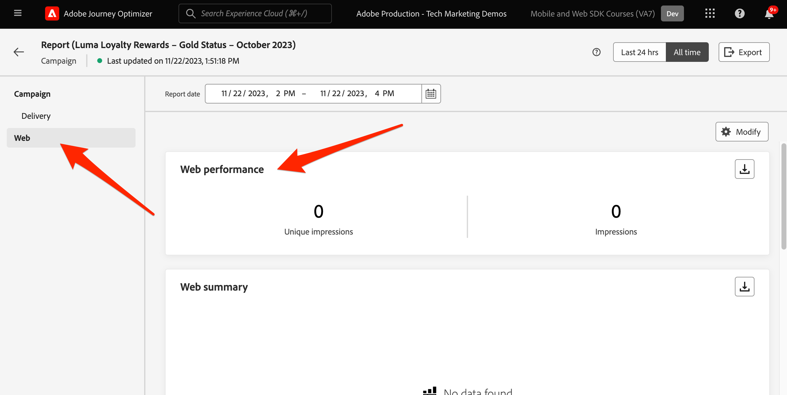

# Konfigurera Journey Optimizer webbkanal med Web SDK

Lär dig hur du implementerar Adobe Journey Optimizer [webbkanal](https://experienceleague.adobe.com/sv/docs/journey-optimizer/using/web/get-started-web) med Adobe Experience Platform Web SDK. Den här lektionen handlar om grundläggande krav för webbkanaler, detaljerade konfigurationssteg och en djupdykning i ett användningsexempel som fokuserar på lojalitetsstatus.

När du följer den här lektionen är Journey Optimizer-användare utrustade att använda webbkanalen för avancerad onlineanpassning med Journey Optimizer webbdesigner.

## Utbildningsmål

När lektionen är slut kan du:

* Förstå SDK funktion och betydelse när det gäller att leverera webbkanalsupplevelsen.
* Förstå processen med att skapa en webbkanalskampanj från början till slut med exempelexemplet Luma Loyalty Rewards.
* Konfigurera kampanjegenskaper, åtgärder och scheman i gränssnittet.
* Förstå funktionaliteten och fördelarna med tillägget Adobe Experience Cloud Visual Editing Helper.
* Lär dig redigera webbsidesinnehåll, inklusive bilder, sidhuvuden och andra element, med webbdesignern.
* Lär dig hur du infogar erbjudanden på en webbsida med beslutsdelen för erbjudandet.
* Bekanta dig med bästa praxis för att säkerställa kvaliteten och framgången för en webbkanalskampanj.

## Förhandskrav

För att slutföra lektionerna i det här avsnittet måste du först:

* Slutför alla lektioner för den första konfigurationen av Platform Web SDK, inklusive inställning av dataelement och regler.
* Kontrollera att Adobe Experience Platform Web SDK-taggtilläggen är version 2.16 eller senare.
* Om du använder Journey Optimizer webbdesigner för att skapa din webbkanal måste du kontrollera att du använder webbläsarna Google Chrome eller Microsoft® Edge.
* Kontrollera också att du har hämtat och aktiverat webbläsartillägget [Adobe Experience Cloud Visual Editing Helper](https://chromewebstore.google.com/detail/adobe-experience-cloud-vi/kgmjjkfjacffaebgpkpcllakjifppnca).
* Kontrollera att cookies från tredje part tillåts i webbläsaren. Det kan vara nödvändigt att inaktivera alla annonsblockerare i webbläsaren.

  >[!CAUTION]
  >
  > I Journey Optimizer webbdesigner är det inte säkert att vissa webbplatser öppnas på grund av någon av följande orsaker:
  > 
  > 1. Webbplatsen har strikta säkerhetsregler.
  > 1. Webbplatsen är inbäddad i en iframe.
  > 1. Kundens QA- eller stage-sajt är inte externt tillgänglig (det är en intern sajt).

* När du skapar webbupplevelser och inkluderar innehåll från Adobe Experience Manager Assets Essentials-biblioteket måste du [konfigurera underdomänen för publicering av det här innehållet](https://experienceleague.adobe.com/sv/docs/journey-optimizer/using/web/configure-web-channel/web-delegated-subdomains).
* Om du använder funktionen för innehållsexperimenterande ska du se till att din webbdatauppsättning också ingår i rapportkonfigurationen.
* För närvarande finns det två typer av implementeringar som gör det möjligt att skapa och leverera webbkanalskampanjer på dina webbegenskaper:
   * Endast på klientsidan: Om du vill ändra webbplatsen måste du implementera Adobe Experience Platform Web SDK.
   * Hybridläge: Du kan använda Platform Edge Network Server-API:t för att begära anpassning på serversidan. Svaret från API:t skickas sedan till Adobe Experience Platform Web SDK för återgivningsändringar på klientsidan. Mer information finns i Adobe Experience Platform Edge Network Server API-dokumentationen. Ytterligare information och implementeringsexempel för hybridläget finns i det här blogginlägget.

  >[!NOTE]
  >
  >Implementering på serversidan stöds för närvarande inte.

## Terminologi

Först och främst bör ni förstå den terminologi som används i webbkanalskampanjer.

* **Webbkanal**: Ett medium för kommunikation eller leverans av innehåll via webben. I den här guiden hänvisar den till den mekanism genom vilken personaliserat innehåll levereras till webbplatsbesökare som använder Platform Web SDK i Adobe Journey Optimizer.
* **Webbyta**: Avser en webbegenskap som identifieras av en URL där innehållet levereras. Det kan omfatta en eller flera webbsidor.
* **Journey Optimizer webbdesigner**: Ett specifikt verktyg eller gränssnitt i Journey Optimizer där användare kan designa sina webbkanalsupplevelser.
* **Hjälp för visuell redigering i Adobe Experience Cloud**: Ett webbläsartillägg som kan användas för visuell redigering och design av webbkanalsupplevelser.
* **Datastream**: En konfiguration i Adobe Experience Platform-tjänsten som säkerställer att det går att leverera webbkanalsupplevelser.
* **Sammanslagningsprincip**: En konfiguration som säkerställer korrekt aktivering och publicering av inkommande kampanjer.
* **Målgrupp**: Ett specifikt segment med användare eller webbplatsbesökare som uppfyller vissa villkor.
* **Webbdesigner**: Ett gränssnitt eller verktyg som hjälper dig att redigera och utforma webbupplevelser visuellt utan att ge djupdykning i koden.
* **Uttrycksredigeraren**: Ett verktyg i webbdesignern som gör att användare kan lägga till personalisering i webbinnehåll, eventuellt baserat på dataattribut eller andra villkor.
* **Erbjud beslutskomponent**: En komponent i webbdesignern som hjälper dig att avgöra vilket erbjudande som passar bäst för en specifik besökare baserat på beslutshantering.
* **Innehållsexperiment**: En metod för att testa olika innehållsvariationer för att ta reda på vilken som fungerar bäst när det gäller det önskade måttet, till exempel inkommande klick.
* **Behandling**: I samband med innehållsexperiment refererar en behandling till en specifik variation av innehåll som testas mot en annan.
* **Simulering**: En förhandsvisningsmekanism som visualiserar webbkanalsupplevelsen innan den aktiveras för aktiva målgrupper.

## Konfigurera datastream

Du har redan lagt till Adobe Experience Platform-tjänsten i din datastream. Nu måste ni aktivera alternativet Adobe Journey Optimizer så att ni kan leverera webbkanalsupplevelser.

Så här konfigurerar du Adobe Journey Optimizer i datastream:

1. Gå till gränssnittet [Datainsamling](https://experience.adobe.com/#/data-collection){target="blank"}.
1. Välj **[!UICONTROL Datastreams]** i den vänstra navigeringen.
1. Markera tidigare skapade data för Luma Web SDK.

   

1. Välj **[!UICONTROL Edit]** i Adobe Experience Platform-tjänsten.

   

1. Markera rutan **[!UICONTROL Adobe Journey Optimizer]**.

   

1. Välj **[!UICONTROL Save]**.

Detta säkerställer att inkommande händelser för Journey Optimizer hanteras korrekt av Adobe Experience Platform Edge Network.

## Konfigurera sammanfogningsprincipen

Kontrollera att en sammanfogningsprincip har definierats med alternativet **[!UICONTROL Active-On-Edge Merge Policy]** aktiverat. Det här alternativet används av Journey Optimizer inkommande kanaler för att säkerställa korrekt aktivering och publicering av inkommande kampanjer.

Så här konfigurerar du alternativet i sammanfogningsprincipen:

1. Gå till sidan **[!UICONTROL Customer]** > **[!UICONTROL Profiles]** i Experience Platform- eller Journey Optimizer-gränssnittet.
1. Klicka på fliken **[!UICONTROL Merge Policies]**.  
1. Välj din profil (det är oftast bäst att använda principen [!UICONTROL Default Timebased]) och växla alternativet **[!UICONTROL Active-On-Edge Merge Policy]** i steget **[!UICONTROL Configure]**.

   

## Konfigurera webbdatauppsättningen för innehållsexperiment

Om du vill använda innehållsexperiment i webbkanalskampanjer måste du se till att den webbdatauppsättning som används också ingår i rapportkonfigurationen. Journey Optimizer rapporteringssystem använder datauppsättningen i skrivskyddat läge för att fylla i användningsklara innehållsexperimenteringsrapporter.

[Att lägga till datauppsättningar för rapportering av innehållsexperiment beskrivs i det här avsnittet](https://experienceleague.adobe.com/sv/docs/journey-optimizer/using/reporting/channel-report/reporting-configuration#add-datasets).

## Use Case Overview - Loyalty Rewards

I den här lektionen används exemplet Loyalty Rewards till att beskriva implementeringen av en webbkanalsupplevelse med hjälp av Web SDK.

Med detta exempel får ni en bättre förståelse för hur Journey Optimizer kan hjälpa er att leverera de bästa inkommande upplevelserna till era kunder med hjälp av Journey Optimizer kampanjer och webbdesignern.

Eftersom den här självstudiekursen riktar sig till implementerare är det värt att notera att den här lektionen handlar om omfattande gränssnittsarbete i Journey Optimizer. Sådana gränssnittsuppgifter hanteras vanligtvis av marknadsförare, men det kan vara bra för implementerare att få insikt i processen, även om de vanligtvis inte ansvarar för att skapa webbkanalskampanjer.

### Skapa lojalitetskampanj

Nu när du har inhämtat våra exempeldata om lojalitet och skapat vårt segment kan du skapa webbkampanjen Loyalty Rewards i Adobe Journey Optimizer.

Så här skapar du exempelkampanjen:

1. Öppna [Journey Optimizer](https://experience.adobe.com/journey-optimizer/home){target="_blank"}-gränssnittet

   >[!NOTE]
   >
   > Schema, datauppsättningar och målgrupper kan också byggas i Journey Optimizer gränssnitt eftersom de alla är vanliga Experience Platform-konstruktioner.

1. Navigera till **[!UICONTROL Journey Management]** > **[!UICONTROL Campaigns]** i den vänstra navigeringen
1. Klicka på **[!UICONTROL Create campaign]** uppe till höger.
1. I avsnittet **[!UICONTROL Properties]** anger du hur du vill köra kampanjen. Välj **Schemalagd** för användningsfallet för Loyalty Rewards.

   

1. Välj **[!UICONTROL Actions]** i avsnittet **[!UICONTROL Web channel]**. Som **[!UICONTROL Web surface]** väljer du **[!UICONTROL Page URL]**.

   >[!NOTE]
   >
   >En webbyta refererar till en webbegenskap som identifieras av en URL där innehållet levereras. Den kan motsvara en enda sidas URL eller innehålla flera sidor, vilket gör att du kan använda ändringarna på en eller flera webbsidor.

1. Välj webbytsalternativet **[!UICONTROL Page URL]** om du vill distribuera upplevelsen på en sida för kampanjen. Ange Luma-sidans URL, `https://luma.enablementadobe.com/content/luma/us/en.html`

1. När webbytan har definierats väljer du **[!UICONTROL Create]**.

   

1. Nu kan du lägga till ytterligare information i den nya webbkanalskampanjen. Ge först namnet på kampanjen. Ring det `Luma Loyalty Rewards – Gold Status`. Du kan också lägga till en beskrivning till kampanjen. Lägg även till **[!UICONTROL Tags]** för att förbättra den övergripande kampanjtaxonomin.

   

1. Som standard är kampanjen aktiv för alla webbplatsbesökare. I det här fallet bör endast guldstatuspoängare se upplevelsen. Aktivera detta genom att klicka på **[!UICONTROL Select audience]** och välja målgruppen `Luma Loyalty Rewards – Gold Status`.

1. I fältet **[!UICONTROL Identity namespace]** väljer du namnutrymmet för att identifiera individer inom det valda segmentet. Eftersom du distribuerar kampanjen på Luma-webbplatsen kan du välja ECID-namnutrymmet. Profiler inom målgruppen `Luma Loyalty Rewards – Gold Status` som saknar ECID-namnutrymmet bland sina olika identiteter omfattas inte av webbkanalskampanjen.

   

1. Schemalägg kampanjen så att den börjar på dagens datum med alternativet **[!UICONTROL Campaign start]** och avslutas om en vecka med alternativet **[!UICONTROL Campaign end]**.

   

>[!NOTE]
>
>Tänk på att webbupplevelsen visas när besökaren öppnar sidan för webbkanalskampanjer. Till skillnad från andra typer av kampanjer i Adobe Journey Optimizer går det därför inte att konfigurera avsnittet **[!UICONTROL Action triggers]**.

### Experimentera med lojalitetsmaterial

Om du rullar tillbaka uppåt i avsnittet **[!UICONTROL Action]** kan du skapa ett experiment för att testa vilket innehåll som fungerar bäst för målgruppen `Luma Loyalty Rewards – Gold Status`. Låt oss skapa och testa två behandlingar som en del av kampanjkonfigurationen.

Så här skapar du innehållsexperimentet:

1. Klicka på **[!UICONTROL Create experiment]**.

   

1. Välj först **[!UICONTROL Success metric]**. Detta är måttet för att avgöra innehållets effektivitet. Välj **[!UICONTROL Unique Inbound Clicks]** om du vill se vilken innehållsbehandling som genererar fler klick på webbupplevelsen CTA.

   

1. När du konfigurerar ett experiment med webbkanal och väljer måtten **[!UICONTROL Inbound Clicks]**, **[!UICONTROL Unique Inbound Clicks]**, **[!UICONTROL Page Views]** eller **[!UICONTROL Unique Page Views]** kan du med listrutan **[!UICONTROL Click Action]** spåra och övervaka klick och vyer exakt på specifika sidor.

1. Du kan också ange en **[!UICONTROL Holdout]** som inte får någon av de två behandlingarna. Låt det vara omarkerat för tillfället.

1. Du kan också välja att **[!UICONTROL Distribute evenly]**. Markera det här alternativet för att se till att uppdelningarna alltid är jämnt fördelade.

[Läs mer om innehållsexperiment i Adobe Journey Optimizer webbkanal](https://experienceleague.adobe.com/sv/docs/journey-optimizer/using/content-management/content-experiment/get-started-experiment).

### Redigera innehåll med hjälp av den visuella hjälpen

Låt oss nu skapa webbkanalsupplevelsen. Använd Adobe Experience Cloud **[!UICONTROL Visual Helper]** om du vill göra det. Det här verktyget är ett webbläsartillägg som är kompatibelt med Google Chrome och Microsoft® Edge. Kontrollera att du har hämtat tillägget innan du försöker skapa dina upplevelser. Se även till att webbsidan innehåller Web SDK.

1. Klicka på **[!UICONTROL Action]** på fliken **[!UICONTROL Edit content]** i kampanjen. Eftersom du angav en enda sidadress som yta bör du vara redo att börja arbeta i dispositionen.

   

1. Klicka nu på **[!UICONTROL Edit web page]** för att börja skapa.

   

1. Börja med att redigera vissa element med hjälp av webbdispositionen. Använd snabbmenyn för att redigera Luma-hjältebildhuvudet. Justera formatet för den sammanhangsberoende rutan till höger.

   

1. Lägg även till personalisering i behållaren med **[!UICONTROL Expression editor]**.

   

1. Se till att materialet spåras korrekt för klickningar. Välj **[!UICONTROL Click track element]** på snabbmenyn.

   

1. Använd **[!UICONTROL Offer decision component]** för att infoga erbjudanden på webbsidan. Den här komponenten använder **[!UICONTROL Decision Management]** för att välja det bästa erbjudandet för Luma-besökare.

### Ändringar i HTML Design

Det finns några tillgängliga metoder om du vill göra mer avancerade eller anpassade ändringar av webbplatsen som en del av kampanjen Loyalty Rewards.

Använd rutan **[!UICONTROL Components]** för att lägga till HTML eller annat innehåll direkt på Luma-webbplatsen.

Lägg till en ny HTML-komponent högst upp på sidan. Redigera HTML i komponenten från designgränssnittet eller **[!UICONTROL Contextual]**-rutan.

Du kan också lägga till HTML-redigeringar från rutan **[!UICONTROL Modifications]**. I den här rutan kan du markera en komponent på sidan och redigera den i designergränssnittet.

Lägg till HTML för målgruppen `Luma Loyalty Rewards – Gold Status` i redigeraren. Välj **[!UICONTROL Validate]**.

Granska nu den nya anpassade HTML-komponenten så att den passar och känns.

Redigera en specifik komponent med ändringen **[!UICONTROL CSS selector type]**.

Lägg till anpassad kod med ändringen **Sida `<head>` typ** .

Möjligheterna är oändliga med **[!UICONTROL Visual Helper]**.

### Simulera innehåll för Loyalty Rewards

Titta på en förhandsgranskning av den ändrade webbsidan innan du aktiverar kampanjen. Tänk på att du måste ha testprofiler konfigurerade för att simulera webbkanalsupplevelser.

Så här simulerar du upplevelsen:

1. Välj **[!UICONTROL Simulate content]** i kampanjen.

   

1. Välj en testprofil för att ta emot simuleringen. Kom ihåg att testprofilen bör finnas hos `Luma Loyalty Rewards – Gold Status`-målgruppen för att få rätt behandling.

1. Förhandsgranskningen visas för testprofilen.

### Aktivera kampanjen Loyalty Rewards

Aktivera slutligen webbkanalskampanjen.

1. Välj **Granska för att aktivera**.

1. Du uppmanas att bekräfta kampanjinformationen en sista gång. Välj **[!UICONTROL Activate]**.  Det kan ta upp till 15 minuter innan kampanjen publiceras på webbplatsen.

### Lojalitetsprogram - QA

Det finns några inloggningar du kan använda för att simulera &quot;guldstatus&quot;-användare och kvalificera dig för din kampanj:

1. `cleavlandeuler@emailsim.io`/`test`
1. `leftybeagen@emailsim.io`/`test`
1. `jenimartinho@emailsim.io`/`test`

Som en god praxis bör du övervaka fliken **[!UICONTROL Web]** för kampanjens livs- och globala rapporter för kampanjspecifika nyckeltal. För den här kampanjen ska du övervaka upplevelseintrycken och klicka på en frekvens.

### Validering av webbkanaler med Adobe Experience Platform Debugger

Adobe Experience Platform Debugger-tillägget, som finns för både Chrome och Firefox, analyserar dina webbsidor för att identifiera problem i implementeringen av Adobe Experience Cloud lösningar.

Du kan använda felsökaren på Luma-webbplatsen för att validera webbkanalsupplevelsen i produktionen. Detta är en bra metod när Loyalty Rewards-användningsexemplet är öppet och körs för att säkerställa att allt är korrekt konfigurerat.

[Lär dig hur du konfigurerar felsökaren i webbläsaren med hjälp av guiden här](https://experienceleague.adobe.com/sv/docs/platform-learn/data-collection/debugger/overview).

Så här börjar du valideringen med felsökaren:

1. Navigera till webbsidan Luma med webbkanalsupplevelsen.
   <!--
    
    -->
1. Öppna **[!UICONTROL Adobe Experience Platform Debugger]** när du är på webbsidan.
   <!--
    
    -->
1. Navigera till **Sammanfattning**. Kontrollera att **[!UICONTROL Datastream ID]** matchar **[!UICONTROL datastream]** i **[!UICONTROL Adobe Data Collection]** som du har aktiverat Adobe Journey Optimizer för.
   <!--
    
    -->
1. Du kan sedan logga in på webbplatsen med olika Luma-förmånskonton och använda felsökaren för att validera begäranden som skickas till Adobe Experience Platform Edge Network.
   <!--
    
    -->
1. Under **[!UICONTROL Solutions]** navigerar du till **[!UICONTROL Experience Platform Web SDK]**.
   <!--
    
    -->
1. Växla på **på fliken** Konfiguration **[!UICONTROL Enable Debugging]**. Detta aktiverar loggning för sessionen i en **[!UICONTROL Adobe Experience Platform Assurance]**-session.
   <!--
    
    -->
1. Logga in på webbplatsen med olika Luma-förmånskonton och använd felsökaren för att validera begäranden som skickas till **[!UICONTROL Adobe Experience Platform Edge network]**. Alla dessa förfrågningar ska hämtas i **[!UICONTROL Assurance]** för loggspårning.
<!--
   
-->

>[!NOTE]
>
>Tack för att du har lagt ned din tid på att lära dig om Adobe Experience Platform Web SDK. Om du har frågor, vill dela allmän feedback eller har förslag på framtida innehåll kan du dela dem i det här [Experience League diskussionsgruppsinlägget](https://experienceleaguecommunities.adobe.com/t5/adobe-experience-platform-data/tutorial-discussion-implement-adobe-experience-cloud-with-web/td-p/444996?profile.language=sv)
