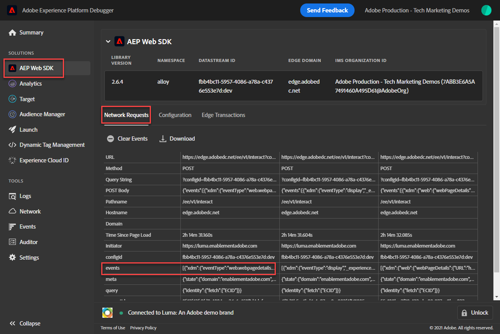

# Validera Web SDK-implementeringar med Experience Platform Debugger

Lär dig hur du validerar implementeringen av din Platform Web SDK med Adobe Experience Platform Debugger.

Felsökaren Experience Platform är ett tillägg för webbläsarna Chrome och Firefox som gör att du kan se Adobe-tekniken som används på dina webbsidor. Ladda ned den version du föredrar:

* [Firefox-tillägg](https://addons.mozilla.org/en-US/firefox/addon/adobe-experience-platform-dbg/)
* [Kromtillägg](https://chrome.google.com/webstore/detail/adobe-experience-platform/bfnnokhpnncpkdmbokanobigaccjkpob)

Om du aldrig har använt felsökningsfunktionen tidigare - och den här är en annan än den tidigare Adobe Experience Cloud Debugger - kan du titta på den här översiktsvideon med fem minuter:

>[!VIDEO](https://video.tv.adobe.com/v/32156?quality=12&learn=on)

I den här lektionen använder du [Adobe Experience Cloud Debugger-tillägg](https://chrome.google.com/webstore/detail/adobe-experience-cloud-de/ocdmogmohccmeicdhlhhgepeaijenapj) som ersätter taggegenskapen hårdkodad på [Luma demo site](https://luma.enablementadobe.com/content/luma/us/en.html) med din egen egendom.

Den här tekniken kallas för miljöväxling och kan vara användbar senare när du arbetar med taggar på din egen webbplats. Du kan läsa in din produktionswebbplats i webbläsaren, men med *utveckling* -tagg. På så sätt kan du tryggt göra och validera taggändringar oberoende av dina vanliga kodreleaser. Den här åtskillnaden mellan marknadsföringstaggreleaser och vanliga kodreleaser är ju en av de främsta anledningarna till att kunderna använder taggar i första hand!

## Utbildningsmål

När lektionen är klar kan du använda felsökaren för att:

* Läsa in ett alternativt taggbibliotek
* Validera att XDM-objektet hämtar och skickar data som förväntat Edge Network

## Förutsättningar

Du känner till datainsamlingstaggar och [Luma demo site](https://luma.enablementadobe.com/content/luma/us/en.html){target=&quot;_blank&quot;} och har slutfört följande tidigare lektioner i självstudien:

* [Konfigurera behörigheter](configure-permissions.md)
* [Konfigurera ett XDM-schema](configure-schemas.md)
* [Konfigurera ett identitetsnamnutrymme](configure-identities.md)
* [Konfigurera ett datastream](configure-datastream.md)
* [Web SDK-tillägget är installerat i taggegenskapen](install-web-sdk.md)
* [Skapa dataelement](create-data-elements.md)
* [Skapa en taggregel](create-tag-rule.md)

## Läsa in alternativa taggbibliotek med Felsökning

I den här självstudien används en öppen version av [Lumas demowebbplats](https://luma.enablementadobe.com/content/luma/us/en.html). Öppna hemsidan och bokmärk den.

Felsökaren i Experience Platform har en cool funktion som gör att du kan ersätta ett befintligt taggbibliotek med ett annat. Den här tekniken är användbar vid validering och gör att vi kan hoppa över många implementeringssteg i den här självstudiekursen.

1. Kontrollera att Luma-webbplatsen är öppen och välj ikonen för Experience Platform-felsökningstillägget
1. Felsökaren öppnar och visar information om den hårdkodade implementeringen, som inte har med den här självstudiekursen att göra (du kan behöva läsa in Luma-webbplatsen igen när du har öppnat Felsökning)
1. Bekräfta att felsökaren är **[!UICONTROL Ansluten till Luma]**&quot; enligt bilden nedan och välj sedan &quot;**[!UICONTROL lock]**&quot; om du vill låsa felsökaren till Luma-webbplatsen.
1. Välj **[!UICONTROL Logga in]** och logga in på Adobe Experience Cloud med ditt Adobe ID.
1. Gå till **[!UICONTROL Experience Platform-taggar]** i den vänstra navigeringen

   

1. Välj **[!UICONTROL Konfiguration]** tab
1. Till höger om där den visar dig **[!UICONTROL Sidinbäddningskoder]**&#x200B;öppnar du **[!UICONTROL Åtgärder]** och markera **[!UICONTROL Ersätt]**

   

1. Eftersom du är autentiserad kommer felsökaren att hämta tillgängliga taggegenskaper och -miljöer. Välj `Web SDK Course` property
1. Välj `Development` miljö
1. Välj **[!UICONTROL Använd]** knapp

   

1. Lumas webbplats kommer nu att läsas in igen _med taggegenskapen_.

   

När du fortsätter med självstudiekursen använder du den här tekniken för att mappa Luma-webbplatsen till din egen taggegenskap för att validera implementeringen av Platform Web SDK. När du börjar använda taggar på produktionswebbplatsen kan du använda samma teknik för att validera ändringar.

## Validera implementeringen i Experience Platform Debugger

Du kan använda Felsökning för att validera implementeringen av din Platform Web SDK och visa data som skickas till Platform Edge Network:

1. Gå till **[!UICONTROL Sammanfattning]** i den vänstra navigeringen om du vill se information om taggegenskapen

   

1. Gå till **[!UICONTROL Experience Platform Web SDK]** i den vänstra navigeringen för att se **[!UICONTROL Nätverksförfrågningar]**
1. Öppna **[!UICONTROL händelser]** rad (oroa dig inte om skärmbilden visar fler begäranden än din, den innehåller begäranden från framtida lektioner och du kan ignorera dem för tillfället)

   

1. Se hur vi kan se `web.webpagedetails.pageView` händelsetyp som anges i [!UICONTROL Skicka händelse] och andra färdiga variabler som följer `AEP Web SDK ExperienceEvent Mixin` format

   

1. Bläddra nedåt till `web` -objekt, välj att öppna det och inspektera `webPageDetails.name`, `webPageDetails.server`och `webPageDetails.siteSection`. De ska matcha motsvarande datalagervariabler för digitalData på hemsidan

   

Du kan även validera informationen i identitetskartan:

1. Logga in på Luma-webbplatsen med inloggningsuppgifterna `test@adobe.com`/`test`

1. Återgå till [Lumas hemsida](https://luma.enablementadobe.com/content/luma/us/en.html)

1. Öppna **[!UICONTROL Experience Platform Web SDK]** i den vänstra navigeringen

   

1. Välj **[!UICONTROL händelser]** rad för att öppna information i ett popup-fönster

   

1. Sök efter **identityMap** i popup-fönstret. Här ser du `lumaCrmId` med tre nycklar för authenticatedState, id och primär:
   

## Validera med utvecklingsverktygen i webbläsaren

Den här typen av förfrågningsinformation visas också i webbläsarens webbutvecklingsverktyg **Nätverk** (förutsatt att webbplatsen läser in taggbiblioteket).

1. Öppna webbläsarens webbutvecklingsverktyg **Nätverk** och läsa in sidan igen. Filter för samtal med `/ee` för att hitta samtalet markerar du det och tittar sedan på **Sidhuvuden** och **Nyttolast** tab

   

1. Gå till **Svar** och notera hur ECID-värdet ingår i svaret. Kopiera det här värdet så som du kommer att använda det för att validera profilinformationen i nästa övning

   

   >[!NOTE]
   >
   >    Du kanske inte ser samma mängd nyttolastbegäranden som i skärmbilden ovan. Skillnaden beror på att framtida lektioner för [konfigurera mål](setup-target.md) slutfördes när skärmbilden togs. Du kan för tillfället ignorera den här skillnaden.

Med ett XDM-objekt som nu utlöses på en sida, och med kännedom om hur datainsamlingen ska valideras, är du redo att skapa de enskilda Adobe-programmen med Platform Web SDK.

[Nästa: ](setup-experience-platform.md)

>[!NOTE]
>
>Tack för att du lade ned din tid på att lära dig om Adobe Experience Platform Web SDK. Om du har frågor, vill dela allmän feedback eller har förslag på framtida innehåll kan du dela med dig av dem om detta [Experience League diskussionsinlägg](https://experienceleaguecommunities.adobe.com/t5/adobe-experience-platform-launch/tutorial-discussion-implement-adobe-experience-cloud-with-web/td-p/444996)
