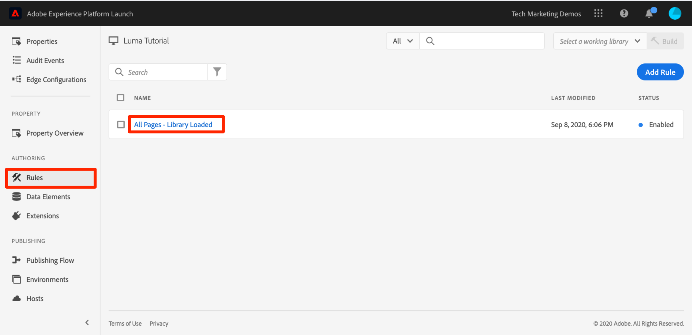

# Lägga till ett dataelement, en regel och ett bibliotek

I den här lektionen ska du skapa ditt första dataelement, regel och bibliotek.

Dataelement och regler är de grundläggande byggstenarna för taggar. Data Elements lagrar de attribut du vill skicka till dina marknadsförings- och annonslösningar, medan Regler skickar förfrågningar till dessa lösningar under rätt förhållanden.  Bibliotek är de JavaScript-filer som läses in på sidan för att göra allt arbete. I den här lektionen ska du använda alla tre för att få vår exempelsida att göra något.

>[!NOTE]
>
>Adobe Experience Platform Launch håller på att integreras i Adobe Experience Platform som en serie datainsamlingstekniker. Flera terminologiska förändringar har introducerats i gränssnittet som du bör vara medveten om när du använder det här innehållet:
>
> * Platforma launchen (klientsidan) är nu **[[!DNL tags]](https://experienceleague.adobe.com/docs/experience-platform/tags/home.html?lang=sv)**
> * Platforma launchens serversida är nu **[[!DNL event forwarding]](https://experienceleague.adobe.com/docs/experience-platform/tags/event-forwarding/overview.html?lang=sv-SE)**
> * Edge-konfigurationer är nu **[[!DNL datastreams]](https://experienceleague.adobe.com/docs/experience-platform/edge/fundamentals/datastreams.html?lang=sv-SE)**

## Utbildningsmål

När lektionen är klar kan du:

* Skapa ett dataelement
* Skapa en regel
* Skapa ett bibliotek
* Lägga till ändringar i ett bibliotek
* Verifiera att biblioteket läses in i webbläsaren
* Arbeta effektivare med funktionen &quot;Arbetsbibliotek&quot;

## Skapa ett dataelement för sidnamn

Dataelement är taggarnas version av ett datalager. De kan lagra värden från ditt eget datalager, cookies, lokala lagringsobjekt, frågesträngsparametrar, sidelement, metataggar osv. I den här övningen skapar du ett dataelement för Sidnamn, som du kommer att använda senare i dina Target- och Analytics-implementeringar.

**Skapa ett dataelement**

1. Klicka på **[!UICONTROL Data Elements]** i den vänstra navigeringen

1. Eftersom du inte har skapat några dataelement än i den här egenskapen visas en kort video med ytterligare information om det här avsnittet. Titta på den här videon, om du vill.

1. Klicka på knappen **[!UICONTROL Create New Data Element]**:

   

1. Namnge dataelementet, t.ex. `Page Name`

1. Använd dataelementtypen [!UICONTROL JavaScript Variable] för att peka på ett värde i exempelsidans datalager: `digitalData.page.pageInfo.pageName`

1. Markera kryssrutorna för **[!UICONTROL Force lowercase value]** och **[!UICONTROL Clean text]** för att standardisera skiftläget och ta bort överflödiga mellanslag

1. Lämna **[!UICONTROL None]** som **[!UICONTROL Storage Duration]**-inställning eftersom det här värdet vanligtvis är olika på alla sidor

1. Klicka på knappen **[!UICONTROL Save]** för att spara dataelementet

   .

>[!NOTE]
>
>Dataelementsfunktionerna _kan utökas med tilläggen_. Med tillägget ContextHub kan du till exempel lägga till dataelement med hjälp av tilläggsfunktioner.

## Skapa en regel

Därefter använder du det här dataelementet i en enkel regel. Regler är en av de mest kraftfulla funktionerna i taggar och gör att du kan ange vad som ska hända när besökaren interagerar med webbplatsen. När villkoren som beskrivs i reglerna är uppfyllda utlöser regeln den åtgärd som du har angett.

Du ska skapa en regel som skickar dataelementvärdet för sidnamnet till webbläsarkonsolen.

**Så här skapar du en regel**

1. Klicka på **[!UICONTROL Rules]** i den vänstra navigeringen

1. Eftersom du inte har skapat några regler än i den här egenskapen visas en kort video med ytterligare information om ämnet. Titta på den här videon, om du vill.

1. Klicka på knappen **[!UICONTROL Create New Rule]**:

   

1. Namnge regeln `All Pages - Library Loaded`. Den här namnkonventionen anger var och när regeln kommer att utlösas, vilket gör det enklare att identifiera och återanvända när taggegenskapen mognar.

1. Klicka på **[!UICONTROL Add]** under Händelser. Händelsen talar om för taggar när regeln ska utlösas och kan vara många saker, bland annat en sidinläsning, ett klick, en anpassad JavaScript-händelse osv.

   

   1. Välj **[!UICONTROL Library Loaded (Page Top)]** som händelsetyp. Observera att när du väljer Händelsetyp fylls ett namn för händelsen i automatiskt med taggen. Observera också att standardordningen för händelsen är 50. Ordning är en kraftfull funktion i taggar som ger dig exakt kontroll över sekvensen av åtgärder när du har flera regler som aktiveras av samma händelse. Du kommer att använda den här funktionen senare i självstudiekursen.

   1. Klicka på knappen **[!UICONTROL Keep Changes]**

   

1. Eftersom den här regeln ska utlösas på alla sidor lämnar du **[!UICONTROL Conditions]** tomt. Om du öppnar modala villkor kan du se att villkor kan lägga till både begränsningar och undantag baserat på ett stort antal alternativ, bland annat URL:er, dataelementvärden, datumintervall och mycket annat.

1. Klicka på **[!UICONTROL Add]** under Åtgärder

1. Välj **[!UICONTROL Action Type > Custom Code]**, som i det här skedet är det enda alternativet. Senare i självstudiekursen, när du lägger till tillägg, finns det fler alternativ.

1. Välj **[!UICONTROL </> Open Editor]** för att öppna kodredigeraren

   

1. Lägg till följande i kodredigeraren. Den här koden skickar värdet för dataelementet Sidnamn till webbläsarkonsolen så att du kan bekräfta att det fungerar:

   ```javascript
   console.log('The page name is '+_satellite.getVar('Page Name'));
   ```

1. Spara kodredigeraren

   

1. Klicka på **[!UICONTROL Keep Changes]** på åtgärdskonfigurationsskärmen

1. Klicka på **[!UICONTROL Save]** för att spara regeln

På sidan Regler ska du se din nya regel:


## Spara ändringarna i ett bibliotek

När du har konfigurerat en samling tillägg, dataelement och regler i gränssnittet för datainsamling måste du paketera dessa funktioner och logik i en uppsättning JavaScript-kod som du kan distribuera på din webbplats så att marknadsföringstaggarna utlöses när besökarna kommer till webbplatsen. Ett bibliotek är den uppsättning JavaScript-kod som ska göra detta.

I en tidigare lektion implementerade du inbäddningskoden för utvecklingsmiljön på exempelsidan. När du läste in exempelsidan returnerades ett 404-fel för inbäddningskodens URL eftersom ett taggbibliotek ännu inte har skapats och tilldelats miljön. Nu ska du placera ditt nya dataelement och linjera i ett bibliotek så att exempelsidan kan göra något.

**Lägga till och skapa ett bibliotek**

1. Klicka på **[!UICONTROL Publishing Flow]** i den vänstra navigeringen

1. Klicka på **[!UICONTROL Add New Library]**

   

1. Namnge biblioteket, t.ex. `Initial Setup`

1. Välj **[!UICONTROL Environment > Development]**

1. Klicka på **[!UICONTROL Add All Changed Resources]**

   

1. Observera att när du har klickat på **[!UICONTROL Add All Changed Resources]** taggar sammanfattas de ändringar du just har gjort.

1. Klicka på **[!UICONTROL Save & Build for Development]**

   

Efter en stund blir statuspunkten grön vilket anger att biblioteket har skapats.


## Validera ditt arbete

Verifiera nu att regeln fungerar som förväntat.

Läs in exempelsidan igen. Om du tittar på fliken Utvecklarverktyg -> Nätverk bör du nu se ett svar från 200 för ditt taggbibliotek!


Om du tittar på Developer Tools -> Console bör du se texten&quot;The page name is home&quot;


Grattis! Du har skapat ditt första dataelement och regel och byggt upp ditt första taggbibliotek!

## Använda funktionen Arbetsbibliotek

När du gör många ändringar i taggar är det inte praktiskt att behöva gå till fliken Publicera, lägga till ändringar och skapa biblioteket varje gång du vill se resultatet.  Nu när du har skapat ditt bibliotek för&quot;Inledande konfiguration&quot; kan du använda funktionen&quot;Arbetsbibliotek&quot; för att snabbt spara ändringarna och återskapa biblioteket i ett enda steg.

Gör en liten ändring i regeln &quot;Alla sidor - Biblioteksinläsning&quot;. Klicka på **[!UICONTROL Rules]** i den vänstra navigeringen och klicka sedan på regeln `All Pages - Library Loaded` för att öppna den.



På sidan `Edit Rule` klickar du på listrutan ***[!UICONTROL Working Library]*** och väljer ditt `Initial Setup`-bibliotek.


När du har markerat biblioteket bör du se att knappen **[!UICONTROL Save]** nu har standardvärdet **[!UICONTROL Save to Library]**. När du ändrar taggar kan du använda det här alternativet för att automatiskt lägga till ändringen direkt i ditt arbetsbibliotek och/eller återskapa den.

Testa det. Öppna åtgärden Egen kod och lägg bara till ett kolon efter texten&quot;Sidnamnet är&quot; så att hela kodblocket läser:

```javascript
console.log('The page name is: '+_satellite.getVar('Page Name'));
```

Spara koden, behåll ändringarna i funktionsmakrot och klicka nu på knappen **[!UICONTROL Save to Library and Build]**.


Vänta en stund tills den gröna punkten visas igen bredvid listrutan [!UICONTROL Working Library]. Läs nu in exempelsidan igen så bör du se ändringen i konsolmeddelandet (du kanske måste rensa webbläsarens cache och läsa in den igen för att kunna se ändringen på sidan):


Det här är ett mycket snabbare sätt att arbeta och du kommer att använda den här metoden för resten av självstudiekursen.

[Nästa&quot;Byt miljö med Experience Cloud Debugger&quot; >](switch-environments.md)
