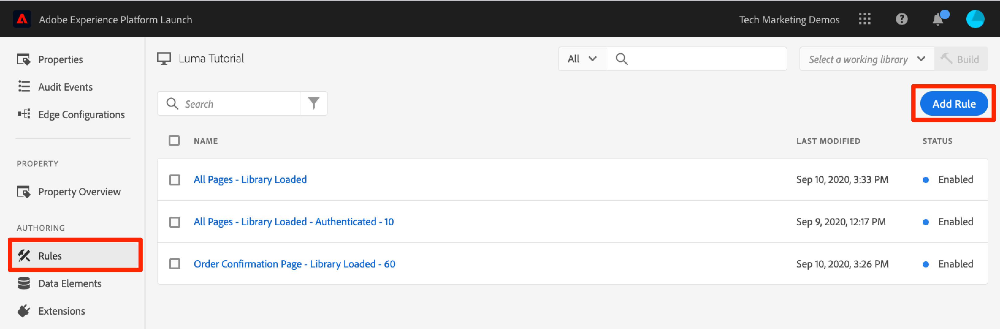
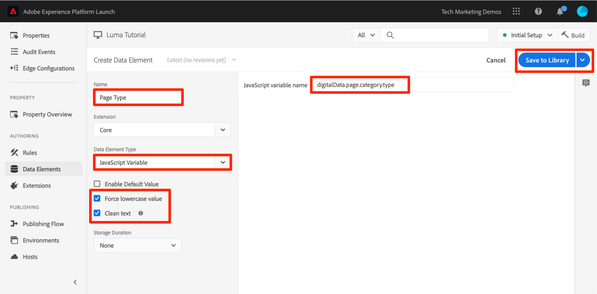
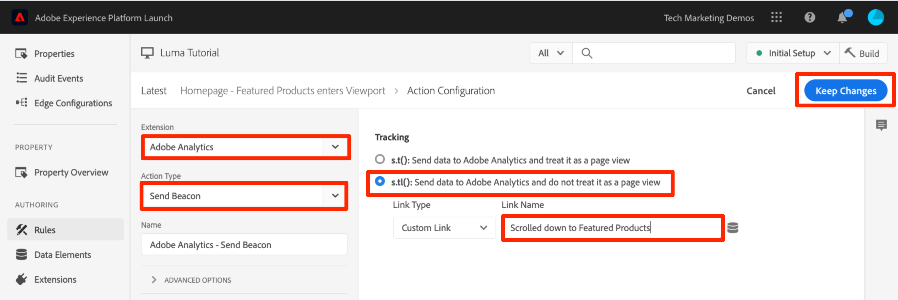
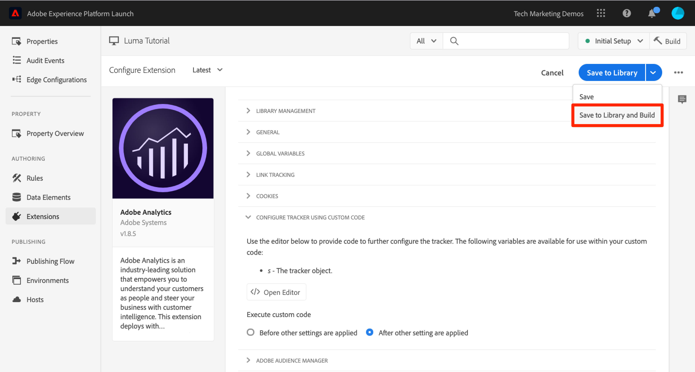
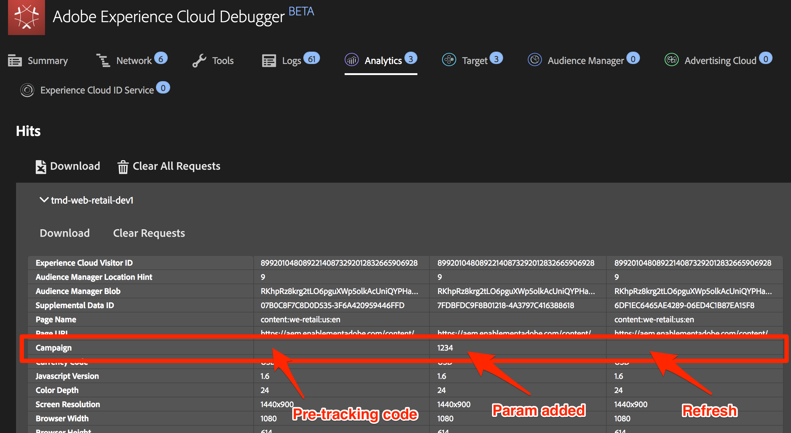

# Lägg till Adobe Analytics

I den här lektionen implementerar du [Adobe Analytics-tillägget](https://experienceleague.adobe.com/docs/experience-platform/tags/extensions/adobe/analytics/overview.html) och skapar regler för att skicka data till Adobe Analytics.

[Adobe Analytics](https://experienceleague.adobe.com/docs/analytics.html) är en branschledande lösning som gör att du kan förstå dina kunder som människor och styra din verksamhet med kundanalys.

>[!NOTE]
>
>Adobe Experience Platform Launch håller på att integreras i Adobe Experience Platform som en serie datainsamlingstekniker. Flera terminologiska förändringar har introducerats i gränssnittet som du bör vara medveten om när du använder det här innehållet:
>
> * Platform Launch (klientsidan) är nu **[[!DNL tags]](https://experienceleague.adobe.com/docs/experience-platform/tags/home.html?lang=sv)**
> * Platform Launch Server Side is now **[[!DNL event forwarding]](https://experienceleague.adobe.com/docs/experience-platform/tags/event-forwarding/overview.html)**
> * Edge-konfigurationer är nu **[[!DNL datastreams]](https://experienceleague.adobe.com/docs/experience-platform/edge/fundamentals/datastreams.html)**

## Utbildningsmål

När lektionen är klar kan du:

1. Lägg till Adobe Analytics-tillägget
1. Ange globala variabler med tillägget
1. Lägg till sidvyfyren
1. Lägga till ytterligare variabler med regler
1. Lägg till klickningsspårning och andra händelsebaserade fyrar
1. Lägg till Analytics-plugin-program

Det finns mycket som kan implementeras för Analytics i taggar. Den här lektionen är inte heltäckande, men bör ge en god översikt över de viktigaste tekniker du behöver för att implementera på din egen webbplats.

## Förhandskrav

Du bör redan ha slutfört lektionerna i [Konfigurera taggar](create-a-property.md) och [Lägg till identitetstjänsten](id-service.md).

Dessutom behöver du minst ett ID för rapportsviten och en spårningsserver. Om du inte har någon test-/dev-rapportsserie som du kan använda för den här självstudiekursen skapar du en. Om du är osäker på hur du gör det läser du [dokumentationen](https://experienceleague.adobe.com/en/docs/analytics/admin/admin-tools/manage-report-suites/c-new-report-suite/t-create-a-report-suite). Du kan hämta din spårningsserver från din nuvarande implementering, Adobe Consultant eller kundtjänstrepresentant.

## Lägg till analystillägget

Tillägget Analytics består av två huvuddelar:

1. Tilläggskonfigurationen, som hanterar huvudinställningarna för AppMeasurement.js-biblioteket och kan ange globala variabler
1. Regelåtgärder för att göra följande:
   1. Ange variabler
   1. Rensa variabler
   1. Skicka Analytics Beacon

**Lägga till Analytics-tillägget**

1. Gå till **[!UICONTROL Extensions > Catalog]**
1. Hitta Adobe Analytics-tillägget
1. Klicka på **[!UICONTROL Install]**

   

1. Under [!UICONTROL Library Management > Report Suites] anger du de ID:n för rapportsviten som du vill använda för varje taggmiljö. Om dina användare har tillgång till Adobe Analytics bör du tänka på att när du börjar skriva i rutan visas en ifylld lista med alla dina rapportsviter. (Det går bra att använda en rapportserie för alla miljöer i den här självstudiekursen, men i verkligheten vill du använda separata rapportsviter, vilket visas i bilden nedan)

   

   >[!TIP]
   >
   >Vi rekommenderar att du använder inställningen [!UICONTROL Manage the library for me option] som [!UICONTROL Library Management] eftersom det gör det mycket enklare att hålla `AppMeasurement.js`-biblioteket uppdaterat.

1. Under [!UICONTROL General > Tracking Server] anger du spårningsservern, t.ex. `tmd.sc.omtrdc.net`. Ange din SSL-spårningsserver om din webbplats stöder `https://`

   

1. I [!UICONTROL Global Variables section], under [!UICONTROL Additional Settings], anger du variabeln [!UICONTROL Page Name] med ditt `Page Name`-dataelement. Klicka på ikonen  för att öppna det modala och välj dataelementet för sidan `Page Name` .)

1. Klicka på **[!UICONTROL Save to Library]**

   

>[!NOTE]
>
>Globala variabler kan anges i tilläggskonfigurationen eller i regelåtgärder. Tänk på att när du anger variabler i tilläggskonfigurationen måste datalagret definieras *före* taggens inbäddningskoder.

## Skicka sidvyfyren

Nu ska du skapa en regel för att utlösa Analytics-beacon, som skickar variabeluppsättningen [!UICONTROL Page Name] i tilläggskonfigurationen.

Du har redan skapat regeln&quot;Alla sidor - Biblioteksinläsning&quot; i [Lägg till ett dataelement, en regel och en bibliotekslektion](add-data-elements-rules.md) i den här självstudiekursen, som aktiveras på varje sida när taggbiblioteket läses in. Du *kan* använda den här regeln även för Analytics, men den här inställningen kräver att alla datalagerattribut som används i Analytics-fyren definieras före taggens inbäddningskoder. Om du vill ha större flexibilitet i datainsamlingen skapar du en ny regel som utlöses av DOM Ready to fire the Analytics Beacon.

**Så här skickar du sidvyknappen**

1. Gå till avsnittet **[!UICONTROL Rules]** i den vänstra navigeringen och klicka sedan på **[!UICONTROL Add Rule]**

   

1. Namnge regeln `All Pages - DOM Ready`
1. Klicka på **[!UICONTROL Events > Add]** för att öppna skärmen `Event Configuration`

   

1. Välj **[!UICONTROL Event Type > DOM Ready]** (Observera att ordningen för regeln är &quot;50&quot;)
1. Klicka på **[!UICONTROL Keep Changes]**
   

1. Klicka på plustecknet 

   

1. Välj **[!UICONTROL Extension > Adobe Analytics]**

1. Välj **[!UICONTROL Action Type > Send Beacon]**

1. Lämna Spårningsuppsättningen på `s.t()`. Observera att om du vill ringa ett `s.tl()`-samtal i en klickhändelseregel kan du göra det med åtgärden Skicka Beacon.

1. Klicka på knappen **[!UICONTROL Keep Changes]**

   

1. Klicka på **[!UICONTROL Save to Library and Build]**

   

### Validera sidvisningsfunktionen

Nu när du har skapat en regel för att skicka en Analytics-fyr bör du kunna se begäran i Experience Cloud Debugger.

1. Öppna [Luma-webbplatsen](https://luma.enablementadobe.com/content/luma/us/en.html) i din Chrome-webbläsare
1. Klicka på felsökningsikonen  för att öppna **[!UICONTROL Adobe Experience Cloud Debugger]**
1. Kontrollera att felsökaren mappar taggegenskapen till *din*-utvecklingsmiljö, vilket beskrivs i [tidigare lektion](switch-environments.md)

   

1. Klicka för att öppna fliken Analytics
1. Expandera namnet på din Report Suite om du vill visa alla förfrågningar som gjorts till den
1. Bekräfta att begäran har utlösts med variabeln och värdet för sidnamn

   

>[!NOTE]
>
>Om sidnamnet inte visas för dig går du tillbaka igenom stegen på den här sidan för att kontrollera att du inte missat något.

## Lägg till variabler med regler

När du konfigurerade analystillägget fyllde du i variabeln `pageName` i tilläggskonfigurationen. Det här är en fin plats att fylla i andra globala variabler som eVars och props, förutsatt att värdet är tillgängligt på sidan innan taggens inbäddningskod läses in.

En flexiblare plats att ange variabler, samt händelser, finns i regler med åtgärden `Set Variables`. Med regler kan du ange olika Analytics-variabler och -händelser under olika förhållanden. Du kan till exempel bara ange `prodView` på produktinformationssidor och händelsen `purchase` på orderbekräftelsesidor. I det här avsnittet får du lära dig hur du ställer in variabler med hjälp av regler.

### Användningsfall

Produktinformationssidor (PDP) är viktiga punkter för datainsamling på butikssajter. Vanligtvis vill du att Analytics ska registrera att en produktvy har inträffat och vilken produkt som har visats. Detta är praktiskt när du vill veta vilka produkter som är populära hos dina kunder. På en mediewebbplats kan artikel- eller videosidor använda tekniker som liknar de du använder i det här avsnittet.  När du läser in en produktinformationssida kanske du vill placera det värdet i sidtypen `eVar`, samt ange vissa händelser och produkt-id:t. På så sätt kan vi se följande i vår analys:

1. Hur många gånger produktinformationssidor läses in
1. Vilka specifika produkter som visas och hur många gånger
1. Hur andra faktorer (kampanjer, sökningar osv.) påverkar hur många PDP-personer som laddas

### Skapa dataelement för sidtyp

Först måste du identifiera vilka sidor som är produktinformationssidorna. Det gör du med ett dataelement.

**Skapa dataelementet för sidtypen**

1. Klicka på **[!UICONTROL Data Elements]** i den vänstra navigeringen
1. Klicka på **[!UICONTROL Add Data Element]**

   

1. Namnge dataelementet `Page Type`
1. Välj **[!UICONTROL Data Element Type > JavaScript Variable]**
1. Använd `digitalData.page.category.type` som **[!UICONTROL JavaScript variable name]**
1. Kontrollera alternativen **[!UICONTROL Clean text]** och **[!UICONTROL Force Lower Case]**
1. Klicka på **[!UICONTROL Save to Library]**

   

### Skapa dataelement för produkt-ID

Därefter samlar du in produkt-id:t för den aktuella produktinformationssidan med ett dataelement

**Skapa dataelementet för produkt-ID**

1. Klicka på **[!UICONTROL Data Elements]** i den vänstra navigeringen
1. Klicka på **[!UICONTROL Add Data Element]**

   

1. Namnge dataelementet `Product Id`
1. Välj **[!UICONTROL Data Element Type > JavaScript Variable]**
1. Använd `digitalData.product.0.productInfo.sku` som **[!UICONTROL JavaScript variable name]**
1. Kontrollera alternativen **[!UICONTROL Clean text]** och **[!UICONTROL Force Lower Case]**
1. Klicka på **[!UICONTROL Save to Library]**

   

### Lägg till Adobe Analytics produktsträngstillägg

Om du redan är bekant med Adobe Analytics-implementeringar är du antagligen bekant med variabeln [products](https://experienceleague.adobe.com/docs/analytics/implementation/vars/page-vars/products.html). Variabeln products har en mycket specifik syntax och används på något olika sätt beroende på sammanhanget. För att göra populationen av produkterna lättare i taggar har ytterligare tre tillägg redan skapats på tagg-tilläggets marknadsplats! I det här avsnittet ska du lägga till ett tillägg som har skapats av Adobe Consulting och som ska användas på produktinformationssidan.

**Lägg till tillägget `Adobe Analytics Product String`**

1. Gå till sidan [!UICONTROL Extensions > Catalog]
1. Hitta tillägget `Adobe Analytics Product String` av Adobe Consulting Services och klicka på **[!UICONTROL Install]**
   
1. Ta en stund att läsa instruktionerna
1. Klicka på **[!UICONTROL Save to Library]**

   

### Skapa regeln för produktinformationssidor

Nu ska du använda dina nya dataelement och tillägg för att skapa regeln för produktinformation. För den här funktionen skapar du en annan sidinläsningsregel som aktiveras av DOM Ready. Du kommer dock att använda ett villkor så att det bara aktiveras på sidorna Produktinformation och i ordningsinställningen så att det aktiveras _före_ regeln som skickar beacon.

**Så här skapar du regeln för produktinformationssidan**

1. Gå till avsnittet **[!UICONTROL Rules]** i den vänstra navigeringen och klicka sedan på **[!UICONTROL Add Rule]**

   

1. Namnge regeln `Product Details - DOM Ready - 40`
1. Klicka på **[!UICONTROL Events > Add]** för att öppna skärmen `Event Configuration`

   

1. Välj **[!UICONTROL Event Type > DOM Ready]**
1. Ange **[!UICONTROL Order]** till 40 så att regeln körs *före* regeln som innehåller åtgärden Analytics > Send Beacon
1. Klicka på **[!UICONTROL Keep Changes]**
   

1. Under **[!UICONTROL Conditions]** klickar du på plustecknet  för att öppna skärmen `Condition Configuration`
   

   1. Välj **[!UICONTROL Condition Type > Value Comparison]**
   1. Använd dataelementväljaren och välj `Page Type` i det första fältet
   1. Välj **[!UICONTROL Contains]** i listrutan för jämförelseoperatorer
   1. I nästa fälttyp `product-page` (det här är den unika delen av sidtypsvärdet som hämtats från datalagret på PDP-filer)
   1. Klicka på **[!UICONTROL Keep Changes]**

      

1. Klicka på plustecknet 

   

1. Välj **[!UICONTROL Extension > Adobe Analytics Product String]**
1. Välj **[!UICONTROL Action Type > Set s.products]**

1. I avsnittet **[!UICONTROL Analytics E-commerce Event]** väljer du **[!UICONTROL prodView]**

1. I avsnittet **[!UICONTROL Data layer variables for product data]** använder du dataelementväljaren för att välja dataelementet `Product Id`

1. Klicka på **[!UICONTROL Keep Changes]**

   


1. Klicka på plustecknet 

   

1. Välj **[!UICONTROL Extension > Adobe Analytics]**
1. Välj **[!UICONTROL Action Type > Set Variables]**
1. Markera **[!UICONTROL eVar1 > Set as]** och ange `product detail page`
1. Ange **[!UICONTROL event1]** och lämna de valfria värdena tomma
1. Klicka på knappen **[!UICONTROL Add Another]** under Händelser
1. Ange händelsen **[!UICONTROL prodView]** och lämna de valfria värdena tomma
1. Klicka på **[!UICONTROL Keep Changes]**

   

1. Klicka på **[!UICONTROL Save to Library and Build]**

   

### Validera produktinformationssidans data

Du har just skapat en regel som ställer in variabler innan beacon skickas. Nu bör du kunna se de nya data som kommer ut i träffen i Experience Cloud Debugger.

**Så här validerar du produktinformationssidans data**

1. Öppna [Luma-webbplatsen](https://luma.enablementadobe.com/content/luma/us/en.html) i din Chrome-webbläsare
1. Navigera till valfri produktinformationssida
1. Klicka på felsökningsikonen  för att öppna **[!UICONTROL Adobe Experience Cloud Debugger]**
1. Klicka på fliken Analytics
1. Expandera din Report Suite
1. Observera produktinformationsvariablerna som nu finns i felsökaren, nämligen att `eVar1` har ställts in på&quot;produktinformationssida&quot;, att variabeln `Events` har ställts in på&quot;event1&quot; och&quot;prodView&quot;, att variabeln products ställs in med produkt-id:t för den produkt som du visar och att sidnamnet fortfarande anges av analystillägget

   

## Skicka en spårlänkssignal

När en sida läses in utlöser du vanligtvis en sidinläsningssignal som utlöses av funktionen `s.t()`. Detta ökar automatiskt måttet `page view` för sidan som visas i variabeln `pageName`.

Ibland vill du dock inte öka antalet sidvisningar på webbplatsen eftersom åtgärden som utförs är&quot;mindre&quot; (eller kanske bara annorlunda) än en sidvy. I det här fallet använder du funktionen `s.tl()`, som vanligtvis kallas för en begäran om spårlänk. Även om den kallas för en begäran om spårlänk behöver den inte aktiveras med ett länkklick. Den kan utlösas av *alla* händelser som är tillgängliga i taggregelbyggaren, inklusive din egen anpassade JavaScript.

I den här självstudiekursen kommer du att utlösa ett `s.tl()`-samtal med en av de coolaste JavaScript-händelserna, en `Enters Viewport` -händelse.

### Användningsfallet

I det här fallet vill du veta om folk rullar ned på Lumas hemsida tillräckligt mycket för att se avsnittet *Aktuella produkter* på vår sida. Det finns en del interna skillnader hos vårt företag om folk ens ser det avsnittet eller inte, så ni vill använda Analytics för att fastställa sanningen.

### Skapa regeln i taggar

1. Gå till avsnittet **[!UICONTROL Rules]** i den vänstra navigeringen och klicka sedan på **[!UICONTROL Add Rule]**
   
1. Namnge regeln `Homepage - Featured Products enters Viewport`
1. Klicka på **[!UICONTROL Events > Add]** för att öppna skärmen `Event Configuration`

   

1. Välj **[!UICONTROL Event Type > Enters Viewport]**.  Då visas ett fält där du måste ange CSS-väljaren som identifierar det objekt på sidan som ska utlösa regeln när den visas i webbläsaren.
1. Gå tillbaka till startsidan för Luma och bläddra till avsnittet Aktuella produkter.
1. Högerklicka på mellanrummet mellan titeln &quot;FEATURED PRODUCTS&quot; och alternativen i det här avsnittet och välj `Inspect` på högerklicksmenyn. Då kommer du nära det du vill ha.
1. Precis där, möjligen direkt under det markerade avsnittet, söker du efter en div med `class="we-productgrid aem-GridColumn aem-GridColumn--default--12"`. Leta reda på elementet.
1. Högerklicka på elementet och välj **[!UICONTROL Copy > Copy Selector]**

   

1. Gå tillbaka till taggar och klistra in värdet från Urklipp i fältet `Elements matching the CSS selector`.
   1. Det är å andra sidan upp till dig att bestämma hur du ska identifiera CSS-väljare. Den här metoden är lite känslig eftersom vissa ändringar på sidan kan bryta väljaren. Tänk på detta när du använder CSS-väljare i taggar.
1. Klicka på **[!UICONTROL Keep Changes]**
   

1. Klicka på plustecknet  för att lägga till ett nytt villkor
1. Välj **[!UICONTROL Condition Type > Value Comparison]**
1. Använd dataelementväljaren och välj `Page Name` i det första fältet
1. Välj **[!UICONTROL Equals]** i listrutan för jämförelseoperatorer
1. I nästa fälttyp `content:luma:us:en` (det här är hemsidans sidnamn som hämtats från datalagret - vi vill bara att den här regeln ska köras på startsidan)
1. Klicka på **[!UICONTROL Keep Changes]**

   

1. Klicka på plustecknet 
1. Välj **[!UICONTROL Extension > Adobe Analytics]**
1. Välj **[!UICONTROL Action Type > Set Variables]**
1. Ange `eVar3` till `Home Page - Featured Products`
1. Ange `prop3` till `Home Page - Featured Products`
1. Ange variabeln `Events` till `event3`
1. Klicka på **[!UICONTROL Keep Changes]**

   

1. Klicka på plustecknet 

1. Välj **[!UICONTROL Extension > Adobe Analytics]**
1. Välj **[!UICONTROL Action Type > Send Beacon]**
1. Välj spårningsalternativet **[!UICONTROL `s.tl()`]**
1. Ange **[!UICONTROL Link Name]** i fältet `Scrolled down to Featured Products`. Det här värdet placeras i rapporten Anpassade länkar i Analytics.
1. Klicka på **[!UICONTROL Keep Changes]**

   

1. Klicka på **[!UICONTROL Save to Library and Build]**

   

### Validera funktionen Spåra länk

Nu ska du se till att den här träffen visas när du bläddrar till avsnittet Aktuella produkter på hemsidan för vår webbplats. När du först läser in hemsidan bör begäran inte göras, men när du rullar nedåt och avsnittet visas bör träffen utlösas av våra nya värden.

1. Öppna [Luma-webbplatsen](https://luma.enablementadobe.com/content/luma/us/en.html) i webbläsaren i Chrome och kontrollera att du är högst upp på startsidan.
1. Klicka på **[!UICONTROL debugger icon]**  för att öppna [!UICONTROL Adobe Experience Cloud Debugger]
1. Klicka på fliken Analytics
1. Expandera träffen i din Report Suite
1. Lägg märke till den normala sidvyträffen för startsidan med sidnamnet osv. (men inget i eVar3 eller prop3).

   

1. Låt Felsökning vara öppet och rulla nedåt på webbplatsen tills du ser avsnittet Aktuella produkter
1. Visa felsökaren igen, och en annan Analytics-träff borde ha träffats. Den här träffen ska ha de parametrar som är associerade med s.tl()-träffen som du ställer in, nämligen:
   1. `LinkType = "link_o"` (det innebär att träffen är en anpassad länkträff, inte en sidvisningsträff)
   1. `LinkName = "Scrolled down to Featured Products"`
   1. `prop3 = "Home Page - Featured Products"`
   1. `eVar3 = "Home Page - Featured Products"`
   1. `Events = "event3"`

      

## Lägga till ett plugin-program

Ett plugin-program är en del av JavaScript-koden som du kan lägga till i implementeringen för att utföra en specifik funktion som inte är inbyggd i produkten. Du kan bygga plugin-program av andra Adobe-kunder/partners eller av Adobe Consulting.

För att implementera plugin-program finns det i stort sett tre steg:

1. Inkludera funktionen doPlugins, där plugin-programmet refereras
1. Lägg till huvudfunktionskoden för plugin-programmet
1. Inkludera koden som anropar funktionen och ställer in variabler osv.

### Gör objektet Analytics tillgängligt globalt

Om du ska lägga till funktionen doPlugins (nedan) och använda plugin-program måste du markera en kryssruta för att göra objektet&quot;s&quot; i Analytics tillgängligt globalt i Analytics-implementeringen.

1. Gå till **[!UICONTROL Extensions > Installed]**

1. Klicka på **[!UICONTROL Configure]** i Adobe Analytics-tillägget

   

1. Under **[!UICONTROL Library Management]** markerar du rutan `Make tracker globally accessible`. Som du ser i hjälpbubblan blir spåraren global under fönstren, vilket är viktigt när du talar om det i din JavaScript-kund.
   

### Inkludera funktionen doPlugins

Om du vill lägga till plugin-program måste du lägga till funktionen doPlugins. Den här funktionen läggs inte till som standard, men när den har lagts till hanteras den av AppMeasurement-biblioteket och anropas sist när en träff skickas till Adobe Analytics. Du kan därför använda den här funktionen för att köra vissa JavaScript-program för att ange variabler som är enklare att ställa in på det här sättet.

1. Bläddra nedåt och expandera avsnittet `Configure Tracker Using Custom Code.` medan du fortfarande är i Analytics-tillägget.
1. Klicka på **[!UICONTROL Open Editor]**
1. Klistra in följande kod i kodredigeraren:

   ```javascript
   /* Plugin Config */
   s.usePlugins=true
   s.doPlugins=function(s) {
   /* Add calls to plugins here */
   }
   ```

1. Håll fönstret öppet för nästa steg

### Lägg till funktionskod för plugin-programmet

Du kommer egentligen att anropa två plugin-program i den här koden, men en av dem är inbyggd i AppMeasurement-biblioteket, så för det behöver du inte lägga till funktionen som ska anropas. Men för den andra måste du också lägga till funktionskoden. Den här funktionen kallas getValOnce().

### Plugin-programmet getValOnce()

Syftet med det här plugin-programmet är att förhindra att värden dupliceras felaktigt i koden när en besökare uppdaterar en sida eller använder webbläsarens bakåtknapp för att gå tillbaka till en sida där ett värde angavs. I den här lektionen använder du den för att förhindra att händelsen `clickthrough` dupliceras.

Koden för det här plugin-programmet finns i [Analytics Documentation](https://experienceleague.adobe.com/docs/analytics/implementation/vars/plugins/getvalonce.html), men finns här för att underlätta kopiering/inklistring.

1. Kopiera följande kod

   ```javascript
   /* Adobe Consulting Plugin: getValOnce v2.01 */
   s.getValOnce=function(vtc,cn,et,ep){if(vtc&&(cn=cn||"s_gvo",et=et||0,ep="m"===ep?6E4:864E5,vtc!==this.c_r(cn))){var e=new Date;e.setTime(e.getTime()+et*ep);this.c_w(cn,vtc,0===et?0:e);return vtc}return""};
   ```

1. Klistra in den i kodfönstret i Analytics-tillägget (om du inte fortfarande har den öppen, öppnar du den igen enligt föregående steg), **helt under** funktionen doPlugins (inte i den).

   

Du kan nu anropa det här plugin-programmet inifrån doPlugins.

### Anropa plugin-program från inom doPlugins

Nu när koden finns där och kan refereras kan du anropa plugin-program i funktionen doPlugins.

Först kallar vi ett plugin-program som är inbyggt i AppMeasurement-biblioteket, så det kallas ett &quot;verktyg&quot;. Det kallas `s.Util.getQueryParam` eftersom det är en del av objektet, är ett inbyggt verktyg och hämtar värden (baserat på en parameter) från frågesträngen i URL:en.

1. Kopiera följande kod:

   ```javascript
   s.campaign = s.Util.getQueryParam("cid");
   ```

1. Klistra in den i funktionen doPlugins. Detta söker efter en parameter med namnet `cid` i den aktuella sidans URL och placerar den i variabeln s.campaign.
1. Anropa nu funktionen getValOnce genom att kopiera följande kod och klistra in den direkt under anropet till getQueryParam:

   ```javascript
   s.campaign=s.getValOnce(s.campaign,'s_cmp',30);
   ```

   Den här koden ser till att samma värde inte skickas in mer än en gång i rad under 30 dagar (se dokumentationen för hur du anpassar koden efter dina behov).

   

1. Spara kodfönstret
1. Klicka på **[!UICONTROL Save to Library and Build]**

   

### Validera plugin-programmen

Nu kan du se till att plugin-programmen fungerar.

**Verifiera plugin-programmen**

1. Öppna [Luma-webbplatsen](https://luma.enablementadobe.com/content/luma/us/en.html) i din Chrome-webbläsare
1. Klicka på felsökningsikonen  för att öppna **[!UICONTROL Adobe Experience Cloud Debugger]**
1. Klicka på fliken Analytics
1. Expandera din Report Suite
1. Observera att träffen Analytics inte har någon Campaign-variabel
1. Lämna Felsökning öppen, gå tillbaka till Luma-webbplatsen och lägg till `?cid=1234` i URL:en och tryck på Retur för att uppdatera sidan med den frågesträngen inkluderad

   

1. Kontrollera felsökaren och bekräfta att det finns en andra Analytics-begäran med en Campaign-variabel inställd på `1234`

   

1. Gå tillbaka och uppdatera Luma-sidan igen, med frågesträngen kvar i URL:en
1. Kontrollera nästa träff i Felsökning och Campaign-variabeln **inte** ska vara närvarande, eftersom plugin-programmet getValOnce har sett till att det inte dupliceras och ser ut som om en annan person kom in från kampanjspårningskoden.

   

1. BONUS: Du kan testa detta om och om igen genom att ändra värdet för parametern `cid` i frågesträngen. Campaign-variabeln ska bara finnas där om det är den **första** gången du kör sidan med värdet. Om du inte ser Campaign-värdet i felsökaren ändrar du bara värdet för `cid` i frågesträngen för URL:en, trycker på Retur och sedan ser du det igen i felsökaren.

   >[!NOTE]
   >
   >Det finns faktiskt några olika sätt att hämta en parameter från frågesträngen i URL:en, bland annat i tilläggskonfigurationen för Analytics. I dessa andra icke-plug-in-alternativ ger de dock inte möjlighet att stoppa onödig duplicering, vilket du har gjort här med plugin-programmet getValOnce. Detta är författarens favoritmetod, men du bör avgöra vilken metod som fungerar bäst för dig och dina behov.

Snyggt jobbat! Du är klar med Analytics-lektionen. Naturligtvis finns det många andra saker du kan göra för att förbättra vår Analytics-implementering, men förhoppningsvis har detta gett dig en del av kärnkompetensen för att hantera resten av dina behov.

[Nästa&quot;Lägg till Adobe Audience Manager&quot; >](audience-manager.md)
