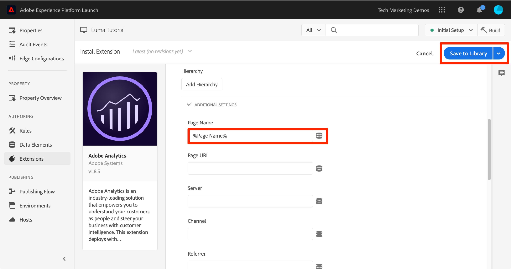
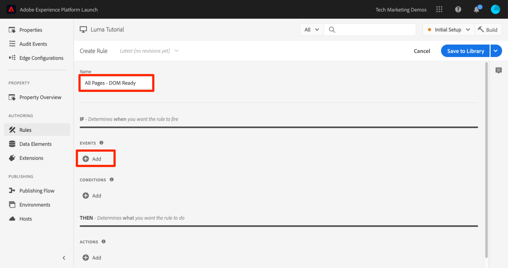
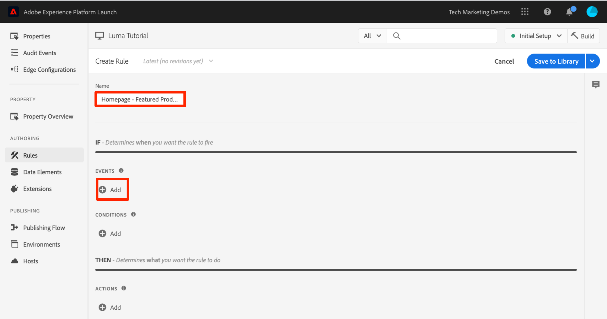
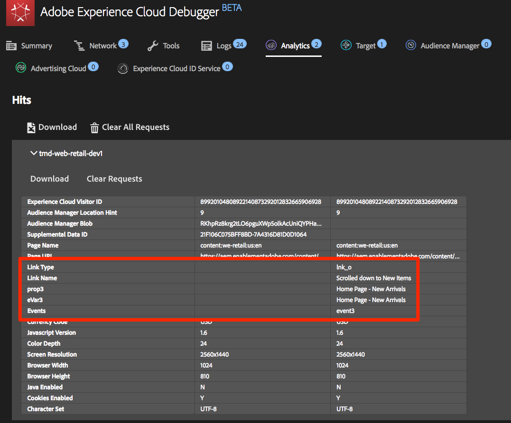
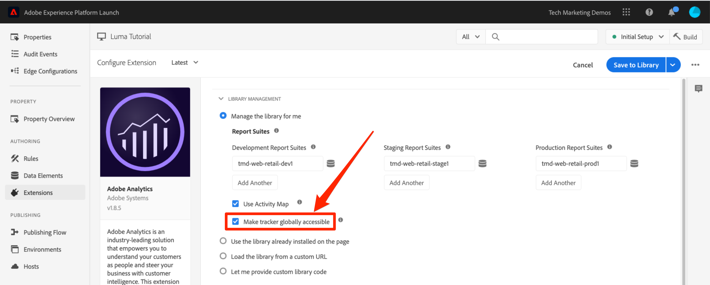

# Lägg till Adobe Analytics

I den här lektionen implementerar du [Adobe Analytics-tillägg](https://experienceleague.adobe.com/docs/experience-platform/tags/extensions/adobe/analytics/overview.html) och skapa regler för att skicka data till Adobe Analytics.

[Adobe Analytics](https://experienceleague.adobe.com/docs/analytics.html) är en branschledande lösning som ger er möjlighet att förstå era kunder som människor och styra verksamheten med kundanalys.

>[!NOTE]
>
>Adobe Experience Platform Launch håller på att integreras i Adobe Experience Platform som en serie datainsamlingstekniker. Flera terminologiska förändringar har introducerats i gränssnittet som du bör vara medveten om när du använder det här innehållet:
>
> * platforma launchen (klientsidan) är nu **[[!DNL tags]](https://experienceleague.adobe.com/docs/experience-platform/tags/home.html?lang=sv)**
> * platform launch Server Side is now **[[!DNL event forwarding]](https://experienceleague.adobe.com/docs/experience-platform/tags/event-forwarding/overview.html)**
> * Edge-konfigurationer är nu **[[!DNL datastreams]](https://experienceleague.adobe.com/docs/experience-platform/edge/fundamentals/datastreams.html)**


## Utbildningsmål

När lektionen är klar kan du:

1. Lägg till Adobe Analytics-tillägget
1. Ange globala variabler med tillägget
1. Lägg till sidvyfyren
1. Lägga till ytterligare variabler med regler
1. Lägg till klickningsspårning och andra händelsebaserade fyrar
1. Lägg till Analytics-plugin-program

Det finns mycket som kan implementeras för Analytics i taggar. Den här lektionen är inte heltäckande, men bör ge en god översikt över de viktigaste tekniker du behöver för att implementera på din egen webbplats.

## Förutsättningar

Du borde ha slutfört lektionerna i [Konfigurera taggar](create-a-property.md) och [Lägg till identitetstjänsten](id-service.md).

Dessutom behöver du minst ett ID för rapportsviten och en spårningsserver. Om du inte har någon test-/dev-rapportsserie som du kan använda för den här självstudiekursen skapar du en. Om du är osäker på hur du gör det kan du läsa [dokumentationen](https://experienceleague.adobe.com/docs/analytics/admin/manage-report-suites/new-report-suite/new-report-suite.html). Du kan hämta spårningsservern från din nuvarande implementering, Adobe Consultant eller Customer Care-representant.

## Lägg till analystillägget

Tillägget Analytics består av två huvuddelar:

1. Tilläggskonfigurationen, som hanterar huvudinställningarna för AppMeasurement.js-biblioteket och kan ange globala variabler
1. Regelåtgärder för att göra följande:
   1. Ange variabler
   1. Rensa variabler
   1. Skicka analyssignal

**Lägga till Analytics-tillägget**

1. Gå till **[!UICONTROL Tillägg > Katalog]**
1. Hitta Adobe Analytics-tillägget
1. Klicka **[!UICONTROL Installera]**

   

1. Under [!UICONTROL Bibliotekshantering > Rapportsviter]anger du de ID:n för rapportsviten som du vill använda för varje taggmiljö. Om dina användare har tillgång till Adobe Analytics bör du tänka på att när du börjar skriva i rutan visas en ifylld lista med alla dina rapportsviter. (Det går bra att använda en rapportserie för alla miljöer i den här självstudiekursen, men i verkligheten vill du använda separata rapportsviter, vilket visas i bilden nedan)

   

   >[!TIP]
   >
   >Vi rekommenderar att du använder [!UICONTROL Hantera biblioteket åt mig, alternativ] som [!UICONTROL Bibliotekshantering] eftersom det gör det mycket enklare att behålla `AppMeasurement.js` biblioteket är uppdaterat.

1. Under [!UICONTROL Allmänt > Spårningsserver]anger du spårningsservern, t.ex. `tmd.sc.omtrdc.net`. Ange din SSL-spårningsserver om din webbplats stöder `https://`

   

1. I [!UICONTROL Avsnittet Globala variabler], under [!UICONTROL Ytterligare inställningar], ange [!UICONTROL Sidnamn] variabel med `Page Name` dataelement. Klicka på  -ikonen för att öppna spärren och välja sidan `Page Name` dataelement)

1. Klicka **[!UICONTROL Spara i bibliotek]**

   

>[!NOTE]
>
>Globala variabler kan anges i tilläggskonfigurationen eller i regelåtgärder. Tänk på att datalagret måste definieras när du ställer in variabler i tilläggskonfigurationen *före* taggens inbäddningskoder.

## Skicka sidvyfyren

Nu ska du skapa en regel för att avskeda Analytics-beacon, som skickar [!UICONTROL Sidnamn] variabeluppsättning i tilläggskonfigurationen.

Du har redan skapat regeln &quot;Alla sidor - Biblioteksinläsning&quot; i [Lägga till ett dataelement, en regel och ett bibliotek](add-data-elements-rules.md) lektion till den här självstudiekursen som utlöses på varje sida när taggbiblioteket läses in. Du *kunde* Använd även den här regeln för Analytics, men den här inställningen kräver att alla datalagerattribut som används i Analytics-fyren definieras före taggens inbäddningskoder. Om du vill ha större flexibilitet i datainsamlingen skapar du en ny regel som utlöses av DOM Ready to fire the Analytics Beacon.

**Så här skickar du sidvyknappen**

1. Gå till **[!UICONTROL Regler]** i den vänstra navigeringen och sedan klicka **[!UICONTROL Lägg till regel]**

   

1. Namnge regeln `All Pages - DOM Ready`
1. Klicka **[!UICONTROL Händelser > Lägg till]** för att öppna `Event Configuration` screen

   

1. Välj **[!UICONTROL Händelsetyp > DOM Ready]** (Observera att ordningen för regeln är &quot;50&quot;)
1. Klicka **[!UICONTROL Behåll ändringar]**
   

1. Klicka på  lägga till en ny åtgärd

   

1. Välj **[!UICONTROL Tillägg > Adobe Analytics]**

1. Välj **[!UICONTROL Åtgärdstyp > Skicka signal]**

1. Lämna spårningsuppsättning på `s.t()`. Observera att om du vill skapa en `s.tl()` anropa en klickhändelseregel som du kan göra även med åtgärden Skicka signal.

1. Klicka på **[!UICONTROL Behåll ändringar]** knapp

   

1. Klicka **[!UICONTROL Spara i bibliotek och bygge]**

   

### Validera sidvisningsfunktionen

Nu när du har skapat en regel för att skicka en Analytics-fyr bör du kunna se begäran i Experience Cloud Debugger.

1. Öppna [Luma site](https://luma.enablementadobe.com/content/luma/us/en.html) i webbläsaren Chrome
1. Klicka på felsökningsikonen  för att öppna **[!UICONTROL Adobe Experience Cloud Debugger]**
1. Kontrollera att felsökaren mappar taggegenskapen till *din* Utvecklingsmiljö, enligt beskrivningen i [tidigare lektion](switch-environments.md)

   

1. Klicka för att öppna fliken Analytics
1. Expandera namnet på din Report Suite om du vill visa alla förfrågningar som gjorts till den
1. Bekräfta att begäran har utlösts med variabeln och värdet för sidnamn

   

>[!NOTE]
>
>Om sidnamnet inte visas för dig går du tillbaka igenom stegen på den här sidan för att kontrollera att du inte missat något.

## Lägg till variabler med regler

När du konfigurerade Analytics Extension fyllde du i `pageName` i tilläggskonfigurationen. Det här är en fin plats att fylla i andra globala variabler som eVars och props, förutsatt att värdet är tillgängligt på sidan innan taggens inbäddningskod läses in.

En flexiblare plats att ställa in variabler på - liksom händelser - finns i regler som använder `Set Variables` åtgärd. Med regler kan du ange olika Analytics-variabler och -händelser under olika förhållanden. Du kan till exempel ange `prodView` endast på produktinformationssidor och `purchase` endast på orderbekräftelsesidor. I det här avsnittet får du lära dig hur du ställer in variabler med hjälp av regler.

### Användningsfall

Produktinformationssidor (PDP) är viktiga punkter för datainsamling på butikssajter. Vanligtvis vill du att Analytics ska registrera att en produktvy har inträffat och vilken produkt som har visats. Detta är praktiskt när du vill veta vilka produkter som är populära hos dina kunder. På en mediewebbplats kan artikel- eller videosidor använda tekniker som liknar de du kommer att använda i det här avsnittet.  När du läser in en produktinformationssida kanske du vill placera det värdet i en&quot;sidtyp&quot; `eVar`, samt ange vissa händelser och produkt-id:t. På så sätt kan vi se följande i vår analys:

1. Hur många gånger produktinformationssidor läses in
1. Vilka specifika produkter som visas och hur många gånger
1. Hur andra faktorer (kampanjer, sökningar osv.) påverkar hur många PDP-personer som laddas

### Skapa dataelement för sidtyp

Först måste du identifiera vilka sidor som är produktinformationssidorna. Det gör du med ett dataelement.

**Skapa dataelement för sidtyp**

1. Klicka **[!UICONTROL Dataelement]** i den vänstra navigeringen
1. Klicka **[!UICONTROL Lägg till dataelement]**

   

1. Namnge dataelementet `Page Type`
1. Välj **[!UICONTROL Dataelementtyp > JavaScript-variabel]**
1. Använd `digitalData.page.category.type` som **[!UICONTROL JavaScript-variabelnamn]**
1. Kontrollera **[!UICONTROL Rensa text]** och **[!UICONTROL Tvinga gemener]** alternativ
1. Klicka **[!UICONTROL Spara i bibliotek]**

   

### Skapa dataelement för produkt-ID

Därefter samlar du in produkt-id:t för den aktuella produktinformationssidan med ett dataelement

**Skapa dataelement för produkt-ID**

1. Klicka **[!UICONTROL Dataelement]** i den vänstra navigeringen
1. Klicka **[!UICONTROL Lägg till dataelement]**

   

1. Namnge dataelementet `Product Id`
1. Välj **[!UICONTROL Dataelementtyp > JavaScript-variabel]**
1. Använd `digitalData.product.0.productInfo.sku` som **[!UICONTROL JavaScript-variabelnamn]**
1. Kontrollera **[!UICONTROL Rensa text]** och **[!UICONTROL Tvinga gemener]** alternativ
1. Klicka **[!UICONTROL Spara i bibliotek]**

   

### Lägg till Adobe Analytics produktsträngstillägg

Om du redan är bekant med Adobe Analytics implementeringar är du antagligen bekant med [variabeln products](https://experienceleague.adobe.com/docs/analytics/implementation/vars/page-vars/products.html). Variabeln products har en mycket specifik syntax och används på något olika sätt beroende på sammanhanget. För att göra populationen av produkterna lättare i taggar har ytterligare tre tillägg redan skapats på tagg-tilläggets marknadsplats! I det här avsnittet ska du lägga till ett tillägg som har skapats av Adobe Consulting och som ska användas på produktinformationssidan.

**Lägg till `Adobe Analytics Product String` extension**

1. Gå till [!UICONTROL Tillägg > Katalog] page
1. Hitta `Adobe Analytics Product String` tillägg från Adobe Consulting Services och klicka på **[!UICONTROL Installera]**
   
1. Ta en stund att läsa instruktionerna
1. Klicka **[!UICONTROL Spara i bibliotek]**

   

### Skapa regeln för produktinformationssidor

Nu ska du använda dina nya dataelement och tillägg för att skapa regeln för produktinformation. För den här funktionen skapar du en annan sidinläsningsregel som aktiveras av DOM Ready. Du kommer dock att använda ett villkor så att det bara aktiveras på sidorna Produktinformation och i ordningsinställningen så att det aktiveras _före_ regeln som skickar beacon.

**Så här skapar du sidregeln Produktinformation**

1. Gå till **[!UICONTROL Regler]** i den vänstra navigeringen och sedan klicka **[!UICONTROL Lägg till regel]**

   

1. Namnge regeln `Product Details - DOM Ready - 40`
1. Klicka **[!UICONTROL Händelser > Lägg till]** för att öppna `Event Configuration` screen

   

1. Välj **[!UICONTROL Händelsetyp > DOM Ready]**
1. Ange **[!UICONTROL Order]** till 40, så att regeln körs *före* regeln som innehåller åtgärden Analytics > Send Beacon
1. Klicka **[!UICONTROL Behåll ändringar]**

   

1. Under **[!UICONTROL Villkor]** klickar du på  för att öppna `Condition Configuration` screen
   

   1. Välj **[!UICONTROL Villkorstyp > Värdejämförelse]**
   1. Använd dataelementväljaren och välj `Page Type` i det första fältet
   1. Välj  **[!UICONTROL Innehåller]** från listrutan för jämförelseoperatorer
   1. I nästa fälttyp `product-page` (det här är den unika delen av sidtypsvärdet som hämtats från datalagret på PDP:er)
   1. Klicka **[!UICONTROL Behåll ändringar]**

      

1. Klicka på  lägga till en ny åtgärd

   

1. Välj **[!UICONTROL Tillägg > Adobe Analytics produktsträng]**
1. Välj **[!UICONTROL Åtgärdstyp > Ange s.products]**

1. I **[!UICONTROL E-handelshändelse för analyser]** avsnitt, markera **[!UICONTROL prodView]**

1. I **[!UICONTROL Datalagervariabler för produktdata]** använder du dataelementväljaren för att välja `Product Id` dataelement

1. Klicka **[!UICONTROL Behåll ändringar]**

   


1. Klicka på  lägga till en ny åtgärd

   

1. Välj **[!UICONTROL Tillägg > Adobe Analytics]**
1. Välj **[!UICONTROL Åtgärdstyp > Ange variabler]**
1. Välj **[!UICONTROL eVar1 > Ange som]** och ange `product detail page`
1. Ange **[!UICONTROL event1]** och de valfria värdena lämnas tomma
1. Klicka på knappen **[!UICONTROL Lägg till ytterligare]** knapp
1. Ange **[!UICONTROL prodView]** händelse, lämna de valfria värdena tomma
1. Klicka **[!UICONTROL Behåll ändringar]**

   

1. Klicka **[!UICONTROL Spara i bibliotek och bygge]**

   

### Validera produktinformationssidans data

Du har just skapat en regel som ställer in variabler innan beacon skickas. Nu bör du kunna se nya data i träffen i Experience Cloud Debugger.

**Så här validerar du produktinformationssidans data**

1. Öppna [Luma site](https://luma.enablementadobe.com/content/luma/us/en.html) i webbläsaren Chrome
1. Navigera till valfri produktinformationssida
1. Klicka på felsökningsikonen  för att öppna **[!UICONTROL Adobe Experience Cloud Debugger]**
1. Klicka på fliken Analytics
1. Expandera din Report Suite
1. Lägg märke till de produktinformationsvariabler som nu finns i felsökaren, nämligen att `eVar1` har angetts till&quot;produktinformationssida&quot;, att `Events` variabeln har angetts till &quot;event1&quot; och &quot;prodView&quot;, att variabeln products har angetts med produkt-id:t för den produkt du visar och att sidnamnet fortfarande har angetts av Analytics-tillägget

   

## Skicka en spårlänk

När en sida läses in utlöser du vanligtvis en sidinläsningssignal som utlöses av `s.t()` funktion. Detta ökar automatiskt `page view` mått för sidan som visas i `pageName` variabel.

Ibland vill du dock inte öka antalet sidvisningar på webbplatsen eftersom åtgärden som utförs är&quot;mindre&quot; (eller kanske bara annorlunda) än en sidvy. I det här fallet använder du `s.tl()` -funktion, som vanligtvis kallas&quot;spårlänksförfrågan&quot;. Även om den kallas för en begäran om spårlänk behöver den inte aktiveras med ett länkklick. Den kan aktiveras av *alla* av de händelser som är tillgängliga i taggregelbyggaren, inklusive ditt eget anpassade JavaScript.

I den här självstudiekursen kommer du att utlösa en `s.tl()` anrop med någon av de coolaste JavaScript-händelserna, och `Enters Viewport` -händelse.

### Användningsfallet

I det här fallet vill du veta om folk rullar ned på Lumas hemsida tillräckligt mycket för att se *Produkter* på sidan. Det finns en del interna skillnader hos vårt företag om folk ens ser det avsnittet eller inte, så ni vill använda Analytics för att fastställa sanningen.

### Skapa regeln i taggar

1. Gå till **[!UICONTROL Regler]** i den vänstra navigeringen och klicka sedan på **[!UICONTROL Lägg till regel]**

   
1. Namnge regeln `Homepage - Featured Products enters Viewport`
1. Klicka **[!UICONTROL Händelser > Lägg till]** för att öppna `Event Configuration` screen

   

1. Välj **[!UICONTROL Händelsetyp > Enter Viewport]**. Då visas ett fält där du måste ange CSS-väljaren som identifierar objektet på sidan som ska utlösa regeln när den visas i webbläsaren.
1. Gå tillbaka till startsidan för Luma och bläddra till avsnittet Aktuella produkter.
1. Högerklicka på avståndet mellan rubriken&quot;FUNKTIONERADE PRODUKTER&quot; och objekten i det här avsnittet och välj `Inspect` från högerklicksmenyn. Då kommer du nära det du vill ha.
1. Där, möjligen precis under det markerade avsnittet, söker du efter en div med `class="we-productgrid aem-GridColumn aem-GridColumn--default--12"`. Leta reda på det här elementet.
1. Högerklicka på det här elementet och välj **[!UICONTROL Kopiera > Kopiera väljare]**

   

1. Gå tillbaka till taggar och klistra in det här värdet från Urklipp i fältet med etiketten `Elements matching the CSS selector`.
   1. Det är å andra sidan upp till dig att bestämma hur du ska identifiera CSS-väljare. Den här metoden är lite känslig eftersom vissa ändringar på sidan kan bryta väljaren. Tänk på detta när du använder CSS-väljare i taggar.
1. Klicka **[!UICONTROL Behåll ändringar]**

   

1. Under Villkor klickar du på  lägga till ett nytt villkor
1. Välj **[!UICONTROL Villkorstyp > Värdejämförelse]**
1. Använd dataelementväljaren och välj `Page Name` i det första fältet
1. Välj  **[!UICONTROL Lika med]** från listrutan för jämförelseoperatorer
1. I nästa fälttyp `content:luma:us:en` (det här är namnet på hemsidan som hämtats från datalagret - vi vill bara att den här regeln ska köras på hemsidan)
1. Klicka **[!UICONTROL Behåll ändringar]**

   

1. Klicka på  lägga till en ny åtgärd
1. Välj **[!UICONTROL Tillägg > Adobe Analytics]**
1. Välj **[!UICONTROL Åtgärdstyp > Ange variabler]**
1. Ange `eVar3` till `Home Page - Featured Products`
1. Ange `prop3` till `Home Page - Featured Products`
1. Ange `Events` variabel till `event3`
1. Klicka **[!UICONTROL Behåll ändringar]**

   

1. Klicka på  lägga till en ny åtgärd

1. Välj **[!UICONTROL Tillägg > Adobe Analytics]**
1. Välj **[!UICONTROL Åtgärdstyp > Skicka signal]**
1. Välj **[!UICONTROL `s.tl()`]** spårningsalternativ
1. I **[!UICONTROL Länknamn]** fält, ange `Scrolled down to Featured Products`. Det här värdet placeras i rapporten Anpassade länkar i Analytics.
1. Klicka **[!UICONTROL Behåll ändringar]**

   

1. Klicka **[!UICONTROL Spara i bibliotek och bygge]**

   

### Validera funktionen Spåra länk

Nu ska du se till att den här träffen visas när du bläddrar till avsnittet Aktuella produkter på hemsidan för vår webbplats. När du först läser in hemsidan bör begäran inte göras, men när du rullar nedåt och avsnittet visas bör träffen utlösas av våra nya värden.

1. Öppna [Luma site](https://luma.enablementadobe.com/content/luma/us/en.html) i webbläsaren Chrome och se till att du är högst upp på startsidan.
1. Klicka på **[!UICONTROL felsökningsikon]**  för att öppna [!UICONTROL Adobe Experience Cloud Debugger]
1. Klicka på fliken Analytics
1. Expandera träffen i din Report Suite
1. Lägg märke till den normala sidvyträffen för startsidan med sidnamnet osv. (men inget i eVar3 eller prop3).

   

1. Låt Felsökning vara öppet och rulla nedåt på webbplatsen tills du ser avsnittet Aktuella produkter
1. Visa felsökaren igen, och en annan Analytics-träff borde ha träffats. Den här träffen ska ha de parametrar som är associerade med s.tl()-träffen som du ställer in, nämligen:
   1. `LinkType = "link_o"` (det innebär att träffen är en anpassad länkträff, inte en sidvisningsträff)
   1. `LinkName = "Scrolled down to Featured Products"`
   1. `prop3 = "Home Page - Featured Products"`
   1. `eVar3 = "Home Page - Featured Products"`
   1. `Events = "event3"`

      

## Lägga till ett plugin-program

Ett plugin-program är en del av JavaScript-kod som du kan lägga till i implementeringen för att utföra en specifik funktion som inte är inbyggd i produkten. Du kan bygga plugin-program av andra Adobe-kunder/partners eller av Adobe Consulting.

För att implementera plugin-program finns det i stort sett tre steg:

1. Inkludera funktionen doPlugins, där plugin-programmet refereras
1. Lägg till huvudfunktionskoden för plugin-programmet
1. Inkludera koden som anropar funktionen och ställer in variabler osv.

### Gör objektet Analytics tillgängligt globalt

Om du ska lägga till funktionen doPlugins (nedan) och använda plugin-program måste du markera en kryssruta för att göra objektet&quot;s&quot; i Analytics tillgängligt globalt i Analytics-implementeringen.

1. Gå till **[!UICONTROL Tillägg > Installerade]**

1. I Adobe Analytics-tillägget klickar du på **[!UICONTROL Konfigurera]**

   

1. Under **[!UICONTROL Bibliotekshantering]** markerar du rutan med etiketten `Make tracker globally accessible`. Som du kan se i hjälpbubblan blir spåraren global under fönsterfönstren, vilket är viktigt när du refererar till det i din kund-JavaScript.
   

### Inkludera funktionen doPlugins

Om du vill lägga till plugin-program måste du lägga till funktionen doPlugins. Den här funktionen läggs inte till som standard, men när den har lagts till hanteras den av AppMeasurement-biblioteket och anropas sist när en träff skickas till Adobe Analytics. Du kan därför använda den här funktionen för att köra vissa JavaScript-skript för att ange variabler som är enklare att ställa in på det här sättet.

1. Bläddra nedåt och expandera avsnittet med namnet medan du fortfarande är i Analytics-tillägget `Configure Tracker Using Custom Code.`
1. Klicka **[!UICONTROL Öppna redigeraren]**
1. Klistra in följande kod i kodredigeraren:

   ```javascript
   /* Plugin Config */
   s.usePlugins=true
   s.doPlugins=function(s) {
   /* Add calls to plugins here */
   }
   ```

1. Håll det här fönstret öppet för nästa steg

### Lägg till funktionskod för plugin-programmet

Du kommer egentligen att anropa två plugin-program i den här koden, men en av dem är inbyggd i AppMeasurement-biblioteket, så för det behöver du inte lägga till funktionen som ska anropas. Men för den andra måste du också lägga till funktionskoden. Den här funktionen kallas getValOnce().

### Plugin-programmet getValOnce()

Syftet med det här plugin-programmet är att förhindra att värden dupliceras felaktigt i koden när en besökare uppdaterar en sida eller använder webbläsarens bakåtknapp för att gå tillbaka till en sida där ett värde angavs. I den här lektionen använder du den för att behålla `clickthrough` från att dupliceras.

Koden för det här plugin-programmet finns i [Analysdokumentation](https://experienceleague.adobe.com/docs/analytics/implementation/vars/plugins/getvalonce.html), men inkluderas här för att underlätta kopiering/inklistring.

1. Kopiera följande kod

   ```javascript
   /* Adobe Consulting Plugin: getValOnce v2.01 */
   s.getValOnce=function(vtc,cn,et,ep){if(vtc&&(cn=cn||"s_gvo",et=et||0,ep="m"===ep?6E4:864E5,vtc!==this.c_r(cn))){var e=new Date;e.setTime(e.getTime()+et*ep);this.c_w(cn,vtc,0===et?0:e);return vtc}return""};
   ```

1. Klistra in det i kodfönstret i Analytics-tillägget (om du inte fortfarande har det öppet öppnar du det igen enligt föregående steg), **helt under** funktionen doPlugins (inte i den).

   

Du kan nu anropa det här plugin-programmet inifrån doPlugins.

### Anropa plugin-program från inom doPlugins

Nu när koden finns där och kan refereras kan du anropa plugin-program i funktionen doPlugins.

Först anropar du ett plugin-program som har införlivats i AppMeasurement Library, så kallas det&quot;verktyg&quot;. Det kallas `s.Util.getQueryParam`, eftersom det är en del av objektet s, är ett inbyggt verktyg som hämtar värden (baserat på en parameter) från frågesträngen i URL:en.

1. Kopiera följande kod:

   ```javascript
   s.campaign = s.Util.getQueryParam("cid");
   ```

1. Klistra in den i funktionen doPlugins. Detta söker efter en parameter som kallas `cid` i den aktuella sidans URL och placera den i variabeln s.campaign.
1. Anropa nu funktionen getValOnce genom att kopiera följande kod och klistra in den direkt under anropet till getQueryParam:

   ```javascript
   s.campaign=s.getValOnce(s.campaign,'s_cmp',30);
   ```

   Den här koden ser till att samma värde inte skickas in mer än en gång i rad under 30 dagar (se dokumentationen för hur du anpassar koden efter dina behov).

   

1. Spara kodfönstret
1. Klicka **[!UICONTROL Spara i bibliotek och bygge]**

   

### Validera plugin-programmen

Nu kan du se till att plugin-programmen fungerar.

**Validera plugin-programmen**

1. Öppna [Luma site](https://luma.enablementadobe.com/content/luma/us/en.html) i webbläsaren Chrome
1. Klicka på felsökningsikonen  för att öppna **[!UICONTROL Adobe Experience Cloud Debugger]**
1. Klicka på fliken Analytics
1. Expandera din Report Suite
1. Observera att träffen Analytics inte har någon Campaign-variabel
1. Gå tillbaka till Luma-webbplatsen och lägg till  `?cid=1234` till URL:en och tryck på Retur för att uppdatera sidan med den frågesträngen inkluderad

   

1. Kontrollera felsökaren och bekräfta att det finns en andra Analytics-begäran med en Campaign-variabel inställd på `1234`

   

1. Gå tillbaka och uppdatera Luma-sidan igen, med frågesträngen kvar i URL:en
1. Kontrollera nästa träff i Felsökning så ska Campaign-variabeln **not** vara närvarande eftersom plugin-programmet getValOnce har sett till att det inte dupliceras och ser ut som om en annan person kom in från kampanjspårningskoden.

   

1. BONUS: Du kan testa det här om och om igen genom att ändra värdet på `cid` -parametern i frågesträngen. Campaign-variabeln ska bara finnas där om det är **först** när du kör sidan med värdet. Om du inte ser Campaign-värdet i felsökaren ändrar du bara värdet för `cid` i URL-adressens frågesträng trycker du på Retur och du bör se den igen i felsökaren.

   >[!NOTE]
   >
   >Det finns faktiskt några olika sätt att hämta en parameter från frågesträngen i URL:en, bland annat i tilläggskonfigurationen för Analytics. I dessa andra icke-plug-in-alternativ ger de dock inte möjlighet att stoppa onödig duplicering, vilket du har gjort här med plugin-programmet getValOnce. Detta är författarens favoritmetod, men du bör avgöra vilken metod som fungerar bäst för dig och dina behov.

Snyggt jobbat! Du är klar med Analytics-lektionen. Naturligtvis finns det många andra saker du kan göra för att förbättra vår Analytics-implementering, men förhoppningsvis har detta gett dig en del av kärnkompetensen för att hantera resten av dina behov.

[Nästa&quot;Lägg till Adobe Audience Manager&quot; >](audience-manager.md)
