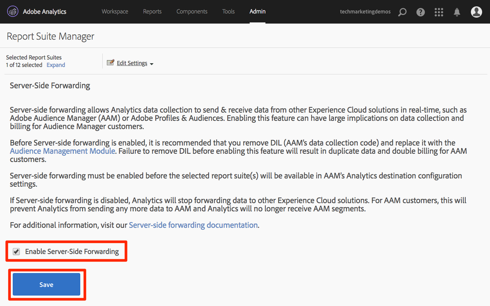

# Lägg till Adobe Audience Manager

I den här lektionen får du hjälp med att aktivera Adobe Audience Manager med hjälp av Serverside Forwarding.

[Adobe Audience Manager](https://experienceleague.adobe.com/docs/audience-manager/user-guide/aam-home.html) (AAM) tillhandahåller branschledande tjänster för datahantering online för målgrupper, vilket ger digitala annonsörer och utgivare de verktyg de behöver för att kontrollera och utnyttja sina datatillgångar för att öka försäljningen.

>[!NOTE]
>
>Adobe Experience Platform Launch håller på att integreras i Adobe Experience Platform som en serie datainsamlingstekniker. Flera terminologiska förändringar har introducerats i gränssnittet som du bör vara medveten om när du använder det här innehållet:
>
> * Platforma launchen (klientsidan) är nu **[[!DNL tags]](https://experienceleague.adobe.com/docs/experience-platform/tags/home.html?lang=sv)**
> * Platforma launchens serversida är nu **[[!DNL event forwarding]](https://experienceleague.adobe.com/docs/experience-platform/tags/event-forwarding/overview.html)**
> * Edge-konfigurationer är nu **[[!DNL datastreams]](https://experienceleague.adobe.com/docs/experience-platform/edge/fundamentals/datastreams.html)**

## Utbildningsmål

När lektionen är klar kan du:

1. Beskriv de två viktigaste sätten att implementera Audience Manager på en webbplats
1. Lägg till Audience Manager med hjälp av funktionen för vidarebefordran på serversidan i Analytics
1. Validera implementeringen av Audience Manager

## Förhandskrav

Du behöver följande för att kunna slutföra lektionen:

1. För att ha slutfört lektionerna i [Konfigurera taggar](create-a-property.md), [Lägg till Adobe Analytics](analytics.md) och [Lägg till identitetstjänsten](id-service.md).

1. Administratörsåtkomst till Adobe Analytics så att du kan aktivera vidarebefordran på serversidan för den rapportserie du använder för kursen. Du kan också be en befintlig administratör på din organisation att göra detta åt dig enligt instruktionerna nedan.

1. Din &quot;Audience Manager-underdomän&quot; (kallas även &quot;Partner-namn&quot;, &quot;Partner-ID&quot; eller &quot;Partner-underdomän&quot;). Om du redan har Audience Manager på din webbplats är det enklaste sättet att få tillgång till den att gå till din webbplats och öppna Felsökning. Underdomänen är tillgänglig på fliken Sammanfattning i avsnittet Audience Manager:

   

Om du inte redan har implementerat Audience Manager följer du de här instruktionerna för att [hämta din Audience Manager-underdomän](https://experienceleague.adobe.com/docs/audience-manager-learn/tutorials/web-implementation/how-to-identify-your-partner-id-or-subdomain.html).

## Implementeringsalternativ

Det finns två sätt att implementera Audience Manager på en webbplats:

* **Vidarebefordring på serversidan (SSF)** - för kunder med Adobe Analytics är detta det enklaste och rekommenderade sättet att implementera. Adobe Analytics skickar data till AAM på Adobe backend, vilket gör att det går att skicka en mindre begäran på sidan. Detta möjliggör också viktiga integreringsfunktioner och uppfyller våra bästa metoder för implementering och driftsättning av Audience Manager-kod.

* **Klientsidan DIL** - Den här metoden är avsedd för kunder som inte har Adobe Analytics. DIL-kod (Data Integration Library Code, den AAM JavaScript-konfigurationskoden) skickar data direkt från webbsidan till Audience Manager.

Eftersom du redan har distribuerat Adobe Analytics i den här självstudiekursen kommer du att distribuera Audience Manager med hjälp av Serverside Forwarding. En fullständig beskrivning och kravlista för vidarebefordran på serversidan finns i [dokumentationen](https://experienceleague.adobe.com/docs/analytics/admin/admin-tools/server-side-forwarding/ssf.html), så att du vet hur den fungerar, vad som krävs och hur du validerar.

## Aktivera vidarebefordran på serversidan

Det finns två huvudsteg i en SSF-implementering:

1. Aktiverar en växel i Analytics-Admin Console för att vidarebefordra data från Analytics till Audience Manager *per rapportsvit*.
1. Placera koden på plats, vilket görs via taggar. För att det här ska fungera på rätt sätt måste du ha tillägget Adobe Experience Platform Identity Service installerat, liksom Analytics-tillägget (du *behöver inte* det AAM tillägget, vilket förklaras nedan).

### Aktivera vidarebefordran på serversidan i Analytics Admin Console

Det krävs en konfiguration i Adobe Analytics Admin Console för att börja vidarebefordra data från Adobe Analytics till Adobe Audience Manager. Eftersom det kan ta upp till fyra timmar att börja vidarebefordra data bör du göra det här steget först.

#### Aktivera SSF i Analytics Admin Console

1. Logga in på Analytics via användargränssnittet i Experience Cloud. Om du inte har administratörsåtkomst till Analytics måste du prata med Experience Cloud- eller Analytics-administratören för att tilldela dig åtkomst eller slutföra de här stegen åt dig.

   

1. I den översta navigeringen i Analytics väljer du **[!UICONTROL Admin > Report Suites]**, och i listan markerar du (multi-select) de rapportsviter som du vill vidarebefordra till Audience Manager.

   

1. Välj **[!UICONTROL Edit Settings > General > Server-Side Forwarding]** på skärmen Rapportsviter och med rapportsviten/rapportsviterna markerade.

   

   >[!WARNING]
   >
   >Som vi nämnt ovan måste du ha administratörsbehörighet för att kunna se det här menyalternativet.

1. Läs informationen på sidan Vidarebefordra på serversidan och markera kryssrutan till **[!UICONTROL Enable Server-Side Forwarding]** för rapportsviten/-sviterna.

1. Klicka på **[!UICONTROL Save]**

   

>[!NOTE]
>
>Eftersom SSF måste aktiveras per rapportserie, glöm inte att upprepa det här steget för dina riktiga rapportsviter när du distribuerar SWF på den faktiska webbplatsens rapportserie.
>
>Om SSF-alternativet är nedtonat måste du mappa rapportsviten(en) till din Experience Cloud-organisation för att kunna aktivera alternativet. Detta förklaras i [dokumentationen](https://experienceleague.adobe.com/docs/analytics/admin/data-governance/gdpr-view-settings.html).

När det här steget har slutförts och du har aktiverat Adobe Experience Platform Identity Service, vidarebefordras data från Analytics till AAM. Om du vill slutföra processen så att svaret kommer tillbaka korrekt från AAM till sidan (och även till Analytics via funktionen Audience Analytics) måste du slutföra följande steg i taggar också. Oroa dig inte, det är superenkelt.

### Aktivera vidarebefordran på serversidan i taggar

Detta är det andra av två steg för att aktivera SSF. Du har redan växlat i Analytics Admin Console och nu behöver du bara lägga till koden, vilka taggar som passar dig om du bara markerar rätt ruta.

>[!NOTE]
>
>För att implementera vidarebefordran av analysdata på serversidan i AAM redigerar/konfigurerar vi faktiskt Analytics-tillägget i taggar, **inte** AAM. Tillägget AAM används endast för implementeringar på klientsidan DIL, för dem som inte har Adobe Analytics. Så följande steg är korrekta när de skickar dig till Analytics-tillägget för att konfigurera detta.

#### Aktivera SSF i taggar

1. Gå till **[!UICONTROL Extensions > Installed]** och klicka för att konfigurera Analytics-tillägget.

   

1. Expandera avsnittet `Adobe Audience Manager`

1. Markera rutan till **[!UICONTROL Automatically share Analytics Data with Audience Manager]**. Detta lägger till Audience Manager-modulen (kod) i implementeringen av Analytics `AppMeasurement.js`.

1. Lägg till din&quot;Audience Manager-underdomän&quot; (kallas även&quot;Partnernamn&quot;,&quot;Partner-ID&quot; eller&quot;Partnerunderdomän&quot;). Följ de här instruktionerna för att [hämta din Audience Manager-underdomän](https://experienceleague.adobe.com/docs/audience-manager-learn/tutorials/web-implementation/how-to-identify-your-partner-id-or-subdomain.html).

1. Klicka på **[!UICONTROL Save to Library and Build]**

   

Kod för vidarebefordran på serversidan har nu implementerats!

### Validera vidarebefordran på serversidan

Det viktigaste sättet att verifiera att vidarebefordran på serversidan är igång är att titta på svaret på något av dina Adobe Analytics-träffar. Vi kommer till det om en minut. Under tiden kan vi kontrollera några andra saker som kan hjälpa oss att se till att det fungerar som vi vill.

#### Kontrollera att koden läses in korrekt

Koden som installeras för att hantera vidarebefordran, och särskilt svaret från AAM till sidan, kallas Audience Manager
&quot;Modul.&quot; Vi kan använda Experience Cloud Debugger för att se till att den har lästs in.

1. Öppna Luma-webbplatsen
1. Klicka på felsökningsikonen i webbläsaren för att öppna felsökningsprogrammet för Experience Cloud
1. På fliken Sammanfattning bläddrar du nedåt till avsnittet Analytics
1. Verifiera att **AudienceManagement** är listad under avsnittet Moduler

   

#### Verifiera partner-ID:t i felsökaren

Därefter kan vi även verifiera att felsökaren hämtar rätt &quot;partner-ID&quot; (AKA Partner-underdomän, osv.) från koden.

1. Bläddra nedåt till Audience Manager-avsnittet medan du fortfarande är i felsökningsprogrammet och fortfarande på fliken Sammanfattning
1. Verifiera ditt partner-ID/din underdomän under &quot;Partner&quot;

   

>[!WARNING]
>
>Du kan lägga märke till att felsökarens avsnitt Audience Manager hänvisar till&quot;DIL&quot;, som är&quot;Datan Integration Library&quot;, och vanligtvis avser en implementering på klientsidan, i motsats till serversidan som vi har implementerat här. Sanningen är att den AAM&quot;modulen&quot; (som används i den här SSF-metoden) använder mycket av samma kod som DIL-biblioteket på klientsidan, och att den här felsökaren för närvarande rapporterar den som sådan. Om du har följt stegen i den här självstudiekursen och resten av objekten i det här valideringsavsnittet är korrekta, kan du vara säker på att vidarebefordran på serversidan fungerar.

#### Verifiera analysbegäran och -svar

Okej, det här är biggie. Om du inte vidarebefordrar data från Analytics till Audience Manager på serversidan finns det ingen respons på Analytics-fyren (förutom en 2x2-pixel). Om du däremot gör en SWF-fil finns det objekt som du kan verifiera i Analytics-begäran och -svaret som talar om för dig att den fungerar som den ska.
Tyvärr stöder inte felsökaren i Experience Cloud för närvarande svaret på beaconerna. Därför bör du använda en annan felsöknings-/paketutlösare, som Charles Proxy eller webbläsarens Developer Tools.

1. Öppna Utvecklarverktygen i webbläsaren och gå till fliken Nätverk
1. I filterfältet skriver du `b/ss` som begränsar det du ser till Adobe Analytics-begäranden
1. Uppdatera sidan för att se Analytics-begäran

   

1. I Analytics-fyren (begäran) söker du efter en callback-parameter. Den ställs in på något sådant: `s_c_il[1].doPostbacks`

   

1. Du får ett svar på Analytics-fyren. Den innehåller referenser till doPostbacks, vilket anropas i begäran, och viktigast av allt, den bör ha ett&quot;stuff&quot;-objekt. Här skickas AAM segment-ID tillbaka till webbläsaren. Om du har &quot;stuff&quot;-objektet fungerar SSF!

   

>[!WARNING]
>
>Se upp för False &quot;Success&quot; - Om det finns ett svar och allt verkar fungera bör du **kontrollera** att du har det där &quot;stuff&quot;-objektet. Annars kanske du får ett meddelande i svaret med texten&quot;status&quot;:&quot;SUCCESS&quot;. Detta är faktiskt ett bevis på att **INTE** fungerar korrekt, eftersom det låter så galet. Om du ser detta innebär det att du har slutfört det andra steget (koden i taggar), men att vidarebefordran i Analytics Admin Console (första steget i det här avsnittet) inte har slutförts ännu. I det här fallet måste du verifiera att du har aktiverat SWF i Analytics Admin Console. Om du har det, och det inte har gått 4 timmar än, var tålmodig.

[Nästa&quot;Experience Cloud Integrations&quot; >](integrations.md)
