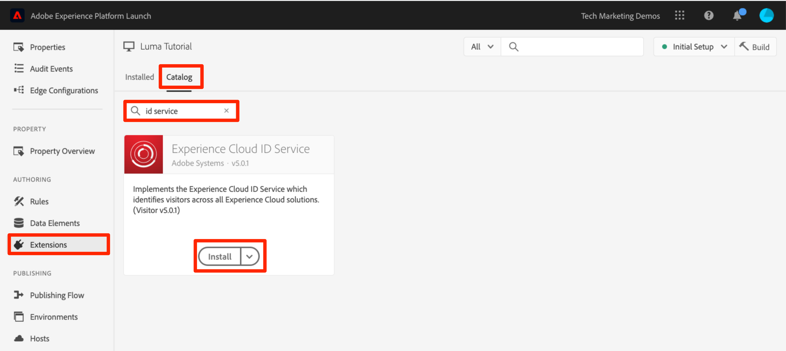
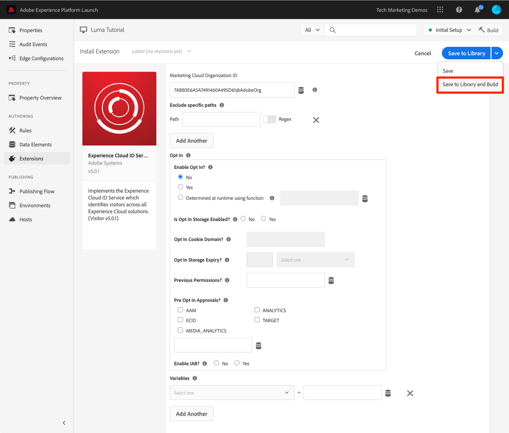
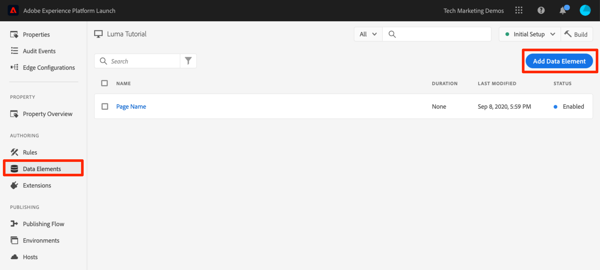
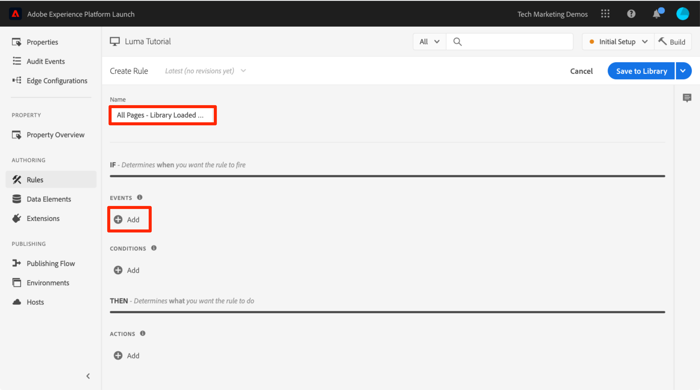
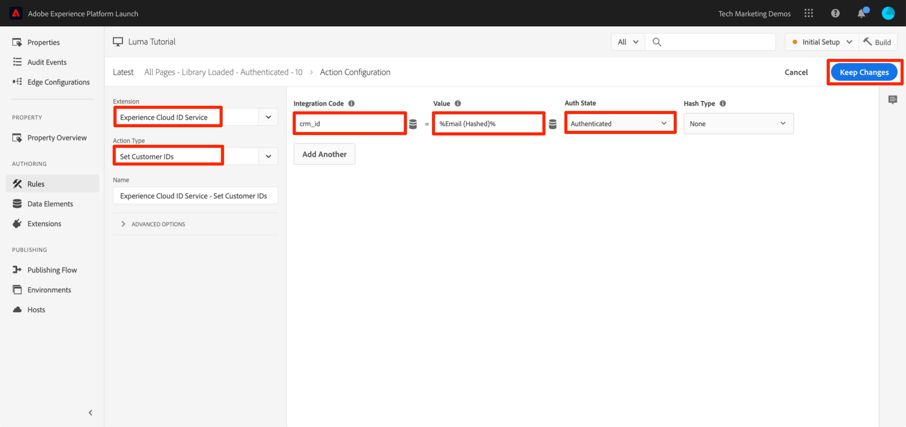

# Lägg till Adobe Experience Platform identitetstjänst

I den här lektionen får du hjälp att implementera [Adobe Experience Platform Identity Service-tillägg](https://experienceleague.adobe.com/docs/experience-platform/tags/extensions/adobe/id-service/overview.html) och skicka kundens ID:n.

The [Adobe Experience Platform Identity Service](https://experienceleague.adobe.com/docs/id-service/using/home.html) anger ett gemensamt besökar-ID för alla Adobe-lösningar för att stärka Experience Cloud:s möjligheter, som målgruppsdelning mellan olika lösningar. Du kan också skicka dina egna kund-ID:n till tjänsten för att möjliggöra målinriktning och integrering mellan olika enheter med CRM-systemet (Customer Relationship Management).

>[!NOTE]
>
>Adobe Experience Platform Launch håller på att integreras i Adobe Experience Platform som en serie datainsamlingstekniker. Flera terminologiska förändringar har introducerats i gränssnittet som du bör vara medveten om när du använder det här innehållet:
>
> * platforma launchen (klientsidan) är nu **[[!DNL tags]](https://experienceleague.adobe.com/docs/experience-platform/tags/home.html?lang=sv)**
> * platform launch Server Side is now **[[!DNL event forwarding]](https://experienceleague.adobe.com/docs/experience-platform/tags/event-forwarding/overview.html)**
> * Edge-konfigurationer är nu **[[!DNL datastreams]](https://experienceleague.adobe.com/docs/experience-platform/edge/fundamentals/datastreams.html)**


## Utbildningsmål

När lektionen är klar kan du:

* Lägg till identitetstjänsttillägget
* Skapa ett dataelement för att samla in dina kund-ID:n
* Skapa en regel som använder åtgärden Ange kund-ID för att skicka kund-ID:n till Adobe
* Använd funktionen för regelordning för att sekvensera regler som utlöses för samma händelse

## Förutsättningar

Du borde ha slutfört lektionerna i [Konfigurera taggar](create-a-property.md) -avsnitt.

## Lägg till identitetstjänsttillägget

Eftersom det här är det första tillägget som du lägger till finns det en snabb översikt över tilläggen. Tillägg är en av de viktigaste funktionerna i taggar. Ett tillägg är en integrering som byggts av Adobe, en partner i Adobe eller en Adobe-kund som lägger till nya och oändliga alternativ för de taggar som du kan distribuera på din webbplats. Om du tänker på taggar som ett operativsystem är tillägg de program du installerar så att taggarna kan göra det du behöver för att göra det.

**Lägga till identitetstjänsttillägget**

1. Klicka på **[!UICONTROL Tillägg]**

1. Klicka **[!UICONTROL Katalog]** för att gå till sidan för tilläggskatalogen

1. Observera de olika tillägg som är tillgängliga i katalogen

1. I filtret längst upp skriver du&quot;id&quot; för att filtrera katalogen

1. På kortet för Adobe Experience Platform identitetstjänst klickar du på **[!UICONTROL Installera]**

   

1. Observera att ditt organisations-ID för Experience Cloud har identifierats automatiskt.

1. Lämna alla standardinställningar och klicka på **[!UICONTROL Spara i bibliotek och bygge]**

   

>[!NOTE]
>
>Varje version av identitetstjänsttillägget innehåller en specifik version av VisitorAPI.js som beskrivs i tilläggsbeskrivningen. Du uppdaterar versionen av VisitorAPI.js genom att uppdatera identitetstjänsttillägget.

### Validera tillägget

Identitetstjänsttillägget är ett av de få taggtillägg som gör en begäran utan att behöva använda en regelåtgärd. Tillägget skickar automatiskt en begäran till identitetstjänsten på första sidan som laddas vid det första besöket på en webbplats. När ID:t har begärts lagras det i en cookie från första part som börjar med AMCV_.

**Så här validerar du identitetstjänsttillägget**

1. Öppna [Luma site](https://luma.enablementadobe.com/content/luma/us/en.html)

1. Kontrollera att felsökaren mappar taggegenskapen till *din* Utvecklingsmiljö, enligt beskrivningen i [tidigare lektion](switch-environments.md).

1. På fliken Sammanfattning i felsökaren bör taggavsnittet ange att tillägget för Adobe Experience Platform Identity Service är implementerat.

1. På fliken Sammanfattning ska identitetstjänstens avsnitt även innehålla samma Org ID som fanns på din tilläggskonfigurationsskärm i datainsamlingsgränssnittet:

   

1. Den första begäran om att hämta besökar-ID:t kan visas på fliken Identitetstjänst i Felsökning. Det kanske redan har begärts, så oroa dig inte om du inte ser det:
   

1. Efter den första begäran om att hämta besökar-ID:t lagras ID:t i en cookie vars namn börjar med `AMCV_`. Du kan bekräfta att cookien har angetts genom att göra följande:
   1. Öppna Utvecklarverktyg i webbläsaren
   1. Gå till `Application` tab
   1. Expandera `Cookies` till vänster
   1. Klicka på domänen `https://luma.enablementadobe.com`
   1. Leta efter AMCV_-cookien på höger sida. Du kan se flera saker eftersom du har läst in Luma-webbplatsen med både den hårdkodade taggegenskapen och den har mappats till din egen.
      

Så ja! Du har lagt till ditt första tillägg! Mer information om konfigurationsalternativen för identitetstjänsten finns i [dokumentationen](https://experienceleague.adobe.com/docs/id-service/using/id-service-api/configurations/function-vars.html).

## Skicka kund-ID:n

Sedan skickar du en [Kund-ID](https://experienceleague.adobe.com/docs/id-service/using/reference/authenticated-state.html) till identitetstjänsten. Då kan du [integrera CRM](https://experienceleague.adobe.com/docs/core-services/interface/customer-attributes/attributes.html) med Experience Cloud och spåra besökare på olika enheter.

I den tidigare lektionen [Lägg till dataelement, regler och bibliotek](add-data-elements-rules.md) du skapade ett dataelement och använde det i en regel. Nu ska du använda samma tekniker för att skicka ett kund-ID när besökaren autentiseras.

### Skapa dataelement för kund-ID:n

Börja med att skapa två dataelement:

1. `Authentication State`—för att ta reda på om besökaren är inloggad eller inte
1. `Email (Hashed)`—för att hämta den hashade versionen av e-postadressen (används som kund-ID) från datalagret

**Skapa dataelementet för autentiseringsläge**

1. Klicka **[!UICONTROL Dataelement]** i den vänstra navigeringen
1. Klicka på **[!UICONTROL Lägg till dataelement]** knapp

   

1. Namnge dataelementet `Authentication State`
1. För **[!UICONTROL Dataelementtyp]**, markera **[!UICONTROL Egen kod]**
1. Klicka på **[!UICONTROL Öppna redigeraren]** knapp

   

1. I [!UICONTROL Redigera kod] använder du följande kod för att returnera värden för &quot;loggad in&quot; eller &quot;utloggad&quot; baserat på ett attribut i Luma-platsens datalager:

   ```javascript
   if (digitalData.user[0].profile[0].attributes.loggedIn)
       return "logged in"
   else
       return "logged out"
   ```

1. Klicka **[!UICONTROL Spara]** för att spara den anpassade koden

   

1. Låt alla andra inställningar behålla sina standardvärden
1. Klicka **[!UICONTROL Spara i bibliotek]** för att spara dataelementet och återgå till dataelementsidan. Vi behöver inte göra något&quot;Build&quot; förrän vi har gjort alla ändringar och är klara att validera.

   

Genom att känna till användarens autentiseringsstatus vet du när ett kund-ID ska finnas på sidan som ska skickas till identitetstjänsten. Nästa steg är att skapa ett dataelement för kundens ID. På Lumas demowebbplats använder du den hashade versionen av besökarens e-postadress.

**Lägga till dataelementet för det hash-kodade e-postmeddelandet**

1. Klicka på **[!UICONTROL Lägg till dataelement]** knapp

   

1. Namnge dataelementet `Email (Hashed)`
1. För **[!UICONTROL Dataelementtyp]**, markera **[!UICONTROL JavaScript-variabel]**
1. Som **[!UICONTROL JavaScript-variabelnamn]** använder du följande pekare för en variabel i Luma-platsens datalager: `digitalData.user.0.profile.0.attributes.username`
1. Låt alla andra inställningar behålla sina standardvärden
1. Klicka **[!UICONTROL Spara i bibliotek]** för att spara dataelementet

   

### Lägg till en regel för att skicka kund-ID:n

Adobe Experience Platform identitetstjänst skickar kund-ID:n i regler med en åtgärd som kallas&quot;Ange kund-ID:n&quot;.  Du kommer nu att skapa en regel som utlöser den här åtgärden när besökaren autentiseras.

**Så här skapar du en regel som skickar kund-ID:n**

1. Klicka på **[!UICONTROL Regler]**
1. Klicka **[!UICONTROL Lägg till regel]** för att öppna regelverktyget

   

1. Namnge regeln `All Pages - Library Loaded - Authenticated - 10`

   >[!TIP]
   >
   >Den här namnkonventionen anger att du skjuter upp den här regeln högst upp på alla sidor när användaren autentiseras och den får ordningen &quot;10&quot;. Om du använder en namngivningskonvention som den här, i stället för att namnge den för de lösningar som utlöses i åtgärderna, kan du minimera det totala antalet regler som krävs för implementeringen.

1. Under **[!UICONTROL Händelser]** klicka **[!UICONTROL Lägg till]**

   

   1. För **[!UICONTROL Händelsetyp]** välj **[!UICONTROL Bibliotek inläst (sidan ovanpå)]**
   1. Expandera **[!UICONTROL Avancerade alternativ]** -avsnittet och för  **[!UICONTROL Order]** enter `10`. Ordningen styr den sekvens med regler som aktiveras av samma händelse. Regler med lägre ordning aktiveras före regler med högre ordning. I det här fallet vill du ange kund-ID:t innan du startar Target-begäran, som du gör i nästa lektion med en regel i ordningen `50` .
   1. Klicka på **[!UICONTROL Behåll ändringar]** för att återgå till regelbyggaren

   

1. Under **[!UICONTROL Villkor]** klicka **[!UICONTROL Lägg till]**

   

   1. För **[!UICONTROL Villkorstyp]** välj **[!UICONTROL Värdejämförelse]**
   1. Klicka på  -ikon för att öppna det modala dataelementet

      

   1. Klicka på **[!UICONTROL Autentiseringstillstånd]** och sedan klicka **[!UICONTROL Välj]**

      

1. Se till att `Equals` är operatorn
1. Skriv &quot;loggad in&quot; i textfältet, vilket gör att regeln utlöses när dataelementet &quot;Autentiseringsstatus&quot; har värdet &quot;inloggad&quot;

1. Klicka **[!UICONTROL Behåll ändringar]**

   

1. Under **[!UICONTROL Åtgärder]** klicka **[!UICONTROL Lägg till]**

   

   1. För **[!UICONTROL Tillägg]** välj **[!UICONTROL Experience Cloud ID-tjänst]**
   1. För **[!UICONTROL Åtgärdstyp]** välj **[!UICONTROL Ange kund-ID]**
   1. För **[!UICONTROL Integrationskod]** enter `crm_id`
   1. För **[!UICONTROL Värde]** ange att väljaren för dataelement ska vara modal och markera `Email (Hashed)`
   1. För **[!UICONTROL Autentiseringsläge]** välj **[!UICONTROL Autentiserad]**
   1. Klicka på **[!UICONTROL Behåll ändringar]** för att spara åtgärden och återgå till regelbyggaren

      

1. Klicka på **[!UICONTROL Spara i bibliotek och bygge]** för att spara regeln

   

Du har nu skapat en regel som skickar kundens ID som en variabel `crm_id` när besökaren är autentiserad. Sedan du angett beställningen som `10` den här regeln startar innan `All Pages - Library Loaded` regel som skapas i [Lägg till dataelement, regler och bibliotek](add-data-elements-rules.md) lektion som använder standardvärdet för Ordning för `50`.

### Validera kund-ID:n

För att validera ditt arbete loggar du in på Luma-webbplatsen för att bekräfta beteendet för den nya regeln.

**Logga in på Luma-webbplatsen**

1. Öppna [Luma site](https://luma.enablementadobe.com/content/luma/us/en.html)

1. Kontrollera att felsökaren mappar taggegenskapen till *din* Utvecklingsmiljö, enligt beskrivningen i [tidigare lektion](switch-environments.md)

   

1. Klicka på **[!UICONTROL INLOGGNING]** länk i det övre högra hörnet på Luma-webbplatsen

   

1. Retur `test@adobe.com` som användarnamn
1. Retur `test` som lösenord
1. Klicka på **[!UICONTROL INLOGGNING]** knapp

   

1. Återgå till startsidan

Bekräfta att kund-ID:t skickas till tjänsten med felsökningstillägget.

**Verifiera att identitetstjänsten skickar kund-ID:t**

1. Kontrollera att fliken med Luma-webbplatsen är i fokus
1. Gå till fliken Adobe Experience Platform Identity Service i Felsökning
1. Expandera ditt Org ID
1. Klicka på cellen med `Customer ID - crm_id` value
1. Observera kundens ID-värde i modalkoden och att `AUTHENTICATED` visas:

   

1. Observera att du kan bekräfta det hash-kodade e-postvärdet genom att visa Luma-sidans källkod och titta på egenskapen username. Den ska matcha det värde du ser i Felsökning:

   

### Ytterligare valideringstips

Taggar har också omfattande loggningsfunktioner för konsoler. Om du vill aktivera dem går du till **[!UICONTROL verktyg]** i Felsökning och aktivera **[!UICONTROL taggkonsolloggning]** växla.


Detta aktiverar konsolloggning både i webbläsarkonsolen och på fliken Loggar i felsökaren. Du bör se loggningen av alla regler du har skapat hittills! Observera att nya loggposter läggs till högst upp i listan. Därför bör regeln &quot;Alla sidor - Bibliotek inläst - autentiserad - 10&quot; utlösas före regeln &quot;Alla sidor - Bibliotek inläst&quot; och visas nedanför den i Felsökarens konsolloggning:


[Nästa&quot;Lägg till Adobe Target&quot; >](target.md)
