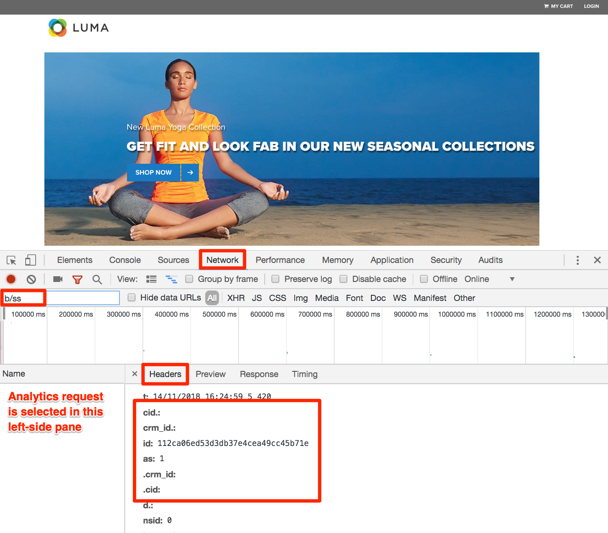

# Experience Cloud Integrations

I den här lektionen ska du läsa om de viktigaste integreringarna mellan de lösningar du just implementerat. Den goda nyheten är att genom att komplettera de tidigare lektionerna har du redan implementerat kodaspekterna för integreringarna! Du behöver inte göra något annat i den här lektionen förutom att läsa och validera.

## Utbildningsmål

När lektionen är klar kan du:

1. Förklara de grundläggande användningsexemplen för målgruppsdelning, analys för målgruppsintegrering (A4T) och kundattribut
1. Validera de grundläggande implementeringsaspekterna för dessa integreringar på klientsidan

## Förhandskrav

Du bör slutföra alla tidigare lektioner i den här självstudiekursen innan du följer instruktionerna i den här lektionen.

>[!NOTE]
>
>Det finns många krav på användarbehörigheter, kontokonfigurationer och etableringssteg som krävs för att fullt ut kunna använda dessa integreringar och som ligger utanför kursens räckvidd. Om du inte redan använder dessa integreringar i din nuvarande implementering av Experience Cloud bör du tänka på följande:
>
>* Granska de fullständiga kraven för [bastjänstintegreringarna](https://experienceleague.adobe.com/en/docs/core-services/interface/services/getting-started)
>* Granska de fullständiga kraven för [Analytics for Target-integrering](https://experienceleague.adobe.com/en/docs/target/using/integrate/a4t/before-implement)

## Målgrupper

[Publiker](https://experienceleague.adobe.com/en/docs/core-services/interface/services/audiences/overview) ingår i People Core-tjänsten och gör att du kan dela målgrupper mellan olika lösningar. Du kan till exempel skapa en målgrupp i Audience Manager och använda den för att leverera personaliserat innehåll med Target.

De viktigaste kraven för att implementera A4T, som du redan har gjort, är att:

1. Implementera Adobe Experience Platform Identity Service
1. Implementera Audience Manager
1. Implementera andra lösningar som ni vill ta emot eller skapa målgrupper, som Target och Analytics

### Validera publikintegreringen

Det bästa sättet att validera målgruppsintegreringen är att bygga en målgrupp, dela den med en annan lösning och sedan använda den fullt ut i den andra lösningen (t.ex. bekräfta att en besökare som kvalificerar sig för ett AAM-segment kan kvalificera sig för en Target-aktivitet som är riktad till det segmentet). Detta ligger dock utanför kursens räckvidd.

Dessa valideringssteg fokuserar på den kritiska delen som visas i implementeringen på klientsidan, besökar-ID:t.

1. Öppna [Luma-webbplatsen](https://luma.enablementadobe.com/content/luma/us/en.html)

1. Kontrollera att felsökaren mappar taggegenskapen till *din*-utvecklingsmiljö, vilket beskrivs i [tidigare lektion](switch-environments.md)

   

1. Gå till fliken Nätverk i Felsökning

1. Klicka på **[!UICONTROL Clear All Requests]** bara för att rensa upp saker

1. Läs in Luma-sidan igen och se till att du ser både Target- och Analytics-begäranden i Felsökning

1. Läs in Luma-sidan igen

1. Du bör nu se fyra förfrågningar på fliken Nätverk i Felsökning - två för Target och två för Analytics

1. Leta i raden med namnet&quot;Experience Cloud Visitor ID&quot;. ID:n i varje begäran från varje lösning ska alltid vara desamma.

   

1. ID:n är unika per besökare, som du kan bekräfta genom att be en medarbetare att upprepa dessa steg.

## Analyser för mål (A4T)

Integreringen [Analytics för Target (A4T)](https://experienceleague.adobe.com/docs/target/using/integrate/a4t/a4t.html) gör att du kan använda dina Analytics-data som källa för rapportering av mått i Target.

De viktigaste kraven för att implementera A4T, som du redan har gjort, är att:

1. Implementera Adobe Experience Platform Identity Service
1. Starta begäran om inläsning av målsidan före visningsläget för sidan Analytics

A4T fungerar genom att sammanfoga en begäran från Target till Analytics på serversidan med analysfunktionen, som vi kallar&quot;träffsammanfogning&quot;.  Träffsammanfogning kräver att den Target-begäran som levererar aktiviteten (eller ökar ett Target-baserat målmått) har en parameter som matchar en parameter i analyssidans vy. Den här parametern kallas för tilläggs-ID (SDID).

### Validera A4T-implementeringen

Det bästa sättet att validera A4T-integreringen är att faktiskt skapa en Target-aktivitet med A4T och validera rapportdata, men detta ligger utanför kursens räckvidd. I den här självstudiekursen får du se hur du kan bekräfta att ID:n för kompletterande data matchar mellan lösningsanropen.

**Så här validerar du SDID:n**

1. Öppna [Luma-webbplatsen](https://luma.enablementadobe.com/content/luma/us/en.html)

1. Kontrollera att felsökaren mappar taggegenskapen till *din*-utvecklingsmiljö, vilket beskrivs i [tidigare lektion](switch-environments.md)

   

1. Gå till fliken Nätverk i Felsökning

1. Klicka på **[!UICONTROL Clear All Requests]** bara för att rensa upp saker

1. Läs in Luma-sidan igen och se till att du ser både Target- och Analytics-begäranden i Felsökning

1. Läs in Luma-sidan igen

1. Du bör nu se fyra förfrågningar på fliken Nätverk i Felsökning - två för Target och två för Analytics

1. Titta på raden med namnet&quot;Kompletterande data-ID&quot;. ID:n från den första sidinläsningen ska matcha mellan Target och Analytics. ID:n från den andra sidinläsningen ska också matcha, men skilja sig från den första sidinläsningen.

   

Om du gör ytterligare Target-begäranden inom omfånget för en sidinläsning (inte inkluderar enkelsidiga program) som ingår i A4T-aktiviteter, är det bra att ge dem unika namn (inte target-global-mbox) så att de även fortsättningsvis har samma SDID:n som de ursprungliga Target- och Analytics-begärandena.

## Kundattribut

[Kundattribut](https://experienceleague.adobe.com/docs/core-services/interface/customer-attributes/attributes.html) är en del av People Core-tjänsten som gör att du kan överföra data från CRM-databasen (customer relationship management) och använda dem i Adobe Analytics och Adobe Target.

De viktigaste kraven för att implementera kundattribut - som du redan har gjort - är att:

1. Implementera Adobe Experience Platform Identity Service
1. Ange kund-ID:n via Id-tjänsten *innan* Mål och analys skickar sina förfrågningar (som du har slutfört med funktionen för regelordning i taggar)

### Validera implementeringen av kundattribut

Du har redan verifierat att kund-ID:n skickas till både identitetstjänsten och Target i tidigare lektioner. Du kan även validera kund-ID:t i Analytics-träffen.
För närvarande är Kund-ID en av de få parametrar som inte visas i Experience Cloud Debugger, så du använder webbläsarens JavaScript Console för att visa den.

1. Öppna Luma-webbplatsen
1. Öppna Utvecklarverktyg i webbläsaren
1. Gå till fliken Nätverk
1. I filterfältet skriver du `b/ss` som begränsar det du ser till Adobe Analytics-begäranden

   

1. Klicka på länken **[!UICONTROL LOGIN]** i det övre högra hörnet på webbplatsen

   

1. Ange `test@test.com` som användarnamn
1. Ange `test` som lösenord
1. Klicka på knappen **[!UICONTROL LOGIN]**

   

1. Du bör gå tillbaka till hemsidan, som också kommer att utlösa en fyr som du kan se i Utvecklarverktyg. Om du kommer till kontoinformationssidan klickar du på logotypen WE.RETAIL för att gå tillbaka till hemsidan.
1. Klicka på begäran och välj fliken Sidhuvuden
1. Bläddra nedåt tills du ser några kapslade parametrar
   1. cid - det här är standardavgränsaren för kundens ID-del i begäran
   1. crm_id - Det här är den anpassade integreringskoden som du angav i lektionen Identitetstjänst
   1. id - Kund-ID-värdet som kommer från dataelementet `Email (Hashed)`
   1. as - Autentiseringstillståndet, med innebörden &quot;1&quot;, är inloggad

   

[Nästa&quot;Publicera din egenskap&quot; >](publish.md)
