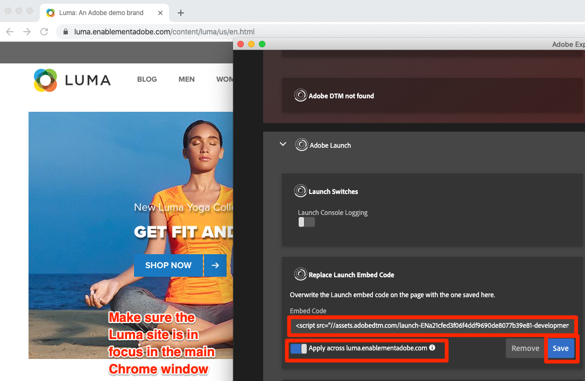
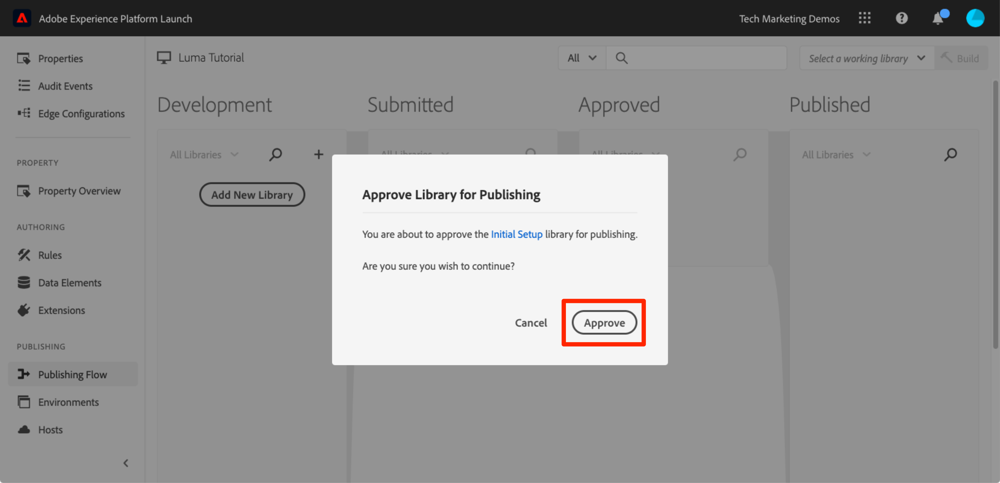

# Publish din taggegenskap

Nu när du har implementerat några av Adobe Experience Cloud lösningar i utvecklingsmiljön är det dags att lära sig publiceringsflödet.

>[!NOTE]
>
>Adobe Experience Platform Launch håller på att integreras i Adobe Experience Platform som en serie datainsamlingstekniker. Flera terminologiska förändringar har introducerats i gränssnittet som du bör vara medveten om när du använder det här innehållet:
>
> * Platforma launchen (klientsidan) är nu **[[!DNL tags]](https://experienceleague.adobe.com/docs/experience-platform/tags/home.html?lang=sv)**
> * Platforma launchens serversida är nu **[[!DNL event forwarding]](https://experienceleague.adobe.com/docs/experience-platform/tags/event-forwarding/overview.html?lang=sv-SE)**
> * Edge-konfigurationer är nu **[[!DNL datastreams]](https://experienceleague.adobe.com/docs/experience-platform/edge/fundamentals/datastreams.html?lang=sv-SE)**

## Utbildningsmål

När lektionen är klar kan du:

1. Publish a Development library to the Staging environment
1. Mappa ett mellanlagringsbibliotek till produktionswebbplatsen med hjälp av Felsökning
1. Publish ett mellanlagringsbibliotek till produktionsmiljön

## Publish till mellanlagring

Nu när du har skapat och validerat ditt bibliotek i utvecklingsmiljön är det dags att publicera det på Förproduktion.

1. Gå till sidan **[!UICONTROL Publishing Flow]**

1. Öppna listrutan bredvid ditt bibliotek och välj **[!UICONTROL Submit for Approval]**

   

1. Klicka på knappen **[!UICONTROL Submit]** i dialogrutan:

   

1. Ditt bibliotek visas nu i kolumnen [!UICONTROL Submitted] i ett obyggt tillstånd:

1. Öppna listrutan och välj **[!UICONTROL Build for Staging]**:

   

1. När ikonen med grön punkt visas kan biblioteket förhandsgranskas i mellanlagringsmiljön.

I verkligheten är nästa steg i processen vanligtvis att låta QA-teamet validera ändringarna i mellanlagringsbiblioteket. De kan göra detta med Felsökning.

**Validera ändringarna i mellanlagringsbiblioteket**

1. Öppna sidan [!UICONTROL Environments] i taggegenskapen

1. Klicka på ikonen  på raden [!UICONTROL Staging] för att öppna den modala

   

1. Klicka på ikonen Kopiera  för att kopiera inbäddningskoden till Urklipp

1. Klicka på **[!UICONTROL Close]** för att stänga spärren

   

1. Öppna [Luma-demowebbplatsen](https://luma.enablementadobe.com/content/luma/us/en.html) i din Chrome-webbläsare

1. Öppna [Felsökningstillägget för Experience Platform](https://chromewebstore.google.com/detail/adobe-experience-platform/bfnnokhpnncpkdmbokanobigaccjkpob) genom att klicka på ikonen  .

   

1. Gå till fliken Verktyg

1. I avsnittet **[!UICONTROL Adobe Launch > Replace Launch Embed Code]** klistrar du in den mellanlagringsinbäddningskod som finns i Urklipp
1. Aktivera växeln **[!UICONTROL Apply across luma.enablementadobe.com]**

1. Klicka på diskikonen för att spara

   

1. Läs in och kontrollera fliken Sammanfattning i Felsökning. Under startavsnittet ska du nu se hur egenskapen för mellanlagring implementeras och visa ditt egenskapsnamn (t.ex.&quot;tagg, självstudiekurs&quot; eller något annat namn på din egenskap).

   

När kvalitetsteamet har signerat i realtid genom att granska ändringarna i mellanlagringsmiljön är det dags att publicera i produktionen.

## Publish till produktion

1. Gå till sidan [!UICONTROL Publishing]

1. Klicka på **[!UICONTROL Approve for Publishing]** i listrutan:

   

1. Klicka på knappen **[!UICONTROL Approve]** i dialogrutan:

   

1. Biblioteket kommer nu att visas i kolumnen [!UICONTROL Approved] i obebyggt läge (gul punkt):

1. Öppna listrutan och välj **[!UICONTROL Build and Publish to Production]**:

   

1. Klicka på **[!UICONTROL Publish]** i dialogrutan:

   

1. Biblioteket visas nu i kolumnen [!UICONTROL Published]:

   

Så ja! Du har slutfört självstudiekursen och publicerat din första egenskap i taggar!
