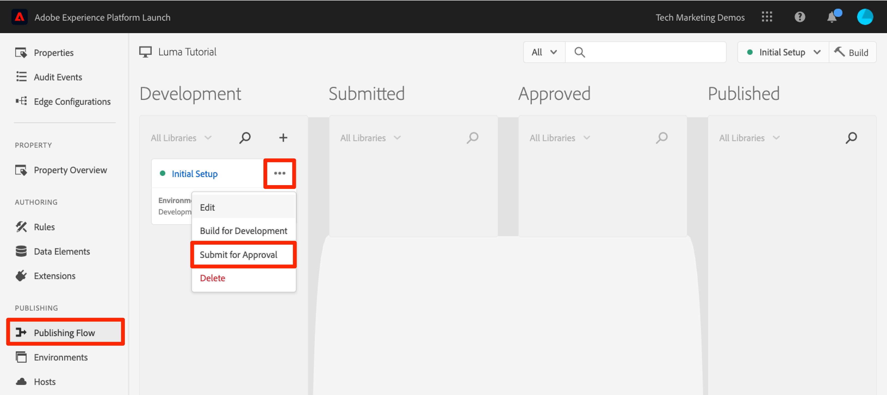
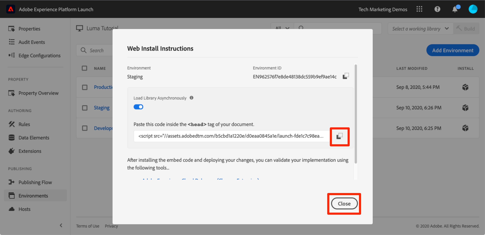

# Publicera taggegenskap

Nu när du har implementerat några av Adobe Experience Cloud lösningar i utvecklingsmiljön är det dags att lära sig publiceringsflödet.

>[!NOTE]
>
>Adobe Experience Platform Launch håller på att integreras i Adobe Experience Platform som en serie datainsamlingstekniker. Flera terminologiska förändringar har introducerats i gränssnittet som du bör vara medveten om när du använder det här innehållet:
>
> * platforma launchen (klientsidan) är nu **[[!DNL tags]](https://experienceleague.adobe.com/docs/experience-platform/tags/home.html?lang=sv)**
> * platform launch Server Side is now **[[!DNL event forwarding]](https://experienceleague.adobe.com/docs/experience-platform/tags/event-forwarding/overview.html)**
> * Edge-konfigurationer är nu **[[!DNL datastreams]](https://experienceleague.adobe.com/docs/experience-platform/edge/fundamentals/datastreams.html)**

## Utbildningsmål

När lektionen är klar kan du:

1. Publicera ett utvecklingsbibliotek i mellanlagringsmiljön
1. Mappa ett mellanlagringsbibliotek till produktionswebbplatsen med hjälp av Felsökning
1. Publicera ett mellanlagringsbibliotek i produktionsmiljön

## Publicera till mellanlagring

Nu när du har skapat och validerat ditt bibliotek i utvecklingsmiljön är det dags att publicera det på Förproduktion.

1. Gå till **[!UICONTROL Publiceringsflöde]** page

1. Öppna listrutan bredvid biblioteket och välj **[!UICONTROL Skicka för godkännande]**

   

1. Klicka på **[!UICONTROL Skicka]** i dialogrutan:

   

1. Biblioteket visas nu i [!UICONTROL Skickat] kolumn i ett obyggt tillstånd:

1. Öppna listrutan och välj **[!UICONTROL Bygg för mellanlagring]**:

   

1. När ikonen med grön punkt visas kan biblioteket förhandsgranskas i mellanlagringsmiljön.

I verkligheten är nästa steg i processen vanligtvis att låta QA-teamet validera ändringarna i mellanlagringsbiblioteket. De kan göra detta med Felsökning.

**Validera ändringarna i mellanlagringsbiblioteket**

1. I taggegenskapen öppnar du [!UICONTROL Miljö] page

1. I [!UICONTROL Mellanlagring] klickar du på ikonen Installera  för att öppna modal

   

1. Klicka på ikonen Kopiera  för att kopiera inbäddningskoden till Urklipp

1. Klicka **[!UICONTROL Stäng]** för att stänga modala

   

1. Öppna [Luma demo site](https://luma.enablementadobe.com/content/luma/us/en.html) i webbläsaren Chrome

1. Öppna [Experience Cloud Debugger](https://chrome.google.com/webstore/detail/adobe-experience-cloud-de/ocdmogmohccmeicdhlhhgepeaijenapj) genom att klicka på  icon

   

1. Gå till fliken Verktyg

1. I **[!UICONTROL Adobe Launch > Replace Launch Embed Code]** -avsnittet klistra in den mellanlagringsinbäddningskod som finns i Urklipp
1. Aktivera **[!UICONTROL Använd på luma.enablementadobe.com]** switch

1. Klicka på diskikonen för att spara

   

1. Läs in och kontrollera fliken Sammanfattning i Felsökning. Under avsnittet Launch bör du nu se hur egenskapen Staging har implementerats och visa ditt egenskapsnamn (dvs. &quot;taggar, självstudiekurs&quot; eller vad du än har namngett din egendom)!

   

När kvalitetsteamet har signerat i realtid genom att granska ändringarna i mellanlagringsmiljön är det dags att publicera i produktionen.

## Publicera till produktion

1. Gå till [!UICONTROL Publicering] page

1. I listrutan klickar du på **[!UICONTROL Godkänn för publicering]**:

   

1. Klicka på **[!UICONTROL Godkänn]** i dialogrutan:

   

1. Biblioteket visas nu i [!UICONTROL Godkänd] kolumn i obebyggt läge (gul punkt):

1. Öppna listrutan och välj **[!UICONTROL Bygg och publicera i produktion]**:

   

1. Klicka på **[!UICONTROL Publicera]** i dialogrutan:

   

1. Biblioteket visas nu i [!UICONTROL Publicerad] kolumn:

   

Nu räcker det! Du har slutfört självstudiekursen och publicerat din första egenskap i taggar!
