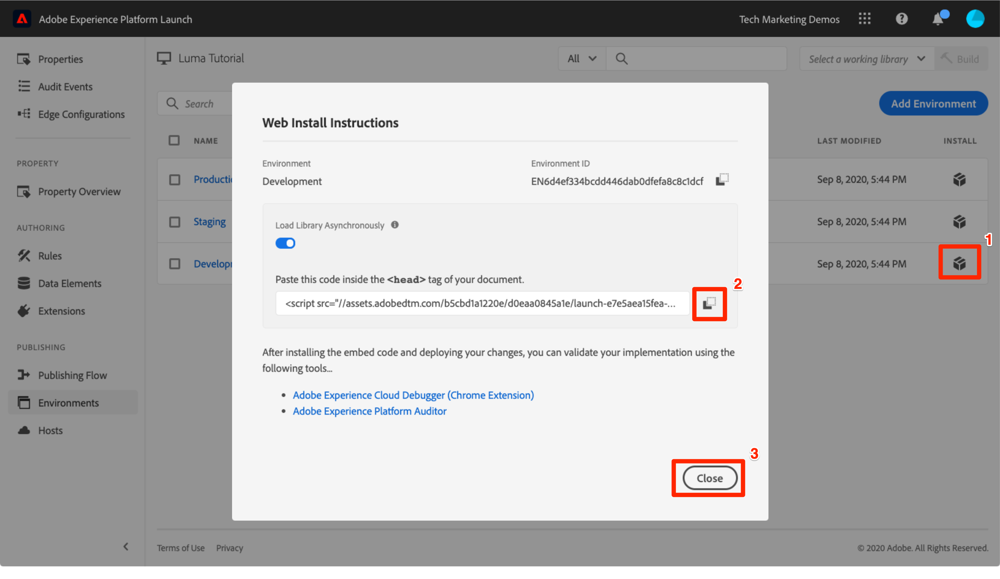

# Byt taggmiljöer med Experience Cloud Debugger

I den här lektionen använder du [Adobe Experience Cloud Debugger-tillägg](https://chrome.google.com/webstore/detail/adobe-experience-cloud-de/ocdmogmohccmeicdhlhhgepeaijenapj) som ersätter taggegenskapen hårdkodad på [Luma demo site](https://luma.enablementadobe.com/content/luma/us/en.html) med din egen egendom.

Den här tekniken kallas för miljöväxling och kan vara användbar senare när du arbetar med taggar på din egen webbplats. Du kan läsa in din produktionswebbplats i webbläsaren, men med *utveckling* -taggmiljö. På så sätt kan du tryggt göra och validera taggändringar oberoende av dina vanliga kodreleaser.  Den här åtskillnaden mellan marknadsföringstaggreleaser och vanliga kodreleaser är ju en av de främsta anledningarna till att kunderna använder taggar i första hand!

>[!NOTE]
>
>Adobe Experience Platform Launch håller på att integreras i Adobe Experience Platform som en serie datainsamlingstekniker. Flera terminologiska förändringar har introducerats i gränssnittet som du bör vara medveten om när du använder det här innehållet:
>
> * platforma launchen (klientsidan) är nu **[[!DNL tags]](https://experienceleague.adobe.com/docs/experience-platform/tags/home.html?lang=sv)**
> * platform launch Server Side is now **[[!DNL event forwarding]](https://experienceleague.adobe.com/docs/experience-platform/tags/event-forwarding/overview.html)**
> * Edge-konfigurationer är nu **[[!DNL datastreams]](https://experienceleague.adobe.com/docs/experience-platform/edge/fundamentals/datastreams.html)**

## Utbildningsmål

När lektionen är klar kan du:

* Använd Felsökning för att läsa in en alternativ taggmiljö
* Använd Felsökning för att verifiera att du har läst in en alternativ taggmiljö

## Hämta URL:en till utvecklingsmiljön

1. I taggegenskapen öppnar du `Environments` page

1. I **[!UICONTROL Utveckling]** klickar du på ikonen Installera  för att öppna modal

1. Klicka på ikonen Kopiera  för att kopiera inbäddningskoden till Urklipp

1. Klicka **[!UICONTROL Stäng]** för att stänga modala

   

## Ersätt tagg-URL:en på Luma Demo-webbplatsen

1. Öppna [Luma demo site](https://luma.enablementadobe.com/content/luma/us/en.html) i webbläsaren Chrome

1. Öppna [Experience Cloud Debugger](https://chrome.google.com/webstore/detail/adobe-experience-cloud-de/ocdmogmohccmeicdhlhhgepeaijenapj) genom att klicka på  icon

   

1. Observera att den taggegenskap som är implementerad visas på fliken Sammanfattning

   

1. Gå till fliken Verktyg
1. Bläddra till avsnittet **[!UICONTROL Ersätt startkod för inbäddning]**
1. Kontrollera att fliken Chrome med Luma-webbplatsen är i fokus bakom Felsökning (inte fliken med den här självstudiekursen eller fliken med datainsamlingsgränssnittet).  Klistra in inbäddningskoden som finns i Urklipp i inmatningsfältet
1. Växla till funktionen &quot;Använd på hela luma.enablementadobe.com&quot; så att alla sidor på Luma-webbplatsen mappas till din taggegenskap
1. Klicka på **[!UICONTROL Spara]** knapp

   

1. Läs in Luma-webbplatsen igen och kontrollera fliken Sammanfattning i Felsökning. Under avsnittet Launch bör du nu se hur din Development Property används. Bekräfta att både egenskapens namn matchar ditt och att miljön säger&quot;utveckling&quot;.

   

>[!NOTE]
>
>Felsökaren sparar den här konfigurationen och ersätter taggens inbäddningskoder när du kommer tillbaka till Luma-webbplatsen. Det påverkar inte andra webbplatser som du besöker på andra öppna flikar. Om du vill förhindra att felsökaren ersätter inbäddningskoden klickar du på knappen **[!UICONTROL Ta bort]** intill inbäddningskoden på fliken Verktyg i Felsökning.

När du fortsätter med självstudiekursen använder du den här tekniken för att mappa Luma-webbplatsen till din egen taggegenskap för att validera taggimplementeringen. När du börjar använda taggar på produktionswebbplatsen kan du använda samma teknik för att validera ändringar.

[Nästa&quot;Lägg till Adobe Experience Platform identitetstjänst&quot; >](id-service.md)
