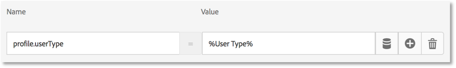

# Lägg till Adobe Target

I den här lektionen ska vi implementera [Adobe Target-tillägg](https://experienceleague.adobe.com/docs/experience-platform/tags/extensions/adobe/target/overview.html) med en sidladdningsbegäran och anpassade parametrar.

[Adobe Target](https://experienceleague.adobe.com/docs/target/using/target-home.html) är Adobe Experience Cloud lösning som innehåller allt ni behöver för att skräddarsy och personalisera kundupplevelsen, så att ni kan maximera intäkterna på era webbplatser, mobilsajter, appar, sociala medier och andra digitala kanaler.

>[!NOTE]
>
>Adobe Experience Platform Launch håller på att integreras i Adobe Experience Platform som en serie datainsamlingstekniker. Flera terminologiska förändringar har introducerats i gränssnittet som du bör vara medveten om när du använder det här innehållet:
>
> * platforma launchen (klientsidan) är nu **[!DNL tags]**
> * platform launch Server Side is now **[!DNL event forwarding]**
> * Edge-konfigurationer är nu **[!DNL datastreams]**


## Utbildningsmål

När lektionen är klar kan du:

* Lägg till det fördolda kodutdrag som används för att hantera flimmer när Target används med asynkrona inbäddningskoder för taggar
* Lägg till tillägget Target v2
* Starta begäran om sidinläsning (kallades tidigare&quot;global mbox&quot;)
* Lägg till parametrar i sidinläsningsbegäran
* Förklara hur profil- och enhetsparametrar kan läggas till i sidans inläsningsbegäran
* Starta begäran om orderbekräftelse med obligatoriska parametrar
* Förklara hur du lägger till avancerade konfigurationer som Bibliotekshuvud och Sidfot i bibliotek
* Validera en målinriktad implementering

## Förutsättningar

För att slutföra lektionerna i det här avsnittet måste du först slutföra lektionerna i [Konfigurera taggar](create-a-property.md) och [Lägg till identitetstjänsten](id-service.md).

## Lägg till fördolt målkodfragment

Innan vi börjar måste vi göra en liten uppdatering av taggens inbäddningskoder. När taggens inbäddningskoder läses in asynkront kan sidan slutföra återgivningen innan målbiblioteket har lästs in fullständigt och innehållsväxlingen har utförts. Detta kan leda till det som kallas&quot;flimmer&quot;, där standardinnehållet visas kort innan det ersätts av det anpassade innehåll som anges av Target. Om du vill undvika denna flimmer rekommenderar vi att du hårdkodar ett särskilt fragment som döljs innan taggarnas asynkrona inbäddningskoder.

Detta har redan gjorts på Luma-webbplatsen, men vi gör detta på exempelsidan så att du förstår implementeringen. Kopiera följande kodrader:

```html
<script>
   //prehiding snippet for Adobe Target with asynchronous tags deployment
   ;(function(win, doc, style, timeout) {
   var STYLE_ID = 'at-body-style';
   function getParent() {
      return doc.getElementsByTagName('head')[0];
   }
   function addStyle(parent, id, def) {
      if (!parent) {
      return;
      }
      var style = doc.createElement('style');
      style.id = id;
      style.innerHTML = def;
      parent.appendChild(style);
   }
   function removeStyle(parent, id) {
      if (!parent) {
      return;
      }
      var style = doc.getElementById(id);
      if (!style) {
      return;
      }
      parent.removeChild(style);
   }
   addStyle(getParent(), STYLE_ID, style);
   setTimeout(function() {
      removeStyle(getParent(), STYLE_ID);
   }, timeout);
   }(window, document, "body {opacity: 0 !important}", 3000));
</script>
```

Öppna exempelsidan och klistra in den precis före taggens inbäddningskod enligt bilden nedan (oroa dig inte om radnumren är olika). I den här skärmbilden har det fördolda fragmentet miniatyrbildats:


Läs in exempelsidan igen. Du kommer att märka att sidan kommer att vara dold i tre sekunder innan den visas. Det här beteendet är tillfälligt och försvinner när du har distribuerat Target. Det här fördolda beteendet styrs av två konfigurationer i slutet av fragmentet, som kan anpassas men som oftast finns kvar i standardinställningarna:

* `body {opacity: 0 !important}` Anger den CSS-definition som ska användas för pre-hide tills Target läses in. Som standard döljs hela brödtexten. Om du har en konsekvent DOM-struktur med ett enkelt identifierbart behållarelement som omsluter allt innehåll under navigeringen, till exempel, och du aldrig vill testa eller anpassa navigeringen, kan du använda den här inställningen för att begränsa det som döljs till behållarelementet.
* `3000` som anger timeoutinställningen för fördöljningen. Som standard visas sidan om Target inte har lästs in på tre sekunder. Detta bör vara extremt sällsynt.

Mer information och för att få fram det icke-minifierade preddolda fragmentet finns i [Adobe Target-tillägget med en asynkron &#x200B;](https://experienceleague.adobe.com/docs/experience-platform/tags/extensions/adobe/target/overview.html#adobe-target-extension-with-an-asynchronous-deployment).

## Lägg till måltillägget

Adobe Target-tillägget stöder implementeringar på klientsidan med Target JavaScript SDK för den moderna webben, at.js. Kunder som fortfarande använder Target:s äldre bibliotek, mbox.js, [bör uppgradera till at.js 2.x](https://experienceleague.adobe.com/docs/target/using/implement-target/client-side/mbox-implement/migrate-mbox/target-atjs-implementation.html) för att kunna använda taggar.

Tillägget Target v2 består av två huvuddelar:

1. Tilläggskonfigurationen som hanterar huvudbiblioteksinställningarna
1. Regelåtgärder för att göra följande:
   1. Load Target (at.js 2.x)
   1. Lägg till parametrar i sidinläsningsbegäranden
   1. Lägg till parametrar i alla begäranden
   1. Inläsningsbegäran för brandsida

I den här första övningen ska vi lägga till tillägget och titta på konfigurationerna. I senare övningar kommer vi att använda åtgärderna.

**Lägga till tillägget**

1. Gå till **[!UICONTROL Tillägg > Katalog]**
1. Typ `target` i filtret för att snabbt hitta Adobe Target-tilläggen. Det finns två tillägg - Adobe Target och Adobe Target v2. I den här självstudien används version 2 av tillägget som använder den senaste versionen av at.js (för närvarande 2.x), som är idealisk för både traditionella webbplatser och enkelsidiga program (SPA).
1. Klicka **[!UICONTROL Installera]**

   

1. När du lägger till tillägget importeras många, men inte alla dina at.js-inställningar från Target-gränssnittet, enligt bilden nedan. En inställning som inte importeras är Timeout, som alltid är 3 000 ms efter att tillägget har lagts till. Lämna standardinställningarna för självstudiekursen. Observera, att till vänster visas versionen at.js som levereras med den aktuella versionen av tillägget.

1. Klicka **[!UICONTROL Spara i bibliotek]**

   

För tillfället gör inte Target något, så det finns inget att validera.

>[!NOTE]
>
>Varje version av Target-tillägget innehåller en specifik version av at.js, som anges i tilläggsbeskrivningen. Du uppdaterar versionen at.js genom att uppdatera Target-tillägget.

## Läs in mål och starta sidinläsningsbegäran

Marknadsförarna använder Target för att styra besökarupplevelsen på sidan när de testar och målar innehåll. På grund av den här viktiga rollen för sidvisningen bör du läsa in Target så tidigt som möjligt för att minimera påverkan på sidsynligheten. I det här avsnittet läser vi in JavaScript-biblioteket Target, at.js, samt utlöser sidinläsningsbegäran (kallas&quot;global mbox&quot; i tidigare versioner av at.js).

Du kan använda `All Pages - Library Loaded` regel som du skapade i lektionen[Lägg till dataelement, regler och bibliotek](add-data-elements-rules.md)&quot; för att implementera Target eftersom det redan aktiveras så tidigt som möjligt vid sidinläsning.

**Läs in mål**

1. Gå till **[!UICONTROL Regler]** i den vänstra navigeringen och klicka sedan på `All Pages - Library Loaded` för att öppna regelredigeraren

   

1. Klicka på  lägga till en ny åtgärd

   

1. Välj **[!UICONTROL Tillägg > Adobe Target v2]**

1. Välj **[!UICONTROL Åtgärdstyp > Läs in mål]**

1. Klicka **[!UICONTROL Behåll ändringar]**

   

Med `Load Target` åtgärd tillagd, at.js läses in på sidan. Inga Target-begäranden kommer dock att starta förrän vi lägger till `Fire Page Load Request` åtgärd.

**Starta sidinläsningsbegäran**

1. Klicka på  igen för att lägga till ytterligare en åtgärd

   

1. Välj **[!UICONTROL Tillägg > Adobe Target v2]**

1. Välj **[!UICONTROL Åtgärdstyp > Inläsningsbegäran för brandsida]**

1. Det finns vissa konfigurationer tillgängliga för sidinläsningsbegäran som gäller huruvida sidan och CSS-väljaren ska döljas eller inte. De här inställningarna fungerar tillsammans med det fragment som är hårdkodat på sidan innan det döljs. Lämna standardinställningarna.

1. Klicka **[!UICONTROL Behåll ändringar]**

   

1. Den nya åtgärden läggs till i sekvens efter `Load Target` och åtgärderna kommer att köras i den här ordningen. Du kan dra och släppa åtgärderna för att ändra ordningen, men i det här fallet kan du `Load Target` måste vara innan  `Fire Page Load Request`.

1. Klicka **[!UICONTROL Spara i bibliotek och bygge]**

   

### Validera sidinläsningsbegäran

Nu när du har lagt till tillägget Target v2 och startat `Load Target` och `Fire Page Load Request` ska det finnas en sidinläsningsbegäran på alla sidor där taggegenskapen används.

**Så här validerar du åtgärderna Läs in mål och Läs in brandsida**

1. Läs in exempelsidan igen. Du bör inte längre se en fördröjning på tre sekunder innan sidan syns. Om du läser in exempelsidan med `file://` -protokollet bör du göra det här steget i Firefox- eller Safari-webbläsare eftersom Chrome inte kommer att starta en Target-begäran när du använder `file://` -protokoll.

1. Öppna [Luma site](https://luma.enablementadobe.com/content/luma/us/en.html)

1. Kontrollera att felsökaren mappar taggegenskapen till *din* Utvecklingsmiljö, enligt beskrivningen i [tidigare lektion](switch-environments.md)

   

1. Gå till fliken Sammanfattning i Felsökning

1. I `Launch` bekräfta att `Target` visas under `Extensions` rubrik

1. I `Target` bekräfta att din at.js-biblioteksversion visas

   

1. Till sist går du till `Target` utökar du klientkoden och bekräftar att sidinläsningsbegäran visas:

   

Grattis! Du har implementerat Target!

## Lägg till parametrar

Genom att skicka parametrar i Target-begäran får ni kraftfulla funktioner för målinriktning, testning och personalisering. Taggtillägget innehåller två åtgärder för att skicka parametrar:

1. `Add Params to Page Load Request`, som lägger till parametrar i sidinläsningsbegäranden (motsvarande [targetPageParams()](https://experienceleague.adobe.com/docs/target/using/implement-target/client-side/functions-overview/cmp-atjs-functions.html) metod)

1. `Add Params to All Requests`, som lägger till parametrar i alla Target-begäranden, t.ex. sidinläsningsbegäran plus ytterligare begäranden från åtgärder för anpassad kod eller hårdkodade på din plats (motsvarar [targetPageParamsAll()](https://experienceleague.adobe.com/docs/target/using/implement-target/client-side/functions-overview/cmp-atjs-functions.html) metod)

Dessa åtgärder kan användas *före* den `Load Target` och kan ange olika parametrar på olika sidor baserat på dina regelkonfigurationer. Använd funktionen för regelordning som du använde när du ställde in kund-ID:n med identitetstjänsten för att ställa in ytterligare parametrar för `Library Loaded` -händelsen före regeln som utlöser sidinläsningsbegäran.
>[!TIP]
>
>Eftersom de flesta implementeringar använder sidinläsningsbegäran för aktivitetsleverans, räcker det oftast med att bara använda `Add Params to Page Load Requests` åtgärd.

### Begäranparametrar (mbox)

Parametrar används för att skicka anpassade data till Target, vilket förbättrar dina personaliseringsfunktioner. De är idealiska för attribut som ändras ofta under en webbläsarsession, t.ex. sidnamn, mall osv. och kvarstår inte.

Låt oss lägga till `Page Name` dataelement som vi skapade tidigare i [Lägg till dataelement, regler och bibliotek](add-data-elements-rules.md) lektion som en request-parameter.

**Lägga till parametern request**

1. Gå till **[!UICONTROL Regler]** i den vänstra navigeringen och klicka sedan på `All Pages - Library Loaded` för att öppna regelredigeraren.

   

1. Klicka på  lägga till en ny åtgärd

   

1. Välj **[!UICONTROL Tillägg > Adobe Target v2]**

1. Välj **[!UICONTROL Åtgärdstyp > Lägg till parametrar i sidinläsningsbegäran]**

1. Retur `pageName` som **[!UICONTROL Namn]**

1. Klicka på  för att öppna ett modalt dataelement

1. Klicka på `Page Name` dataelement

1. Klicka på **[!UICONTROL Välj]** knapp

   

1. Klicka **[!UICONTROL Behåll ändringar]**

   

1. Klicka och dra i den vänstra kanten av `Add Params to Page Load Request` åtgärd för att ordna om de åtgärder som den är före `Fire Page Load Request` åtgärd (kan vara före eller efter `Load Target`)

1. Klicka **[!UICONTROL Spara i bibliotek och bygge]**

   

#### Validera begärandeparametrar

För närvarande är anpassade parametrar som skickas med at.js 2.x-begäranden inte så lätta att se i Felsökning, så vi kommer att använda webbläsarens utvecklingsverktyg.

**Validera parametern pageName-begäran**

1. Läs in Luma-webbplatsen igen och kontrollera att den är mappad till din egen taggegenskap
1. Öppna webbläsarens utvecklarverktyg
1. Klicka på fliken Nätverk
1. Filtrera förfrågningar till `tt.omtrdc` (eller din CNAME-domän för Target-begäranden)
1. Expandera `Headers` > `Request Payload` > `execute.pageLoad.parameters` för att validera `pageName` parameter och värde


<!--Now go to the **[!UICONTROL Target]** tab in the Debugger. Expand your client code and look at the requests. You should see the new `pageName` parameter passed in the request:

-->

### Profilparametrar

Profilparametrar skickas också via Target-begäran, på samma sätt som begärandeparametrar. Profilparametrar lagras dock i Target-databasen för besökarprofiler och bevaras för [längden på besökarens profil](https://experienceleague.adobe.com/docs/target/using/audiences/visitor-profiles/visitor-profile-lifetime.html). Du kan ange dem på en sida på webbplatsen och använda dem i Target-aktiviteter på en annan sida. Här är ett exempel från en bilwebbplats. När en besökare går till en fordonssida kan du skicka profilparametern &quot;profile.lastViewed=sportscar&quot; för att registrera deras intresse för just det fordonet. När besökaren bläddrar till andra sidor som inte är avsedda för fordon kan du rikta innehåll baserat på det senast visade fordonet.  Profilparametrar är idealiska för attribut som sällan ändras eller bara är tillgängliga på vissa sidor

Du skickar inga profilparametrar i den här självstudiekursen, men arbetsflödet är nästan identiskt med det du gjorde när du skickade `pageName` parameter. Den enda skillnaden är att du måste ge profilparameternamn ett `profile.` prefix. Så här ser en profilparameter som kallas &quot;userType&quot; ut i `Add Params to Page Load Request` åtgärd:



### Enhetsparametrar

Enhetsparametrar används som särskilda parametrar i [Recommendations implementeringar](https://experienceleague.adobe.com/docs/target/using/recommendations/plan-implement.html) av tre huvudskäl:

1. Som en nyckel för att utlösa produktrekommendationer. Om du till exempel använder en rekommendationsalgoritm som&quot;Personer som visade produkt X, även visade Y&quot;, är&quot;X&quot; rekommendationens&quot;nyckel&quot;. Det är vanligtvis produktknappen (`entity.id`) eller kategori (`entity.categoryId`) som besökaren för närvarande visar.
1. Samla in besökares beteende för att driva rekommendationer som&quot;Senast visade produkter&quot; eller&quot;De mest visade produkterna&quot;
1. Fylla i Recommendations-katalogen. Recommendations innehåller en databas över alla produkter och artiklar på din webbplats, så att de kan visas i rekommendationserbjudandet. Om du till exempel rekommenderar produkter bör du visa attribut som produktnamnet (`entity.name`) och bild (`entity.thumbnailUrl`). Vissa kunder fyller i sin katalog med serverdelsflöden, men de kan också fyllas i med enhetsparametrar i Target-begäranden.

Du behöver inte skicka några enhetsparametrar i den här självstudien, men arbetsflödet är identiskt med det du gjorde tidigare när du skickade `pageName` request parameter - bara ge parametern ett namn med prefixet &quot;entity&quot; som prefix. och mappa det till det relevanta dataelementet. Observera att vissa vanliga entiteter har reserverade namn som måste användas (t.ex. entity.id för produktsku). Så här skulle det se ut att ange enhetsparametrar i `Add Params to Page Load Request` åtgärd:


### Lägg till parametrar för kund-ID

Samlingen av kund-ID:n med Adobe Experience Platform Identity Service gör det enkelt att importera CRM-data till Target med [Kundattribut](https://experienceleague.adobe.com/docs/target/using/audiences/visitor-profiles/working-with-customer-attributes.html) Adobe Experience Cloud. Dessutom kan [sammanfogning av besökare på olika enheter](https://experienceleague.adobe.com/docs/target/using/integrate/experience-cloud-device-co-op.html)så att ni kan upprätthålla en enhetlig användarupplevelse när kunderna växlar mellan sina bärbara datorer och sina mobila enheter.

Du måste ange Kund-ID i identitetstjänstens `Set Customer IDs` åtgärd innan sidinläsningsbegäran aktiveras. Kontrollera därför att du har följande funktioner på din webbplats:

* Kund-ID måste vara tillgängligt på sidan före taggarna Embed Code
* Tillägget Adobe Experience Platform Identity Service måste vara installerat
* Du måste använda `Set Customer IDs` åtgärd i en regel som utlöses vid händelsen&quot;Biblioteksinläsning (överst på sidan)&quot;
* Använd `Fire Page Load Request` åtgärd i en regel som utlöser *efter* åtgärden Ange kund-ID

I föregående lektion [Lägg till Adobe Experience Platform identitetstjänst](id-service.md)skapade du `All Pages - Library Loaded - Authenticated - 10` regel som utlöser åtgärden Ange kund-ID. Eftersom den här regeln har en  `Order` inställning för `10`, anges kundens ID:n innan vår sidladdningsbegäran aktiveras från `All Pages - Library Loaded` linje med `Order` inställning för `50`. Så du har redan implementerat samlingen med kund-ID:n för Target!

#### Validera kund-ID

För närvarande är anpassade parametrar som skickas med at.js 2.x-begäranden inte så lätta att se i Felsökning, så vi kommer att använda webbläsarens utvecklingsverktyg.

**Så här validerar du kund-ID:t**

1. Öppna [Luma site](https://luma.enablementadobe.com/content/luma/us/en.html)

1. Kontrollera att felsökaren mappar taggegenskapen till *din* Utvecklingsmiljö, enligt beskrivningen i [tidigare lektion](switch-environments.md)

   

1. Logga in på Luma-webbplatsen med inloggningsuppgifterna `test@adobe.com`/`test`
1. Återgå till [Lumas hemsida](https://luma.enablementadobe.com/content/luma/us/en.html)

1. Öppna webbläsarens utvecklarverktyg
1. Klicka på fliken Nätverk
1. Filtrera förfrågningar till `tt.omtrdc` (eller din CNAME-domän för Target-begäranden)
1. Expandera `Headers` > `Request Payload` > `id.customerIds.0` för att validera kundens ID-inställningar och -värde:


<!--
1. Open the Debugger
1. Go to the Target tab
1. Expand your client code
1. You should see parameters in the latest Target request for `vst.crm_id.id` and `vst.crm_id.authState`. `vst.crm_id.id` should have a value of the hashed email address and `vst.crm_id.authState` should have a value of `1` to represent `authenticated`. Note that `crm_id` is the `Integration Code` you specified in the Identity Service configuration and must align with the key you use in your [Customer Attributes data file](https://experienceleague.adobe.com/docs/core-services/interface/customer-attributes/t-crs-usecase.html):


-->

>[!WARNING]
>
>Med Adobe Experience Platform Identity Service kan du skicka flera ID:n till tjänsten, men bara det första skickas till Target.

### Lägg till parametern för egenskapstoken

>[!NOTE]
>
>Det här är en valfri övning för Target Premium-kunder.

Egenskapstoken är en reserverad parameter som används med Target Premium [Enterprise-användarbehörigheter](https://experienceleague.adobe.com/docs/target/using/administer/manage-users/enterprise/property-channel.html) -funktion. Det används för att definiera olika digitala egenskaper så att olika medlemmar i en Experience Cloud-organisation kan tilldelas olika behörigheter för varje egenskap. Du kanske till exempel vill att en grupp användare ska kunna konfigurera Target-aktiviteter på din webbplats, men inte i ditt mobilprogram.

Målegenskaperna motsvarar taggegenskaper och rapportsviter från Analytics. Ett företag med flera varumärken, webbplatser och marknadsföringsteam kan använda olika Target-egenskaper, taggegenskap och Analytics-rapporteringsprogram för varje webbplats eller mobilapp. Taggegenskaperna skiljs åt med hjälp av deras inbäddningskoder, Analytics-rapportsviterna skiljs åt med hjälp av deras rapportritets-ID och Target-egenskaperna skiljs åt med deras egenskapstokenparameter.


Egenskapstoken måste implementeras med en anpassad kodåtgärd i taggar med `targetPageParams()` funktion. Om du implementerar flera webbplatser med olika värden för at_property med en enda taggegenskap kan du hantera värdet at_property via ett dataelement.

Här är en valfri övning om du är en Target Premium-kund och vill implementera en egenskapstoken i egenskapen Tutorial:

1. Öppna målanvändargränssnittet på en separat flik

1. Gå till **[!UICONTROL Administration > Egenskaper]**

1. Identifiera den egenskap som du vill använda och klicka på **[!UICONTROL &lt;/>]** (eller skapa en ny egenskap)

1. Kopiera kodfragmentet i `<script></script>` till Urklipp

   

1. Gå till fliken Taggar **[!UICONTROL Regler]** i den vänstra navigeringen och klicka sedan på `All Pages - Library Loaded` för att öppna regelredigeraren.

   

1. Klicka på `Core - Custom Code` åtgärd för att öppna `Action Configuration`

   

1. Öppna kodredigeraren och klistra in koden från målgränssnittet som innehåller `targetPageParams()` function
1. Klicka på **[!UICONTROL Spara]** knapp

   

1. Kontrollera **[!UICONTROL Kör globalt]** box so `targetPageParams()` deklareras i det globala omfånget
1. Klicka **[!UICONTROL Behåll ändringar]**

   

1. Klicka **[!UICONTROL Spara i bibliotek och bygge]**

   

>[!WARNING]
>
>Om du försöker lägga till `at_property` parametern via **[!UICONTROL Lägg till parametrar i sidinläsningsbegäran]** -åtgärden fyller parametern i nätverksbegäran men Target kan inte identifiera den automatiskt när sidan läses in. Fyll alltid i `at_property` med `targetPageParams()` i en Custom Code-åtgärd.

#### Validera egenskapstoken

För närvarande är anpassade parametrar som skickas med at.js 2.x-begäranden inte så lätta att se i Felsökning, så vi kommer att använda webbläsarens utvecklingsverktyg.

**Så här validerar du parametern för egenskapstoken**

1. Öppna [Luma site](https://luma.enablementadobe.com/content/luma/us/en.html)
1. Kontrollera att felsökaren mappar taggegenskapen till *din* Utvecklingsmiljö, enligt beskrivningen i [tidigare lektion](switch-environments.md)

   

1. Öppna webbläsarens utvecklarverktyg
1. Klicka på fliken Nätverk
1. Filtrera förfrågningar till `tt.omtrdc` (eller din CNAME-domän för Target-begäranden)
1. Expandera `Headers` > `Request Payload` > `property.token` för att validera värdet
   

<!--
1. Go to the `Target` tab
1. Expand your client code
1. You should see the parameter for "at_property" in every page load request request as you browse the site:

-->

## Lägg till anpassade begäranden

### Lägg till en beställningsbekräftelse

Begäran om orderbekräftelse är en särskild typ av begäran som används för att skicka orderinformation till Target. Det som gör en vanlig Target-begäran till en beställningsbegäran är att tre specifika frågeparametrar (orderId, orderTotal och productPurchasedId) ingår. Förutom att rapportera intäkter gör beställningsbegäran även följande:

1. Dubbletter av oavsiktliga orderåterinskick
1. Filtrerar extrema order (alla order vars totalbelopp var mer än tre standardavvikelser från medelvärdet)
1. Använder en annan algoritm bakom scenen för att beräkna statistisk säkerhet
1. Skapar en särskild, nedladdningsbar revideringsrapport över information om enskilda order

Det bästa sättet är att använda en orderbekräftelsebegäran i alla ordergrupper, även på icke-butikssajter. Exempelvis har leadgenereringswebbplatser vanligtvis lead-trattar med ett unikt lead-id som genereras i slutet. Dessa platser bör implementera en beställningsförfrågan med ett statiskt värde (t.ex. &quot;1&quot;) för orderTotal.

Kunder som använder integreringen med Analytics for Target (A4T) för de flesta rapporter kanske också vill implementera beställningsförfrågan om de använder Automated Personalization-aktiviteter, som inte har stöd för A4T. Dessutom är beställningsbegäran en viktig del i Recommendations implementeringar, som driver algoritmer baserat på inköpsbeteenden. Den senaste informationen om A4T-stöd finns på [dokumentationen](https://experienceleague.adobe.com/docs/target/using/integrate/a4t/a4t.html?lang=en#section_F487896214BF4803AF78C552EF1669AA).

Begäran om orderbekräftelse ska utlösas från en regel som bara aktiveras på din orderbekräftelsesida eller -händelse. Den kan ofta kombineras med en regel som ställer in Adobe Analytics-händelsen purchase. Den måste konfigureras med åtgärden Custom Code för Core-tillägget, med lämpliga dataelement för att ställa in parametrarna orderId, orderTotal och productPurchasedId.

Låt oss lägga till dataelementen och regeln vi måste skicka en orderbekräftelseförfrågan på Luma-webbplatsen. Eftersom du redan har skapat flera dataelement kommer dessa instruktioner att förkortas.

**Skapa dataelement för order-ID**

1. Klicka **[!UICONTROL Dataelement]** i den vänstra navigeringen
1. Klicka **[!UICONTROL Lägg till dataelement]**
1. Namnge dataelementet `Order Id`
1. Välj **[!UICONTROL Dataelementtyp > JavaScript-variabel]**
1. Använd `digitalData.cart.orderId` som `JavaScript variable name`
1. Kontrollera `Clean text` option
1. Klicka **[!UICONTROL Spara i bibliotek]**
(Vi skapar inte biblioteket förrän vi har gjort alla ändringar för orderbekräftelsebegäran.)

**Skapa dataelement för kundvagnsbelopp**

1. Klicka **[!UICONTROL Lägg till dataelement]**
1. Namnge dataelementet `Cart Amount`
1. Välj **[!UICONTROL Dataelementtyp > JavaScript-variabel]**
1. Använd `digitalData.cart.cartAmount` som `JavaScript variable name`
1. Kontrollera `Clean text` option
1. Klicka **[!UICONTROL Spara i bibliotek]**

**Så här skapar du dataelementet för Cart SKU:er (Target)**

1. Klicka **[!UICONTROL Lägg till dataelement]**
1. Namnge dataelementet `Cart SKUs (Target)`
1. Välj **[!UICONTROL Dataelementtyp > Anpassad kod]**
1. För Target måste skalet vara en kommaseparerad lista. Den här anpassade koden formaterar om datalagerarrayen till rätt format. Klistra in följande i den anpassade kodredigeraren:

   ```javascript
   var targetProdSkus="";
   for (var i=0; i<digitalData.cart.cartEntries.length; i++) {
     if(i>0) {
       targetProdSkus = targetProdSkus + ",";
     }
     targetProdSkus = targetProdSkus + digitalData.cart.cartEntries[i].sku;
   }
   return targetProdSkus;
   ```

1. Kontrollera `Force lowercase value` option
1. Kontrollera `Clean text` option
1. Klicka **[!UICONTROL Spara i bibliotek]**

Nu måste vi skapa en regel för att utlösa orderbekräftelsebegäran med dessa dataelement som parametrar på orderbekräftelsesidan.

**Så här skapar du regeln för sidan Orderbekräftelse**

1. Klicka **[!UICONTROL Regler]** i den vänstra navigeringen
1. Klicka **[!UICONTROL Lägg till regel]**
1. Namnge regeln `Order Confirmation Page - Library Loaded - 60`
1. Klicka **[!UICONTROL Händelser > Lägg till]**
   1. Välj **[!UICONTROL Händelsetyp > Bibliotek inläst (sidan ovanpå)]**
   1. Under **[!UICONTROL Avancerade alternativ]**, ändra `Order` till `60` så att den brinner efter `Load Target` (vilket finns i vår `All Pages - Library Loaded` regel där `Order` är inställd på `50`)
   1. Klicka **[!UICONTROL Behåll ändringar]**
1. Klicka **[!UICONTROL Villkor > Lägg till]**
   1. Välj **[!UICONTROL Villkorstyp > Sökväg utan frågesträng]**
   1. För `Path equals` enter `thank-you.html`
   1. Växla till alternativet Regex om du vill ändra logiken från `equals` till `contains` (du kan använda `Test` för att bekräfta att testet kommer att skickas med URL:en `https://luma.enablementadobe.com/content/luma/us/en/user/checkout/order/thank-you.html`

      

   1. Klicka **[!UICONTROL Behåll ändringar]**
1. Klicka **[!UICONTROL Åtgärder > Lägg till]**
   1. Välj **[!UICONTROL Åtgärdstyp > Anpassad kod]**
   1. Klicka **[!UICONTROL Öppna redigeraren]**
   1. Klistra in följande kod i `Edit Code` modal

      ```javascript
      adobe.target.getOffer({
        "mbox": "orderConfirmPage",
        "params":{
           "orderId": _satellite.getVar('Order Id'),
           "orderTotal": _satellite.getVar('Cart Amount'),
          "productPurchasedId": _satellite.getVar('Cart SKUs (Target)')
        },
        "success": function(offer) {
          adobe.target.applyOffer({
            "mbox": "orderConfirmPage",
            "offer": offer
          });
        },
        "error": function(status, error) {
          console.log('Error', status, error);
        }
      });
      ```

   1. Klicka **[!UICONTROL Spara]** för att spara den anpassade koden
   1. Klicka **[!UICONTROL Behåll ändringar]** för att behålla åtgärden
1. Klicka **[!UICONTROL Spara i bibliotek och bygge]**

#### Validera beställningsbekräftelsebegäran

För närvarande är anpassade parametrar som skickas med at.js 2.x-begäranden inte så lätta att se i Felsökning, så vi kommer att använda webbläsarens utvecklingsverktyg.

1. Öppna [Luma site](https://luma.enablementadobe.com/content/luma/us/en.html)

1. Kontrollera att felsökaren mappar taggegenskapen till *din* Utvecklingsmiljö, enligt beskrivningen i [tidigare lektion](switch-environments.md)

   

1. Bläddra på webbplatsen och lägg till flera produkter i kundvagnen
1. Fortsätt till kassan
1. Under utcheckningsprocessen är de enda obligatoriska fälten `First Name` och `Last Name`

   

1. På sidan Granska beställning klickar du på `Place Order` knapp
1. Öppna webbläsarens utvecklarverktyg
1. Klicka på fliken Nätverk
1. Filtrera förfrågningar till `tt.omtrdc` (eller din CNAME-domän för Target-begäranden)
1. Klicka på den andra begäran
1. Expandera `Headers` > `Request Payload` > `execute.mboxes.0` för att validera begärans namn och orderparametrarna:


<!--
1. Look in the Debugger
1. Go to the Target tab
1. Expand your client code
1. You should see the `orderConfirmPage` request as the latest Target request with the orderId, orderTotal, and productPurchasedId parameters populated with the details of your order

   link to "orderConfirmPage request with required parameters": images/target-debugger-orderConfirmPage.png 
-->

### Anpassade begäranden

Det finns sällsynta tillfällen när du behöver göra andra Target-begäranden än sidinläsning och beställningsbekräftelsebegäran. Ibland definieras inte viktiga data som du vill använda för personalisering på sidan före taggens inbäddningskoder. De kan vara hårdkodade längst ned på sidan eller returneras från en asynkron API-begäran. Dessa data kan skickas till Target med en extra begäran, men det är inte optimalt att använda denna begäran för innehållsleverans eftersom sidan redan är synlig. Dessa data kan användas för att förbättra besökarprofilen för senare bruk (med hjälp av profilparametrar) eller för att fylla i Recommendations-katalogen.

I dessa fall använder du åtgärden Anpassad kod i Core-tillägget för att utlösa en begäran med [getOffer()](https://experienceleague.adobe.com/docs/target/using/implement-target/client-side/functions-overview/adobe-target-getoffer.html)/[applyOffer()](https://experienceleague.adobe.com/docs/target/using/implement-target/client-side/functions-overview/adobe-target-applyoffer.html) och [trackEvent()](https://experienceleague.adobe.com/docs/target/using/implement-target/client-side/functions-overview/adobe-target-trackevent.html) metoder. Det här liknar det du just gjorde i [Begäran om orderbekräftelse](#order-confirmation-request) motion, men du använder bara ett annat begärandenamn och kommer inte att använda de särskilda orderparametrarna. Var noga med att använda **[!UICONTROL Läs in mål]** åtgärd innan du gör Target-begäranden från anpassad kod.

## Bibliotekshuvud och bibliotekets sidfot

Skärmen Edit at.js i användargränssnittet Target har platser där du kan klistra in anpassad JavaScript som körs omedelbart före eller efter filen at.js. Bibliotekshuvudet används ibland för att åsidosätta at.js-inställningarna via
[targetGlobalSettings()](https://experienceleague.adobe.com/docs/target/using/implement-target/client-side/functions-overview/targetgobalsettings.html) fungerar eller skickar data från tredje part med [Dataleverantörer](https://experienceleague.adobe.com/docs/target-learn/tutorials/integrations/use-data-providers-to-integrate-third-party-data.html) -funktion. Bibliotekets sidfot används ibland för att lägga till [at.js, anpassad händelse](https://experienceleague.adobe.com/docs/target/using/implement-target/client-side/functions-overview/atjs-custom-events.html) avlyssnare.

Om du vill replikera den här funktionen i taggar behöver du bara använda åtgärden Anpassad kod i Core-tillägget och sekvensera åtgärden före (Bibliotekshuvud) eller efter (Biblioteksfot) åtgärden Läs in mål. Detta kan göras i samma regel som `Load Target` (se bilden nedan) eller i separata regler med händelser eller orderinställningar som kommer att aktiveras före eller efter regeln som innehåller `Load Target`:


Mer information om användningsexempel för anpassade sidhuvuden och sidfötter finns i följande resurser:

* [Använd dataProviders för att integrera data från tredje part i Adobe Target](https://experienceleague.adobe.com/docs/target-learn/tutorials/integrations/use-data-providers-to-integrate-third-party-data.html)
* [Implementera dataLeverantörer integrerar data från tredje part i Adobe Target](https://experienceleague.adobe.com/docs/target-learn/tutorials/integrations/implement-data-providers-to-integrate-third-party-data.html)
* [Använd svarstoken och anpassade at.js-händelser med Adobe Target](https://experienceleague.adobe.com/docs/target-learn/tutorials/integrations/use-response-tokens-and-atjs-custom-events.html)

[Nästa&quot;Lägg till Adobe Analytics&quot; >](analytics.md)
