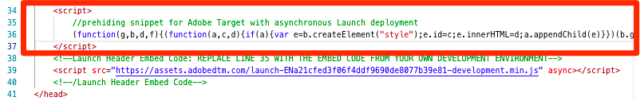
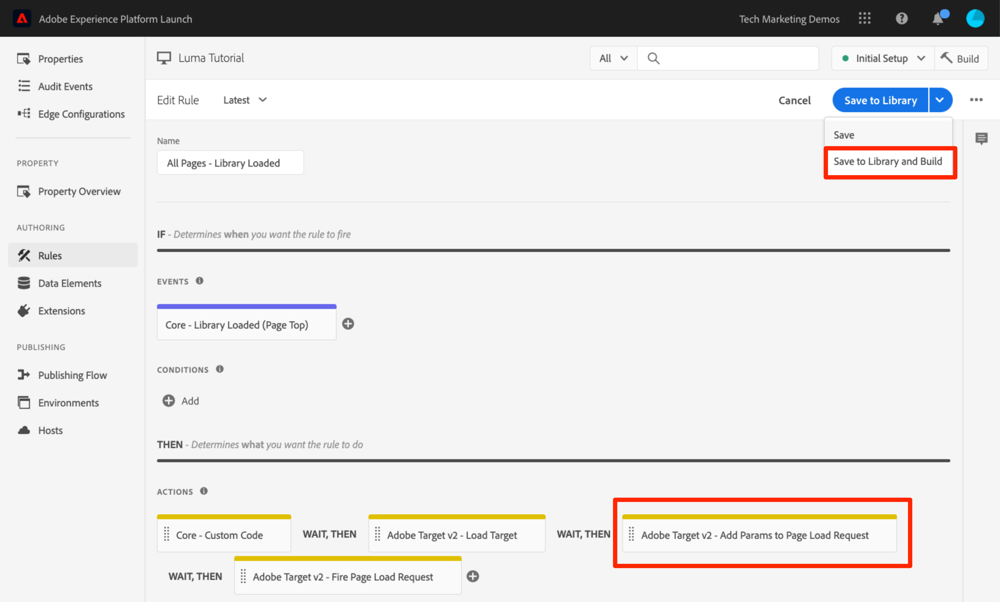

# Lägg till Adobe Target

I den här lektionen implementerar vi [Adobe Target-tillägget](https://experienceleague.adobe.com/docs/experience-platform/tags/extensions/adobe/target/overview.html) med en sidinläsningsbegäran och anpassade parametrar.

[Adobe Target](https://experienceleague.adobe.com/docs/target/using/target-home.html) är en Adobe Experience Cloud-lösning som innehåller allt du behöver för att skräddarsy och personalisera kundupplevelsen, så att du kan maximera intäkterna på webbplatser, mobilsajter, appar, sociala medier och andra digitala kanaler.

>[!NOTE]
>
>Adobe Experience Platform Launch håller på att integreras i Adobe Experience Platform som en serie datainsamlingstekniker. Flera terminologiska förändringar har introducerats i gränssnittet som du bör vara medveten om när du använder det här innehållet:
>
> * Platform Launch (klientsidan) är nu **[!DNL tags]**
> * Platform Launch Server Side is now **[!DNL event forwarding]**
> * Edge-konfigurationer är nu **[!DNL datastreams]**

## Utbildningsmål

När lektionen är klar kan du:

* Lägg till det fördolda kodutdrag som används för att hantera flimmer när Target används med asynkrona tagginbäddningskoder
* Lägg till tillägget Target v2
* Starta begäran om sidinläsning (kallades tidigare&quot;global mbox&quot;)
* Lägg till parametrar i sidinläsningsbegäran
* Förklara hur profil- och enhetsparametrar kan läggas till i sidans inläsningsbegäran
* Starta begäran om orderbekräftelse med obligatoriska parametrar
* Förklara hur du lägger till avancerade konfigurationer som Bibliotekshuvud och Sidfot i bibliotek
* Validera en målinriktad implementering

## Förhandskrav

För att kunna slutföra lektionerna i det här avsnittet måste du först slutföra lektionerna i [Konfigurera taggar](create-a-property.md) och [Lägg till identitetstjänsten](id-service.md).

## Lägg till fördolt målkodfragment

Innan vi börjar måste vi göra en liten uppdatering av taggens inbäddningskoder. När taggens inbäddningskoder läses in asynkront kan sidan slutföra återgivningen innan målbiblioteket har lästs in fullständigt och innehållsväxlingen har utförts. Detta kan leda till det som kallas&quot;flimmer&quot;, där standardinnehållet visas kort innan det ersätts av det anpassade innehåll som anges av Target. Om du vill undvika denna flimmer rekommenderar vi att du hårdkodar ett särskilt fragment som döljs innan taggarnas asynkrona inbäddningskoder.

Detta har redan gjorts på Luma-webbplatsen, men vi gör detta på exempelsidan så att du förstår implementeringen. Kopiera följande kodrader:

```html
<script>
   //prehiding snippet for Adobe Target with asynchronous tags deployment
   ;(function(win, doc, style, timeout) {
   var STYLE_ID = 'at-body-style';
   function getParent() {
      return doc.getElementsByTagName('head')[0];
   }
   function addStyle(parent, id, def) {
      if (!parent) {
      return;
      }
      var style = doc.createElement('style');
      style.id = id;
      style.innerHTML = def;
      parent.appendChild(style);
   }
   function removeStyle(parent, id) {
      if (!parent) {
      return;
      }
      var style = doc.getElementById(id);
      if (!style) {
      return;
      }
      parent.removeChild(style);
   }
   addStyle(getParent(), STYLE_ID, style);
   setTimeout(function() {
      removeStyle(getParent(), STYLE_ID);
   }, timeout);
   }(window, document, "body {opacity: 0 !important}", 3000));
</script>
```

Öppna exempelsidan och klistra in den precis före taggens inbäddningskod enligt bilden nedan (oroa dig inte om radnumren är olika). I den här skärmbilden har det fördolda fragmentet miniatyrbildats:



Läs in exempelsidan igen. Du kommer att märka att sidan kommer att vara dold i tre sekunder innan den visas. Det här beteendet är tillfälligt och försvinner när du har distribuerat Target. Det här fördolda beteendet styrs av två konfigurationer i slutet av fragmentet, som kan anpassas men som oftast finns kvar i standardinställningarna:

* `body {opacity: 0 !important}` anger den CSS-definition som ska användas för pre-hide tills Target läses in. Som standard döljs hela brödtexten. Om du har en konsekvent DOM-struktur med ett enkelt identifierbart behållarelement som omsluter allt innehåll under navigeringen, till exempel, och du aldrig vill testa eller anpassa navigeringen, kan du använda den här inställningen för att begränsa det som döljs till behållarelementet.
* `3000` som anger timeoutinställningen för fördöljning. Som standard visas sidan om Target inte har lästs in på tre sekunder. Detta bör vara extremt sällsynt.

Mer information och information om hur du hämtar det icke-minifierade fördolda fragmentet finns i [Adobe Target-tillägget med en asynkron distribution &#x200B;](https://experienceleague.adobe.com/docs/experience-platform/tags/extensions/adobe/target/overview.html#adobe-target-extension-with-an-asynchronous-deployment).

## Lägg till måltillägget

Adobe Target-tillägget stöder implementeringar på klientsidan med Target JavaScript SDK för den moderna webben, at.js. Kunder som fortfarande använder Target:s äldre bibliotek, mbox.js, [bör uppgradera till at.js 2.x](https://experienceleague.adobe.com/docs/target/using/implement-target/client-side/mbox-implement/migrate-mbox/target-atjs-implementation.html) för att kunna använda taggar.

Tillägget Target v2 består av två huvuddelar:

1. Tilläggskonfigurationen, som hanterar huvudbiblioteksinställningarna
1. Regelåtgärder för att göra följande:
   1. Load Target (at.js 2.x)
   1. Lägg till parametrar i sidinläsningsbegäranden
   1. Lägg till parametrar i alla begäranden
   1. Begäran om inläsning av brandsida

I den här första övningen ska vi lägga till tillägget och titta på konfigurationerna. I senare övningar kommer vi att använda åtgärderna.

**Lägga till tillägget**

1. Gå till **[!UICONTROL Extensions > Catalog]**
1. Skriv `target` i filtret för att snabbt hitta Adobe Target-tilläggen. Det finns två tillägg - Adobe Target och Adobe Target v2. I den här självstudien används version 2 av tillägget som använder den senaste versionen av at.js (för närvarande 2.x), som är idealisk för både traditionella webbplatser och Single-page-applikationer (SPA).
1. Klicka på **[!UICONTROL Install]**

   

1. När du lägger till tillägget importeras många, men inte alla dina at.js-inställningar från Target-gränssnittet, enligt bilden nedan. En inställning som inte kommer att importeras är Timeout, som alltid är 3 000 ms efter att tillägget har lagts till. Lämna standardinställningarna för självstudiekursen. Observera, att till vänster visas versionen at.js som levereras med den aktuella versionen av tillägget.

1. Klicka på **[!UICONTROL Save to Library]**

   

För tillfället gör inte Target något, så det finns inget att validera.

>[!NOTE]
>
>Varje version av Target-tillägget innehåller en specifik version av at.js, som anges i tilläggsbeskrivningen. Du uppdaterar versionen at.js genom att uppdatera Target-tillägget.

## Läs in mål och starta sidinläsningsbegäran

Marknadsförarna använder Target för att styra besökarupplevelsen på sidan när de testar och målar innehåll. På grund av den här viktiga rollen för sidvisningen bör du läsa in Target så tidigt som möjligt för att minimera påverkan på sidsynligheten. I det här avsnittet läser vi in JavaScript-biblioteket Target, at.js, samt utlöser sidinläsningsbegäran (kallas&quot;global mbox&quot; i tidigare versioner av at.js).

Du kan använda regeln `All Pages - Library Loaded` som du skapade i lektionen [Lägg till dataelement, regler och bibliotek](add-data-elements-rules.md) för att implementera Target eftersom den redan aktiveras så tidigt som möjligt vid sidinläsning.

**Att läsa in mål**

1. Gå till **[!UICONTROL Rules]** i den vänstra navigeringen och klicka sedan på `All Pages - Library Loaded` för att öppna regelredigeraren

   

1. Klicka på plustecknet 

   

1. Välj **[!UICONTROL Extension > Adobe Target v2]**

1. Välj **[!UICONTROL Action Type > Load Target]**

1. Klicka på **[!UICONTROL Keep Changes]**

   

När åtgärden `Load Target` har lagts till läses at.js in på sidan. Inga Target-begäranden utlöses dock förrän vi lägger till åtgärden `Fire Page Load Request`.

**Starta sidinläsningsbegäran**

1. Klicka på plustecknet 

   

1. Välj **[!UICONTROL Extension > Adobe Target v2]**

1. Välj **[!UICONTROL Action Type > Fire Page Load Request]**

1. Det finns vissa konfigurationer tillgängliga för sidinläsningsbegäran som gäller huruvida sidan och CSS-väljaren ska döljas eller inte. De här inställningarna fungerar tillsammans med det fragment som är hårdkodat på sidan innan det döljs. Lämna standardinställningarna.

1. Klicka på **[!UICONTROL Keep Changes]**

   

1. Den nya åtgärden läggs till i sekvens efter åtgärden `Load Target` och åtgärderna kommer att köras i den här ordningen. Du kan dra och släppa åtgärderna för att ordna om ordningen, men i det här scenariot måste `Load Target` vara före `Fire Page Load Request`.

1. Klicka på **[!UICONTROL Save to Library and Build]**

   

### Validera sidinläsningsbegäran

Nu när du har lagt till tillägget Target v2 och utlöst åtgärderna `Load Target` och `Fire Page Load Request` bör det finnas en sidinläsningsbegäran på alla sidor där taggegenskapen används.

**Så här validerar du åtgärderna Läs in mål och Läs in brandsida**

1. Läs in exempelsidan igen. Du bör inte längre se en fördröjning på tre sekunder innan sidan syns. Om du läser in exempelsidan med protokollet `file://` bör du göra det här steget i Firefox- eller Safari-webbläsare eftersom Chrome inte startar en Target-begäran när `file://` -protokollet används.

1. Öppna [Luma-webbplatsen](https://luma.enablementadobe.com/content/luma/us/en.html)

1. Kontrollera att felsökaren mappar taggegenskapen till *din*-utvecklingsmiljö, vilket beskrivs i [tidigare lektion](switch-environments.md)

   

1. Gå till fliken Sammanfattning i Felsökning

1. Bekräfta att `Target` visas under rubriken `Extensions` i avsnittet `Launch`

1. I avsnittet `Target` bekräftar du att din at.js-biblioteksversion visas

   

1. Till sist går du till fliken `Target`, utökar klientkoden och bekräftar att sidinläsningsbegäran visas:

   

Grattis! Du har implementerat Target!

## Lägg till parametrar

Genom att skicka parametrar i Target-begäran får ni kraftfulla funktioner för målinriktning, testning och personalisering. Taggtillägget innehåller två åtgärder för att skicka parametrar:

1. `Add Params to Page Load Request`, som lägger till parametrar i sidinläsningsbegäranden (motsvarande metoden [ targetPageParams()](https://experienceleague.adobe.com/docs/target/using/implement-target/client-side/functions-overview/cmp-atjs-functions.html)))

1. `Add Params to All Requests`, som lägger till parametrar i alla Target-begäranden, t.ex. sidinläsningsbegäran plus ytterligare begäranden från åtgärder för anpassad kod eller hårdkodade på din plats (motsvarar metoden [ targetPageParamsAll()](https://experienceleague.adobe.com/docs/target/using/implement-target/client-side/functions-overview/cmp-atjs-functions.html) )

Dessa åtgärder kan användas *före* åtgärden `Load Target` och kan ange olika parametrar på olika sidor baserat på dina regelkonfigurationer. Använd funktionen för regelordning som du använde när du ställde in kund-ID:n med identitetstjänsten för att ställa in ytterligare parametrar för händelsen `Library Loaded` innan regeln som startar sidinläsningsbegäran.
>[!TIP]
>
>Eftersom de flesta implementeringar använder sidinläsningsbegäran för aktivitetsleverans, räcker det oftast med att bara använda åtgärden `Add Params to Page Load Requests`.

### Begäranparametrar (mbox)

Parametrar används för att skicka anpassade data till Target, vilket förbättrar dina personaliseringsfunktioner. De är idealiska för attribut som ändras ofta under en webbläsarsession, t.ex. sidnamn, mall osv. och kvarstår inte.

Låt oss lägga till dataelementet `Page Name` som vi skapade tidigare i lektionen [Lägg till dataelement, regler och bibliotek](add-data-elements-rules.md) som en begärandeparameter.

**Så här lägger du till begärandeparametern**

1. Gå till **[!UICONTROL Rules]** i den vänstra navigeringen och klicka sedan på `All Pages - Library Loaded` för att öppna regelredigeraren.

   

1. Klicka på plustecknet 

   

1. Välj **[!UICONTROL Extension > Adobe Target v2]**

1. Välj **[!UICONTROL Action Type > Add Params to Page Load Request]**

1. Ange `pageName` som **[!UICONTROL Name]**

1. Klicka på ikonen  för att öppna det modala dataelementet

1. Klicka på dataelementet `Page Name`

1. Klicka på knappen **[!UICONTROL Select]**

   

1. Klicka på **[!UICONTROL Keep Changes]**

   

1. Klicka och dra i den vänstra kanten av åtgärden `Add Params to Page Load Request` för att ändra ordningen på åtgärder som den har innan åtgärden `Fire Page Load Request` (kan vara före eller efter `Load Target`)

1. Klicka på **[!UICONTROL Save to Library and Build]**

   

#### Validera begärandeparametrar

För närvarande är anpassade parametrar som skickas med at.js 2.x-begäranden inte så lätta att se i Felsökning, så vi kommer att använda webbläsarens utvecklingsverktyg.

**Verifiera parametern för pageName-begäran**

1. Läs in Luma-webbplatsen igen och kontrollera att den är mappad till din egen taggegenskap
1. Öppna webbläsarens utvecklarverktyg
1. Klicka på fliken Nätverk
1. Filtrera begäranden till `tt.omtrdc` (eller din CNAME-domän för Target-begäranden)
1. Expandera avsnittet `Headers` > `Request Payload` > `execute.pageLoad.parameters` för att validera parametern och värdet `pageName`


<!--Now go to the **[!UICONTROL Target]** tab in the Debugger. Expand your client code and look at the requests. You should see the new `pageName` parameter passed in the request:

-->

### Profilparametrar

Profilparametrar skickas också via Target-begäran, på samma sätt som begärandeparametrar. Profilparametrar lagras emellertid i målets databas för besökarprofiler och kommer att finnas kvar under [varaktigheten för besökarens profil](https://experienceleague.adobe.com/docs/target/using/audiences/visitor-profiles/visitor-profile-lifetime.html). Du kan ange dem på en sida på webbplatsen och använda dem i Target-aktiviteter på en annan sida. Här är ett exempel från en bilwebbplats. När en besökare går till en fordonssida kan du skicka profilparametern &quot;profile.lastViewed=sportscar&quot; för att registrera deras intresse för just det fordonet. När besökaren bläddrar till andra sidor som inte är avsedda för fordon kan du rikta innehåll baserat på det senast visade fordonet.  Profilparametrar är idealiska för attribut som sällan ändras eller bara är tillgängliga på vissa sidor

Du skickar inga profilparametrar i den här självstudien, men arbetsflödet är nästan identiskt med det du gjorde när du skickade parametern `pageName`. Den enda skillnaden är att du måste ge profilparameternamn ett `profile.`-prefix. Så här ser en profilparameter som kallas userType ut i åtgärden `Add Params to Page Load Request`:


### Enhetsparametrar

Enhetsparametrar är särskilda parametrar som används i [Rekommendationer och implementeringar](https://experienceleague.adobe.com/docs/target/using/recommendations/plan-implement.html) av tre huvudorsaker:

1. Som en nyckel för att utlösa produktrekommendationer. Om du till exempel använder en rekommendationsalgoritm som&quot;Personer som visade produkt X, även visade Y&quot;, är&quot;X&quot; rekommendationens&quot;nyckel&quot;. Det är vanligtvis den produktsku (`entity.id`) eller kategori (`entity.categoryId`) som besökaren för närvarande visar.
1. Samla in besökares beteende för att driva rekommendationer som&quot;Senast visade produkter&quot; eller&quot;De mest visade produkterna&quot;
1. Fylla i katalogen Rekommendationer. Rekommendationer innehåller en databas över alla produkter eller artiklar på din webbplats, så att de kan tas med i rekommendationserbjudandet. Om du till exempel rekommenderar produkter vill du vanligtvis visa attribut som produktnamnet (`entity.name`) och bilden (`entity.thumbnailUrl`). Vissa kunder fyller i sin katalog med serverdelsflöden, men de kan också fyllas i med enhetsparametrar i Target-begäranden.

Du behöver inte skicka några enhetsparametrar i den här självstudiekursen, men arbetsflödet är identiskt med det du gjorde tidigare när du skickade parametern `pageName` för begäran. Ge bara parametern ett namn som är prefix med &quot;entity&quot;. och mappa det till det relevanta dataelementet. Observera att vissa vanliga entiteter har reserverade namn som måste användas (t.ex. entity.id för produktsku). Så här skulle det se ut att ange enhetsparametrar i åtgärden `Add Params to Page Load Request`:


### Lägg till parametrar för kund-ID

Samlingen av kund-ID:n med Adobe Experience Platform Identity Service gör det enkelt att importera CRM-data till Target med funktionen [Kundattribut](https://experienceleague.adobe.com/docs/target/using/audiences/visitor-profiles/working-with-customer-attributes.html) i Adobe Experience Cloud. Det möjliggör även sammanfogning av [besökare mellan olika enheter](https://experienceleague.adobe.com/docs/target/using/integrate/experience-cloud-device-co-op.html), vilket gör att du kan upprätthålla en konsekvent användarupplevelse när dina kunder växlar mellan sina bärbara datorer och sina mobila enheter.

Du måste ange kund-ID:t i identitetstjänstens `Set Customer IDs`-åtgärd innan sidinläsningsbegäran aktiveras. Kontrollera därför att du har följande funktioner på din webbplats:

* Kund-ID måste vara tillgängligt på sidan före taggarna Embed Code
* Tillägget Adobe Experience Platform Identity Service måste vara installerat
* Du måste använda åtgärden `Set Customer IDs` i en regel som utlöses vid händelsen Biblioteksinläsning (överst på sidan)
* Använd åtgärden `Fire Page Load Request` i en regel som utlöses *efter* åtgärden Ange kund-ID

I föregående lektion, [Lägg till Adobe Experience Platform identitetstjänst](id-service.md), skapade du regeln `All Pages - Library Loaded - Authenticated - 10` för att starta åtgärden Ange kund-ID. Eftersom den här regeln har en `Order`-inställning på `10`, anges kund-ID:n innan vår sidinläsningsbegäran aktiveras från `All Pages - Library Loaded`-regeln med dess `Order`-inställning på `50`. Så du har redan implementerat samlingen med kund-ID:n för Target!

#### Validera kund-ID

För närvarande är anpassade parametrar som skickas med at.js 2.x-begäranden inte så lätta att se i Felsökning, så vi kommer att använda webbläsarens utvecklingsverktyg.

**Verifiera kund-ID:t**

1. Öppna [Luma-webbplatsen](https://luma.enablementadobe.com/content/luma/us/en.html)

1. Kontrollera att felsökaren mappar taggegenskapen till *din*-utvecklingsmiljö, vilket beskrivs i [tidigare lektion](switch-environments.md)

   

1. Logga in på Luma-webbplatsen med inloggningsuppgifterna `test@test.com`/`test`
1. Återgå till [Lumas hemsida](https://luma.enablementadobe.com/content/luma/us/en.html)

1. Öppna webbläsarens utvecklarverktyg
1. Klicka på fliken Nätverk
1. Filtrera begäranden till `tt.omtrdc` (eller din CNAME-domän för Target-begäranden)
1. Expandera avsnittet `Headers` > `Request Payload` > `id.customerIds.0` för att validera kundens ID-inställningar och värde:


<!--
1. Open the Debugger
1. Go to the Target tab
1. Expand your client code
1. You should see parameters in the latest Target request for `vst.crm_id.id` and `vst.crm_id.authState`. `vst.crm_id.id` should have a value of the hashed email address and `vst.crm_id.authState` should have a value of `1` to represent `authenticated`. Note that `crm_id` is the `Integration Code` you specified in the Identity Service configuration and must align with the key you use in your [Customer Attributes data file](https://experienceleague.adobe.com/docs/core-services/interface/customer-attributes/t-crs-usecase.html):


-->

>[!WARNING]
>
>Med Adobe Experience Platform Identity Service kan du skicka flera ID:n till tjänsten, men bara det första skickas till Target.

### Lägg till parametern för egenskapstoken

>[!NOTE]
>
>Detta är en valfri övning för Target Premium-kunder.

Egenskapstoken är en reserverad parameter som används med Target Premium [Enterprise User Permissions](https://experienceleague.adobe.com/docs/target/using/administer/manage-users/enterprise/property-channel.html) -funktionen. Det används för att definiera olika digitala egenskaper så att olika medlemmar i en Experience Cloud-organisation kan tilldelas olika behörigheter för varje egenskap. Du kanske till exempel vill att en grupp användare ska kunna konfigurera Target-aktiviteter på din webbplats, men inte i ditt mobilprogram.

Målegenskaperna motsvarar taggegenskaper och analysrapportsviter. Ett företag med flera varumärken, webbplatser och marknadsföringsteam kan använda olika Target-egenskaper, taggegenskap och Analytics-rapporteringsprogram för varje webbplats eller mobilapp. Taggegenskaperna skiljs åt med hjälp av deras inbäddningskoder, Analytics-rapportsviterna skiljs åt med hjälp av deras rapportritets-ID och Target-egenskaperna skiljs åt med deras egenskapstokenparameter.


Egenskapstoken måste implementeras med en anpassad kodåtgärd i taggar med funktionen `targetPageParams()`. Om du implementerar flera webbplatser med olika värden för at_property med en enda taggegenskap kan du hantera värdet at_property via ett dataelement.

Här är en valfri övning om du är Target Premium-kund och vill implementera en egenskapstoken i egenskapen Tutorial:

1. Öppna målanvändargränssnittet på en separat flik

1. Gå till **[!UICONTROL Administration > Properties]**

1. Identifiera den egenskap som du vill använda och klicka på **[!UICONTROL </>]** (eller skapa en ny egenskap)

1. Kopiera kodfragmentet inom `<script></script>` till Urklipp

   

1. Gå till **[!UICONTROL Rules]** i den vänstra navigeringen på fliken Taggar och klicka sedan på `All Pages - Library Loaded` för att öppna regelredigeraren.

   

1. Klicka på åtgärden `Core - Custom Code` under Åtgärder för att öppna `Action Configuration`

   

1. Öppna kodredigeraren och klistra in koden från målgränssnittet som innehåller funktionen `targetPageParams()`
1. Klicka på knappen **[!UICONTROL Save]**

   

1. Markera rutan **[!UICONTROL Execute globally]** så att `targetPageParams()` deklareras i det globala omfånget
1. Klicka på **[!UICONTROL Keep Changes]**

   

1. Klicka på **[!UICONTROL Save to Library and Build]**
   

>[!WARNING]
>
>Om du försöker lägga till parametern `at_property` via åtgärden **[!UICONTROL Add Params to Page Load Request]** fylls parametern i i nätverksbegäran, men Target&#39;s Visual Experience Composer (VEC) kan inte identifiera den automatiskt när sidan läses in. Fyll alltid i `at_property` med funktionen `targetPageParams()` i en anpassad kodsåtgärd.

#### Validera egenskapstoken

För närvarande är anpassade parametrar som skickas med at.js 2.x-begäranden inte så lätta att se i Felsökning, så vi kommer att använda webbläsarens utvecklingsverktyg.

**Verifiera egenskapstokenparametern**

1. Öppna [Luma-webbplatsen](https://luma.enablementadobe.com/content/luma/us/en.html)
1. Kontrollera att felsökaren mappar taggegenskapen till *din*-utvecklingsmiljö, vilket beskrivs i [tidigare lektion](switch-environments.md)

   

1. Öppna webbläsarens utvecklarverktyg
1. Klicka på fliken Nätverk
1. Filtrera begäranden till `tt.omtrdc` (eller din CNAME-domän för Target-begäranden)
1. Expandera avsnittet `Headers` > `Request Payload` > `property.token` för att validera värdet
   

<!--
1. Go to the `Target` tab
1. Expand your client code
1. You should see the parameter for "at_property" in every page load request request as you browse the site:

-->

## Lägg till anpassade begäranden

### Lägg till en beställningsbekräftelse

Begäran om orderbekräftelse är en särskild typ av begäran som används för att skicka orderinformation till Target. Det som gör en vanlig Target-begäran till en beställningsbegäran är att tre specifika frågeparametrar (orderId, orderTotal och productPurchasedId) ingår. Förutom att rapportera intäkter gör beställningsbegäran även följande:

1. Dubbletter av oavsiktliga orderåterinskick
1. Filtrerar extrema order (alla order vars totalbelopp var mer än tre standardavvikelser från medelvärdet)
1. Använder en annan algoritm bakom scenen för att beräkna statistisk säkerhet
1. Skapar en särskild, nedladdningsbar revideringsrapport över information om enskilda order

Det bästa sättet är att använda en orderbekräftelsebegäran i alla ordergrupper, även på icke-butikssajter. Exempelvis har leadgenereringswebbplatser vanligtvis lead-trattar med ett unikt lead-id som genereras i slutet. Dessa platser bör implementera en beställningsbegäran med ett statiskt värde (t.ex. &quot;1&quot;) för orderTotal.

Kunder som använder integreringen med Analytics for Target (A4T) för de flesta rapporter kanske också vill implementera beställningsförfrågan om de använder Automated Personalization-aktiviteter, som inte har stöd för A4T. Dessutom är beställningsbegäran en viktig del i rekommendationer-implementeringar, som styr algoritmer baserat på inköpsbeteende. Den senaste informationen om A4T-stöd finns i [dokumentationen](https://experienceleague.adobe.com/docs/target/using/integrate/a4t/a4t.html?lang=en#section_F487896214BF4803AF78C552EF1669AA).

Begäran om orderbekräftelse ska utlösas från en regel som bara aktiveras på din orderbekräftelsesida eller -händelse. Den kan ofta kombineras med en regel som ställer in Adobe Analytics-händelsen purchase. Den måste konfigureras med åtgärden Custom Code för Core-tillägget, med lämpliga dataelement för att ställa in parametrarna orderId, orderTotal och productPurchasedId.

Låt oss lägga till dataelementen och regeln vi måste skicka en orderbekräftelseförfrågan på Luma-webbplatsen. Eftersom du redan har skapat flera dataelement kommer dessa instruktioner att förkortas.

**Skapa dataelementet för order-ID**

1. Klicka på **[!UICONTROL Data Elements]** i den vänstra navigeringen
1. Klicka på **[!UICONTROL Add Data Element]**
1. Namnge dataelementet `Order Id`
1. Välj **[!UICONTROL Data Element Type > JavaScript Variable]**
1. Använd `digitalData.cart.orderId` som `JavaScript variable name`
1. Markera alternativet `Clean text`
1. Klicka på **[!UICONTROL Save to Library]**
(Vi skapar inte biblioteket förrän vi har gjort alla ändringar för orderbekräftelsebegäran.)

**Skapa dataelementet för kundvagnsmängden**

1. Klicka på **[!UICONTROL Add Data Element]**
1. Namnge dataelementet `Cart Amount`
1. Välj **[!UICONTROL Data Element Type > JavaScript Variable]**
1. Använd `digitalData.cart.cartAmount` som `JavaScript variable name`
1. Markera alternativet `Clean text`
1. Klicka på **[!UICONTROL Save to Library]**

**Så här skapar du dataelementet för kundvagn-SKU:er (mål)**

1. Klicka på **[!UICONTROL Add Data Element]**
1. Namnge dataelementet `Cart SKUs (Target)`
1. Välj **[!UICONTROL Data Element Type > Custom Code]**
1. För Target måste skalet vara en kommaseparerad lista. Den här anpassade koden formaterar om datalagrets array till rätt format. Klistra in följande i den anpassade kodredigeraren:

   ```javascript
   var targetProdSkus="";
   for (var i=0; i<digitalData.cart.cartEntries.length; i++) {
     if(i>0) {
       targetProdSkus = targetProdSkus + ",";
     }
     targetProdSkus = targetProdSkus + digitalData.cart.cartEntries[i].sku;
   }
   return targetProdSkus;
   ```

1. Markera alternativet `Force lowercase value`
1. Markera alternativet `Clean text`
1. Klicka på **[!UICONTROL Save to Library]**

Nu måste vi skapa en regel för att utlösa orderbekräftelsebegäran med dessa dataelement som parametrar på orderbekräftelsesidan.

**Så här skapar du regeln för orderbekräftelsesidan**

1. Klicka på **[!UICONTROL Rules]** i den vänstra navigeringen
1. Klicka på **[!UICONTROL Add Rule]**
1. Namnge regeln `Order Confirmation Page - Library Loaded - 60`
1. Klicka på **[!UICONTROL Events > Add]**
   1. Välj **[!UICONTROL Event Type > Library Loaded (Page Top)]**
   1. Under **[!UICONTROL Advanced Options]** ändrar du `Order` till `60` så att den aktiveras efter åtgärden `Load Target` (som finns i vår `All Pages - Library Loaded`-regel där `Order` är inställd på `50`)
   1. Klicka på **[!UICONTROL Keep Changes]**
1. Klicka på **[!UICONTROL Conditions > Add]**
   1. Välj **[!UICONTROL Condition Type > Path Without Query String]**
   1. Ange `thank-you.html` för `Path equals`
   1. Växla till alternativet Regex om du vill ändra logiken från `equals` till `contains` (du kan använda funktionen `Test` för att bekräfta att testet kommer att skickas med URL:en `https://luma.enablementadobe.com/content/luma/us/en/user/checkout/order/thank-you.html`)

      

   1. Klicka på **[!UICONTROL Keep Changes]**
1. Klicka på **[!UICONTROL Actions > Add]**
   1. Välj **[!UICONTROL Action Type > Custom Code]**
   1. Klicka på **[!UICONTROL Open Editor]**
   1. Klistra in följande kod i `Edit Code` modal

      ```javascript
      adobe.target.getOffer({
        "mbox": "orderConfirmPage",
        "params":{
           "orderId": _satellite.getVar('Order Id'),
           "orderTotal": _satellite.getVar('Cart Amount'),
          "productPurchasedId": _satellite.getVar('Cart SKUs (Target)')
        },
        "success": function(offer) {
          adobe.target.applyOffer({
            "mbox": "orderConfirmPage",
            "offer": offer
          });
        },
        "error": function(status, error) {
          console.log('Error', status, error);
        }
      });
      ```

   1. Klicka på **[!UICONTROL Save]** för att spara den anpassade koden
   1. Klicka på **[!UICONTROL Keep Changes]** om du vill behålla åtgärden
1. Klicka på **[!UICONTROL Save to Library and Build]**

#### Validera beställningsbekräftelsebegäran

För närvarande är anpassade parametrar som skickas med at.js 2.x-begäranden inte så lätta att se i Felsökning, så vi kommer att använda webbläsarens utvecklingsverktyg.

1. Öppna [Luma-webbplatsen](https://luma.enablementadobe.com/content/luma/us/en.html)

1. Kontrollera att felsökaren mappar taggegenskapen till *din*-utvecklingsmiljö, vilket beskrivs i [tidigare lektion](switch-environments.md)

   

1. Bläddra på webbplatsen och lägg till flera produkter i kundvagnen
1. Fortsätt till kassan
1. Under utcheckningsprocessen är de enda obligatoriska fälten `First Name` och `Last Name`

   

1. Klicka på knappen `Place Order` på sidan Granska beställning
1. Öppna webbläsarens utvecklarverktyg
1. Klicka på fliken Nätverk
1. Filtrera begäranden till `tt.omtrdc` (eller din CNAME-domän för Target-begäranden)
1. Klicka på den andra begäran
1. Expandera avsnittet `Headers` > `Request Payload` > `execute.mboxes.0` för att validera begäransnamnet och orderparametrarna:


<!--
1. Look in the Debugger
1. Go to the Target tab
1. Expand your client code
1. You should see the `orderConfirmPage` request as the latest Target request with the orderId, orderTotal, and productPurchasedId parameters populated with the details of your order

   link to "orderConfirmPage request with required parameters": images/target-debugger-orderConfirmPage.png 
-->

### Anpassade begäranden

Det finns sällsynta tillfällen när du behöver göra andra Target-begäranden än sidinläsning och beställningsbekräftelsebegäran. Ibland definieras inte viktiga data som du vill använda för personalisering på sidan före taggens inbäddningskoder. De kan vara hårdkodade längst ned på sidan eller returneras från en asynkron API-begäran. Dessa data kan skickas till Target med en extra begäran, men det är inte optimalt att använda denna begäran för innehållsleverans eftersom sidan redan är synlig. Dessa data kan användas för att förbättra besökarprofilen för senare bruk (med hjälp av profilparametrar) eller för att fylla i katalogen Rekommendationer.

I dessa fall använder du åtgärden Egen kod i Core-tillägget för att utlösa en begäran med metoderna [getOffer()](https://experienceleague.adobe.com/docs/target-dev/developer/client-side/at-js-implementation/functions-overview/adobe-target-getoffer.html)/[applyOffer()](https://experienceleague.adobe.com/docs/target-dev/developer/client-side/at-js-implementation/functions-overview/adobe-target-applyoffer.html) och [trackEvent()](https://experienceleague.adobe.com/docs/target-dev/developer/client-side/at-js-implementation/functions-overview/adobe-target-trackevent.html) . Detta liknar mycket det du gjorde i [beställningsbekräftelsebegäran](#order-confirmation-request), men du använder bara ett annat begärandenamn och kommer inte att använda de särskilda orderparametrarna. Var noga med att använda åtgärden **[!UICONTROL Load Target]** innan du gör Target-begäranden från anpassad kod.

## Bibliotekshuvud och bibliotekets sidfot

Skärmen Edit at.js i användargränssnittet Target har platser där du kan klistra in anpassad JavaScript som körs omedelbart före eller efter filen at.js. Library Header används ibland för att åsidosätta at.js-inställningarna via
Funktionen [targetGlobalSettings()](https://experienceleague.adobe.com/docs/target/using/implement-target/client-side/functions-overview/targetgobalsettings.html) eller skicka data från tredje part med funktionen [Data Providers](https://experienceleague.adobe.com/docs/target-learn/tutorials/integrations/use-data-providers-to-integrate-third-party-data.html) . Library Footer används ibland för att lägga till [at.js-avlyssnare för anpassade händelser](https://experienceleague.adobe.com/docs/target-dev/developer/client-side/at-js-implementation/functions-overview/atjs-custom-events.html).

Om du vill replikera den här funktionen i taggar behöver du bara använda åtgärden Anpassad kod i Core-tillägget och sekvensera åtgärden före (Bibliotekshuvud) eller efter (Biblioteksfot) åtgärden Läs in mål. Detta kan göras i samma regel som åtgärden `Load Target` (se bilden nedan) eller i separata regler med händelser eller orderinställningar som kommer att aktiveras före eller efter regeln som innehåller `Load Target`:


Mer information om användningsexempel för anpassade sidhuvuden och sidfötter finns i följande resurser:

* [Använd dataProviders för att integrera tredjepartsdata i Adobe Target](https://experienceleague.adobe.com/docs/target-learn/tutorials/integrations/use-data-providers-to-integrate-third-party-data.html)
* [Implementera dataProviders för att integrera tredjepartsdata i Adobe Target](https://experienceleague.adobe.com/docs/target-learn/tutorials/integrations/implement-data-providers-to-integrate-third-party-data.html)
* [Använd svarstoken och anpassade at.js-händelser med Adobe Target](https://experienceleague.adobe.com/docs/target-learn/tutorials/integrations/use-response-tokens-and-atjs-custom-events.html)

[Nästa&quot;Lägg till Adobe Analytics&quot; >](analytics.md)
